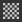

# ポリゴン塗りつぶし

**多角形の塗りつぶし**&#x200B;ツール()を使用すると、選択した多角形をピクセルマスクに変換することで、マスクをすばやく描画できます。 他の3DCCアプリケーションの3D選択ツールのように見えるかもしれませんが、実際にはピクセルデータを生成するペイント塗りつぶしツールです。 つまり、選択と選択解除を行い、白または黒のペイントを指定します。

多角形の塗りつぶしツールは、[ペイントレイヤー](../../interface/layer-stack/layer-stack.md)で機能しますが、基本カラーのみに限定され、この目的には使用できません。 [マスクのみに使用](../../interface/layer-stack/masking-and-effects.md)。

4つの選択モードがあります。

*  **三角形の塗りつぶし** – 個々のメッシュの三角形を塗りつぶします。
*  **ポリゴン塗りつぶし** – ポリゴン全体を塗りつぶします。 書き出し時にメッシュが既に三角形分割されている場合は、三角形塗りつぶしと同じ効果が得られます。
* **メッシュ入力** – 接続されたサブメッシュ全体を入力します。 3Dアプリケーションの「サブオブジェクト」モードと同様に、クリックしたポリゴンに接続されているすべてのポリゴンを塗りつぶします。
* **UVチャンクの入力** - UVチャンク全体または「アイランド」全体を入力します。 メッシュ塗りつぶしのように機能しますが、UV空間で接続されたポリゴンを見ることによって動作します。 UV境界で塗りつぶしが停止します。

これらの4つのモードは組み合わせたり切り替えたりすることができます。つまり、ある程度のスマートな使い方で、メッシュとUVチャンクのモードを使用して、マスク内のセクションにすばやくマークとマーク解除ができます。

（デフォルト）ポリゴンフィルツールに関連するホットキーは次のとおりです。

* *数値キー4* – 多角形の塗りつぶしツールを選択します。
* *X* – マスクをペイントするときに現在の色を反転します。 黒を白にすばやく入れ替えます。 マテリアルペイントモードでは、このホットキーは無効です。
