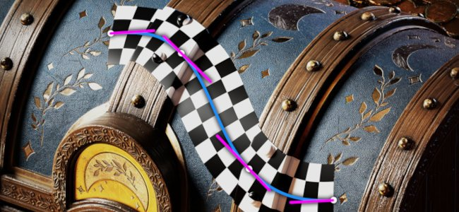
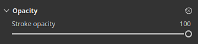

# リボンパス

<b>リボン</b>パスツールを使用すると、3Dモデルのサーフェス上の点によって定義される曲線に沿って変形するパターンを作成できます。 リボンを使用して、曲線に沿ってテキストを書き込むこともできます。

リボンツールは、ツールバーのパスツールメニューから選択できます。

または<b>パスの種類</b>ボタンを使用：

## 概要

リボンパスツールは、画像やマテリアルの描画方法が、「パスに沿ってペイント」ツールとは異なります。

ペイント/ブラシベースのツールでは、パス上で画像が複数回繰り返されます。リボンでは、画像がパスに沿って繰り返され、その曲線に従って変形されます。 ペイントブラシの個々のコンポーネントは<b>スタンプ</b>と呼ばれ、リボンのコンポーネントは<b>パッチ</b>と呼ばれます。

## 設定

### サイズ

| パラメーター | 説明 |
| --- | --- |
| <b>線幅</b> | 現在の線のグローバル幅を制御します。 |

### 不透明度

| パラメーター | 説明 |
| --- | --- |
| <b>ストロークの不透明度</b> | 現在のストロークの最終的な不透明度を制御します。 |

### ストローク

| パラメーター | 説明 |
| --- | --- |
| <b>画像の向き</b> | 入力画像の方向を定義します。 この方向は、画像をパス上に配置する方法を制御します。 |
| <b>画像を反転</b> | パスの軸/幅に沿って画像を反転させます。 |
| <b>コーナー</b> | パス上に鋭角コーナー（分割接線）を表示する方法を定義します。 考えられる動作は次のとおりです。<ul data-preserve-html="true"> <li data-preserve-html="true"><b>マイター結合</b>:シャープまたは尖った角</li> <li data-preserve-html="true"><b>ラウンド結合</b>:スムーズ/ラウンドコーナー</li> <li data-preserve-html="true"><b>ベベル結合</b>：正方形/平らな角</li> <li data-preserve-html="true"><b>切り取り結合</b>:パスを再度開始します。 このモードでは、専用の開始/終了セクションを持つ新しいパスが作成されます。</li> </ul>以下に、コーナーの表示順序を示します。  

 |
| <b>閉じたときに終了を省略</b> | 有効にすると、パスが閉じられて連続したループが作成されたときに、開始/終了セクションが削除されます。 これは、ストレッチオフセットと動的ストロークの両方に適用されます。 |

### ストレッチとタイリング

リボンパスでは、2つの異なるモードを使用して、パスに沿ってイメージを繰り返したり引き伸ばしたりする方法をコントロールできます。

* <b>パスに沿って伸縮</b>: （既定）パスに沿って繰り返される画像は、パスの長さに合わせて伸縮されます
* <b>縦横比を維持</b>:パスに沿って繰り返される画像の縦横比は保持されます。 パスと比較して画像が長すぎる場合は、切り抜かれます。

#### パスに沿って伸縮

| パラメーター | 説明 |
| --- | --- |
| <b>オフセット間のみストレッチ</b> | 有効にすると、画像の中央部を引き伸ばしながら、画像の開始部分と終了部分をそのまま維持します。 <b>開始オフセット</b>と<b>終了オフセット</b>パラメーターを使用して、これらのセクションのサイズを定義します。 中央のセクションは、開始/終了に基づいて自動的に計算されます。  

 |
| <b>タイルモード</b> | パスに沿って画像を繰り返す方法を定義します。 指定可能な値は次のとおりです。<ul data-preserve-html="true"> <li data-preserve-html="true"><b>なし</b>：画像は繰り返されません。 それは全ての道に沿って伸びるでしょう。</li> <li data-preserve-html="true"><b>自動</b>: （既定）画像は、そのサイズと線幅に基づいて、特定の回数だけ自動的に繰り返されます。</li> <li data-preserve-html="true"><b>カスタム</b>:イメージ化は、<b>タイリング量</b>パラメーターで定義された回数だけ繰り返されます。</li> </ul> |
| <b>タイル分割の金額</b> | <b>カスタム</b>分割モードで画像が繰り返される回数を指定します。 |
| <b>2番目のタイルごとにミラー</b> | パスの長さに沿って使用する画像を2回おきに反転します。 |
| <b>縦横比</b> | 現在の画像縦横比を拡大または縮小します。 |

#### 縦横比を維持

| パラメーター | 説明 |
| --- | --- |
| <b>比率</b> | 比率を維持しながら画像を拡大/縮小する方法を定義します。<ul data-preserve-html="true"> <li data-preserve-html="true"><b>パスの幅に合わせる</b>: （既定）パスの幅に合わせて画像を拡大/縮小します。 このため、長すぎると画像が切り抜かれる可能性があります。</li> <li data-preserve-html="true"><b>パスの長さに合わせる</b>：縦横比を維持しながら正確な数がパスに収まるように、画像のサイズを調整します。</li> </ul> |
| <b>クリップされたタイルを削除</b> | 有効にすると、完全には見えないパスに沿った繰り返しが削除されます（切り抜かれた場合）。 <b>比率</b>設定が<b>パスの長さに合わせる</b>に設定されている場合、この設定は無効になります。 |
| <b>タイルモード</b> | パスに沿って画像を繰り返す方法を定義します。 指定可能な値は次のとおりです。<ul data-preserve-html="true"> <li data-preserve-html="true"><b>なし</b>：画像は繰り返されません。 それは全ての道に沿って伸びるでしょう。</li> <li data-preserve-html="true"><b>自動</b>: （既定）画像は、そのサイズと線幅に基づいて、特定の回数だけ自動的に繰り返されます。</li> <li data-preserve-html="true"><b>カスタム</b>:イメージ化は、<b>タイリング量</b>パラメーターで定義された回数だけ繰り返されます。</li> </ul> |
| <b>2番目のタイルごとにミラー</b> | パスの長さに沿って使用する画像を2回おきに反転します。 |
| <b>整列</b> | パスに沿って画像を開始する場所を定義します。 指定可能な値は次のとおりです。<ul data-preserve-html="true"> <li data-preserve-html="true"><b>始点に位置合わせ</b>:パスの最初の点から画像が描画されます。</li> <li data-preserve-html="true"><b>中央に揃える</b>：画像はパスの中央に描画されます。</li> <li data-preserve-html="true"><b>終点に整列</b>:パスの最後の点から画像が描画されます。</li> </ul> |
| <b>縦横比</b> | 現在の画像縦横比を拡大または縮小します。 |

### チャンネルブレンディング

このセクションでは、パスが重なっている場合のブレンド結果を制御します。

| パラメーター | 説明 |
| --- | --- |
| <b>Alpha</b> | リボンパスの<b>Alpha</b>セクションを重なり合う領域にブレンドする方法を制御します。これにより、他のすべてのチャンネルのブレンドの強さが影響を受けます。 指定可能な値は次のとおりです。<ul data-preserve-html="true"> <li data-preserve-html="true"><b>標準</b>：最上位セグメントのアルファを使用します。</li> <li data-preserve-html="true"><b>明るくする（最大）</b>: （既定値）アルファ値の最大値を使用し、最も不透明なセグメントを保持します。</li> <li data-preserve-html="true"><b>覆い焼き（リニア）</b>：各セグメントのアルファを加算して累積し、彩度を上げます。</li> </ul> |
| <b>標準</b> | パスが重なり合う領域で、<b>通常</b>チャンネルをブレンドする方法を定義します。 指定可能な値は次のとおりです。<ul data-preserve-html="true"> <li data-preserve-html="true"><b>標準</b>：最上位セグメントの結果を使用します。</li> <li data-preserve-html="true"><b>法線マップの組み合わせ</b>: （既定値）同じ強度でセグメントを組み合わせます。</li> <li data-preserve-html="true"><b>標準マップの詳細</b>：最上位のセグメントを追加の詳細として検討し、最下部の領域はその強度を保持します。</li> </ul>この設定は、レイヤー全体に定義されている<b>通常</b>描画モードとは別のものです。このモードは、パス自体の自己重複描画の後に適用されます。 <b>注意</b>：この設定は、チャネルが均一な色の場合は無効になっています。 ビットマップおよびSubstanceリソースとのみ互換性があります。 |
| <b>Height</b> | <b>Height</b>チャンネルがパスと重なる領域でブレンドされる方法を定義します。 指定可能な値は次のとおりです。<ul data-preserve-html="true"> <li data-preserve-html="true"><b>標準</b>：最上位セグメントの結果を使用します。</li> <li data-preserve-html="true"><b>覆い焼き（リニア）</b>：元の強度を維持しながら、セグメントを追加します。</li> <li data-preserve-html="true"><b>比較（最小）</b> ：重なり合うセグメントの最も暗い値または最も低い値のみを保持します。</li> <li data-preserve-html="true"><b>明るさ（最大）</b>: （既定値）重なり合うセグメントの最も明るい値または最も高い値を維持します。</li> <li data-preserve-html="true"><b>スクリーン</b>: <b>直線的な覆い焼き</b>と似ていますが、彩度が低くなります。</li> </ul>この設定は、レイヤー全体に定義されている<b>Height</b>描画モードとは別のものです。この描画モードは、パス自体の重なり合い描画の後に適用されます。 <b>注意</b>：この設定は、チャネルが均一な色の場合は無効になっています。 ビットマップおよびSubstanceリソースとのみ互換性があります。 |

Heightチャンネルを使用した描画モードの例：

## テキスト画像と非正方形の画像

[テキストリソース](../text-resource.md)を使用している場合、または縦横比が正方形でない画像を使用している場合は、リボンパスに合わせて自動的に拡大/縮小されます。

この動作により、パスに沿ってパターンをトリミングするなど、テキストの書き込みや画像の繰り返しが可能になります。

