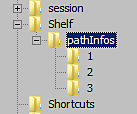

# リソースパスの手動編集

このページでは、アプリケーションを起動せずにリソースパスを追加または削除するための環境設定の編集方法について説明します。

## 環境設定の場所

リソースの場所は、プラットフォームに応じて変更できるアプリケーションの環境設定で管理します。

<table data-preserve-html="true"> <colgroup> <col/> <col/> <col/> </colgroup> <tbody> <tr> <th>システム</th> <th>バージョン</th> <th>パス</th> </tr> <tr> <td rowspan="2"><p><strong>Windows</strong></p><p>（登記簿）</p></td> <td><strong>7.2</strong>以降</td> <td>HKEY_CURRENT_USER\Software\Adobe\Adobe Substance 3D Painter</td> </tr> <tr> <td>レガシー</td> <td>HKEY_CURRENT_USER\Software\Allegorithmic\Substance Painter</td> </tr> <tr> <td rowspan="2"><p><strong>Mac</strong></p><p>（図書館）</p></td> <td><strong>7.2</strong>以降</td> <td>/Users/[ユーザー名]/Library/Preferences/com.adobe.Adobe Substance 3D Painter.plist</td> </tr> <tr> <td>レガシー</td> <td>/Users/[ユーザー名]/Library/Preferences/com.substance3d.user.plist</td> </tr> <tr> <td rowspan="2"><strong>Linux</strong></td> <td><strong>7.2</strong>以降</td> <td>/home/[ユーザー名]/.config/Adobe/Adobe Substance 3D Painter.conf</td> </tr> <tr> <td>レガシー</td> <td>/home/[ユーザー名]/.config/Allegorithmic/Substance Painter.conf</td> </tr> </tbody> </table>

## Windowsでのパスの追加

Windowsでは、パスはWindowsレジストリで管理できます。

<table>
<tr style="border: 0;">
<td style="border: 0;" valign="top">



</td>
<td style="border: 0;" valign="top">


</td>
</tr>
</table>

1. **スタート/ファイル名を指定して実行**&#x200B;をクリックするか、**Windows + R**&#x200B;を押します。
1. ダイアログに「**regedit**」（引用符は除く）と入力し、**OK**&#x200B;を押します。
1. **レジストリエディター**&#x200B;ウィンドウの左側のツリービューに移動し、上記のレジストリキーに移動します。
1. **&#x200B;**&#x200B;pathInfos **の下に** number **を名前としてキー**&#x200B;を追加します。 既存のキー（1から始まる）に基づいて番号を増やします。
1. ウィンドウの右側で&#x200B;**右クリック** > **新規** > **文字列値**&#x200B;を実行します。 名前を&#x200B;**disabled**&#x200B;にし、値を&#x200B;**false**&#x200B;に設定します。
1. ウィンドウの右側で&#x200B;**右クリック** > **新規** > **文字列値**&#x200B;を実行します。 名前を&#x200B;**name**&#x200B;にして、カスタムシェルフの名前を入力します。
1. ウィンドウの右側で&#x200B;**右クリック** > **新規** > **文字列値**&#x200B;を実行します。 **path**&#x200B;という名前を付け、シェルフがあるパスに値を設定します。
1. 「**pathInfos** 」内のキー「 **size** 」を1ずつ増やすことを忘れないでください。
1. ウィンドウを閉じます。
1. アプリケーションを起動します。

エントリ&#x200B;**writableShelf**&#x200B;の値を新しい場所の名前に変更することで、新しいパスを既定のパス（プリセットなどの新しいリソースが作成されたパス）として定義できます。


## Linuxでのパスの追加

**Linux**&#x200B;では、ユーザーアプリケーションの基本設定の構成ファイルを使用して追加のパスを作成できます。この構成ファイルは、ホームディレクトリに格納されます（を参照してください）。

1. 上記のパスに移動します。
1. ファイル&#x200B;**Substance 3D Painter.config**&#x200B;を開きます
1. **[シェルフ]**&#x200B;セクションまで下にスクロール

最後に表示されている番号を増分して新しいシェルフパスを追加します。例：

```
pathInfos2disabled=false  

pathInfos2name=custom_resources 

pathInfos2path=/home/Username/Documents/custom_path 

writableShelf=custom_resources
```


**writableShelf**&#x200B;変数を使用して、既定のパス（プリセットなどの新しいリソースが作成されたパス）を指定します。

変更を保存し、アプリケーションを再起動します。
