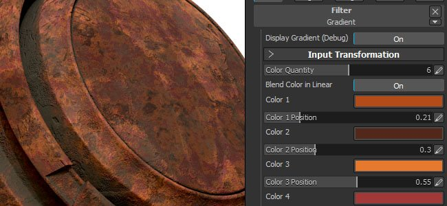

# バージョン2017.3

**Substance Painter 2017.3**&#x200B;では、**AdobeプロジェクトFelix**&#x200B;とオープンフォーマット&#x200B;**glTF**&#x200B;のサポートにより、新しい高度な書き出しプリセットに重点を置いています。 この新しいリリースでは、インターフェイスの改善と自動保存プラグインの追加により、ユーザーエクスペリエンスにも焦点を当てています。

リリース日： *28 September 2017*

## 主な機能

### Adobe Standardマテリアルの書き出しプリセット

このリリースに含まれる新しいエクスポーターの1つは、Adobe Dimension（以前のAdobeプロジェクトFelix）で使用されるAdobe Standardマテリアルのサポートです。 メッシュとそのテクスチャを書き出して、ワンクリックでプロジェクトFelixに読み込むことができます。 アクセスするには、書き出しテクスチャウィンドウで「**Adobe Standard Material**」を選択します。 詳細については、[http://www.adobe.com/products/dimension.html](https://www.adobe.com/products/dimension.html)を参照してください。

これについては、次のブログ投稿も参照してください。 <https://www.allegorithmic.com/blog/new-dimension-substance-ecosystem>

### glTF 2.0書き出しプリセット

また、**glTF**&#x200B;ファイル形式のサポートが追加され、**メッシュ**&#x200B;と&#x200B;**PBRテクスチャ** (メタリック/ラフネス)のエクスポートが行われました。 テクスチャを書き出しウィンドウで「**glTF PBRメタルの粗さ**」を選択するだけで、アクセスできます。 **glTF**&#x200B;は、Khronosグループによって指示されたオープンソースファイル形式です。 glTFファイルは、**Windows 10**&#x200B;内で表示することも、[**Babylon**](http://sandbox.babylonjs.com/)などのWebGLビューアを使用することもできます。

詳細については、 <https://github.com/KhronosGroup/glTF>を参照してください。

### 自動保存プラグイン

このリリースには、現在開いているプロジェクトの&#x200B;**バックアップを作成**&#x200B;できる新しいプラグインも含まれています。 現在開いているプロジェクトの側にバックアップファイルが作成されます。\
このため、ファイルメニューに「**コピーとして保存**」エントリも追加しました。 **自動保存**&#x200B;は、プラグイン自体を無効にすることで停止できます。**設定**&#x200B;には、構成パネル&#x200B;**から**&#x200B;アクセスできます。 警告時間の遅延に達すると、メインツールバーのボタンの下に&#x200B;**進行状況バー**&#x200B;が表示され、必要に応じて数分スヌーズできます（バックアップの前に何かを完了したい場合に便利です）。

バックアップが作成されたが、プロジェクトが保存されていない場合（傾斜なし）、バックアップは&#x200B;**Documents/Allegorithmic/Folder/autosave** Substance Painterー内に保存されます。 それ以外の場合は、バックアップはプロジェクト自体の横になります（パスが構成パネルで上書きされていない限り）。

### 改善されたグラデーションフィルター

**グラデーションフィルター**&#x200B;が完全に改良されました。 **Substance Designer**&#x200B;で使用可能な&#x200B;**グラデーションマップ**&#x200B;ノードに似た動作をしています。 現在では、最大&#x200B;**10色の異なるカラー**&#x200B;がサポートされており、**グラデーションの**&#x200B;内側の色の場所&#x200B;**&#x200B;**&#x200B;を指定できるため、多くの新しいドアが開きます。 これにより、より多くの&#x200B;**詳細なカラーパターン**&#x200B;を作成できるだけでなく、**高さマップ**&#x200B;を再マップして、**新しい図形**&#x200B;を作成することもできます。

メインスライダー（カラー量）は、グラデーションの作成に使用されるカラーの総数を定義します。 すぐ下にあるボタンは、カラーの描画モード（sRGBまたはリニア）を定義します。 これは、カラー間のブレンドを適切に行う場合に重要です。 例えば、純粋なレッドと純粋なグリーンをブレンドすると、その中間に美しいイエローが生まれます。 ボタンが無効になっている場合は表示されません（代わりに濃い茶色になります）。 Heightまたはその他のグレースケールチャンネルを再マッピングする場合は、ガンマ変換を行わないように、このボタンを無効にする必要があります。

上のボタンをクリックすると、フィルターの結果をグラデーション自体に置き換えて、2D ビュー内のグラデーションを表示できます。

### インターフェイスと動作の改善

このリリースでは、アプリケーションのさまざまなドックの&#x200B;**タブ**&#x200B;が、それぞれのウィンドウの下部&#x200B;**ではなく、上部**&#x200B;に配置されています。 この選択は、インターフェイスの読みやすさを向上させるだけでなく、他のアプリケーションとの一貫性を高めるために行われました。 この変更に従って、タブタイトルの横に&#x200B;**小さな十字**&#x200B;が追加され、**簡単に閉じることができます**。 タブ上で&#x200B;**右クリック**&#x200B;して&#x200B;**コンテキストメニュー**&#x200B;を表示することもできます。このメニューでは、ウィンドウを閉じたり、ドッキングを解除したりできます。 ウィンドウのドッキングを解除するショートカットは、タブをウィンドウ領域の外側にドラッグ&amp;ドロップするだけです。

ファイルエクスプローラーから&#x200B;**プロジェクトをビューポートー**&#x200B;にドラッグアンドドロップするだけで、**プロジェクトを開く**&#x200B;ことができます。 これは、**メッシュ**&#x200B;のファイルでも機能します。メッシュファイルを&#x200B;**空のビューポート**&#x200B;にドラッグ&amp;ドロップすると、**新しいプロジェクトウィンドウ**&#x200B;が開きますが、**既に開いているプロジェクト**&#x200B;でドラッグ&amp;ドロップすると、**プロジェクト構成ダイアログ**&#x200B;が開き、すばやく&#x200B;**メッシュを更新**&#x200B;できます。

**注意** :ドラッグ&amp;ドロップで問題が発生した場合は、[件名に関するFAQを確認](../../technical-support/technical-issues/miscellaneous-issues/impossible-to-drag-and-drop-files-into-the-shelf.md)してください。

### パフォーマンスの向上

今回のSubstance Painterには、GPUメモリ(VRam)の管理方法に関する新しい強力なパフォーマンス向上も含まれています。 均一カラー（塗りつぶしレイヤーなど）は、より小さいテクスチャに圧縮されるようになりました。これにより、メインメモリとGPUメモリ間の転送が高速化されるとともに、メモリフットプリントが減少し、計算時間も短縮されます。 これは、巨大なプロジェクトを開いたり、GPUメモリの制限に達したりするときに特に表示されます。

## リリースノート

### 2017.3.3

（2017年12月1日リリース）

**修正済み：**

* [Steam]起動時にバージョンチェッカーのポップアップを表示しない
* [書き出し] Photoshop CS6で開くと、PSDファイルのグループがロックされる

### 2017.3.2

（2017年11月20日リリース）

**追加：**

* [UI]新しいバージョンの改善ダイアログと変更ログの追加
* [UI]新しいバージョンのダイアログでメンテナンスの有効期限が切れているかどうかを示す
* [License]メンテナンス日に対応するためにライセンスシステムを更新する
* [書き出し] Adobe Standard Materialの名前をAdobe Dimensionに変更

**修正済み：**

* [Mac]ペイントによって黒い正方形とテクスチャが破損する
* [エンジン] ビューポートでキャッシュが消えることがある
* [エンジン]メモリ圧縮がトリガーされるとブロックノイズが発生する
* [ベイク]特定のメッシュをベイクすると奇妙なエラーメッセージが表示される
* [書き出し] PSDの書き込みが正しくなく、Photoshopで正しく認識されない
* [レイヤー]複数のプロジェクト間でのレイヤーのコピー/ペーストはできません
* [Substance]通常入力のUserDataカラースペースが反転することがある
* [シェルフ]発電機内のマイクロノーマルが逆曲率を出力
* [シェルフ] HSLフィルターもアルファチャンネルに影響する
* [Linux] Centosへのインストールが、依存関係がないために失敗する
* インストーラーが以前にインストールしたすべてのリソースを削除しない場合がある

### 2017.3.1

（2017年10月26日リリース）

**追加：**

* [書き出し]プロジェクトからメッシュを書き出すことができます。
* [シェルフ]タブのタイトルから「サブシェルフ」を削除します。
* 後処理の設定をテンプレートに保存
* TDRメッセージをより理解しやすくする
* エラーを報告するための設定ウィンドウの改善

**修正済み：**

* 複数のサブシェルフを削除するときにクラッシュが発生しました
* 計算中にレベルから別のレベルに切り替えるとクラッシュが発生する
* [Mac]エンジンの計算中にIntel GPUがクラッシュする
* [Mac]&#x200B;[ビューポート] ディザリングを有効にすると、パフォーマンスが低下する
* [Mac] MacOS 10.13がログファイルで「不明なバージョン」として認識される
* [ベイカー] ケージとのベイクが機能しなくなった
* [レイヤー] Ctrl + Cショートカット（コピー操作）が機能しない
* [レイヤー]レイヤーをペーストしても、アンカーの参照でUIが更新されない
* [アンカー]参照のあるレイヤーを複製またはコピー/ペーストするとリンクが解除される
* [書き出し] 8K書き出しで、アプリケーションがクラッシュしたり、デッドロックしたりする場合がある
* [エクスポート]生成されたglTFファイル形式に複数の問題があります
* [読み込み]同じファイル名でメッシュを再読み込みできない
* [プラグイン]自動保存ウィンドウが常に一番上に表示される
* [UI] TDRダイアログで「Esc」を押すと無限ループが発生する
* [UI] UIをリセットすると、シェルフウィンドウに2番目のタイトルバーが表示される

### 2017.3

（2017年9月28日リリース）

**追加：**

* [書き出し] AdobeプロジェクトFelixのメッシュとテクスチャの書き出しを許可
* [書き出し] glTFファイル形式に書き出すことができます
* [エンジン]ブロック圧縮を使用してVRAMのテクスチャサイズを最適化する
* [ビューポート] ビューポートにメッシュまたはプロジェクトをドラッグ&amp;ドロップできる
* [UI] TDRに関する警告メッセージを改善する
* [UI]ログは要求があった場合にのみ表示されます
* [UI]ログウィンドウの内容をクリアできるようにします
* [UI]ステータスバーに警告やエラーを表示する
* [UI]タブをwebブラウザーと同じ上部に表示する
* [UI] 「ペイント可能しない」コンテキストとメッセージを改善する
* [UI]ファイルメニューに「コピーとして保存」アクションを追加
* [レイヤー]既定のタイリング設定を1に設定します
* [シェルフ] 10色のダイナミックカラーをサポートするようにグラデーションフィルターを改善
* [シェルフ]ミニシェルフのデフォルトクエリにスペースを追加します
* [シェルフ] シェルフ内のローカルリソースに対して[エクスプローラーで開く]アクションを追加する
* [シェルフ] Adobeマテリアル標準（プロジェクトFelix）のテンプレートとシェーダーを追加
* [シェルフ] マテリアルレイヤシェーダの最大タイリングを128に増やす
* [シェルフ] マスクジェネレーターの細かい部分にsobel 曲率を追加
* [プラグイン]カスタマイズ可能な時間間隔で自動保存プラグインを追加
* [スクリプト] 「コピーとして保存」機能の追加

**修正済み：**

* [UI]初回起動時にレイアウトが壊れる
* [書き出し]書き出し時に生成されるPSDにフォーマットエラーがある
* [書き出し] EXRは常に8ビットを高さマップで書き出す
* 破損した追加のマップを書き出すと[書き出し]クラッシュが発生する
* [読み込み]ハードエッジがローポリゴンメッシュに保持されない場合がある
* [読み込み]メッシュを読み込む際のエラーメッセージが改善され、問題が発生する
* [ベイカー] [名前で一致]が有効な場合、IDマップのベイク処理に失敗する
* [ビューポート]接線空間がベイカーと同期されない
* [効果]レイヤーを戻しても、アンカーの参照が復元されない
* [効果]アンカーを使用して2つのマスク間にリンクを作成すると、更新の問題が発生する
* [効果]マスクの上にあるマスクアンカーを表示しないでください
* [効果]アンカーポイントからAlphaを抽出の設定が機能しない
* [エンジン]マスクが最初のブラシストロークの後に反転する
* [エンジン]特定のプロジェクトでテクスチャセットを切り替えるとクラッシュする
* [シェルフ]プロジェクト内のプリセットを削除するとクラッシュする
* [シェルフ]高度な三平面フィルタでの誤字
* [シェルフ] MGマスクビルダーのAOノイズスケールが正しく機能しない
* [Shelf] MG Mask Builderの曲率パラメータが反転している
* [シェルフ]読み込んだアルファが平坦な球体ではなく、マテリアル球体のプレビューを生成する
