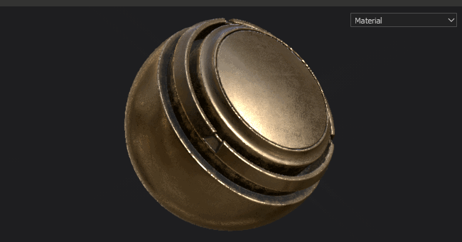
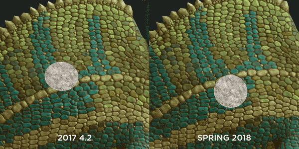
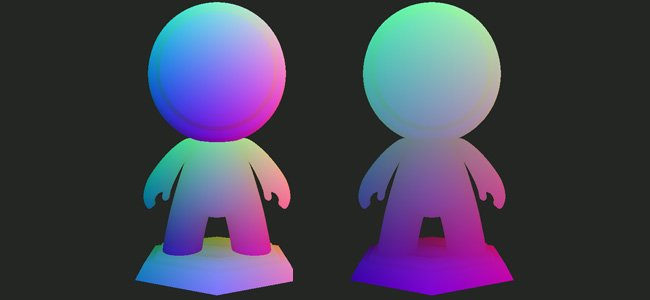
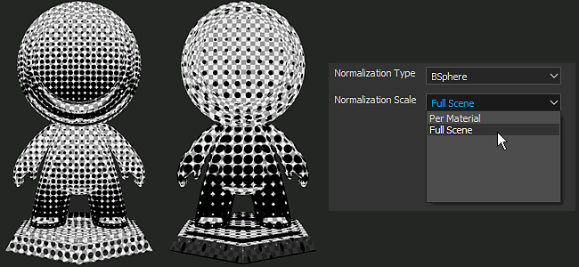
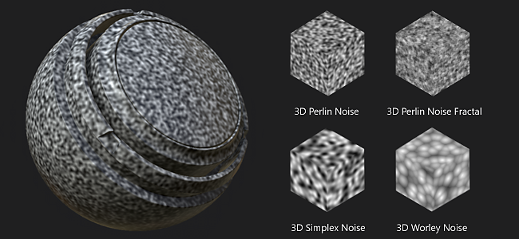

# バージョン2018.1

**Substance Painter 2018.1**&#x200B;では、インターフェイスが刷新され、ビヘイビアーが大幅に改善されました。 パフォーマンスも多くの分野で改善されています。

リリース日： *15 March 2018*

## 主な機能

### 新しいインターフェイスと動作

{width="650px"}

Substance Painter 2018.1では、色やアイコンからウィジェットのビヘイビアーまで、**インターフェイスの全面的な刷新**&#x200B;が導入されました。

* **新しいインターフェイス**&#x200B;では、新しいデザインの導入に重点が置かれ、読みやすくなり、移動が面倒でなくなります。\
  すべてのアイコンをより明確に修正しました。 カラースキームも修正しましたが、一貫性が向上しました。\
  
* 多くのウィジェット、特に&#x200B;**スライダー**&#x200B;は、**タブレットペン**&#x200B;で&#x200B;**使いやすい**&#x200B;ように改善されました。\
  バーをクリックしてスライダーを移動するか、値フィールドを使用して数値をより正確に編集できます。\
   
* **新しいツールバー**&#x200B;を使用すると、その場で&#x200B;**ドック**&#x200B;を開くことができます。\
  ツールバーのボタンの1つをクリックすると、そのボタンの横にDockが表示され、その他のインターフェイスの上にフローティングされます。ボタンを再度クリックすると、そのボタンが閉じます。\
  ドックがボタンから離れると、通常のフローティングウィンドウになり、インターフェイスにドッキングできるようになります。 閉じた場合、ボタンはDockツールバーで再び使用できるようになります。\
  この新しいドッキングシステムは、フルスクリーンでより簡単に動作します。 すべてのドックがインターフェイスに常に存在する必要はありません。\
  
* ドックでは、新しい&#x200B;**タブレイアウト**&#x200B;が使用されるようになりました。このレイアウトでは、アイテムをセクションに整理しながら、その中をすばやくスクロールできます。\
  このタブレイアウトでは、情報を非表示にする通常のタブシステムとは異なり、**大きなウィンドウ**&#x200B;を表示でき、**すべての情報**&#x200B;を同時に表示できます。\
    
* **クイックメニュー**&#x200B;が追加され、**ツールのプロパティ**&#x200B;を&#x200B;**直接ビューポートーで**&#x200B;利用できるようになりました。\
  クイックメニューを開くには、**ビューポートを右クリック**&#x200B;します。 クイックメニューを&#x200B;**閉じる**&#x200B;には、**ビューポートをもう一度クリック**&#x200B;します。\
  ビューポートをクリックしたときにのみメニューが閉じるため、シェルフからクイックメニューにリソースを直接ドラッグ&amp;ドロップできます。\
  
* ビューポートの上部に新しい&#x200B;**コンテキストツールバー**&#x200B;が追加されました。\
  このツールバーは、使用されている現在のツールに応じてパラメータを変更します。 ブラシのサイズなどの基本的なツール機能にすばやくアクセスできます。\
  
* **レイヤースタック**&#x200B;で&#x200B;**ドラッグ&amp;ドロップ**&#x200B;を使用して&#x200B;**エフェクトを並べ替え**&#x200B;できるようになりました。\
  
* ショートカット「**C**」および「**B**」を使用すると、**チャネル**&#x200B;および&#x200B;**テクスチャ**&#x200B;をすばやく&#x200B;**ビューポート**&#x200B;に表示できますが、**統合ドロップダウン**&#x200B;を使用して、ビューポートの表示を変更できるようになりました。\
  **ビューポート**&#x200B;の&#x200B;**右上**&#x200B;に、**すべてのチャンネルとメッシュマップ** （以前の追加マップ）を一覧表示するドロップダウンが表示されます。 この統合されたドロップダウンは、**表示設定**&#x200B;ドックでも使用できます。\
  
* **表示設定**&#x200B;と&#x200B;**ビューア設定**&#x200B;は、**単一のDockに結合**&#x200B;されました。\
  **環境**、**カメラ**&#x200B;および&#x200B;**ビューポート**&#x200B;の設定が&#x200B;**一緒**&#x200B;にグループ化され、**シェーダー**&#x200B;のパラメーターが&#x200B;**代わりに**&#x200B;専用のドック&#x200B;**に移動**&#x200B;されました。\
  新しい&#x200B;**タブレイアウト**&#x200B;を利用して、ウィンドウをすばやく移動できます。\
  

### マテリアルとスマートマテリアルをビューポートにドラッグ&amp;ドロップ

{width="650px"}

マテリアルとスマートマテリアルを&#x200B;**ビューポートに直接**&#x200B;ドラッグ&amp;ドロップ&#x200B;**できるようになりました。**\
この新しい操作により、**対象テクスチャセット**&#x200B;の&#x200B;**ジオメトリ**&#x200B;が同時にハイライト表示されます。 これにより、テクスチャセットのレイヤースタックの上部に新しいレイヤーが作成されます。

### タブレットペンの動作の改善

このバージョンでは、特にSubstance Painterに大きな負荷がかかっている場合に、グラフィックタブレットのペンの動きや入力を処理する方法が改善されました。\
連続計算を行っている間は、入力を失うことはありません。 これにより、どのような状況でも正確なブラシストロークを使用できます。

### シームパディングの改善

UV アイランドの外側にパディングを作成する方法を一新しました。 現在のピクセルを特定の間隔で拡大する代わりに、シームの反対側にある隣接するピクセルを探して、2つの値を補間します。\
これにより、テキストの縦横比が一致しない場合でも、最終結果が大幅に改善され、UV アイランド間の分割が見えにくくなります。

<table>
<tr style="border: 0;">
<td style="border: 0;" valign="top">

{width="200px"}

</td>
<td style="border: 0;" valign="top">

{width="200px"}

</td>
</tr>
</table>

この新しいパディングは、ブラシストローク、解像度の変更またはレイヤーの変更が行われるたびに自動的に生成されます。

### パフォーマンスの向上

{width="650px"}

また、このバージョンでは、複数のレベルでのパフォーマンスも向上しました。

* プロジェクトを開いたり保存したりする操作が、以前よりも少し速くなるはずです。\
  **ペイントデータ**&#x200B;のエンコード/デコード方法を修正しました。 これは、特にペイント情報の多いプロジェクト（ブラシストローク）で発生します。
* メッシュを使用して&#x200B;**サブオブジェクト**&#x200B;をサポートするようになりました。\
  Substance Painterーに読み込む前にメッシュを1つに結合する必要はなくなりました。 プロジェクト内の&#x200B;**8000個のサブオブジェクト**&#x200B;でも、パフォーマンスは良好です。
* **ビューポート**&#x200B;の&#x200B;**更新**&#x200B;方法を変更し、描画時のGPUの負荷を軽減しました。\
  これは、画像全体を更新するのではなく、現在作業している小さな領域を更新することを意味します。\
  処理能力の低いGPUでも、シェーダーのサンプルカウントが多い場合でも、その違いを実感できます。
* **シェルフ**&#x200B;システムは、アプリケーション起動時に&#x200B;**高速に**&#x200B;個のリソースを検出できるようになりました。\
  埋め込みビットマップを含むマテリアルは、検出に&#x200B;**2倍高速**&#x200B;です（非固体として調理された場合）。 **プリセット**&#x200B;も改善点を確認してください。

### グローバルシーンの職位ベイカー

フルシーンサイズを考慮したテクスチャセットごとのポジションマップをベイクできる新しい設定になりました。\
この新しいビヘイビアーを使用すると、以前のようにシームを作成するのではなく、シーン全体で一致するマスクジェネレーターでトライプラナー投影を使用できます。 これは、UDIMベースのプロジェクトのように、テクスチャセットが多いプロジェクトでは本当に便利です。

ポジションベイカーで、パラメーター「**正規化スケール**」を「**マテリアルごと**」から「**完全なシーン**」に変更して、この新しいビヘイビアーを有効にします。

### 新規コンテンツ

このリリースではまた、新しいコンテンツも追加されています。

* 新しい&#x200B;**3D ノイズ。**\
  Substance Designerから直接読み込まれ、4つの新しい3Dとまったくシームレスなノイズがデフォルトシェルフに追加されました。\
  これらの新しいノイズは、プロジェクトのポジションマップに依存して、シームのない結果を生成します。
* **非正方形** ノイズ\
  基本音がSubstance Designerの最新版にアップデートされている。\
  これは、非正方形の展開機能がノイズパラメーターで使用できるようになったことを意味します。
* 新しいマスクジェネレーター **3D Linear gradient** この新しいマスクジェネレーターを使用すると、3D空間の任意の方向に線形グラデーションを作成できます。\
  方向は、位置マップ上で直接選択できる2つの3D位置で定義できます。\
  例：

1. &#x200B;
   1. レイヤーの1つにマスクジェネレーター&#x200B;**3D Linear gradient**&#x200B;を作成します
   1. ビューポートの表示を「**位置**」に切り替えます（ビューポートのドロップダウンから、または「**B**」キーを使用して）
   1. 「**3D位置開始**」パラメーターをクリックして、**カラーピッカー**&#x200B;のポップアップを開きます
   1. **ビューポートの**&#x200B;メッシュで色を選ぶ&#x200B;**&#x200B;**
   1. 2番目のパラメーター「**3D位置End**」に対してプロセスを繰り返します

      

* 新しいテンプレート&#x200B;**Lens-studio** （チャット3Dアプリのスナップ）。\
  スナップで作成したLens-Studioを対象としたプロジェクトを簡単に作成できる新しいテンプレートを用意しました。\
  専用のシェーダーおよび書き出しプリセットも使用できます。 Lens Studioの詳細については、<https://lensstudio.snapchat.com/>を参照してください。
* **スマートマテリアル**&#x200B;と&#x200B;**スマートマスク**&#x200B;が、最新バージョンのマスクジェネレーターで更新されました。\
  アドビのスマートプリセットはすべて、**マイクロディテール**&#x200B;機能をサポートするようになりました。この機能は、**アンカーポイント**&#x200B;で使用できます。

### 新規サンプルプロジェクト

{width="650px"}

「**TilingMaterial**」という名前の新しいサンプルプロジェクトが作成されました。このプロジェクトは、「**ファイル/サンプルを開く**」メニューアクションを使用して開くことができます。\
このプロジェクトでは、UVが重なり合う単純な平面メッシュを使用して、**シームレスにペイント**&#x200B;マテリアルとブラシストロークで&#x200B;**タイリングマテリアルを作成**&#x200B;できます。

{width="400px"}

## チュートリアル

新しいインターフェイスをカバーする新しいチュートリアルコース、Substanceアカデミーに追加されました： [Substance painter 2018入門](https://academy.allegorithmic.com/courses/a97b433a5997fd800b5ed300d783cc41/youtube-e-zpEL0Wcqg)

## リリースノート

### 2018.1.3

（2018年6月28日リリース）

**追加：**

* 概要：ホットフィックス
* [環境設定] Painterの再起動時にプロジェクトを保存するように提案する

**修正済み：**

* [Plugin]検索Substance Sourceが機能しない
* [スマートマテリアル]スマートマテリアルを読み込むとクラッシュすることがある
* [スマートマテリアル]スマートマテリアルを削除するとクラッシュすることがある
* [保存]保存するとクラッシュすることがある
* [シェルフ] セル 2とセル 3で反転が機能しない
* [シェルフ]一部のAlphaで発生する誤字
* [シェルフ]一部のSubstanceマテリアルが正しくレンダリングされない

**既知の問題：**

* AMD VEGA GPUでの計算のフリーズ

### 2018.1.2

（2018年6月6日公開）

**追加：**

* 概要：ベイク処理速度の向上、保存システムの改善、スライダーの更新、プラグインAPIの更新、中国語の翻訳、パディングの改善（オプション）
* [ベーカーさん]新しいベーカー版でパフォーマンスが向上
* 互換性のないGPUを使用してディスプレイダイアログを強制する
* [保存]新しいコンパクトプロジェクト機能を表示します（フル/コンパクト保存モード）
* [保存]保存エラーが発生した場合にユーザーに通知する
* [消去]次の保存をフル/コンパクトモードで実行
* [スライダー]カラー/グレースケールバーとスライダーの精度の向上
* [スライダー]上下の矢印コントロールの追加
* [スライダー]カラーおよびグレースケールバースライダーに対して同じ検出ゾーン
* [プラグイン]自動保存は常に増分モードで実行される
* [プラグイン]プラグインを新しいインターフェイススタイルに切り替えるオプション
* [言語]中国語の翻訳を追加
* テクスチャセット設定のテクスチャごとの隣接パディングをUVと3D空間の間で切り替えるオプション
* [スクリプト]保存モードの表示：フル/コンパクトまたはインクリメンタル
* [Script]スクリプト/QMLドキュメントを更新する
* [ログ]ログに保存モードを指定する（完全/圧縮または増分）

**修正済み：**

* [ツール]チャンネルスロットがシングルチャンネルフィルのマテリアルスロットに変形します
* マテリアルによって割り当てられていない面を含むメッシュ(FBX)を読み込むときにクラッシュが発生する
* NVIDIA グリッド 5.2を搭載したIrayを仮想マシンでクラッシュする
* マテリアルプリセットの削除を取り消すときにクラッシュが発生する
* 一部のプロジェクトを読み込み中のクラッシュ
* [コマンドライン] メッシュの新しいコマンドラインをudimごとに分割
* [ツールバー]ツールバーの縮小
* [インスタンス化]複数のテクスチャセット間でビットマップをインスタンス化できない
* [ビューポート]タイルされたUVでメッシュをペイントすると、更新が完了しない
* [Iray]誘電体に法線マップを2回適用する
* [シェルフ]一部のSubstanceパラメーター(alpha、procedurals、matfx)で誤字が発生する
* [シェルフ]ビットマップ「許可された個人のみ」のタイプミス
* [スクリプト]関数alg.shaders.マテリアル()が機能しない

**既知の問題：**

* AMD VEGA GPUでの計算フリーズ

### 2018.1.1

（2018年4月3日公開）

**修正済み：**

* [タブレット]デフォルトのインタラクション選択を変更する際の問題
* [ベイカー] Assimpライブラリとのクラッシュ
* [ベイカー]成績表を用いた性能低下
* [Iray] アルファチャンネルにレンズゆがみが適用されない
* [ドライバー]最小ドライバー要件の更新
* [3Dview]法線情報のないメッシュで法線が正しく生成されない
* [Intel] Substance Painter 2018.1.0とのクラッシュ
* [Intel]&#x200B;[ビューポート]パディングに関する問題（黒のアーティファクト）

**既知の問題：**

* AMD VEGA GPUでの計算フリーズ

### 2018.1

（2018年3月15日公開）

**追加：**

* 新しい全体的なスタイル（アイコン、カラー、ビヘイビアー）
* 新しいデフォルトレイアウト
* [タブレット]ペイント時のユーザーエクスペリエンスの向上
* [メインメニュー]ビューとツールバーのネイティブ項目を最初に並べ替える
* [メインメニュー] 「ビューポート」セクションの「クイックマスクアクションを移動」
* [メインメニュー]右クリック操作をビューポートセクションに移動
* [メインメニュー] 「表示」メニューを「ウィンドウ」に名前変更
* [クイックメニュー] ビューポートで右クリックして新しいツールプロパティを作成
* [ウィジェットをドッキング]すばやく縮小/呼び出しできる新しいドッキングツールバー
* [表示設定] カメラとビューアの設定ウィンドウが結合されました
* [レイヤースタック]コンテキストに応じた右クリックメニュー
* [レイヤースタック]同じレイヤー内で効果をドラッグ&amp;ドロップして移動する
* [ツールバー]ツールバーと新しいコンテキストツールバーの再編成
* [ツールツールバー]コピースタンプツールを2つのツールに分割する
* [ツールのプロパティ]プレビューの背景のグレースケール値を明るくする
* [ツールプロパティ]タブの編成（塗りとツール）
* [ツール]ペイントの結果がステンシルと一致する
* [ビューポート] 塗りつぶしレイヤーの新しいカーソル
* [ビューポート]よりスムーズなナビゲーションとペイント（高いフレーム率）
* [ビューポート] ビューポートのマテリアル/チャンネル/マップ選択コンボボックス
* [ビューポート]回転中のちらつきを低減（シャドウをオン）
* [シェルフ] Painterを開いたときにデフォルトでマテリアルが表示される
* [シェルフ] Substanceテクスチャとマテリアルの読み込み時間の短縮（2～6倍速）
* [シェルフ] Substance Source構造に合わせてマテリアルフォルダーを再編成する
* [シェルフ] ビューポートのメッシュにマテリアルを直接ドラッグ&amp;ドロップする
* [シェルフ]新しい3D ノイズ（パーリン、パーリンフラクタル、シンプレックス、ワーリー）
* [シェルフ] メッシュの位置を使用した新しい3D Linear gradientマスクジェネレーター
* [シェルフ]非正方形拡張をサポートするために基本ノイズを更新しました
* [シェルフ] Lens Studio用に新しいテンプレートと書き出しプリセットを追加しました（スナップアプリ）
* [シェルフ]最新バージョンのマスクエディターを使用するようにスマートマテリアルとスマートマスクを更新しました（マイクロディテール）
* [シェルフ]シームレスなタイリングマテリアルを実現する新しいサンプルプロジェクト「TilingMaterial」
* [シェルフ]新しいブラシプリセット（カリグラフィー、ウェット、ハッチングなど）
* [スライダー]新しいスライダーとグレースケール/カラーバーのスタイルと動作
* [ベイカー]ポジションマップの計算にフルシーンのバウンディングボックスを使用できるようにします
* [シェーダー]既定のシェーダーパラメータからHeight力パラメータを削除します
* [エンジン] Substanceエンジンが更新されました
* [エンジン] UVチャンク間で不連続が発生しない（新しいシームパディング）
* [プラグイン] Substance Sourceからダウンロードしたマテリアルをすばやく読み込む
* [プラグイン]新しい全体的なスタイルに合うようにすべてのプラグインを更新する
* [環境設定]プレビューの背景色が自動的に変更されます
* [クリーン]プロジェクト破損のリスクを軽減
* [開く]プロジェクトを開く時間の改善
* [新規プロジェクト]新規プロジェクト – メッシュの更新時間の短縮
* [保存]プロジェクト時間の短縮
* [ログ]ログに報告されたライセンスの種類
* [TextureSet] 「テクスチャ」ボタンの名前を「烘焙メッシュマップ」に変更
* 「その他のマップ」を「メッシュマップ」に名前変更

**修正済み：**

* [ビューポート]多数のサブオブジェクトを含むメッシュでパフォーマンスが低下する
* [ツールのプロパティ]画像をマテリアルスロットにドラッグ&amp;ドロップすると、チャンネルが無効になる
* [ツールのプロパティ]指先ツールとクローンツールでブラシのプレビューが壊れる
* [テクスチャセット]テンプレートを使用するとチャネルの順序が正しくない
* [シェルフ] グレースケール変換ジェネレータのアイコンがありません
* [シェルフ] Sign Circle Numberのアルファが壊れています（フォントがありません）
* 起動時に統合GPUが誤って検出される
* [クラッシュ]#文字で名前を付けた読み込まれたリソースをドラッグ&amp;ドロップする
* [エンジン]統合GPUでのVram検出の問題
* [エンジン] Substance engineリンカーの多数のクラッシュを修正
* [エンジン]解像度を変更すると、四角形のノイズが発生する
* [ポストエフェクト] ポストエフェクトがオンになっていると、インターフェイスのサイズ変更が遅くなる
* [ベイカー] [レイ距離]の値でシーン単位が正しく考慮されない
* [ベイカー]入力値にかかわらず、メッシュオクルーダー距離からのAOを1にクランプ
* [ベイカー]名前で一致させると、特定の名前を持つ一部のメッシュが無視される
* [ベイカー] [メッシュポリグループ]と[サブメッシュID]の設定からの色は、常に黒いイメージを返します
* [ベイカー] BlenderのバイナリFBX メッシュでID ベイクが失敗する
* [シェーダー] dota-2と非pbr-spec-glossを使用した2D ビューのノイズ
* [Linux] ベイク時にCPUスレッドが1つだけ使用される
* [MacOS] ビューポート上でブラシカーソルが動くクラッシュ

**既知の問題：**

* AMD VEGA GPUでの計算フリーズ
* Irayへの書き出し時に、ゆがみ後処理が考慮されない(アルファチャンネル)
