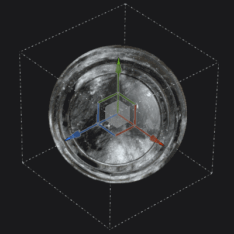
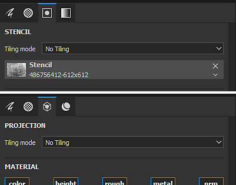
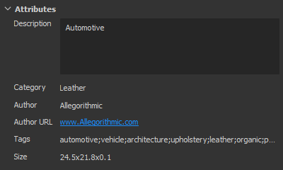

# バージョン2018.2

**Substance Painter 2018.2**&#x200B;には、サブサーフェススキャッタリングペイントなどの待望の機能が追加されており、テクスチャリングが以前よりもさらに簡単になりました。

リリース日： *2 August 2018*

## 主な機能

### サブサーフェススキャッタリング

**サブサーフェススキャタリング**&#x200B;は、**リアルタイム**&#x200B;ビューポートおよび&#x200B;**Irayレンダラー**&#x200B;でサポートされるようになりました。\
サブサーフェスのスキャタリングは、オブジェクトまたはサーフェスを貫通する際の光のメカニズムです。 金属表面のように反射されるのではなく、光の一部が材料に吸収され、**内部で散乱**&#x200B;されます。 実際の多くのマテリアルには、肌やワックスなどの表面下の散乱があります。

このサブサーフェスエフェクトの実装は、他のゲームエンジンや他のオフラインレンダラからのリアルタイムの実装と非常に緊密に一致しています。 他のアプリケーションで使用する散布テクスチャを簡単に作成できます。

{width="650px"}

上記は、よく知られたDigital Emily 2アセットの例です。 USC Institute for Creative TechnologiesとWikihumanプロジェクトのメンバーのおかげで、Digital Emily 2アセットを使用してレンダリングを実演できるようになりました。\
（この比較は、類似しているが厳密ではない照明条件で行われたため、視覚的な違いが説明されている場合があります）。

プロジェクトにサブサーフェススキャタリングを追加するには、次の手順に従います。

1. **ディスプレイの設定**&#x200B;ウィンドウに移動し、**サブサーフェススキャッタリング**&#x200B;設定を&#x200B;**アクティブ化**&#x200B;します。
1. 現在のテクスチャセットに「**散布**」チャンネルを追加
1. 塗りつぶしレイヤーを使用するか、新しいチャンネルで&#x200B;**白くペイント**&#x200B;して、ビューポートでサブサーフェス効果を&#x200B;**表示**&#x200B;します。

詳細な手順は、[Subsurface Scatteringドキュメント](../../features/subsurface-scattering/subsurface-scattering.md)を参照してください。

>[!NOTE]
>
> リアルタイムビューポートでサブサーフェススキャタリングをサポートするには、プロジェクトの&#x200B;**シェーダ**&#x200B;が&#x200B;**更新**&#x200B;されている必要があります。\
> カスタムシェーダーについては、**ヘルプメニュー**&#x200B;にあるドキュメントを参照して、**シェーダー API**&#x200B;の変更点を確認してください。

### 塗りつぶしレイヤーのマニピュレータ

塗りつぶしレイヤーの制御が改善され、マニピュレータが表示されるようになりました。 塗り潰し投影の正確な配置とコントロールが容易になりました。

**UV 投影**&#x200B;を使用すると、マニピュレータが&#x200B;**2Dビュー**&#x200B;に表示されます。

* マニピュレータの&#x200B;**外側**&#x200B;をクリックすると、**回転**&#x200B;します。
* **境界線**&#x200B;の&#x200B;**正方形**&#x200B;をクリックすると、**拡大・縮小**&#x200B;されます。
* **内側**&#x200B;をクリックすると、マニピュレータが&#x200B;**移動**&#x200B;します。
* **CTRL**&#x200B;を使用して、**対称**&#x200B;の複数のコーナーに影響を与えます。
* 変換（移動、回転、スケール）には、**SHIFT** ～ **制約**&#x200B;を使用します。\
  

**Tri-Planarプロジェクション**&#x200B;を使用すると、**3Dビュー**&#x200B;にマニピュレータが表示されます。

* 点線の立方体はグローバル投影を表します
* **W**、**E**&#x200B;または&#x200B;**R**&#x200B;キーボードショートカットを使用して、**移動**、**回転**、および&#x200B;**拡大・縮小**&#x200B;モードを切り替えます。
* **T**&#x200B;キーボードショートカットを使用して、マニピュレータのローカル方向とワールド方向を切り替えます。
* 変換には&#x200B;**SHIFT**&#x200B;を使用して&#x200B;**制約**&#x200B;します。
* 3平面キューブ投影は、高度な塗りつぶしレイヤープロパティで変更することもできます。\
  \
  

ビューポートの上部にあるコンテキストツールバーは、現在の投影モードにも適応し、次のような追加のツールやコントロールを提供します。

詳しくは、[塗りつぶしレイヤーのドキュメント](../../painting/fill-projections/fill-projections.md)を参照してください。

### ステンシルおよび投影ツールの非正方形および非傾斜サポート

ステンシルパラメーターと投影ツールが改善され、非正方形の解像度と非ティリング動作がサポートされるようになりました。\
デフォルトのパラメーターは、デフォルトで非ティリングに設定されるようになりました。 このパラメーターは、ツールのプロパティで変更できます。

チルリングモードは、次のように設定できます。

* **タイル表示なし** （既定）
* **横タイル**
* **縦並べ表示**
* **縦と横のタイリング** （古い動作）

この新しいパラメーターはツールまたはブラシプリセットに保存できるので、カスタムコンテンツとの共有が簡単になります。

>[!NOTE]
>
> * また、プロジェクション比は、非正方形の解像度で出力されるSubstanceファイルにも適応します。 この比率は、出力ノードから直接計算されます。
> * 投影ツールでは、複数のチャンネルの比率が異なる場合、最初に見つかった比率が他のすべてのチャンネルに適用されます。

### カメラの読み込みと管理

メッシュの読み込みと共に、Substance Painter内の&#x200B;**カスタムカメラを読み込み**&#x200B;できるようになりました。\
**3Dビューポート**&#x200B;でカメラを&#x200B;**選択して表示**&#x200B;し、**使用してIray**&#x200B;でレンダリングできます。

詳しくは、[カメラ管理のドキュメント](../../interface/viewport/camera-management.md)を参照してください。

プロジェクトに&#x200B;**カメラを読み込む**&#x200B;には：

1. 同じファイル内のカメラを使用して、プロジェクトのメッシュを書き出します（FBX、Alembic、glTFなどのサポートされている形式を使用）
1. [新しいプロジェクトウィンドウ](../../getting-started/project-creation.md) （または[プロジェクト構成](../../interface/project-configuration.md)）で[カメラのインポート]設定を選択します。\
   
1. ビューポートのドロップダウンを使用するか、[表示設定](../../interface/display-settings/camera-settings.md)の設定を使用して、目的のカメラに切り替えます。\
   

Display SettingsウィンドウのCamera Settingsが拡張され、カメラのプロパティを制御できるようになりました。\
カメラ間で&#x200B;**切り替え**&#x200B;は可能です。変更されないように、**比率**&#x200B;を確認し、プロパティを&#x200B;**ロック**&#x200B;してください。 復元ボタンを使用して、カメラを初期値に戻すことができます。

カメラのフレーム（およびそのゲート）も考慮されており、非常に特定の視点から表示およびペイントすることが可能です。 フレームとゲートは3Dビューポート上に表示され、その不透明度は、[表示設定](../../interface/display-settings/camera-settings.md)ウィンドウの&#x200B;**ビューポート設定**&#x200B;で制御できます。

### レイヤースタックの動作の改善

* **マテリアルとスマートマテリアルをIDマップにドラッグアンドドロップします：**\
  シェルフからビューポートへのコンテンツのドラッグ&amp;ドロップが改善されました。 **CTRL**&#x200B;を押しながらマテリアルをドラッグ&amp;ドロップすると、マスクとして使用するIDカラーを選択できます。\
  レイヤースタックで作成された新しいレイヤーに、カラー選択効果を含む黒いマスクが追加されます。 同じマテリアルを別のIDカラーにドラッグ&amp;ドロップすると、既存のレイヤーが更新され、IDカラーが結合されます。\
  
* **レイヤースタックのドラッグ&amp;ドロップスクロール:**\
  レイヤースタックの周囲にレイヤーをドラッグすると、小さなウィンドウが表示されるようになりました。\
  リソースまたはレイヤーをレイヤースタックウィンドウの境界線の近くにドラッグすると、コンテンツのスクロールが自動的に開始されます。\
  

### glTFとAlembicメッシュのインポート

メッシュの読み込みと新しいプロジェクトの作成で、新しいファイル形式がサポートされるようになりました。

* **glTF** ：この形式は、テクスチャの書き出し時に既に使用可能で、読み込み時に使用できるようになりました。 glTFファイルにテクスチャが含まれている場合、テクスチャは読み込まれ、レイヤースタックの内側に配置されます（メタリック/ラフネスのワークフローの場合）。
* **Alembic** ：この形式は、メッシュを転送するためにVFX /アニメーション業界で広く使用されています。

>[!NOTE]
>
> Substance Painterには、現時点で読み込むアニメーションのフレームを制御する機能はありません。\
> つまり、Alembicファイルを書き出すときに、アセットにペイントするために使用する参照フレームを既に設定しておく必要があります。

### Substance統合の改善

Substance Painter内のSubstance統合が、待望のリクエストで改善されました。

* <b>次の場合に表示：</b>\
  「次の場合に表示」は、条件に基づいてパラメーターを非表示にできるSubstanceファイルフォーマットの優れた機能です。\
  この機能により、パラメーターとコンテキスト設定がよりわかりやすくリストされ、マテリアルとフィルターが全体的に使いやすくなりました。\
  詳細については、[Substance Designerのドキュメント](https://experienceleague.adobe.com/en/docs/substance-3d-designer/home)を参照してください。\
  
* **Substanceプリセット** Substanceプリセットを使用すると、マテリアルの高度な微調整やバリエーションを簡単に設定できます。 [Substance Source](https://source.allegorithmic.com)の多くのマテリアルにはプリセットがあるので、試してみてください。\
  Substanceファイルに1つ以上のプリセットが含まれている場合、パラメーターリストの新しいドロップダウンが使用できるようになります。 パラメーターの更新に適用するプリセットを選択します。\
  
* **Substance属性**\
  Substance属性がインターフェイスに表示され、特定のファイルに関する情報を簡単に取得できるようになりました。\
  属性は、2つの異なる場所で表示できます。プロパティウィンドウのパラメータの上、またはシェルフのアセットを右クリックして表示します。\
   

### 新しいサンプルプロジェクト「Jade Toad」

「**JadeToad**」という新しいサンプルプロジェクトがSubstance Painterに含まれるようになりました。 このサンプルプロジェクトでは、デフォルトで&#x200B;**サブサーフェスの散布**&#x200B;効果が有効になっています。\
プロジェクトを見つけるには、**ファイル** > **サンプルを開く…**&#x200B;メニュー項目を使用します。

## リリースノート

### 2018.2.3

（2018年9月25日公開）

**&#x200B;**&#x200B;修正済み：**&#x200B;**

* [2Dビュー]新しいプロジェクトを作成すると、2Dビューがメッシュで壊れる
* [クラッシュ] UV 投影から3平面プロジェクションに切り替えるとクラッシュする
* [RayCollider] 「RayCollider」による複数のクラッシュ
* [ツール]レイヤーを切り替えると、変更されたブラシプロパティが失われる
* 消しゴムに切り替えると、ブラシ設定がリセットされる

**既知の問題：**

* AMD VEGA GPUでの計算のフリーズ
* Windows OSでのショートカットに関するHuionタブレットの問題

### 2018.2.2

（2018年9月11日公開）

**追加：**

* 概要：コンテンツの更新、新しいスクリプト機能、および自動更新を無効にできるホットフィックス
* [コンテンツ][シェルフ]スキンシェルフプリセットを追加する
* [コンテンツ][シェルフ] 19個のスキン法線をサブサーフェススキャタリング用のマテリアルに変換
* [スクリプト]開いているプロジェクトからプロジェクトテンプレートを作成する
* [スクリプト]開いているプロジェクトの書き出し設定を取得/設定します。
* [アップデート]設定および環境変数で自動更新ポップアップを無効にできる
* [アップデート]メンテナンスの古いポップアップに次のバージョンまで表示されない

**修正済み：**

* [カメラ]直交投影からパースに切り替えると、ズームが正しく表示されない
* [表示]一部のマップがsRGBではなくリニアで表示されます
* [ビューポート]メッシュフォーカスが正しく動作しない
* [2Dビュー]壊れたカメラを含むプロジェクトにUVシェルが表示されない
* [SSS][Tooltip]サブサーフェス散布ツールチップがログに表示されます
* 一部のプロジェクトは2018.2で開くことができず、エラーメッセージがnull Substanceパッケージを保存できません
* [マスク]マスクを操作すると、ペイントツールのカラーがスタックすることがある
* [マテリアル]特定の状況でマップが表示されない
* [Proj][Tools]ジェネレータでアクティブなマニピュレータ
* [Substance]パラメーターのSubstanceグループがありません
* [スクリプティング]ドキュメント内のソフトウェア名が正しくない
* [UDIMs]複数のUVタイル上のUVシェルに関する情報がログに存在しない

**既知の問題：**

* AMD VEGA GPUでの計算のフリーズ
* Windows OSでのショートカットに関するHuionタブレットの問題

### 2018.2.1

（2018年8月3日リリース）

**修正済み：**

* プロジェクトのアップグレード時にサブサーフェススキャタリングシェーダーパラメータが見つからない

**既知の問題：**

* AMD VEGA GPUでの計算のフリーズ
* Windows OSでのショートカットに関するHuionタブレットの問題

### 2018.2

（2018年8月2日リリース）

**追加：**

* 概要：サマーリリース、サブサーフェスのスキャッタリングのサポート、プロジェクションと塗りつぶし機能の強化、カメラの読み込みと選択、Alembic/glTFのサポート、IDマップへのドラッグ&amp;ドロップ、Substanceフォーマットのサポートの強化、新しいコンテンツ
* [SSS][ビューポート][IRay]一般サブサーフェススキャタリング
* [SSS] MDLとサブサーフェスのスキャッタリングパラメータを同期する
* [SSS] 「Scattering」という名前の新しいグレースケールチャンネルを追加しました
* [SSS][シェーダ設定]サブサーフェススキャタリング（スキンまたは半透明）のスキャタリングタイプパラメータ
* [SSS][シェーダ設定]サブサーフェススキャタリングのスキャッタリングスケールパラメータ
* [SSS][シェーダ設定]サブサーフェススキャタリングのスキャッタリングカラーパラメータ
* [SSS][表示設定]サブサーフェススキャッタリングのスキャッタリングサンプル数
* [Shader][Iray] Iray用サブサーフェススキャタリングMDLを統合
* [シェーダ]リソースアップデーターによるシェーダの更新
* [Shader] Update change log APIおよびドキュメント
* [ツールプロパティ][プロジェクト]三面体投影の新しいパラメータ
* [ビューポート][投影]マニピュレータを使用して3Dビューの塗り潰しレイヤプロパティを直接制御する（3面投影）
* [ショートカット][プロジェクト]三面法の投影マニピュレータ用の新しいショートカットQ、W、E、R、T
* [ビューポート][プロジェクト]マニピュレータを使用して2Dビューで塗り潰しレイヤプロパティを直接制御する(UV 投影)
* [Shortcuts][Proj] UV 投影マニピュレータ用の新しいショートカットQ
* [コンテキストツールバー][プロジェクト]三平面の投影マニピュレータを制御する
* [コンテキストツールバー][プロジェクト]コントロールUV 投影マニピュレータ
* [ツールプロパティ]投影ツールとステンシルツールでテクスチャのタイリングを無効にする
* [ステンシル]投影ツール/ステンシルで非正方形の画像を使用する
* [ステンシル]プロパティウィンドウでタイリングモードの制御を許可
* [ステンシル]ズームがタイリングされていないステンシルの中央に表示されない
* [カメラ] Maya、Max、Blender、Modo、DAEからカメラをインポートする
* [カメラ][ビューポート]読み込んだカメラをビューポートで選択し、制御します
* [カメラ][Iray] Irayで読み込んだカメラを選択して制御する
* [カメラ][UI][新規プロジェクト][プロジェクト構成] 「カメラを読み込み」はデフォルトでオンになっています
* [カメラ][ショートカット]カメラを切り替えるためのショートカット「&lt;」と「>」を追加
* [カメラ][ビューポート]ビューポートにフレームを追加
* [カメラ][ビューポート設定]フレームの不透明度のコントロール
* [Cameras][Camera Settings] 500 mmでの最大焦点距離
* [カメラ][カメラ設定]露出率
* [カメラ][カメラ設定]ロックオプションを追加
* [カメラ][カメラ設定]復元オプションの追加
* [カメラ][カメラ設定]フォーカス距離アトリビュートの追加
* [glTF] glTFファイルのインポート
* [glTF]環境オクルージョンマップをインポートします
* [Alembic]静的ジオメトリを持つAlembic 1フレームを読み込む
* [シェルフ]モディファイヤ付きのIDマップを使用して、マテリアルをメッシュに直接ドラッグアンドドロップする(Ctrl/Command)
* [レイヤスタック] IDマップを使用したメッシュ上でのマテリアルのドラッグアンドドロップによる自動IDマスク作成
* [レイヤースタック]レイヤースタック内でレイヤーをドラッグ&amp;ドロップして自動スクロールする
* [UI][ツールのプロパティ] Substanceのプリセットを表示する
* [UI][ヘルプメニュー]ヘルプメニューの改善
* [UI][新規プロジェクト][プロジェクト構成]ウィンドウの再編成
* [UI][新規プロジェクト][プロジェクト構成] 「メッシュ」の用語を「ファイル」に置き換えます
* [UI][Substance] Substanceの属性をUIに表示する
* [ショートカット] 「F4」は2Dビューと3Dビューを切り替えます
* [ショートカット]トグルステンシル「N」およびクイックマスク「U」の新しいショートカット
* [Substanceの統合] Substanceパラメーターの「visible if」ステートメントを考慮します
* [ビューポート]カメラの移動後に影の計算が強制されない
* [コンテンツ]読み込んだカメラでMeetMatを更新
* [コンテンツ]サブサーフェススキャタリングを有効にしてサンプルを追加する – JadeToad
* [コンテンツ]サブサーフェススキャタリングが有効になっている新しいPBRプロジェクトテンプレートを追加する
* [コンテンツ]書き出しプリセットが更新され、新しい散布チャンネルが追加されました
* [コンテンツ][シェルフ] pbr-metal-rough、pbr-metal-rough-alpha-test、pbr-coated、pbr-spec-glossに対する追加されたサブサーフェス散乱サポート
* [コンテンツ][シェルフ] 5つのスマートマテリアル（ビー玉とスキン）に散布チャンネルを追加
* [コンテンツ][シェルフ] 1個の新しいヒスイマテリアル
* [含有量][シェルフ] 1個の新しいワックスマテリアル

**修正済み：**

* [CMD]バージョンが異なる同じコマンドラインを使用すると、異なる結果が得られる
* [TDR] TdrLevelが設定されている場合、ログにエラーはありません
* [Baker]環境オクルージョンマップがフリップされる
* [ID Map] 0 ～ 1の範囲外を選択するとクラッシュする
* [Iray]テクスチャセットを切り替えてペイントモードに戻るとクラッシュする
* [ビューポート]ドラッグアンドドロップでビューポート間のドロップ領域を同期
* [エンジン]塗りつぶしレイヤーをタイル表示したり、小さなブラシをペイントしたりすると、モアレが発生する
* [License]ライセンスサービスのソフトウェアバージョンチェックが正しくありません
* [ライセンス]認証の処理方法を変更する
* [API]テンプレートを使用して作成する場合でも、`onNewProjectCreated`スクリプトAPIイベントを呼び出します
* [シェーダ]シェーダファイルがコンパイルされない場合、コンパイルされたシェーダがキャッシュからロードされない
* [シェルフ]シェルフからHDRファイルをエクスポートすると、値が固定されたファイルが出力されます
* [書き出し] EXR書き出しでは、RGBカラー値が0 ～ 1の範囲にクランプされます
* [コンテンツ]手続き型ノイズ「3Dパーリンノイズフラクタル」がピクセル化される

**既知の問題：**

* AMD VEGA GPUでの計算のフリーズ
* Windows OSでのショートカットに関するHuionタブレットの問題
