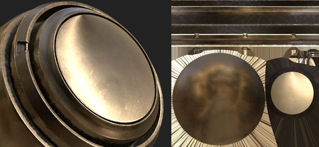
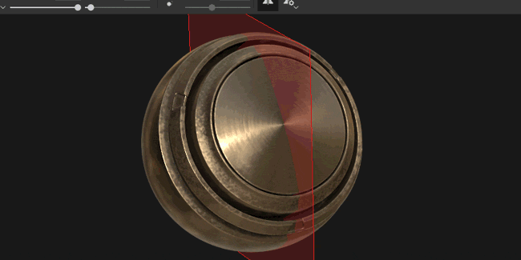
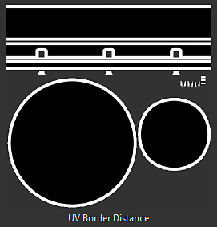

# バージョン2018.3

**Substance Painter 2018.3**&#x200B;が登場し、多くの新しいワークフローとレンダリング機能が追加されました。

リリース日： *20 November 2018*

## 主な機能

### 2D ビュー書き出し

**をテクスチャ**&#x200B;としてレンダリングして&#x200B;**2D ビューをエクスポート**&#x200B;できるようになりました。 この機能は多くのユーザーからリクエストされており、最終的に利用可能になりました。 書き出しプロセスでは、**2D ビュー**&#x200B;の現在の状態を使用して、通常の書き出し設定（パディング、ファイルフォーマット、ビット深度）でテクスチャをレンダリングします。 つまり、ビューモードが&#x200B;**マテリアル**&#x200B;ではなく&#x200B;**ソロ**&#x200B;に設定されている場合、2D ビューはそのまま書き出されます。

**書き出しウィンドウ**&#x200B;に移動し、「**2D ビュー**」という名前の新しい設定を選択します。\

独自の&#x200B;**書き出しプリセット**&#x200B;を作成する場合、[書き出し]ウィンドウの[**構成**]タブで、「**2D ビュー**」という名前の新しい&#x200B;**変換されたマップ**&#x200B;も使用できます。

### 改善されたベイク処理された照明フィルター

**ベイク済み照明環境**&#x200B;フィルターは大幅に改善され、**HDR 環境マップ**&#x200B;を適切にサポートするようになりました。\
ビューポートの照明を（2D ビューに表示されているように）再現し、Base colorチャンネルにベイクできるようになりました。 新しいフィルターは、**回転**、**環境**&#x200B;マップ&#x200B;**垂直方向**、および&#x200B;**露光量**&#x200B;の変更など、さらに細かい制御を提供します。

### リアルタイム異方性Specular反射

この新しいバージョンでは、「**pbr-metal-rough-異方性-angle**」という名前の新しいシェーダーを導入しています。 このシェーダーは、「**Anisotropy angle**」と「**Anisotropy level**」という名前の2つのチャンネルをサポートしています。これらのチャンネルを使用して、異方性Specularの反射を作成できます。 このシェーダーは、変換することなく、そのままIrayに移動されます。

この新しいシェーダーには、[シェーダーウィンドウ](../../interface/shader-settings/shader-settings.md)からアクセスできます。[シェーダー]ボタンをクリックしてミニシェルフを開きます。

デフォルトのサンプルプロジェクト「**Preview Sphere**」が更新され、その新しいシェーダーを利用して、様々なチャンネルを設定する方法が示されるようになりました。

>[!NOTE]
>
> **Anisotropy angle**&#x200B;チャンネル内のグラデーションを使用しているときに奇妙な&#x200B;**線の斑点**&#x200B;が表示される場合は、塗りつぶしレイヤーに備えて「**最も近い**」のフィルターリングモードに変更してみてください。これにより、シェーダーのサンプリングが改善され、問題が解消される可能性があります。

### クリアコートシェーダーを更新

**クリアコート**&#x200B;シェーダ(**pbr-coated**)が改善され、より多くのコントロールとレンダリングの可能性を提供できるようになりました。 また、専用の&#x200B;**MDL**&#x200B;を使用して、**Iray**&#x200B;と互換性を持たせることにしました。

変更のリストは次のとおりです。

* **セカンダリ**&#x200B;粗さ&#x200B;**レイヤーを**&#x200B;制御します（**ユーザー0**&#x200B;チャネル経由）。
* **マスク**&#x200B;をセカンダリレイヤーから（**ユーザー1**&#x200B;チャネル経由）送信します。
* サーフェスレイヤーに適用するビヘイビアーを選択します。**法線のディテールを維持** （元）または&#x200B;**滑らかなサーフェス** （新規、メッシュ法線マップを無視）

この新しいシェーダーをテクスチャリングするための新しいプロジェクトテンプレートも簡単に追加しました。名前は&#x200B;**PBR - メタリックラフネスコーティング**&#x200B;です。

### 新規ビューポートのアンチエイリアス

Substance Painterのアンチエイリアスのポストプロセスは修正され、「**テンポラルアンチエイリアシング**」(**TAA**)と呼ばれる新しい方式に変更されました。\
この新しい手法は、非常に最小限のコストですべてのケースでより良い結果を提供します。 **TAA**&#x200B;は、複数のフレームにわたって情報を蓄積することで、ディテールを失うことなく、非常に滑らかなエッジを作成します。

後効果ではなくなったため、設定は&#x200B;**ディスプレイ設定**&#x200B;ウィンドウ内で少し移動し、**後効果**&#x200B;セクションの&#x200B;**下**&#x200B;になっています。

この新しいアンチエイリアスを透明度と組み合わせると、新しい可能性も生まれます。 プロジェクトで&#x200B;**Alphaテスト**&#x200B;シェーダーを使用している場合は、「**アルファディザリング**」設定を有効にしてみてください。

新しい&#x200B;**TAA**&#x200B;では、**ノイズ**&#x200B;および&#x200B;**表面化散乱**&#x200B;のサンプルに見られる青の反射パターンも適切にフィルターされます。

### スパース仮想テクスチャリング(SVT)

**スパース仮想テクスチャ**&#x200B;または&#x200B;**SVT**&#x200B;のリリースは、この新しいバージョンの大きな変更点の1つです。

この新しいシステムは、Substance Painterの基礎とアプリケーションの動作を変えます。 Substance Painterでは、SVTを使用してビューポートの特定のメモリフットプリントを維持し、**テクスチャのインとアウト**&#x200B;を可能にします。 主な利点は、大きなプロジェクトをより簡単に読み込み、GPUの負荷を減らして&#x200B;**パフォーマンスを向上**&#x200B;できることです。 つまり、サイズが大きくなりすぎると、一部のテクスチャがディスクからアンロードされ、必要に応じて後で取り戻されます)。 これは&#x200B;**揮発性キャッシュ**&#x200B;で、アプリケーションが閉じると削除されます。

このシステムのもう1つの利点は、**ビューポート**&#x200B;内に&#x200B;**ミップマップ**&#x200B;を導入できることです。これにより、テクスチャの品質が向上し、特に生地のパターンで見えるモアレ効果が減少します。

この新しいシステムに関して、メインの環境設定（**編集/設定**）で編集できるコントロールをいくつか表示しました。

* **キャッシュディレクトリ** ：この設定は、Substance PainterがSVTキャッシュを含む一時ファイルを書き込む場所を制御します。
* **ハードウェアサポートアクセラレーション** ：有効にすると、Substance PainterはGPUによる疎テクスチャのネイティブサポートを使用します（無効にすると、ソフトウェアの実装にフォールバックします）

SVTについて詳しくは、ドキュメントページを参照してください： [スパース仮想テクスチャ](../../features/sparse-virtual-textures.md)

>[!NOTE]
>
> Substance Painterを使用しながら最高のパフォーマンスを得るために、**キャッシュディレクトリ**&#x200B;を&#x200B;**ソリッドステートドライブ(SSD)**&#x200B;に設定することをお勧めします。
> 
> これらの設定は、環境変数[環境変数](../../pipeline-and-integration/configuration/environment-variables.md)で上書きできます。

### 新たに改良された対称ツール

対称ツールが修正され、原点をオフセットできるようになりました。 プロジェクトが部分的に対称であったり、中心からずれている場合に、プランを調整できるようになりました。 オフセットは、軸ごとにプロジェクト内に保存されます。

また、この機能に愛情を注ぎ、新しいビジュアルフィードバックを加えました。

* 対称面の位置を示すために、**交差線**&#x200B;が&#x200B;**default**&#x200B;によってメッシュ上に描画されました。
* **カーソル**&#x200B;を移動すると、**ミラーポイント**&#x200B;が表示され、ミラーブラシストロークが適用される場所が示されます。

すべての新しいビジュアルは、コンテキストツールバーの新しい対称メニューで微調整できます。

* **ミラーX、ミラーY、ミラーZ** :対称に使用する方向を定義します
* **オフセット** :軸ごとのオフセット値を制御します。 Cross Arrowアイコンを使用すると、すべてのオフセットを0にリセットできます。
* **対称面** :「面を表示」を使用すると、メッシュを切断する面を描画できます。 [交差を表示]平面がメッシュを切断するメッシュ上に線分を作成します。
* **対称カーソル** :Showカーソルは、対称が適用されている場所に第2ブラシカーソルを描きます。 「ペイント中に非表示」を選択すると、ペイントしていない場合にのみカーソルが表示されます。
* **マニピュレーター** :「マニピュレーターを表示」を選択すると、対称面をオフセットするためのマニピュレーターがビューポートに表示されます。 **マニピュレーターサイズ**&#x200B;は、ビューポート内のコントローラーの大きさを制御します。

3平面ショートカットおよびUV マニピュレーターと同じ&#x200B;**ショートカット**&#x200B;を使用して、対称マニピュレーターの表示と非表示を切り替えることができます。

* **Q** : マニピュレーターの表示/非表示
* **Shift** ：移動をスナップ（個別のオフセット）
* **+ / -** : マニピュレーターサイズを変更します

### 改良された三マニピュレーター

平面をコントロールするための3つのオリジナルの軸に加えて、3回転マニピュレーターをコントロールする際に新しい回転球も追加しました。 球体を使用すると、ノイズパターンを投影するときなどに、様々な角度をすばやく試すことが簡単になります。

### 8ビットディザテクスチャの書き出し

通常モードおよびテクスチャを8ビットモードのファイル形式に書き出す場合、Substance Painterは自動的に&#x200B;**ディザリング**&#x200B;を適用して、**バンディング** **問題**&#x200B;を減らします。

>[!NOTE]
>
> 書き出しプリセットで法線マップが使用されていて、アルファに何か他のもの（RGB=通常、A = ラフネスなど）が使用されている場合、法線のみがディザされます。

### レイヤースタックの動作の改善

レイヤースタックとレイヤー管理に、いくつかのワークフローの機能強化が行われました。

* **右クリック**&#x200B;メニューから&#x200B;**カラー**&#x200B;をレイヤースタック内の&#x200B;**レイヤー**&#x200B;と&#x200B;**フォルダー**&#x200B;に割り当てて、レイヤーを整理します。\
  ただし、Substance Painterレイヤーの色が他のソフトウェアパッケージの色と少し異なる動作をします。
  * フォルダー内のレイヤーは、フォルダーのカラーを継承しますが、グレー表示になります。
  * カラーのあるフォルダー内でカラーが割り当てられていないレイヤーを移動した場合、そのフォルダーのカラーが引き継がれます。
  * レイヤーに専用のカラーがある場合、そのレイヤーはフォルダーによってオーバーライドされません。この元のビヘイビアーを使用すると、手動で割り当てるカラー数が多くなりすぎることなく、レイヤースタックのカラー化と整理が容易になります。

* マウスを&#x200B;**クリックしてスライド**&#x200B;することで、複数の&#x200B;**レイヤー**&#x200B;をすばやく&#x200B;**表示および非表示**&#x200B;できます。\
  また、この機会に、非表示のフォルダー内のレイヤーの非表示を解除する動作を少し調整しました。これにより、フォルダーの非表示も解除されます。

* **矢印**&#x200B;キーボード&#x200B;**ショートカット**&#x200B;を使用して、描画モードをすばやく&#x200B;**切り替え**&#x200B;ます。\
  描画ポップアップメニューを&#x200B;**閉じる**&#x200B;と、**フォーカス**&#x200B;はレイヤーに&#x200B;**残り**&#x200B;変更されず、以前の同じショートカットで引き続き変更できます。

### フィルターとジェネレーターの新しいSubstance入力

カスタムフィルターおよびジェネレーター用の新しいSubstance入力が表示されました。 これらの新しいテクスチャ入力により、新しいメッシュ関連情報を使用してより高度なエフェクトを作成できます。

使用できる新しい入力は次のとおりです。

* メッシュ位置
* ワールド空間法線
* ワールド空間正接
* ワールド空間ビタンジェント
* メッシュテキストサイズ
* UV マスク

詳細については、新しいドキュメントを参照してください： [メッシュベースの入力](../../content/creating-custom-effects/mesh-based-input.md)

例として、新しい&#x200B;**マスクジェネレーター**&#x200B;を提供します。この名前は「**UV境界線距離**」で、現在のテクスチャセットのUV アイランドの境界線から黒と白のマスクを作成します。

>[!NOTE]
>
> これらの入力は、プロジェクトメッシュに基づいてSubstance Painterのエンジンから直接提供され、[ベイカー](../../baking/baking.md)は使用されません。

### 新規および更新されたコンテンツ

この新しいバージョンには、新しいコンテンツが含まれています。

* 新しい&#x200B;**異方性** シェーダーで使用される新しいプロシージャル&#x200B;**グラデーション**&#x200B;パターン:

  * 異方性放射状
  * 円形グラデーション
  * グラデーションディスクのオーバーラップ
  * グラデーションディスクをシフト
  * グラデーションフレーク
  * グラデーション代替
  * グラデーションチェッカー
  * グラデーションチェッカー（二重）
  * グラデーション織り
  * グラデーション織機を回転
  * グラデーションウィーブ角度
  * グラデーションウィーブ角度を回転\
    
* 新しい&#x200B;**環境**&#x200B;マップ:

  * スタジオオートモーティブニュートラル\
    
* 新規&#x200B;**プロジェクト** **テンプレート** :

  * PBR - ANISOTROPY ANGLE
  * PBR - メタリックラフネスコーティング
* 新規&#x200B;**マテリアル** :

  * 人間の女性30年代面06（シェルフのスキンプリセットですばやく見つけることができます）\
    この新しい肌のマテリアルは、**Texturing.XYZ**&#x200B;によって提供され、リアルな肌をペイントするための優れた表面のディテールを提供します。\
    

また、既存のコンテンツの一部を更新して調整しました。

* アップデーターフィルター「**ベイク済み照明環境**」 ：上記を参照してください。
* フィルター「**MatFx Shutline**」の更新：マテリアル効果を非表示にし、Height/通常の結果のみを維持できるようになりました。
* 更新された&#x200B;**サンプルプロジェクト** :プレビュー球は対称で使用できるようになり、カスタムレンダリングに新しいカメラ角度が追加されました。 デフォルトのシェーダーは「Anisotropy angle」になりました。

## リリースノート

### 2018.3.3

（2019年3月7日公開）

**追加：**

* [コンテンツ]新しいプロジェクトテンプレートを統合：「PBR – メタリックの粗さAlphaブレンド」
* Linux動的ライブラリの検索順序が変更され、システムにインストールされているライブラリより前のインストールディレクトリ内のライブラリに優先順位が設定される

**修正済み：**

* 3Dビューポートでメッシュが消えることがある（Fキーを押してカメラをリセット）
* [glTF]新しいSketchfabライセンスタイプでSubstance Painter Sketchfabアップローダを更新する
* [Import]&#x200B;[glTF] glTFファイルで定義されている入力テクスチャ変調の処理が正しくない
* [Import]&#x200B;[glTF] glTFの読み込みで、グリッドが正しく表示されないことがある
* [書き出し]&#x200B;[USD] Arkitで不透明度が機能しない
* [Export]&#x200B;[USD] USDzの書き出しがクラッシュすることがある
* [書き出し]&#x200B;[USD]保存せずにUSDに書き出すとクラッシュする
* [書き出し]&#x200B;[USD]テクスチャのタイリングモード、メッシュのサブディビジョンモード、シェーダの出力タイプが正しくない
* [書き出し]&#x200B;[USD]すべてのジオメトリを含む一部のテクスチャセットのみの疎な書き出し
* [インスタンス]壊れたインスタンスレイヤーを削除しようとするとクラッシュする
* [Regression]&#x200B;[Export]選択したビット深度で書き出されないマップがあります
* [Linux]ライブラリlibtbb.so.2の問題

**既知の問題：**

* AMD VEGA GPUで計算がフリーズすることがある
* Windows OSでのショートカットに関するHuionタブレットの問題

### 2018.3.2

（2019年1月24日公開）

**追加：**

* 概要：新機能を含むホットフィックス
* [エクスポート] USDZへのエクスポートを許可します
* [ビューポート]ディスプレイ設定でテクスチャの画質を制御できるようにします
* [ビューポート] [表示設定]にmipバイアス設定が追加されました
* [ビューポート]ディスプレイ設定に異方性フィルタリングが追加されました
* [plugins] Substance Painter 2018のスタイルを使用するように公式プラグインを更新する
* [License]ユーザーフォルダーにデフォルトでライセンスをインストールする

**修正済み：**

* 減圧に関連したクラッシュ
* ソロマテリアルでのTAAの追加
* シャドウ、TAA、アルファを含むノイズテストシェーダーとディザリング
* すべてのクラシックPBRシェーダのSpecular ディザリングを削除する
* 場合によってはシェーダー設定のクラッシュ
* OpenGLとIrayレンダリングの間で散布のアクティブ化が同期されない
* 指先ツールとクローンツールが特定のメッシュで機能しない
* 一部のテクスチャセットはIrayレンダリングに表示できません
* プロジェクトを閉じた後、名前を変更したテクスチャセットが保存されない
* ID マップにマテリアルをドラッグ&amp;ドロップすると、ワイヤーフレームが正常に動作しない
* [スクリプト]プロジェクトの保存時にファイルパスの作成が強制されない
* [スクリプティング]コールバック「onProjectAboutToSave()」が機能しない
* バグ報告ウィンドウでフォーラムリンクが破損する

**既知の問題：**

* AMD VEGA GPUで計算がフリーズすることがある
* Windows OSでのショートカットに関するHuionタブレットの問題

### 2018.3.1

（2018年12月6日公開）

**追加：**

* 概要：ホットフィックス
* [シンメトリ]&#x200B;[ビューポート] 2Dビューのシンメトリペイントが戻り、クローンブラシのプレビューが修正されました

**修正済み：**

* [書き出し] 2Dビューの書き出しで黒いテクスチャが出力されることがある
* [Iray]マテリアルレイヤーをインスタンス化した後、Irayで法線の情報が正しくなくなる
* 非正方形テクスチャセットは、クラッシュする場合があります
* [元に戻す]複数のCtrl+Zキーを押したときにランダムにクラッシュする場合がある
* [QML] AlgScrollViewがログに警告を生成することがある（バインドループ）

**既知の問題：**

* AMD VEGA GPUで計算がフリーズすることがある
* Windows OSでのショートカットに関するHuionタブレットの問題
* アンチエイリアスとシャドウを同時にアクティブにすると、予期しない結果になることがあります

### 2018.3.0

（2018年11月20日公開）

<b><b>追加：</b></b>

* 概要：ビューポートのアップグレード、適切な2D ビューの書き出し、新しいUIヘルパー、強化された対称ツール、新しいコンテンツ、パフォーマンスの大幅な向上
* [アンチエイリアス]&#x200B;[ビューポート] 3Dビューポート用の新しいテンポラルアンチエイリアシングフィルタリング（表示設定を使用）
* [書き出し] 2Dビューポートのコンテンツを単一のテクスチャとして書き出します
* [書き出し]&#x200B;[ディザリング]書き出し時にディザリングを表示します
* [レイヤースタック]レイヤーとフォルダーのカラー
* [レイヤースタック]複数のレイヤーやエフェクトのクイック選択と非アクティブ化
* [レイヤースタック]上下キーとマウスのスクロールによる描画モードのナビゲーションが容易
* [プロジェクト]&#x200B;[UI]3平面の3つの軸すべてに追加の回転マニピュレーター
* [Proj]&#x200B;[Shorcuts] – および+を入力して、マニピュレーターのサイズを変更します。
* [シェーダー] PBR被覆シェーダーのチャネルを持つ被覆層パラメータを制御する
* [Substance]フィルターとジェネレーターに新しいメッシュベースのテクスチャ入力を表示します
* [対称]&#x200B;[ビューポート]&#x200B;[UI] 対称のオフセットをマニピュレーターで制御する
* [対称]&#x200B;[コンテキストツールバー]&#x200B;[UI]新しい対称パネルとオプション
* [対称]新しい対称線の交点モード
* [対称]新しい対称クローンカーソル
* [対称]&#x200B;[ショートカット] Qは非表示にし、-、+はサイズを変更し、Shiftはスナップします
* [ログ] テクスチャを書き出せない場合のエラーメッセージを改善
* [スクリプト]表示設定のリソースを変更または更新できるようにします
* [スクリプティング] テクスチャセットのチャンネルを作成または削除できます
* [コンテンツ]&#x200B;[シェーダ]専用のシェーダー(pbr-metal-rough-choose-angle)を使用した異方性のサポートを異方性
* [コンテンツ]異方性と修正された角度を使用したプレビュー球の更新
* [コンテンツ]更新されたmatFx shutline
* [コンテンツ]新しいTexturing.XYZシームレスな面スキャン
* [コンテンツ]新しい異方性手続き
* [コンテンツ]新しいフィルタ： ベイク済み照明環境
* [コンテンツ]新環境マップ：スタジオオートモーティブニュートラル
* [コンテンツ]新しいプロジェクトテンプレート： PBR - メタリックラフネス Anisotropy angle（異方性チャンネル付き）
* [コンテンツ]新規プロジェクトテンプレート： PBR - メタリックラフネスコーティング
* [SVT]&#x200B;[エンジン] スパース仮想テクスチャ (SVT)
* [SVT]&#x200B;[環境設定]&#x200B;[UI] SVTハードウェアサポートアクセラレーションオプション
* [SVT]&#x200B;[Log]スパース仮想テクスチャリング機能の追加情報（例：サイズディスク）
* [SVT]&#x200B;[UI]ディスクのサイズがキャッシュに対して小さすぎる場合に、起動時にメッセージウィンドウが表示される
* [SVT]&#x200B;[環境設定]&#x200B;[UI] Substance Painterーのグローバルキャッシュの場所
* [SVT] Substance Painterのキャッシュのパスを指定する新しい環境変数
* [SVT] SVTハードウェアサポートアクセラレーションを有効にする新しい環境変数
* [SVT]ハードウェアによる疎サポートの検出
* [SVT]&#x200B;[ハードウェアまばらな] Nvidia GPUの最小ドライバーバージョンを上げます
* [SVT]&#x200B;[Shader]&#x200B;[Viewport]&#x200B;[UI]プロジェクトを開いたときに、スパース仮想テクスチャリングでアーティファクトが存在する場合にユーザーに警告する

<b><b>修正済み：</b>\
</b>

* [カラーピッカー]カラーを選択しようとすると、ペイントカーソルが表示される
* 特定の順序でレイヤーを選択または選択解除するとクラッシュする
* マスク付きのレイヤーをインスタンスとしてペーストするとクラッシュする
* [ユーザーチャンネル]&#x200B;[リグレッション]ユーザーチャンネル名を変更するとクラッシュする
* [ユーザチャンネル]グレー表示されたブラシのプレビュー
* [Alembic]読み込み後、複数のマテリアルから1つのテクスチャセットのみ
* [エンジン]書き出したテクスチャがブラシスタンプのビューポートと異なる
* [エンジン]レベル効果を使用した反転がテクスチャに完全に影響しない
* マテリアルピッカーが選択中にブラシストロークを適用している
* 解像度を128x128pxに切り替えるとクラッシュする
* レイヤーを再ベイクまたはインスタンス化すると、メッシュマップリンクが正しく更新されない
* [Substance]入力として要求されたベイクメッシュ法線でUserDataカラースペースが機能しない
* 複数のシェーダーインスタンスを使用する場合、MDLの関連付けが一致しません
* [シンメトリ]&#x200B;[Fill Layer] Fill Layerでアクティブなシンメトリプレーンとそのマニピュレータ
* [ビューポート]クリック後に変換の基点が必ずしも更新されない
* [UI] HDPIモニターのアイコンの固定とプレースホルダーの削除

<b><b>既知の問題：</b>\
</b>

* AMD VEGA GPUでの計算のフリーズ
* Windows OSでのショートカットに関するHuionタブレットの問題
* アンチエイリアスとシャドウを同時にアクティブにすると、予期しない結果になることがあります

<b>  
</b>
