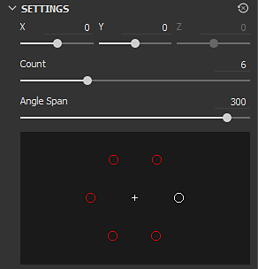
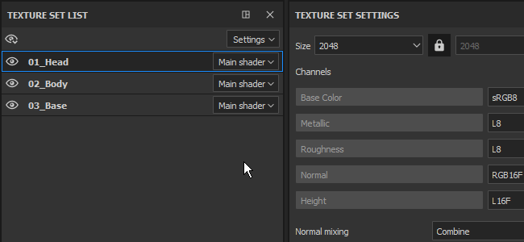

# バージョン2019.1

**Substance Painter 2019.1**&#x200B;は、既存の機能を拡張し、新しい芸術的なツールも導入しています。 このリリースでは、多くの新しいコンテンツを提供することにも重点を置いています。

リリース日： *23 April 2019*

## 主な機能

### 動的ストローク

今回のリリースでは、ブラシエンジンが動的ストロークと呼ばれるものをサポートするようになりました。 この種のストロークは、新しいSubstanceバージョンがリリースされると同時にバリエーションが生まれ、新しい効果が生まれます。 アセットにペイントされた新しいブラシストロークごとに新しいSubstanceマテリアルまたはアルファを使用できるようになりました。

Dynamic Stroke互換リソースがペイントツール（ペイント、消しゴム、指先またはコピースタンプ）に読み込まれると、新しいパラメーターグループが表示されます。

動的ストロークでは、次のプロパティがサポートされています（Substanceグラフに表示されている場合）。

* **スタンプのインデックス** ：ストローク内のスタンプのID /番号。
* **ランダムシード** :スタンプまたはストロークごとに変更できます。
* **時間** ：ブラシストロークをペイントする経過時間。ペイント速度は速いか遅いと、異なる結果が生じます。

印鑑索引には、次の2つのパラメーターが用意されています。

* **スタンプの開始** : *開始位置* （常に0から開始）または&#x200B;*ランダムインデックスから* （0から&#x200B;**スタンプの循環数**&#x200B;で定義された最大値までの間のランダムな位置を選択）。
* **印鑑循環棚卸** ：このパラメーターは、生成されるSubstanceの変動の合計量を定義します。 パフォーマンスを最適化するために、このパラメータは制限として機能します。 Substance Painterは、新しいものを作り出すのではなく、既に生成されたものを再利用するためにそれを使用します。

この新機能と互換性のあるリソースは、シェルフを参照して、現在隣にある新しいアイコンを見るだけで見つけることができます。

この機能と互換性のあるリソースには、「**dynamicstroke**」という名前の新しいタグも自動的に追加されます。これにより、シェルフ内のキーワードで簡単にフィルタリングできます。

また、多くの新しい&#x200B;**ツールプリセット**&#x200B;を追加し、

{width="450px"}

>[!NOTE]
>
> この機能（およびそのパフォーマンスへの影響）の詳細については、[専用のドキュメント](../../painting/dynamic-strokes/dynamic-strokes.md)を参照してください。

### ディスプレイスメントとテッセレーション

Substance Painterは、リアルタイムビューポートとIrayの両方で&#x200B;**ディスプレイスメント**&#x200B;と&#x200B;**メッシュ分割**&#x200B;をサポートするようになりました。 両方とも、シェーダーパラメーターの下の&#x200B;**Shader Settings**&#x200B;ウィンドウで制御できます。

* **ソースチャンネル** :メッシュ変形の基になるチャンネル。 デフォルトはHeightですが、ディスプレイスメントに設定することもできます。
* **スケール** :プロジェクトのメッシュに適用される変形の量を制御します。

* **サブディビジョンモード** ：均一またはエッジの長さ。 サブディビジョンの量の計算方法を指定します。
* **サブディビジョンの数** : （モードの均一） 1 ～ 32。 値が大きいほどポリゴンの数が増え、詳細は表示されますが、パフォーマンス上の問題が発生する可能性があります。
* **最大の長さ** : （モードエッジの長さ） 1 /値。 各セグメントがこのシーンのサイズである 1/1 の数値以下になるまで、すべてのポリゴンエッジが分割されます。

「**タイル資料**」サンプルプロジェクトを（**ファイル/サンプルを読み込み**&#x200B;経由）読み込んで、この新機能をすぐに試してみてください。

{width="450px"}{width="450px"}

>[!NOTE]
>
> 「**法線へのHeight**」という名前の新しいフィルターがシェルフに追加されました。このフィルターは、最終的な法線マップを取得するために使用できます（Substance Painterによるネイティブの変換が十分でない場合）。

### マスクエフェクトを比較

マテリアルの作成とブレンドは少し難しい場合があるため、「**マスクを比較**」という新しい効果を作成しました。 このエフェクトを使用すると、2つのチャンネルをすばやく簡単に比較し、結果としてマスクを作成できます。

マスクを比較エフェクトには、次のプロパティがあります。

* **チャネル** ：ソースとターゲットを比較してマスクを作成するチャネルです。
* **比較** ：ここでは、マスクの計算方法を選択するための3つのパラメーターを使用できます。 中央のドロップダウンは、比較操作を定義します（より小さい、許容値内、より大きい）。
* **定数** ：比較設定が「定数」に設定されている場合に比較される値です。
* **硬さ** ：結果として得られるマスクの比較のSmoothness/硬さを制御します。
* **ヒストグラム** ：ソースとターゲットのヒストグラムビューを提供します。 少しだけ重なっているかどうか（重なっていない場合はマスクは空になります）を知っておくと便利です。

設定をさらに簡単にするには、レイヤーを右クリックして、ショートカット「**Heightの組み合わせでマスクを追加**」を選択し、この新しいマスクをレイヤーにすばやく追加します。 また、Heightチャンネルの描画モードが、初期設定の「覆い焼き（リニア）」から「通常」に切り替わります。\

### ラジアル対称

ラジアル対称を処理するために、対称ツールの機能を拡張しました。 シンメトリ設定メニューに新しいモードが追加され、このモードが有効になりました（コンテキストツールバーで使用可能）。

次の設定を使用できます。

* **X / Y / Z** ：ラジアル対称で使用される対称軸の方向を制御します。
* **カウント** ：重複したポイントの数。
* **角度スパン** ：元のポイントから複製されたポイントの位置。 この設定を使用して、完全な円や4分の1などを作成できます。

また、ペイントを開始する前に設定を微調整しやすくするために、プレビューも少し追加しました。

### 塗りつぶしレイヤーの新しい投影モード

塗りつぶしレイヤーと塗りつぶし効果を使用した2つの新しい投影モードが追加されました： **平面**&#x200B;および&#x200B;**球**。 また、3D投影の動作をさらに制御するために、多数の新しいパラメータを追加しました。

* **新しい平面投影モード**\
  平面の投影は、この新しいモードで可能になりました。 これは、車両にストライプを作成したり、特定の場所にデカールを配置する場合に便利です。

  
* **平面投影のサーフェスツール**\
  平面投影を操作しやすくするために、ショートカット「**Shift + W**」でアクセスできる&#x200B;**サーフェスツール**&#x200B;と呼ばれる3Dマニピュレータの新しいコントロールも追加されました。 コンテキストツールバーからアクセスすることもできます。 この新しいモードは、平面投影でのみ使用できます。

  

  
* **平面投影カリング/フェード**\
  複数の設定を使用して、平面投影を連続または有限のいずれかにすることができます。 カリング設定を有効にすると、マニピュレータの周囲のドット付きボックスに投影のバウンディングボックスが表示され、中線が投影の開始点になります。 投影のスケールを設定すると、フェードの距離と開始タイミングをコントロールできます。

  {width="500px"}

  
* **新しい球面投影法モード**\
  球面投影法はこの新しいモードで実行できるようになりました。 これにより、高度なパターンを実現したり、より簡単に曲面を追うことができます。

  {width="350px"}
* **新しいシェイプの切り抜き設定**\
  3D投影に、投影の繰り返しを制御する設定が加わりました。 例えば、デカールを手動でマスクすることなく、特定の領域に対してのみ繰り返す場合などに非常に便利です。

  {width="500px"}
* **既存の設定を移動し、名前を変更しました**\
  これらの新しい予測により、一部の設定の動作が少し修正されました。 例えば、「**タイル**」の名前が変更され、「**UV ラップ**」に変更されました。 タイルは、垂直方向または水平方向にのみ設定できるようになりました。 スケール、回転およびオフセットは、投影モード間で一貫性を保つために、「**UV変換**」という名前の新しいパラメーターグループの一部になりました。

  

  
* **回転マニピュレータの全軸モードの改善**&#x200B;明示的な球を描画する代わりに、下のテクスチャリングを非表示にしないように非表示になりました。 軸の間をクリックすると、球が選択され、すべての軸を一度に回転できます。\
  

### 様々な改善

* **テクスチャセットの複数選択**\
  複数のテクスチャセットを選択して、テクスチャセット設定を使用して一度に解像度を変更できるようになりました。\
  マルチ選択モードでも「メイン」のテクスチャセットという概念があるため、追加の要素がグレーで選択されます。 現在の選択を維持したまま別のテクスチャセットに切り替える必要がある場合は、マウスの中ボタンを使用します。
* **テクスチャセットリストでクイック表示/非表示**\
  レイヤースタックと同様に、クリック&amp;ドラッグでテクスチャセットの表示と非表示を切り替えられるようになりました。
* **レイヤースタックのUIを改善**\
  レイヤーの非表示/表示状態のアイコンを、一貫性を保ちながらわかりやすくなるように変更しました。 また、エフェクトやその他のレイヤーの選択と比較しやすいように、選択したレイヤーの表示方法を変更しました。\
  
* **現在の選択範囲に基づく新しいエフェクトの位置**&#x200B;レイヤーに追加された新しいエフェクトは、現在選択されているエフェクトのすぐ上に配置されます。\
  
* **マテリアルチャンネルボタンのクイック切り替え**\
  Altキーを押しながらチャンネルボタンをクリックすると、特定のチャンネルを分離できます。 もう一度クリックすると、すべてのチャンネルが有効になります。\
  
* **書き出し時のディザ処理**&#x200B;書き出しウィンドウのファイルフォーマットとビット深度の横にある専用設定により、ディザ処理を無効にできるようになりました。 ディザリングを適用する方法とタイミングの詳細については、[書き出しのドキュメント](../../export/export-window/export-window.md)を参照してください。\
  
* **より良いヒストグラム**\
  ヒストグラム生成ツールを修正しました。 レイヤースタックを変更すると、ヒストグラムの情報がより正確に表示され、正しく更新されるようになりました。\
  
* **レイヤーのインスタンス化の改善**\
  インスタンス化されたレイヤーの描画モードが、デフォルトの描画モードではなく「通過」に設定されるようになりました。 この描画モードでは、レイヤーがテクスチャセット間でインスタンス化されている場合に、一部のエフェクトの互換性が向上します。

### 新規コンテンツ

このリリースでは、プリセットからアルファや新しい強力なフィルターまで、多くの新しいコンテンツも追加されました。

* **新しいブラシとツールのプリセット**\
  このリリースでは、新しい動的ストローク機能が導入され、すぐに使用できるブラシとツールのプリセットが追加されました。

  * 10個の新しいブラシプリセット:
    * インクの汚れ
    * インキランダム
    * リーフのカーブ（重い）
    * 葉のカーブ
    * 葉っぱの乱雑さ
    * リーフシンプル
    * リーフの旋回
    * ジグザグ（長い）
    * ジグザグ（短）
    * ジグザグステップ
  * 11の新しいツールプリセット:
    * 紅葉
    * 亀裂
    * 機器シンボル
    * グラデーション色相
    * 爪
    * 小石
    * スクラッチ
    * スプレーカラー
    * スプレースキンライト
    * スプレー式皮膚発赤
    * ジッパー
* **93件の新しいAlpha**\
  これらすべてを列挙するには数が多すぎるため、シェルフの「Alpha」セクションを見ると、新しい矢印、三角形、標識、その他の種類のシェイプがたくさん表示されます。
* **13件の新しいフィルター**\
  この新しいバージョンには、失われた状況に非常に便利な多くの新しいフィルターがあります。

  * **ぼかし勾配** ：新しいぼかしフィルターがファミリーに追加されました。 このフィルターは、ワープフィルターと同じように機能します。既存の入力またはカスタム入力を使用して、ターゲットチャンネルをぼかします。
  * **ベベル** ：シェイプの周囲にグラデーションの境界線を作成します。たとえば、マスクを拡張する場合に便利です。
  * **カラーマッチ** ：このフィルターは、ソースカラーをターゲットカラーに一致させようとします。 マテリアルのカラーを調整するのに便利です。
  * **グラデーションカーブ** ：このフィルターは、グレースケール入力に適用して外観を変更できるカーブプリセットのリストを提供します。
  * **グラデーションダイナミック** ：グレースケール入力を新しい入力画像（グレースケールまたはカラー）で再マップします。
  * **Height調整** ：このフィルターには、Heightチャンネルを簡単に操作できる2つの設定（「オフセット」と「乗算」）があります。
  * **通常チャンネルへのHeight** ：このフィルターは、Heightチャンネルを通常チャンネルに変換し、通常チャンネルに送ります。 必要に応じて異なる強度コントロールがあります。
  * **マスクアウトライン** ：このフィルターは、グレースケール入力の周囲に黒いボーダーに白を作成します。 これは、マスクでシェイプの周囲に境界線を作成するときに最も便利です。
  * **PBR 検証** ：このフィルターが追加され、PBRマテリアルの色が適切な範囲にあるかどうかが確認されました。 詳しくは、[PBRガイド](https://www.allegorithmic.com/pbr-guide)を参照してください。
  * **MatFXピーリングペイント** ：古いペイントが剥がれ始めるのをシミュレートします。 このフィルターはアルファを出力するので、その下のマテリアルと簡単にブレンドできます。
  * **MatFx水滴** ：オブジェクトの表面の水滴をシミュレートします。 雨の後の車の水のように。
* **7個の新しいジェネレータ**\
  このリリースでは、いくつかの新しいジェネレータが追加されました。

  * **環境オクルージョン** ：環境オクルージョンのメッシュマップを制御するマスクジェネレーターです。 マスクエディタに基づきます。
  * **ワールド空間法線** :ワールド空間法線メッシュマップに対するコントロールを提供するマスクジェネレータ。 マスクエディタに基づきます。
  * **位置** ：位置メッシュマップを制御できるマスクジェネレーター。 マスクエディタに基づきます。
  * **曲率** ：曲率メッシュマップを制御できるマスクジェネレーターです。 マスクエディタに基づきます。
  * **自動ステッチ** : UV境界、メッシュの曲率、またはカスタムマスク入力の周囲にステッチを作成するマスクジェネレーター。
  * **UVテクセル密度** :メッシュのポリゴンのテクセル密度に基づいてカラーグラデーションを出力するヘルパー。
  * **UVランダムカラー** :UV アイランドごとに（またはカスタムグラデーション入力に基づいて）ランダムカラーを生成します。
* **2つの新しい環境マップ**

  * 秋の森
  * カノープスの地面

    
* **5件の新しいプロシージャ**

  * グラデーション色相
  * グラデーションビルダー
  * カラーのジッター（インデックス別）
  * シードによるカラージッター
  * ぼかしをスタイライズ

    

## チュートリアル

最新機能を取り上げたチュートリアルを確認してください。

また、Substanceアカデミーに関するチュートリアルで、ダイナミックなストロークを作成する方法について説明しています。[Substance Painter用のカスタムのダイナミックなストロークを作成する](https://academy.allegorithmic.com/courses/Creating-a-custom-Dynamic-Stroke-for-Substance-Painter)

## リリースノート

### 2019.1.3

*（2019年7月1日リリース）*\
概要： **2つの新機能によるバグ修正**

**修正済み：**

* 「パスに従う」が常に機能するわけではない
* 単一チャネルスロットで使用されるSBSARでチャネルマッピングが機能しない
* [レイヤースタック]非表示レイヤーでスクロールするとパフォーマンスが低下する
* [TextureSet]マスク間をクリックするとクラッシュする
* [SVT] ディスプレイスメントが正しく表示されず、ちらつく場合がある
* [alembic]頂点法線の代わりにポイント法線を使用するとメッシュがクラッシュする
* [Alembic][Log]読み込み時にAlembicファイルがサポートされない場合、ログにエラーが記録される

### 2019.1.2

*（2019年5月21日リリース）*\
概要： **ホットフィックス**

**修正済み：**

* 画像入力で2つのリソースを選択するとクラッシュする

### 2019.1.1

*（2019年5月20日リリース）*\
概要： **ホットフィックス**

**追加：**

* Substance Designer 2019.1の最終リリースでSubstance engineを最新バージョンにアップデートします。

**修正済み：**

* [Substance]入力画像で考慮されていない場合に表示される
* [SVT][エンジン]テクスチャセットの解像度を変更するとクラッシュすることがある
* [エンジン]黒のテクスチャがランダムに表示される場合がある
* [レイヤースタック][UI] Shiftキーを押しながらマスクを切り替えると、複数のレイヤーを同時に選択できる
* [レイヤースタック]不透明度は、パススルー描画モードのペイント効果には影響しません
* [レイヤースタック]消しゴムブラシストロークで、「通常」フィルター入力へのHeightが正しく更新されない
* [LayersStack]スマートマスクのドロップを取り消すとクラッシュする
* シャドウと時間のアンチエイリアスをアクティブにしてワイヤーフレームがちらつく
* [ディスプレイスメント]いくつかのヘビーメッシュでAMDが遅れる
* [Windows]ファイルエクスプローラーで一部のプロジェクトを開くとクラッシュする
* [ヒストグラム]アンカーポイントでマスクを削除するとクラッシュすることがある
* まれに、プレビューの生成でクラッシュすることがある
* [クラッシュ]クローンツールと指先ツールを使いすぎると、プロジェクトを再度開くことができない
* 保存後にマテリアルモードでメッシュが表示されないことがある
* [スクリプト] alg.mapexport.documentStructure()がフォルダーに対して誤った値を返す

**既知の問題：**

* テクスチャセット名をダブルクリックすると、名前の変更モードに入る前に選択される

### 2019.1

*（2019年4月23日公開）*\
概要： **専用の新しいコンテンツを使用した動的なストローク、リアルタイムのディスプレイスメントとテッセレーション、Iray、マスク効果の比較、円形のシンメトリー、平面と球面投影法**

**追加：**

* [ツール]ダイナミックストローク：ブラシストロークと一緒にSubstanceを変化させる
* [ダイナミックストローク]新しいスタンプインデックスパラメータをオプションで表示します
* [ダイナミックストローク] $timeパラメータを考慮します。
* [ダイナミックストローク]ストロークおよびスタンプごとに新しい$randomseedパラメータを生成します。
* [ダイナミックストローク]乱数からダイナミックストロークインデックスを開始します
* [Dynamic stroke][Shelf]専用の新しいアイコンを使用して動的なストロークリソースを見つける方法
* リアルタイムビューポートでのディスプレイスメントとテッセレーション
* Irayでのディスプレイスメントとテッセレーション
* [シェーダ設定][UI] ディスプレイスメントとテッセレーションを制御するための新しいタブ
* [レイヤースタック]新しいCompareMaskエフェクト: 2つのチャンネルを比較してマスクを生成します
* [レイヤースタック][UI]右クリックメニューの「Heightの組み合わせでマスクを追加」に新しいエントリが追加され、CompareMaskエフェクトが挿入される
* [シンメトリ]新しいシンメトリモード：放射状ペイント
* [シンメトリ設定] [設定]と[表示]の両方のセクションを展開します。
* [シンメトリ設定][UI]ラジアルペイントのプレビュー
* 平面と球の2つの新しい投影モードを表示します
* [プロジェクト]すべての投影の新しいシェイプ切り抜きモード
* [投影]新しいマニピュレータを使用した平面モード：サーフェスツール
* [プロジェクト][ショートカット]サーフェスツールのショートカットSHIFT+W
* [Proj] 深度カリングと背面カリングによる平面プロジェクションマスク
* [マニピュレータ]3つの座標軸すべてで回転マニピュレータを改善しました
* [ツール][UX] Altキーを押しながらチャネルをクリックすると、そのチャネルがフォーカスされる（他のすべてのチャネルが有効または無効になる）
* [Engine] Substance engineの最新バージョンに更新する
* [テクスチャセット]複数選択と解像度の変更
* [テクスチャセット]テクスチャセットをすばやくアクティブ化および非アクティブ化する
* [テクスチャセット]ソロとすべてのオプションを新しいメニューに統合
* [テクスチャセット][レイヤスタック]アクティブ化および非アクティブ化のための新しいアイコン
* [レイヤースタック][UX]既に選択されているエフェクトの上にエフェクトを挿入
* [レイヤースタック][UI]レイヤースタック表示選択スタイルを再処理
* [レイヤースタック]インスタンス化されたレイヤーの描画モードが、デフォルトで通過モードになりました
* [書き出し]ディザリングを有効または無効にするオプション
* [プラグイン]スライダーの精度モディファイアをサポート(SHIFT)
* [プラグイン][UI]自動保存用の新しいアイコン
* [スクリプト]フォルダの内容を一覧表示する
* [スクリプト]ファイルの削除を許可する
* [スクリプティング]使用済みのリソースを含むすべてのスタック情報を読み取る
* [コンテンツ][動的なストローク]新しいツールとブラシプリセット
* [コンテンツ][動的な線] 2つの新しい手続き型グラデーション：グラデーション色相とグラデーションビルダー
* [コンテンツ] 11の新しいフィルター：MatFxピーリングペイント、MatFx水滴など
* [コンテンツ] 7つの新しいジェネレータ：自動ステッチャー、UVランダムカラー、UVテクスチャ密度など
* [コンテンツ] 93の新しいアルファ：新しいテキスト、矢印やその他の様々なシェイプ
* [コンテンツ] 2つの新しいプロシージャ：グラデーション色相、グラデーションビルダーなど
* [コンテンツ]ツール用の21の新しい動的ストロークおよびブラシプリセット：小石、足跡、スプレーなど
* [コンテンツ] 2つの新しいHDRis：カノーパスの地面と秋の森
* [コンテンツ]シェルフ内でランダムなシードのキュレーションを使用してコンテンツを更新する
* [コンテンツ]シェルフにランダムシードパラメータが表示された新しいアイコン

**修正済み：**

* [レイヤースタック]レイヤースタックが無限にドラッグし続ける
* [Mac] 「Finderで表示」を選択するとフリーズする場合があります
* [スクリプティング]シェーダファイルを移動すると、カスタムUIで保存した設定が失われる
* [スクリプティング] APIのバージョン番号が正しくないため、最新ではない
* [効果]ヒストグラムのコンテンツが正しく表示されない
* [効果]ヒストグラムエフェクトが更新されない場合がある
* [棚]材質「プラスチック生地角錐」にステッチが正しく合わない

**既知の問題：**

* テクスチャセット名をダブルクリックすると、名前の変更モードに入る前に選択される
* [レイヤースタック][UI] Shiftキーを押しながらマスクを切り替えると、複数のレイヤーを同時に選択できる
