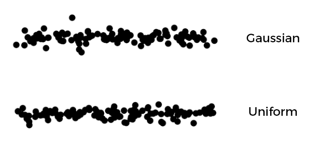
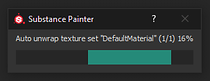

# バージョン2019.3

**Substance Painter 2019.3**&#x200B;では、Photoshopのブラシプリセットのサポートとメッシュの自動UVアンラッピングを導入し、グラフィックタブレットの取り扱いの向上など、様々なQOLの向上を実現します。

リリース日： *2019年12月17日*

## 主な機能

### Photoshopブラシプリセットのサポート(ABR)

Substance PainterでPhotoshopブラシを使用できるようになりました。 プリセットをABRファイルとして書き出すだけで、通常のブラシプリセットとして読み込めるようになりました。 ABRファイルに含まれるプリセットは、個別のブラシプリセットとしてシェルフに表示されます。

読み込むABRファイルがない場合は、オンラインで多くのファイルを検索できます。

* [AdobeでのKyleのブラシプリセット](https://www.adobe.com/products/photoshop/brushes.html)
* [ArtStationのブラシプリセット](https://www.artstation.com/marketplace?q=photoshop%20brush&sort_by=trending)
* [DeviantArtのブラシプリセット](https://www.deviantart.com/search?q=photoshop%20brush)
* [Cubebrushのブラシプリセット](https://cubebrush.co/marketplace?categories=354,57)

Photoshopブラシをサポートするために、ペイントツールのプロパティに次のような様々な新機能が追加されました。

* **新しいサイズとフローの最小パラメーター**\
  筆圧が有効な場合のツールの最小サイズと最小フローを指定できるようになりました。 このパラメーターは、定義されている現在の最大サイズ/フローに基づいてパーセンテージとして機能します。 Photoshopのブラシプリセットを使用すると、これらの設定は自動的にキャリブレーションされます。\
  
* **新しい位置のジッターパラメーター**\
  Photoshopブラシの動作に合わせて、いくつかの新しい設定が追加されました。 ジッターを適用する軸と、ランダムな位置の分散方法を定義できるようになりました（**均一**&#x200B;を選択して、Photoshopに一致させます）。\
  \
  
* **新しいアルファ描画モード**\
  Photoshopは、Substance Painterモードと同じようにブラシストロークを合成しないため、ペイント結果により適した新しい描画モード(比較（明）)が追加されました。 この描画モードでは、スタンプが重なっても重なりすぎることがないため、「流量・不透明度」の値を低くしてペイントすると、筆圧感が向上します。\
  \
  
* **丸みと反転のサポート**\
  丸み（SubstanceのHeightを拡大・縮小）や反転（両方の軸で画像を鏡像化）などのパラメーターをサポートするために、**ブラシメーカーPhotoshop**&#x200B;という名前の新しいAlphaAlphaーが追加されました。 このAlphaは、ABRファイルのブラシプリセットをクリックすると自動的に読み込まれます。\
  \
  
* **レイヤーのアルファチャンネルの新しいガンマ補正**\
  Photoshopは、リニアガンマ空間ではブラシストロークをブレンドしないため、Photoshopのブラシプリセットを使用してペイントすると、描画と不透明度が正しく表示されない場合があります。 レイヤーで新しい設定を有効にして、その動作に合わせてガンマ補正を適用できます。 これは、ブラシストロークのペイントに使用されるアルファに影響し、レイヤーのマスクを使用して他のレイヤーとブレンドする方法にも影響します。ただし、レイヤーの描画モードはリニアガンマ空間でも動作します。\
  **この設定を有効にする**&#x200B;には、レイヤーを右クリックし、**ガンマ補正されたアルファ/マスク**&#x200B;を選択します。 この設定が有効になると、レイヤーの横に新しいアイコンが表示されます。\
   \
  
* **間隔および位置のジッターの最大値を増加しました**\
  Photoshopのブラシプリセットパラメーターを適切に一致させるために、次のパラメーターの最大値が増えました。

  * **間隔**：最大を1000に設定できるようになりました。
  * **位置のジッター**：最大値を1000に設定できるようになりました。

ABRファイルの書き出し方法や読み込み方法などの詳細については、[Photoshopブラシプリセット](../../painting/presets/photoshop-brush-presets/photoshop-brush-presets-abr.md)のドキュメントを参照してください。

>[!NOTE]
>
> 現在、すべてのPhotoshopブラシパラメーターがサポートされているわけではありません。詳細については、[互換性リスト](../../painting/presets/photoshop-brush-presets/photoshop-brush-parameters-compatibility.md)を参照してください。

### ペイントおよびグラフィックタブレットのサポートの改善

Photoshopブラシプリセットのサポートに加え、グラフィックタブレットの使用に関して多数の改善と修正が行われています。

* **直線の最初のスタンプが2倍にならない**\
  直線をペイントする場合、最初のスタンプの複製はもう行われません（直線を配置するためだけにスタンプを取り消す必要はありません）。\
  
* **直線圧力補間**\
  角度補正ラインで筆圧がサポートされるようになりました。 最初のスタンプと最後のスタンプの間で圧力値が補間されます。\
  
* **新しいブラシのプレビューモード**\
  ビューポートのブラシプレビューを、異なる表示モードに変更できるようになりました。 モードを変更するには、コンテキストツールバーの「新規」ドロップダウンボタンをクリックします。

  
* **筆圧曲線**\
  コンテキストツールバーで、筆圧を解釈する方法を定義できるようになりました。 これらの新しい設定は、異なるペイントスタイルを許可する圧力の増加速度を制御します。

  * **線形**：変換は行われず、グラフィックタブレットのペンで指定された圧力が取得されました。 タブレットドライバの設定でペンの筆圧曲線が既に定義されている場合は、この設定を使用します。
  * **イーズイン** （デフォルト）：筆圧の開始が遅くなり、細いストロークや細いストロークを簡単にペイントできるようになります。
  * **イーズインアウト** ：筆圧の開始を遅くし、終了を早くして、柔らかいストロークまたは強いストロークをペイントしやすくします。

  
* **筆圧ボタンはドロップダウンではありません**\
  ここでは、筆圧コントロールをシンプルなオン/オフボタンに変更しました。 これにより、圧力の有効化と無効化が非常に簡単かつ迅速になります。

  
* **グラフィックタブレットのサポートを改善し、Windows Inkに切り替え**\
  グラフィックタブレットの扱い方を一新しました。 これにより、最近のグラフィックタブレットのモデルとの一般的な互換性が向上し、以前の問題が削減されます。 Windowsでは、WintabではなくWindows Inkに切り替えて互換性を改善しました。

  >[!NOTE]
  >
  > Wacomドライバーが最新の状態で、タブレット設定で「Windows Ink」が有効になっていることを確認します。

### 自動UVアンラップ（ベータ版）

Substance Painterは、UV座標が欠落しているメッシュを自動的にアンラップするようになりました。 これにより、あらゆる種類のジオメトリを読み込み、すぐにペイントを開始できます。 マテリアルの割り当てに従ってテクスチャセットを作成しながら、サブメッシュごとに1つのUV アイランドを生成します。 この機能は現在ベータ版で、今後のバージョンで拡張される予定です。 自動アンラップは、**UDIMワークフローを使用しない**&#x200B;プロジェクトにのみ適用されます。

* **UVの自動アンラップ**\
  デフォルトでは、Substance PainterはメッシュのUV座標が見つからない場合に、UV座標を自動的に生成するようになりました。 これは、プロジェクトの作成とメッシュの再読み込みの両方に適用されます。 ただし、[メイン設定](https://helpx.adobe.com/substance-3d/unlisted/documentation/spdoc/general-71008262.html)に移動して、**読み込みオプション**&#x200B;の&#x200B;**UVの自動アンラップを有効にする**&#x200B;を無効にすると、この動作を無効にできます。

  
* **UVのラップ解除の進行状況バー**\
  メッシュをインポートする際に、プロセスの現在の状態を示すプログレスバーが表示されるようになりました。 これには、UVアンラッププロセスも含まれます。

  
* **現在知られている問題**\
  この新機能は現在ベータ版のため、いくつかの問題が予想されます。 現在確認されている問題の一覧については、以下のリリースノートを参照してください。 アプリケーションがクラッシュし、正しくない結果が生成された場合は、問題を調査し、プロセスを改善するために、アプリケーションを介してクラッシュまたはバグレポートを送信することをお勧めします。

>[!NOTE]
>
> 新しい&#x200B;**generator**&#x200B;がシェルフに追加され、自動アンラップが視覚化されました。 使用するには、新しいレイヤーを作成し、ジェネレータエフェクトを追加して、新しい&#x200B;**UVチェッカー**&#x200B;リソースをそのレイヤーに読み込みます。

### Substance統合の改善

今後もSubstanceフォーマットの統合化を進め、待望の機能に加え、Dynamic Stroke機能など既存の機能も充実していきます。

* **ソフト範囲スライダーで固定しない**\
  これまでは、Substanceグラフの露光量スライダーは、常にクランプされているかのように動作していました。 つまり、入力できる値が、パラメーターで定義されたデフォルトの最小値と最大値を超えることはできません。

  
* **パラメーターで定義されたステップのサポート**\
  ステップが定義されたパラメーターを持つSubstanceグラフが、スライダーを微調整する際に考慮されるようになりました。
* **フロートスライダーの桁精度を上げました**\
  フロートスライダーの入力値を6桁まで指定できるようになりました。 ただし、これは浮動小数点精度によって制限されます。つまり、値の入力が丸められる場合があります。
* **動的ストロークを使用した新しいランダムシードコントロール**\
  定義された範囲を持つ複数のランダムシード値を要求できるようになりました。 これにより、キャッシュの再利用を活用して、優れたパフォーマンスを維持しながら、ユニークでランダムなSubstanceバリエーションを作成できます。\
  [ダイナミックストローク]領域で、**ランダムシードの種類**&#x200B;のパラメータを&#x200B;**ストロークごとにランダム**&#x200B;または&#x200B;**スタンプごとにランダム**&#x200B;に切り替えて、新しいパラメータにアクセスします。 **ランダムサンプル量**&#x200B;は、生成されるSubstanceのバリエーションの総数を定義します。 選択した量が生成されると、既にセット内でランダムなバリエーションが選択されます。

  
* **新しいユーザーデータの静的動的ストローク**\
  Substanceを動的なストロークと見なせるタイミングを指定できる新しい最適化が追加されました。 Visible Ifと同様に、userdataフィールドに条件を追加して、ダイナミックストローク機能を使用して、Substance Painterが新しいSubstanceのバリエーションを生成する条件を指定できるようになりました。 詳細については、[userdataのドキュメント](../../content/creating-custom-effects/user-data.md)を参照してください。
* **すべてのチャンネルの出力ノードをマスクとして指定する新しいユーザーデータ**\
  新しいユーザデータを出力ノードに追加して、他のすべてのチャンネルのアルファマスクとして使用できるようになりました。 これは、既存の&#x200B;**channels\_system** Alphaに似ていますが、Substanceグラフに専用の出力を新たに作成する必要はありません。 詳細については、[userdataのドキュメント](../../content/creating-custom-effects/user-data.md)を参照してください。

### その他の改善

アプリケーションの残りの部分には様々な改良が施されており、Substance Painter内での日々の作業に役立ちます。

* **独立したビューポートフォーカス**\
  2Dおよび3Dフォーカス（Fショートカット）が次の動作で変更されました。

  * **2Dビューの上にマウスを置く**: Fキーを押すと、2Dビューのみがフォーカスされます。
  * **3Dビューの上にマウスを置く**: Fキーを押すと、3Dビューのみがフォーカスされます。
  * **ビューポートの外側でマウスを動かす**: Fキーを押すと、2Dビューと3Dビューの両方がフォーカスされます。

  {width="400px"}
* **ウィンドウのキーボードとメニューのショートカットのベイク処理**\
  ベイクウィンドウは、次の2つの新しい方法で開くことができます。

  * **Ctrl + Shift + B**&#x200B;を押します。
  * [編集]メニューから、**[メッシュマップをベイク]**&#x200B;をクリックします。

  
* **Ctrl + Alt +左クリックショートカットでドックとウィンドウをスクロール**\
  マウスホイールを使わずにウィンドウやドックをスクロールできる新しいショートカットが追加されました。 このショートカットは、グラフィックタブレットのペンでスクロールできるようになりました。

  
* **パフォーマンスの向上**\
  背景には（開口部プロジェクトから絵画まで）Substance Painterの一般的なパフォーマンスを向上させる多くの最適化が施されています。

### 新規コンテンツ

このリリースでは、多くの新しいコンテンツが追加されました。

* **「Meet Mat」サンプルプロジェクトを更新しました**\
  Matは新しいトポロジで更新され、ディスプレイスメントとの親和性が向上しました。 IDマップが修正されてマスクの可能性が増し、プロジェクトで新しいカメラセットを使用して新しい視野角を提供できるようになりました。

  {width="500px"}
* **新しいフィルター**\
  3つの新しいフィルターが追加され、スタイル設定されたコンテンツが簡単になりました。

  * **MatFxコミック**\
    このフィルタは、基本色/拡散反射光から曲率までの入力に基づいて、ハッチングラインとエッジラインをシミュレートします。

    
  * **MatFx水彩画**\
    このフィルターは、入力カラーを読み取ることで、にじみと紙の吸収を伴う水彩画をシミュレートします。

    
  * **MatFx油彩**\
    [Emrecan Cubukcu](https://www.artstation.com/emrecancubukcu)の作品に着想を得たこのフィルターは、入力からカラー情報を読み取り、様々なパラメーターに基づいてブラシストロークに変換します。 様々なバリエーションを簡単に試せるように複数のプリセットが用意されています。 **ベイク済み照明環境**&#x200B;フィルターと組み合わせるか、テクスチャのシャドウを手動でベイク処理またはペイントして、効果を最大化することをお勧めします。

    

    

    >[!NOTE]
    >
    > これは非常に高価なフィルタで、計算に時間がかかる場合があります。 繰り返しの場合は、エフェクトを含むレイヤーを無効にしてから、その下のレイヤーを微調整することをお勧めします。
* **新しいブラシプリセット**

  * **102個のPhotoshopブラシプリセット**\
    Photoshopブラシサポートの導入により、それを紹介する新しいプリセットのセットが含まれるようになりました。 これらのプリセットは、[Adobe webサイト](https://www.adobe.com/products/photoshop/brushes.html)で入手可能なKyle T. Websterのパックから選択されています。

    {width="500px"}
  * **18個の新しいブラシプリセット**\
    Photoshopのブラシプリセットに加えて、新たに通常のプリセットが追加されました。

    * 基本的な筆圧
    * 木炭画
    * 木炭塗りつぶしフレーム
    * 木炭灯
    * 木炭培地
    * 木炭天然
    * 木炭調のランプ
    * 密度の高い線のウィグル
    * 波状のドット
    * 波打つストローク（分割）
    * ウィグリーストローク
    * ペイントローラー矢印
    * ペイントローラーのホチキス止め（横）
    * ペイントローラーとじ
    * ペイントローラーのステッチ
    * ペイントローラーStripe
    * ペイントローラー静脈ロングナロー
    * ペイントローラー警告テキスト

    {width="500px"}
* **新しいツールプリセット**\
  グワッシュペイントをシミュレートする2つの新しいツールプリセットが追加されました。

  * グワッシュ高密度。
  * グワッシュは色あせた。

  
* **新しいアルファ**\
  新しいブラシプリセットの作成に使用されるアルファに加えて（上記を参照）、2つの新しい重要なAlphaが統合されました。

  * **ブラシメーカーのPhotoshop**\
    この新しいSubstanceグラフでは、Photoshopのダイナミックストローク機能で使用できる固有のブラシパラメーターの一部が複製されています。 を使用すると、真円率と反転や入力画像を制御することができます。 より多くのバリエーションを作成するために、いくつかのジッターパラメーターも使用できます。 このSubstanceグラフは、ABRファイルからのPhotoshopブラシプリセットをクリックすると、Alphaセクションに自動的に挿入されます。

    
  * **ブラシ作成ツールのペイントローラー**\
    この新しいSubstanceグラフは、ペイントローラー（または単純なリボンツール）を使用して、切れ目のない連続したパターンをペイントするシミュレーションを行います。 設定を簡単に行うには、既存のプリセットを確認するか、グラフの説明を参照してください。 [レイジーマウス](../../painting/lazy-mouse.md)を有効にして、ロールブラシが正しく描画されるようにすると、分割を発生させることはお勧めします。

    

    {width="290px"}
* **新しい「UVチェッカー」ジェネレーター**\
  「UVチェッカー」という名前の新しいジェネレータが統合され、メッシュのUV座標の分析に役立ちます。 これにより、自動UVアンラップによって生成されるUVがわかりやすくなります。

  
* **新しいテンプレートと書き出しプリセット**

  * **キーショット9+**\
    この書き出しプリセットにより、書き出されたテクスチャは、テクスチャとマテリアルの読み込みと割り当てを簡単にする新しいKeyshot 9機能と互換性があります。 詳細については、[キーショットドキュメント](https://luxion.atlassian.net/wiki/spaces/K9M/pages/1124335675/Material+Importer)を参照してください。
  * **Spark AR Studio**\
    この新しいプロジェクトテンプレートと書き出しプリセットを使用すると、[Spark AR Studio](https://sparkar.facebook.com/ar-studio/)での作業が簡単になります。

>[!WARNING]
>
> * このリリースでは、MacOS 10.11(El Capitan)がサポートされなくなりました。
> * このリリースではCentOS 6.xがサポートされなくなりました。
> * CentOS 7.5以前では、依存関係の問題が原因でアプリケーションが起動しない場合があります。この問題を解決するには、システムを更新するか、インストールフォルダーの[次のライブラリ](https://centos.pkgs.org/7/centos-x86_64/freetype-2.8-12.el7.x86_64.rpm.html)をコピーします。

## リリースノート

### 2019.3.3

*（2020年2月6日リリース）*\
概要： **Iray 2019.3**&#x200B;へのアップグレードに関するバグ修正

**追加：**

* Iray 2019.3へのアップグレード
* [ログ] Ryzen CPUの古いBIOSがベイク時にクラッシュすることを示す
* [ABR] ABRアルファをシェルフに抽出する

**修正済み：**

* [Baker]ハイポリゴンメッシュにUVがない場合、ベイク処理に失敗する
* [Linux]カスタムマウスショートカットが保存されない
* [ブラシ]一部のアルファシェイプでアウトラインが消える
* [タブレット]スライダーの移動時に間違った検出が発生する
* [ショートカット]「Ctrl+Alt+MouseClick」でショートカットを設定できない
* [シェルフ]ペンタブレットを使用すると、リソースのツールチップが表示されない
* [2Dビュー][書き出し] 2Dビュープリセットで標準情報が考慮されない
* 特定のブラシを使用してUV整合でペイントするとフリーズする
* フィルターの下にペイントすると、進行中のストロークにアーティファクトが生じる
* [ビューポート]メッシュを再読み込み後にビューポートにテクスチャキャッシュが正しく表示されない
* [クラッシュ] Photoshopに書き出した後に保存するとエラーが発生する
* [クラッシュ]リソースを読み込むときに、接頭辞に特殊シンボルを書き込む
* [クラッシュ]アンカーポイントプロパティのリファレンスをクリックします
* [アンカーポイント]アンカーポイントと参照の間にフィルターがある場合、チャンネルが更新されない
* ヘルプメニューのImage URLリンクが機能しない

**既知の問題：**

* [UVアンラッピング]高ポリゴンメッシュの処理には時間がかかる場合があります
* [UVアンラップ]まったく同じ座標の頂点がマージされます
* [UVアンラップ]一部のメッシュパーツでUV生成が失敗することがある
* [UVアンラップ]1つのUV アイランドで不均一または非常に歪んだテキセル比が発生する場合がある
* [UVアンラップ]テクスチャセット間の均一でないテクスチャ比
* [UVアンラップ]生成されたUV アイランドが非常に長くなり、UV空間に収まらない場合がある
* [UVアンラップ]小さいエッジまたは重なり合うエッジを持つ縮退したフェースまたは三角形でないメッシュフェースは、UVをアンラップされないことがあります

### 2019.3.2

*（2020年1月21日リリース）*\
概要： **バグ修正**

**修正済み：**

* ソロチャンネルモードで保存したプロジェクトを開くと、メッシュが表示されない
* クローンツールを使用してレイヤーでペイントすると、ビューポートが必ずしも更新されない

**既知の問題：**

* [ベーカー] Ryzen CPUのマルチスレッドに関連するクラッシュ
* [UVアンラッピング]高ポリゴンメッシュの処理には時間がかかる場合があります
* [UVアンラップ]まったく同じ座標の頂点がマージされます
* [UVアンラップ]一部のメッシュパーツでUV生成が失敗することがある
* [UVアンラップ]1つのUV アイランドで不均一または非常に歪んだテキセル比が発生する場合がある
* [UVアンラップ]テクスチャセット間の均一でないテクスチャ比
* [UVアンラップ]生成されたUV アイランドが非常に長くなり、UV空間に収まらない場合がある
* [UVアンラップ]小さいエッジまたは重なり合うエッジを持つ縮退したフェースまたは三角形でないメッシュフェースは、UVをアンラップされないことがあります

### 2019.3.1

*（2019年12月20日公開）*\
概要： **ホットフィックス**

**修正済み：**

* 特定のUV 投影を使用してメッシュを操作するとクラッシュする
* [ABR] Photoshopプリセットを切り替えるとクラッシュする
* [Linux] libGLXの依存性の問題により、CentOS 7.4でSubstance Painterを開始できない
* [ベイカー]ファイル/クリーンを使用した後にベイク処理を行うとクラッシュする
* [ベーカー]キャンセル後にベイク処理の進行状況ダイアログがフリーズする
* [ベイカー]テクスチャの書き出し後にメッシュをベイク処理できない
* [ベイカー] [名前で一致]を使用すると、黒いメッシュマップが作成される
* 【ベーカーの皆さん】ケージは対象外です
* [シェルフ] PSDファイルを読み込むと、画像が破損する
* [サンプル]「Mat」サンプルプロジェクトでカメラが破損し、書き出しプリセットが正しくない

**既知の問題：**

* [ベーカー] Ryzen CPUのマルチスレッドに関連するクラッシュ
* [UVアンラッピング]高ポリゴンメッシュの処理には時間がかかる場合があります
* [UVアンラップ]まったく同じ座標の頂点がマージされます
* [UVアンラップ]一部のメッシュパーツでUV生成が失敗することがある
* [UVアンラップ]1つのUV アイランドで不均一または非常に歪んだテキセル比が発生する場合がある
* [UVアンラップ]テクスチャセット間の均一でないテクスチャ比
* [UVアンラップ]生成されたUV アイランドが非常に長くなり、UV空間に収まらない場合がある
* [UVアンラップ]小さいエッジまたは重なり合うエッジを持つ縮退したフェースまたは三角形でないメッシュフェースは、UVをアンラップされないことがあります

### 2019.3.0

*（2019年12月17日公開）*\
概要： **ハンドペイントのユーザーエクスペリエンスの向上、タブレットでの操作、ベータ版(0.3.0)での自動UVアンラッピング、およびハンドペイント用の多様な新しいコンテンツを備えたメジャーリリース**

**追加：**

* Substance Painterに自動UVアンラップバージョン0.3.0を統合する
* [UVアンラップ] UVが存在しないかUVの一部が存在しない場合に、Substance PainterでUVを自動的にアンラップする
* [UVアンラップ]アクティブおよび非アクティブにする1つのグローバル設定
* [UVアンラップ]ログファイルにバージョンがレポートされます
* [UVアンラップ][UI] UVアンラップの進行状況を示す
* [UI]ブラシプレビューを選択するためのコンテキストツールバーの新しい設定：フルプレビュー、ブラシのアウトライン、十字
* [ツール]アルファ領域の新しい高度な描画モード：標準に加えて明（最大）
* [レイヤースタック]アルファまたはマスクのレイヤーごとのガンマ補正オプション（右クリックメニュー）
* [レイヤースタック][UI]レイヤーアルファがガンマ補正されたときに「i」アイコンを追加
* [タブレット][ツール]サイズと流量に対する最小圧力を表示
* [Tablet][UI]カーブの筆圧を選択するためのコンテキストツールバーの新しい設定：線形、簡単に入力、簡単に出力
* [Tablet][UX] Add Ctrl+Alt+クリックしてスクロール
* Photoshopブラシプリセットの読み込み（ABR形式）
* [ABR]形状パラメータをサポート
* [ABR]シェイプダイナミクスパラメータをサポート
* [ABR]転送パラメータのサポート
* [ABR]散乱パラメータをサポートする
* [ABR][動的ストローク]サポートの丸みと反転
* [ABR][Shelf]ブラシフォルダーの構造をフィルターエディターに表示します
* [ABR][Shelf]サムネールに「Photoshop」アイコンを追加
* [ABR][Shelf]サポートされていないパラメーターのリストをABR詳細サムネールに追加
* [Tool][動的ストローク]生成するランダムシードの数を制御する新しいダイナミックストローク設定
* [ツール][UI]散布ジッターに新しい分布および軸設定を追加
* [ショートカット] Ctrl+Shift+Bを追加してベイクウィンドウを開く
* [UI][メニュー] 「編集」メニューにエントリを追加してベイクウィンドウを開く
* [UI][設定]ショートカットリストの整列を改善しました
* [UI]圧力コントロール（サイズと流量）アイコンをオン/オフボタンで置き換える
* [ビューポート] 2Dビューポートと3Dビューポートを別々にフォーカスできます
* QT 5.12.5にアップデートします。
* [UI]メッシュの読み込みの進行状況を示す
* [Substance]スライダーで非固定およびソフトレンジのサポートを追加
* [Substance]Substanceパラメーターの精度を最大6桁まで増やす
* [Substance]パラメーターで定義されたステップを考慮します
* [Substance] userdataの条件をサポートして動的なストロークの生成を最適化する
* [Substance] userdataを介して、すべてのチャンネルのマスクとしてグラフ出力を指定できます
* [コンテンツ] ディスプレイスメントフレンドリーなトポロジ、新しいIDマップ、新しいカメラを使用して、「Mat」サンプルプロジェクトを更新します
* [コンテンツ] 3つの新しいフィルター(MatFx)を統合：コミックブック、水彩画、油彩（エムレカン・クブクの作品から着想）
* [コンテンツ] Kyle T. Websterのパックの102のPhotoshopブラシプリセットを統合
* [コンテンツ] 18の新しいブラシプリセットの統合：ペイントローラー矢印、ペイントローラー警告テキスト、木炭画など
* [コンテンツ] 9つの新しいアルファを統合：ブラシメーカーのペイントローラー、ブラシメーカーのPhotoshop、ブラシパターンなど
* [コンテンツ] 2つの新しいツールプリセットを統合：「Gouache Dense」と「Gouache Faded」
* [コンテンツ] 1つの新しいジェネレータを統合：UVチェッカー（UV アイランドとシームをハイライト）
* [コンテンツ] 2つの新しい書き出しプリセットを統合：Keyshot 9+およびSpark AR Studio
* [コンテンツ] 1つの新しいプロジェクトテンプレートを統合：Spark AR Studio(Facebook)

**修正済み：**

* [タブレット]スタイラスのストロークを元に戻す(Ctrl+Z)と、マウスのストロークを元に戻す時間よりも時間がかかる
* [タブレット]直線を描画するときに、開始圧力と終了圧力が考慮されない
* [タブレット]直線を使用すると、最初のスタンプが2回描画される
* [タブレット] Huionタブレットショートカットのサポートを改善
* [タブレット] Huionペンボタンのサポートを改善
* [タブレット]ブラシプレビューと描画されたスタンプの間のオフセット
* [タブレット]ペンでブラシを変更するショートカットを使用すると、まれにパフォーマンスが低下する
* [タブレット]特定のレイヤーでペイントすると遅延が発生する
* ビューポートの切り替え時に、不鮮明なテクスチャが発生することがまれにあります
* [UI][Substance]画像入力が必ずしも表示されない
* Cleanは、プロジェクトに読み込まれたシェルフからプリセットを削除しません
* [ツール][Dynamic Stroke]スタンプのサイクルカウントを微調整する際のパフォーマンスの問題
* 3D/2Dビューポートモードでペイントしているときに、更新の問題が発生することがまれにあります
* 非常に長いストロークを1つペイントすると、フリーズする場合があります
* [ツール]特定の動的ストロークでペイントする際のパフォーマンスの問題
* [UI]フォルダーを選択してもコンテキストツールバーにブラシのプロパティが表示される
* 対称軸の値はリセットされません
* 浮動小数点値を含むEXRテクスチャの読み込みは完全に黒になります
* 分離するチャンネルをAltキーを押しながらクリックしても、フィルターとジェネレーターで機能しない
* [書き出し]書き出し時に特定のプロジェクトがクラッシュする
* [Substance]パラメーターがVisible Ifによって非表示になっている場合、ドロップダウンのデフォルト値が正しくない
* [シェーダ]マテリアルレイヤで定義されたチャンネルがUIで同じようにソートされない
* [Shelf]プリセットメタデータがディスクに保存されない

**既知の問題：**

* [UVアンラッピング]高ポリゴンメッシュの処理には時間がかかる場合があります
* [UVアンラップ]まったく同じ座標の頂点がマージされます
* [UVアンラップ]一部のメッシュパーツでUV生成が失敗することがある
* [UVアンラップ]1つのUV アイランドで不均一または非常に歪んだテキセル比が発生する場合がある
* [UVアンラップ]テクスチャセット間の均一でないテクスチャ比
* [UVアンラップ]生成されたUV アイランドが非常に長くなり、UV空間に収まらない場合がある
* [UVアンラップ]小さいエッジまたは重なり合うエッジを持つ縮退したフェースまたは三角形でないメッシュフェースは、UVをアンラップされないことがあります
* Metmatのサンプルで、読み込んだカメラに関していくつかの問題が発生する
