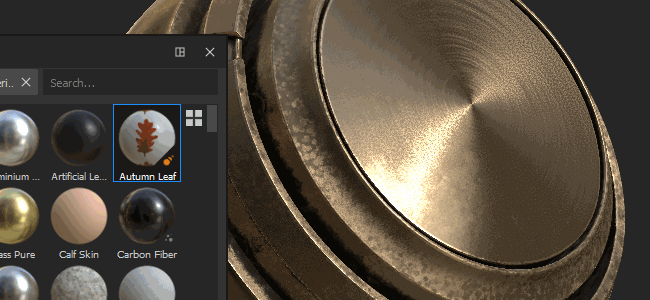
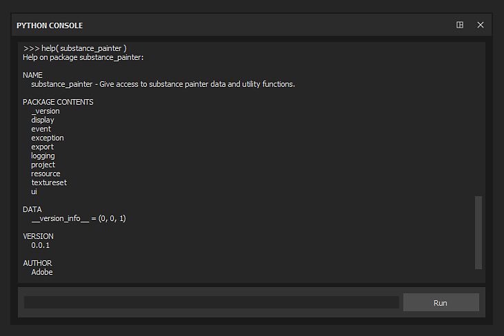
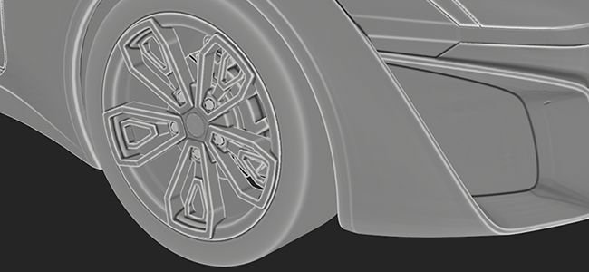
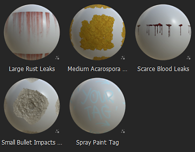

# バージョン2020.1(6.1.0)

**Substance Painter 2020.1 (6.1.0)**&#x200B;では、新しいエクスポーター、pythonスクリプティング、新しい曲線ベイカー、新しいコンテンツなど、ワークフローに関するさまざまな機能強化が提供されます。

リリース日： *2020年4月22日*

>[!NOTE]
>
> このリリース以降、アプリケーションのバージョン番号の形式が変わり始めます。 **2020.1**&#x200B;は&#x200B;**6.1.0**&#x200B;になります。

## 主な機能

### 新しいテクスチャのエクスポートウィンドウ

書き出しウィンドウが全面的に修正され、プロジェクトのテクスチャの設定と書き出しをより簡単かつ簡単に行えるようになりました。 また、書き出しをより便利にする新しい機能ももたらします。 新しい書き出しウィンドウは、次の3つのタブに分かれています。

**設定**

このタブでは、各テクスチャセットの一般設定および固有の設定を制御します。

* **新しいグローバル設定**\
  グローバル設定は、すべてのテクスチャセットで共有されるパラメータセットです。 これらのアトリビュートを使用すると、各テクスチャセットを個別に手動で編集しなくても、パラメータの割り当てや更新をすばやく行うことができます。 グローバル設定には、次のパラメーターがあります。

  * **出力ディレクトリ**:テクスチャを生成するターゲットの場所を定義します。
  * **出力テンプレート**：書き出されたテクスチャの名前付けとパッキングを構成するために使用するプリセットを定義します。
  * **ファイルの種類**：書き出されたテクスチャのファイル形式とビット深度を定義します。
  * **サイズ**:テクスチャセットがエクスポートされる最大のテクスチャ解像度を定義します。
  * **Padding**: UV アイランドの外側の情報の生成方法を定義します。
  * **シェーダーパラメーターの書き出し**：有効にすると、シェーダー設定とそのテクスチャセット割り当てを格納するjsonファイルが書き出されます。

  
* **テクスチャセット単位の設定とパラメーターのオーバーライド**\
  グローバル設定の下には、現在開いているプロジェクトのテクスチャセットのリストが表示されます。 「一般の書き出しパラメーター」セクションには、グローバルパラメーターから継承された設定が表示されます。 テクスチャセットごとに異なる&#x200B;**書き出しプリセット**&#x200B;を選択することもできます。

  

  ペンアイコンをクリックすると、特定のパラメータをオーバーライドしてその値を変更できます。 もう一度クリックすると、オーバーライドが無効になり、値がデフォルト（グローバル設定から継承）にリセットされます。

  
* **書き出すテクスチャの選択**\
  テクスチャセット書き出しパラメータの下には、生成されるテクスチャのリストがあります。 このリストを使うと、チェックまたはチェックを外して生成するファイルを正確に選択することができます。 このリストには、書き出し設定または出力テンプレートから継承された、各テクスチャのファイルフォーマットとビット深度も表示されます。 ペンアイコンを使用して、特定のテクスチャのファイルフォーマットおよびビット深度をオーバーライドします。
* **エクスポートせずに設定を保存する**\
  新しい「**設定を保存**」ボタンを使用すると、テクスチャを書き出さなくてもプロジェクトの書き出し設定を保存できるようになりました。 これは、テクスチャの再生成を行わずにプロジェクトを調整する場合に便利です。この処理には時間がかかることがあります。

  
* **クリック&amp;ドラッグして書き出しをすばやく有効/無効にする**\
  マウスのクリックとドラッグを使用して、テクスチャセットとテクスチャをすばやく有効または無効にします。

  

  

**出力テンプレート**

このタブでは、設定プリセットを作成して、書き出されたテクスチャに名前を付けることができます。

* <b>書き出しプリセットの作成</b>\
  [<b>出力テンプレート</b>]タブは、古いエクスポーターの[<b>構成</b>]タブと同じです。 これを使用して書き出しプリセットを作成し、テクスチャの名前の指定とパックをすばやく行うことができます。 カスタム書き出しプリセットを作成する方法については、ドキュメントページを参照してください。
* **書き出しプリセットのファイル形式とビット深度を設定**\
  書き出しプリセットに新たに追加された機能では、ファイル形式およびテクスチャごとのビット深度を設定できるため、プロジェクト間での設定の共有がさらに簡単になります。

  
* **出力テンプレートから書き出されたテクスチャを制御する**\
  書き出しプロセスを設定するときは、新しいオプション&#x200B;**出力テンプレートに基づく**&#x200B;を使用して、書き出しプリセットからテクスチャプロパティを定義します。

  

**書き出しのリスト**

このタブには、進行中の書き出しプロセスと、書き出されたすべてのテクスチャのグローバルサマリーが表示されます。

* **書き出されたテクスチャの一覧**\
  タブには、オーバーライドされたパラメータと無視または除外されたテクスチャを考慮して、テクスチャセットごとにエクスポートされる個々のテクスチャがリストされます。 これは、書き出しプロセスを開始する前に、すべてが正常に行われていることを確認するための良い方法です。 書き出しプロセスが開始すると、インターフェイスは自動的にこのタブに切り替わります。

  
* **プロセスとログのエクスポート**\
  タブの右側には、進行中の書き出しプロセスの詳細を出力するコンソールがあります。 正常に書き出されたテクスチャと、警告およびエラーが表示されます。 インターフェイスの下部には、プロセスの現在のステータスを示す進行状況バーも表示されます。

  

  

### 新規デカールレイヤーモード

[アセット](../../interface/assets/assets.md)からマテリアルをドラッグ&amp;ドロップすると、新しい&#x200B;**デカール**&#x200B;モードを使用できます。 これにより、**平面投影**&#x200B;モードで新しい塗りつぶしレイヤーが作成され、パターンや画像をより簡単に配置できるようになります。 これを使用するには、**ALTキーボードショートカット**&#x200B;を押しながら、シェルフからいずれかのマテリアルを&#x200B;**ドラッグ&amp;ドロップ**&#x200B;してマニピュレータをプレビューし、デカールを目的の位置に移動したら、マウスを放します。 マウスボタンを放すと、新しい塗りつぶしレイヤーが作成されます。

今回は、Substance Sourceから選択したデフォルトのシェルフに5つのデカールも含めました。 この新しいデカールワークフローについて詳しくは、[この記事](https://magazine.substance3d.com/effortless-grunge-look-with-new-substance-source-parametric-decals/)を参照してください。

>[!NOTE]
>
> デカールを使いやすくするために、レイヤー作成時に各チャンネルのデフォルトの描画モードを指定できる新しい[user-dataキーワード](../../content/creating-custom-effects/user-data.md)が実装されました。

### 新しいPythonスクリプティング

**Python**&#x200B;のスクリプトとモジュールをSubstance Painterを使用して作成および実行できるようになりました。 アドビでは、Python 3.7とPySide2をSubstance Painterと統合しました。また、専用の&#x200B;**substance\_painter**&#x200B;モジュールを介してカスタムPython APIを提供しています。 さらに、より明確で使いやすくするために、JavaScriptバージョンからAPIを再考する機会を得ました。 これらの関数は類似点を共有しているため、既存のユーザーはPythonプラグインを簡単に作成できます。

Python APIについて詳しくは、アプリケーションのヘルプメニューからアクセスできるドキュメントを参照してください。

* **Pythonモジュールをインストールしています**\
  Pythonモジュールはユーザーアカウントの下にある専用のDocumentsフォルダーにインストールできますが、専用の環境変数を使用して補足パスの場所を追加し、スタジオ全体のセットアップを簡単にする方法も提供しています。
* **Substance Painter Pythonサブモジュール**\
  次のサブモジュールが公開されました（詳細は後日公開されます）。

  * substance\_painter.display
  * substance\_painter.event
  * substance\_painter.exception
  * substance\_painter.export
  * substance\_painter.logging
  * substance\_painter.project
  * substance\_painter.resource
  * substance\_painter.textureset
  * substance\_painter.ui
* **Pythonインタープリター**\
  新しいPythonコンソールウィンドウを使用して、モジュールを試したり、Pythonスクリプトを実行したりできます。

  {width="500px"}

### 改良されたパン屋

今回のリリースでは、Curvatureベイカーが改善され、Ambient オクルージョンベイカーに新しいパラメータがいくつか追加されました。

* <b>メッシュベイカーからの新しい曲率</b>\
  従来の曲線ベイカーは非推奨となり、新しい「メッシュから」バージョンに置き換えられました。このバージョンは最近、Substance Designerに追加されました。 新しいベイカー設定について詳しくは、ドキュメントページを参照してください。\
  新しいパン屋には、次の機能があります。

  * <b>精度を向上</b> ：計算された曲率がより正確になり、リアルな値が生成されます。
  * <b>メッシュの接触</b>:メッシュ間の相互貫通により曲率情報が生成されるようになりました（以前のベイカーでは、この問題は発生しませんでした）。
  * <b>高ポリゴンメッシュ</b>：標準マップから変換するのではなく、高ポリゴンメッシュから直接ディテールをベイクします。
  * <b>パフォーマンス</b>：新しいベイカーはレイトレーシングを使用して詳細を計算します。つまり、GPU レイトレーシングアクセラレーション(RTX/Optix)が有効です。

  {width="500px"}

  互換性の理由から、Curvature baker設定を使用して古いCurvature bakerにアクセスすることは可能です。 古いパン屋を使用するには、設定&#x200B;**ノーマルマップから生成**&#x200B;を選択してください。

  
* <b>環境オクルージョンの向上</b>\
  環境オクルージョンベイカーが改善され、新しい設定がサポートされるようになりました。

  * <b>地面</b>:メッシュの下にある平面をシミュレートして、地面から生じる影を作成します。 詳しくは、環境オクルージョンのマニュアルを参照してください。
  * <b>背面を無視</b>:アンビエントオクルージョンをベイク処理するときに、特定のオブジェクトを無視する新しいメッシュ名サフィックスが追加されました。 たとえば、浮動ジオメトリの詳細を無視できます。 詳しくは、「名前による一致」のドキュメントを参照してください

  {width="500px"}

### メッシュ書き出しの改善（テッセレーションを使用）

書き出しメッシュが、新機能と設定により改善されました。

* **元のメッシュトポロジをエクスポートするか、テッセレーションを使用してメッシュをエクスポートします**\
  メッシュを書き出すときに、ディスプレイスメントエフェクト用に生成されたテッセレーションを適用できるようになりました。 次の設定が可能です。

  * **ディスプレイスメント/テッセレーションなし**:メッシュ分割なしでベースメッシュをエクスポートします。 **三角形化を適用**&#x200B;が無効な場合、元のメッシュの三角形、四角形、またはN角形が書き出されます。
  * **ディスプレイスメント/テッセレーションあり**:メッシュをサブディビジョン付きでエクスポートします。 **頂点法線の再計算を有効にする**&#x200B;と、メッシュ法線はディスプレイスメントオフセットと一致するように調整されます。

  
* **シーンの階層とメッシュ名**\
  元のシーン階層と読み込まれたメッシュのオブジェクト名が保持され、書き出されたメッシュに再適用されるようになりました。
* **FBXファイル形式で書き出す**\
  プロジェクトメッシュを他のファイル形式と一緒にFBXでエクスポートできるようになりました。\
  **注意**: Substance Painterと互換性のないデータは、インポート中に破棄されます（例：スキニング、ジョイント）。

### UVの自動アンラップ機能の向上

自動UVアンラップは、新しい設定を使用して、より簡単に制御できるようになりました。

* **プロジェクト作成時にUVの自動アンラップを使用する**\
  プロジェクトの作成時に、新しい自動UVアンラッププロセスを有効または無効にできる新しい設定が追加されました。 この設定は、3Dメッシュを既存のプロジェクトに再読み込みする場合にも使用できます。

  
* <b>詳細なラップ解除設定</b>\
  チェックボックスの横にある自動UVアンラッピングは、新しい<b>オプション</b>ボタンです。 新しいウィンドウが開き、展開プロセスを制御するための高度な設定が表示されます。このウィンドウでは、以前のように常にすべてを再計算するのではなく、プロセスの別の部分で既存のメッシュ情報を保持できます。 詳しくは、専用ドキュメントを参照してください。 現在の設定：

  * <b>縫い目</b>：既存の縫い目を保持するか再生成するかを定義します。
  * <b>UV アイランド</b>：既存のUVアンラップが保持されるか再生成されるかを定義します。
  * <b>パッキング</b>: UV アイランドパッキングを保持するか再生成するかを定義します。
  * <b>余白サイズ</b>：各UV アイランドの間隔（パーセント）を定義します。

  

### 新規コンテンツ

このリリースでは、新しいマテリアルがいくつか追加されただけでなく、新しいソフトウェアバージョンに合わせて多くの書き出しプリセットが更新されました。

* **5個の新しいデカールマテリアル**\
  新しいデカールの機能を試すために、Substance Sourceから直接入手できる5つの新しいマテリアルを追加しました。

  * 大きな錆リーク
  * 中型アカロスポーラ苔癬
  * 血液漏出が少ない
  * コンクリート壁への小さな弾丸の衝撃
  * スプレーペイントタグ

  
* <b>新しいVrayシェーダー、プロジェクトテンプレート、およびエクスポートプリセット</b>\
  [カオスグループ](https://www.chaosgroup.com/)と協力して、VrayMtl動作を再現する2つの新しいシェーダを統合しました。 Vrayで作成したレンダリングを一致させようとすると、より正確な外観になります。 プロジェクトテンプレートを使用して、Vrayの新しいプロジェクトを簡単に設定できます。 詳しくは、ドキュメントを参照してください。

  
* <b>新しいMaxwellプロジェクトテンプレートおよびエクスポートプリセット</b>\
  [次の制限](http://www.nextlimit.com/)との共同作業で、新しいプロジェクトテンプレートを統合し、Maxwellレンダラー用のプリセットを書き出しました。
* **更新された書き出しプリセット**\
  多くの書き出しプリセットが更新されました。主に新しいファイル形式とビット深度設定を使用するためですが、新しいソフトウェアバージョンと一致させることもできます。

## チュートリアル

新機能を説明する新しいビデオチュートリアルをご覧ください。

## リリースノート

### 2020.1.3

*（2020年6月16日リリース）*\
概要： **バグ修正**

**追加：**

* [書き出し]シェーダーパラメーターのjsonファイルにディスプレイスメント設定を追加する

**修正済み：**

* [クラッシュ]&#x200B;[エンジン]既存のチャンネルを消去して置き換えようとするとクラッシュする
* [クラッシュ]マテリアルレイヤーでマスクをペイントした後にシェーダを変更する
* [クラッシュ]&#x200B;[エンジン]一部の大規模なプロジェクトでクラッシュする
* [ベイカー] zBrushから書き出したOBJで、「名前で一致」が機能しない
* [ディスプレイスメント]&#x200B;[SVT] ディスプレイスメントがオンになっていると、プロジェクトを開いたときにテクスチャが表示されない
* [書き出し]一部のテクスチャは均一なグレーで書き出されます
* [書き出し]無効になっているテクスチャセットは、DimensionおよびSketchfab書き出しプリセット用に書き出さないでください
* [スクリプティング]&#x200B;[JavaScript] JavaScript APIを使用してonProjectOpenedイベントの書き出し設定にアクセスするとクラッシュする
* [Scripting]&#x200B;[Javascript] onExportFinished()がエクスポート後に呼び出されない

### 2020.1.2

*（2020年5月28日リリース）*\
概要： **Substance engineおよびベーカーのアップデートに関するバグの修正**

**追加：**

* [ベイカー]最新バージョンへの更新
* [ベーカー]環境オクルージョン、曲率、Thicknessベーカーでの新しいサンプリング方法
* Substance engineの最新バージョンに更新する
* [スクリプト]&#x200B;[Python]プロジェクトリソースのResourceIDの作成を許可する
* [Scripting]&#x200B;[Python]チャネル情報の照会を許可する
* [スクリプティング]&#x200B;[Python] dryrun関数とコールバック関数を追加して、テクスチャの書き出しをシミュレートする

**修正済み：**

* [ベイカー]特定の場合、接線法線マップを使用してワールド空間法線ベイカーを実行すると、法線が正しく表示されない
* [ベーカー]高ポリゴンがない場合にOptixで環境オクルージョンのベイク処理でエラーが発生する
* [動的ストローク]特定のテクスチャセットの読み込み時の遅延
* [書き出し]無効になっているUSD、glTFのテクスチャセットを書き出さないでください
* [スクリプティング]&#x200B;[JavaScript]新しいCurvatureベイカー設定を編集できない
* [スクリプティング]&#x200B;[JavaScript] alg.texturesets.addChannel()がエラーを返さない場合がある
* setProjectExportOptions()のJavascript APIドキュメントで[Scripting]&#x200B;[JavaScript]が間違っている
* [スクリプティング]&#x200B;[JavaScript]常にすべてのテクスチャセットをエクスポートします
* [Scripting]&#x200B;[Python] sys.executableは、パスではなくpython.exeへのSubstance Painterを返します
* テクスチャキャッシュがMac OSとWindows/Linux間で互換性がない
* [Livelink UE4]結合メッシュのすべてのテクスチャセットに最後のマテリアルのみが使用される

**既知の問題：**

* [書き出し]&#x200B;[Dimension]&#x200B;[Skecthfab]無効になっているテクスチャセットを書き出さないでください
* [クラッシュ]マテリアルレイヤーでマスクをペイントした後にシェーダを変更する

### 2020.1.1

*（2020年5月5日リリース）*

**追加：**

* [書き出し] TextureSetのオーバーライドされた状態のビジュアルフィードバック

**修正済み：**

* [書き出し]特殊解像度モニターでエクスポーターウィンドウのサイズが大きすぎるため、サイズを変更できない
* [書き出し]書き出し後、オプションが保存されない
* [書き出し]クラッシュするか、「キャッシュから」書き出しプリセットを使用して書き出せない
* [エクスポート]エクスポートをキャンセルすると、予期しない空のマップが生成されます
* [書き出し]仮想書き出しプリセット設定の修正
* [Python] PYTHONPATH env varが考慮されない
* [Python]&#x200B;[Export] Python経由で書き出しをキャンセルすると、例外エラーが返される
* [Python]&#x200B;[書き出し] export\_project\_texturesがpsdファイル形式では正しくない結果になります

**既知の問題：**

* [JavaScript]新しい曲線ベイカー設定を編集できない
* [JavaScript]&#x200B;[書き出し]常にすべてのテクスチャセットを書き出す
* [Bakers] GPU レイトレーシングを含むLinuxでクラッシュする
* [書き出し]&#x200B;[USD]無効になっているテクスチャセットを書き出さないでください

### 2020.1.0

*（2020年4月22日リリース）*

**追加：**

* 新しいテクスチャとメッシュの書き出し
* [書き出し]新しいエクスポータインタフェース
* [書き出し]&#x200B;[書き出しタブ]テクスチャセットごとに書き出すマップチャンネルを選択できます
* [書き出し]&#x200B;[書き出しタブ]すべてのテクスチャセットのテクスチャセットサイズを1回の操作で変更できます
* [書き出し]&#x200B;[書き出し]テクスチャセットごとに異なるテンプレートを許可する（USD、glTF、Sketchfab、Dimensionを除く）
* [書き出し]&#x200B;[書き出し]タブマップとテクスチャセットのクイックアクティブ化と非アクティブ化
* [書き出し]&#x200B;[書き出し]解像度8192x8192の書き出しは試験的ではありません
* [書き出し]&#x200B;[書き出しタブ]マップごとのファイル形式とビット深度を変更できます
* [書き出し]&#x200B;[書き出しタブ]既定のパラメータ値にリセットできます
* [書き出し]&#x200B;[書き出しタブ]書き出しせずに設定を保存できるようにする
* [書き出し]&#x200B;[出力テンプレートタブ] 「設定」タブを「出力テンプレート」タブに名前変更
* [書き出し]&#x200B;[出力テンプレートタブ]プリセットマップごとにファイル形式とビット深度を定義できます
* [書き出し]&#x200B;[書き出しの一覧]エクスポート処理の概要と表示を行う新しいプレビュータブ
* [メッシュを読み込み/書き出し]読み込み/書き出し時間のパフォーマンス最適化
* [メッシュを書き出し] FBXでメッシュを書き出す
* [メッシュを書き出し]ディスプレイスメントとテッセレーションを使用してメッシュを書き出す
* [メッシュを書き出し]&#x200B;[UI]法線の頂点を再計算するための新しい設定、三角形分割を適用
* [メッシュを書き出し]自動アンラップによって生成された新しいUVを使用して元のメッシュトポロジを書き出す
* その他のコントロールを使用した自動UVアンラップの更新
* [UVアンラップ]&#x200B;[UI]新しいプロジェクトウィンドウでUVの自動アンラップを有効にする設定を追加
* [UVアンラップ]&#x200B;[UI]ラップ解除ステップ（継ぎ目、ラップ解除、パッキング）を制御する新しいオプション
* [UVアンラップ]&#x200B;[UI]既存のアンラップシーム/アンラップ/パッキングを保存できます
* [UV Unwrapping]&#x200B;[UI]ラップ解除ステップを完全に再計算する新しいオプション
* [UVアンラップ]&#x200B;[UI]マージンサイズを制御する新しいオプション（なし、小、中、大）
* 新しいパン屋
* [ベイカー]メッシュから古い曲率を新しい曲率に置き換える
* [ベイカー] 「アンビエントオクルージョン」のベイカーの裏面を無視する場合は、「名前で一致」オプションを追加します
* [ベイカー] 「環境オクルージョン」のベイカーにグリッドを追加
* 新しいスクリプティングPython API(3.7.6)
* [Python]&#x200B;[UI] Python用の新しいスクリプトメニュー
* [Python]&#x200B;[UI]ヘルプメニューの新しいPythonドキュメント
* [Python] Pythonモジュールを公開するSubstance Painter: substance\_painter, alg, display, project.setting, project, texturesets, ui
* [Python]新しい「substance\_painter」Pythonモジュールを公開します
* [Python]新しいPythonサブモジュールを公開：alg、display、log、project、resource、texturesets、ui
* [Python]プロジェクトの変更のためのリスナー
* [Python] Pythonドキュメントの新しい例
* [JavaScript]&#x200B;[UI]プラグインメニューがJavaScriptに置き換えられました
* [ビューポート]シェルフからリソースを「ドラッグ/ドロップ+ ALT」してデカールプロジェクションの作成を許可する
* 新規コンテンツ
* [コンテンツ] Substance Sourceから5つの新しいデカールマテリアルを作成
* [コンテンツ] Maxwellレンダラー用に新しいプロジェクトテンプレートを追加し、プリセットを書き出す
* [コンテンツ] Keyshot 9書き出し用のプロジェクトテンプレートを追加
* [コンテンツ] Keyshot 9書き出しプリセットを更新して、ディスプレイスメントとエミッシブをサポートする
* [コンテンツ]&#x200B;[エクスポーター]最新バージョンのゲームエンジンおよびレンダラーに合わせるためのすべての書き出しプリセットの更新
* [Content]&#x200B;[Exporter]新しい形式とディザリング設定を使用するために、書き出しプリセットファイルを更新します
* [コンテンツ] VRayマテリアル(VRayMtl)をサポートする新しいテンプレートとシェーダ
* [レイヤースタック]ゴミ箱アイコンまたはキーボードショートカットを使用してレイヤー効果を削除できます削除
* プラグインSubstance Sourceを削除（「送信先」機能を含むランチャーを使用）
* [Windows]ハイエンドGPUでTDR警告が表示されない

**修正済み：**

* 新規プロジェクトファイルダイアログの翻訳の問題
* [ベイカー] 「前処理されたシーンファイルを保存」の設定が機能しなくなりました
* [ベーカー]高ポリゴンがない場合、optixでベイク処理を行うとクラッシュする
* [平面プロジェクション]プロジェクションは、繰り返しUVを使用するメッシュでは機能しません
* [デカール]異なる塗りつぶしレイヤー投影モードを使用した場合の、通常チャンネルの動作の違い
* [指先]&#x200B;[コピー]マスクでペイントすると、斑点が表示される
* [エンジン]特定のレイヤーコンテンツでクラッシュする
* [エンジン]ペイント中にランダムにクラッシュすることがある
* [アンカーポイント]空のマスクへの参照は常に白を返す
* [書き出し]特定のスタック設定でレイヤが考慮されない
* [メッシュを書き出し]特殊文字を含むパスでは書き出すことができません
* [メッシュを書き出し] LinuxまたはMacOSから書き出すと、glTFファイルを読み取れない
* [メッシュをインポート] DAE、PLY、またはglTFを再インポートしても意図したとおりに動作しない
* [クラッシュ]マテリアルレイヤーでマスクをペイントした後にシェーダを変更する

**既知の問題：**

* [スクリプティング]&#x200B;[JavaScript]新しいCurvatureベイカー設定を編集できない
* [Bakers] GPU レイトレーシングを含むLinuxでクラッシュする
* [書き出し]&#x200B;[USD]無効になっているテクスチャセットを書き出さないでください
