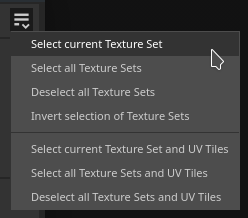
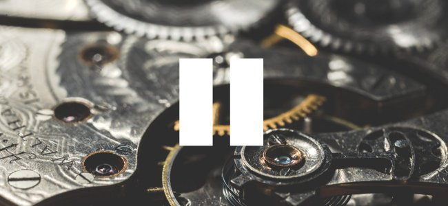

# バージョン2020.2(6.2.0)

**Substance Painter 2020.2.0 (6.2.0)**&#x200B;では、UDIMをまたいでペイントできる新しいUVタイルワークフローが導入されました。 また、あらゆるタイプのプロジェクトに対して、パフォーマンスとプロジェクトサイズが向上しています。

リリース日： *2020年7月23日*

&#x200B;>> 

アーティストクレジット： Dragon by [Damien Guimoneau](https://www.artstation.com/damz)、 Robot by [Jason Huang](https://www.artstation.com/jasonhuang)。

## 主な機能

### UDIMをまたいでペイントする新しいUVタイルのワークフロー

このリリースでは、Substance Painterに新しいUVタイルのワークフローが導入され、UDIMタイル全体をペイントできるようになりました。

新しいワークフローでは、**UVは個々のテクスチャセットに分割されなくなります**。 代わりに、UVタイルはメッシュのマテリアル割り当てに基づいて単一のテクスチャセット内に含まれます。 同じテクスチャセット内にあるUVタイルは、2Dおよび3Dビューポートの両方で&#x200B;**継ぎ目なしでペイント**&#x200B;できます。

UVタイルは、UDIMが主に命名規則であるため、この新しいワークフローを一般的な方法で記述するために使用される用語です。 現在UDIMのみが利用可能な規約ですが、将来的には（MudboxやZBrushの命名方式のサポートなど）UDIMを拡張する予定です。 また、UDIMスキームでは不可能な負の座標のタイルをサポートすることも考えています。 そのため、このワークフローではより広い用語を選択しました。

この新しいワークフローで導入された変更の概要は次のとおりです。

* **UVタイルプロジェクトを作成しています**\
  新しいプロジェクトを作成するときに、新しいワークフローを使用するかどうかを指定する新しい設定があります。

  ワークフローが決定され、プロジェクトが作成されると、他の設定とは異なり、後で変更することはできません。

  
* 2DビューポートのUVタイル

  新しいUVタイルワークフローを使用する場合、2Dビューに、各UVタイルに専用のUDIM番号がある新しいグリッドが表示されるようになりました。 各タイルは個別にペイントできます。

  
* UVタイル全体のペイント

  UV タイル

  同じテクスチャセット内にあるものは、シームレスにペイントできます。 これにより、UVタイルの数を乗算するだけで、アセットの全般的な解像度と品質を向上させることができます。
* テクスチャセットリストウィンドウのUVタイル

  この

  テクスチャセットリストに

  読み込まれたメッシュで見つかったマテリアルに関連するUVタイルを一覧表示するように更新されました。 各UVタイルは、UDIM規則に基づく名前で表示されます。

  
* UVタイル単位で解像度を変更する

  各UVタイルのデフォルト解像度は親のテクスチャセットに基づいていますが、タイルごとにオーバーライドすることができます。 テクスチャセットリストでタイルを選択し、テクスチャセット設定ウィンドウに移動して解像度を変更するだけです。 タイルの解像度が上書きされると、2Dビューの数値の横に新しい解像度が表示されます。

  
* 新規レイヤースタックアイコン

  レイヤースタックには、ペイントおよび塗りつぶしレイヤーの新しいアイコンが追加されています。 UVタイルにはより多くのテクスチャのセットが含まれているため、この小さな領域にすべてを表示することはできませんでした。 特定のサムネールを計算する必要がなくなったため、パフォーマンスが向上します。 この新しいアイコンセットは、メイン設定で設定を有効にすることで、通常のプロジェクトでも使用できます（以下を参照）。

  
* レイヤー上に新しいUVタイルマスク

  UVタイルマスクは、通常のマスクよりも効率的にレイヤーをマスクするための新しい方法です。 特定のUVタイルの計算を完全に破棄できるため、パフォーマンスが向上します。 このツールは、多数のUVタイルを含むプロジェクトで快適に作業できるようにするためにお勧めします。 詳細については、ドキュメントの[専用ページ](../../interface/layer-stack/geometry-mask.md)を参照してください。

  {width="550px"}
* **マスクされたUVタイルを通してペイント**\
  複数のUVタイルが同じテクスチャセットに存在する場合、ジオメトリの他の部分が邪魔になっているため、メッシュの特定の領域をペイントするのが困難になることがあります。 このような状況を回避するために、コンテキストツールバーに新しいペイント設定が追加されました（名前： **ペイントストロークはマスクされたUVタイルを無視します**）。 この設定を有効にすると、UVタイルマスクによって除外されたUVタイルはすべてビューポートで非表示になり、ペイントストロークを通過/無視できるようになります。 UVタイルマスクを変更すると、修正されたUVタイルを持つメッシュや除外が必要な新しいジオメトリを再読み込みできるため、ブラシストロークが再計算されます。 これにより、ペイントストロークのやり直しが回避されます。

  

  
* UVタイルのベイク処理

  ベイカーもUVタイルをサポートしており、ベイクウィンドウに選択リストが表示されます

  ベイク処理するタイルとテクスチャセットを指定します。 チェックボックス上でクリックしてドラッグするか、新しいドロップダウンメニューを使用して、選択をすばやく変更できます。

  

  
* 新しい$udimタグを使用したUVタイルテクスチャの書き出し

  出力テンプレートに新しいタグが追加され、ファイル名にUVタイル番号を含むファイルを書き出せるようになりました。 現在、UDIM変換のみが使用できます。 また、タグが使用できない場合に、括弧を使用してファイル名のオプションの要素を定義することもできます。 これにより、例えば、UVタイルプロジェクトで利用できる場合にのみUDIM番号を付加するファイル名を作成して、書き出しプリセットをどのタイプのプロジェクトでも互換性があるようにすることができます。

  
* **画像シーケンスの読み込み**&#x200B;画像シーケンスは、それぞれ特定のUVタイルに一致する一連のテクスチャです。 画像シーケンスをインポートするには、シーケンスの最初のファイルをシェルフにドラッグ&amp;ドロップするか、リソースのインポートウィンドウを使用します。 シーケンス内の残りのファイルも自動的に読み込まれます。 シーケンスはシェルフ内に単一のリソースとして表示されます。このリソースには、含まれるファイルの数を示す番号が付いています。 シーケンスを使用するには、塗りつぶしレイヤーにドラッグ&amp;ドロップします。 投影モードは自動的に&#x200B;**塗りつぶし（UVタイルごとに一致）**&#x200B;に設定されます。

  {width="600px"}

  
* Alembicメッシュを使用した面セットのサポート

  Alembic Facesetがマテリアルとして読み込まれ、テクスチャセットに分割されるようになりました。 この変更により、Alembicメッシュは新しいUVタイルワークフローと互換性があります。 AlembicメッシュにFacesetsにないフェースが含まれている場合、DefaultMaterialという名前のテクスチャセットに自動的に配置されます。

新しいUVタイルワークフローの詳細については、[専用ドキュメント](../../features/uv-tiles/uv-tiles.md)を参照してください。

>[!NOTE]
>
> UVタイルのワークフローは非常に負荷が高くなる可能性があるため、SSDを使用してキャッシュとプロジェクトファイルの両方を保存し、読み込み時間を短縮してスムーズに操作することをお勧めします。

### 新しい一時停止エンジン

作業中にSubstance Painterエンジンを一時停止できるようになりました。 エンジンを一時停止すると、テクスチャの計算、ビューポートの更新、またはペイントストロークは登録されますが、計算されません。

この新しいアクションにより、複雑なレイヤースタックを設定および調整し、計算を最後まで遅らせることができます。 エンジンを一時停止する主な利点は、中間計算を避け、最終的な結果のみを計算することです。 これにより、アプリケーションの応答性が向上し、アップデートが全体的に高速になります。 ただし、エンジンの一時停止を解除するまでは視覚的なフィードバックは得られません。

エンジンを一時停止するには、ビューポートの上にあるコンテキストツールバー&#x200B;**の**&#x200B;ボタンをクリックするか、**ショートカットShift + Escape**&#x200B;を使用します（設定で変更可能）。 エンジンの一時停止を解除するには、ボタンをオフにするか、ショートカットを再利用します。

### パフォーマンスの向上

* **テクスチャの書き出しの高速化**\
  テクスチャの書き出しは、特に多数のテクスチャを生成する大規模なプロジェクトの場合、非常に高速になります。 テクスチャの生成および書き込み方法にいくつかの改良が加えられています。 多数のテクスチャセットまたは複雑なレイヤースタックを含むプロジェクトの内部テストでは、書き出しプロセスが通常は最大&#x200B;**4倍または5倍速くなりました**。
* **プロジェクトを開くときにキャッシュの計算が遅れる** Substance Painterでは、レイヤーの微調整とブレンドを高速に行うためにキャッシュシステムが使用されます。 以前のバージョンでは、このキャッシュはプロジェクトを開くたびに計算されていました（ビューポートの下部にある緑色の読み込みバーで表示されます）。 キャッシュの計算は、塗りつぶしレイヤーパラメーターをペイントまたは微調整するなど、レイヤーを編集しようとしたときにのみトリガーされるようになりました。 この変更により、作業を開始する前に、待たずに目的のテクスチャセットに切り替えてプロジェクトを開くことができます。 計算も細かくなるので、必要な処理だけを行うことができます。 例えば、UVタイルを含むプロジェクトでは、修正が必要なタイルのみが計算されます。
* **メッシュマップの非同期読み込み**&#x200B;メッシュマップが非同期に読み込まれるようになりました。 つまり、メッシュマップの読み込みを待っている間、アプリケーションはブロックされなくなります。 これは、ビューポートにメッシュマップを表示する場合に特に表示されます（下図を参照）。 また、メッシュマップが不要になったので、プロジェクトを開く時間が短縮されます。

  
* **マスク表示モードでの編集を改善しました**\
  Altキーを押しながらマスク（または専用の表示モード）をクリックしてビューポートに表示すると、テクスチャの更新はマスクに対してのみ実行されるようになりました。 つまり、このビューモードを使用すると、ビューポートがマテリアルモードに戻るまで他の計算が遅れるため、ペイントや編集の効果がよりスムーズになります。

  
* **新規レイヤースタックのサムネール**\
  前述のように、レイヤースタックでは新しいアイコンセットを使用できるようになりました。 これらのアイコンを使用すると、サムネールを計算する必要がないため、一般的なパフォーマンスが向上します。 UVタイルプロジェクトでは自動的に行われますが、通常のプロジェクトでは、**編集/設定**&#x200B;に移動して、**レイヤースタックのサムネールをアイコンで置き換え**&#x200B;を有効にすることで、これらのアイコンを選択して使用することもできます。

  
* **インクリメンタル保存の高速化**&#x200B;プロジェクトを縮小でき、変更されたデータに関して保存プロセスがより細分化されているため、インクリメンタル保存（Ctrl+Sを押す）がより高速になりました。 これは特に、負荷の高いプロジェクトで顕著です。
* **改善されたIrayスタートアップパフォーマンス**\
  アプリケーション内で共有されているメモリの管理方法が改善されたため、Rayでレンダリングモードにすばやく切り替えられるはずです。

### プロジェクトサイズの改善

プロジェクトファイルには、[大きなファイルフットプリント](../../technical-support/workflow-issues/project-issues/projects-are-really-big.md)が付いていることで知られています。 この問題の根本原因を調査し、いくつかの解決策を設計しました。 このバージョンでは、最初の一連の変更が導入されています。

* **ベーカー出力をグレースケール画像に切り替えています**\
  以前のバージョンでは、どのような場合でもパン屋はRGBの画像を出力していました。 これで、グレースケールベイカー（曲率、周囲オクルージョン）はグレースケール画像のみを出力するようになりました。 この簡単な変更により、プロジェクトサイズを20%から60%削減できます。 この変更を利用するには、既存のプロジェクトのメッシュマップを再生成する必要があります。
* **ベーカーの既定の拡散と拡張の設定を変更しています**\
  以前は、ベイカーによって1ピクセルの膨張が発生し、次に拡散パターン（UV アイランドの外側にある不鮮明なピクセル）が発生していました。 グラデーションは圧縮しにくいため、この設定では非常に重いテクスチャが生成されます。 そのため、この問題を減らすために、デフォルト設定が変更されました。 デフォルトでは拡散がオフになっており、拡張は32ピクセルに設定されています（これは4K解像度と一致する必要があります）。 この改善を利用するには、既存のプロジェクトをこれらの新しい設定に切り替えて再ベイク処理することをお勧めします。

### その他の改善

この新しいバージョンには、いくつかの変更が追加されています。

* **選択範囲のベイク処理**\
  新しいUVタイルワークフローで作業を簡単にするために、ベイクウィンドウが少し変更され、新しいセレクションリストが追加されました。このリストには、テクスチャセットごとのUVタイルリストが含まれています。 このため、「現在のテクスチャセットをベイク処理」ボタンは削除されました。 ベイク処理の対象の選択を便利に保つために、ドロップダウンメニューにいくつかのオプションが追加されました。

  

  
* **テクスチャセット設定のシェーダーインスタンス**\
  UVタイルを含むへのテクスチャセットリストの再加工に伴い、UIが雑然としないように若干の変更が加えられました。 以前は異なるシェーダインスタンスを作成して切り替えることができた機能が、テクスチャセット設定に移動されました。

  

## チュートリアル

新機能を紹介する新しいビデオチュートリアルを以下に示します。 新しいUVタイルワークフローについて、[Substanceアカデミー](https://www.youtube.com/playlist?list=PLB0wXHrWAmCx1fWbUyBFcjtfL8xhxZFnv)で他のビデオをご覧いただけます。

## リリースノート

### 2020.2.0

*（2020年7月23日リリース）*

**追加：**

* UVタイル(UDIM)
* [UVタイル] UVタイル全体をペイントする
* [UVタイル] UVタイルの新しいワークフローと従来のワークフローを選択できます
* [UVタイル] UDIM/UVタイルイメージシーケンスをリソースとしてインポートする
* [UVタイル]テクスチャセットリストウィンドウでテクスチャセットごとにUVタイルのリストを追加する
* [UVタイル]テクスチャセット設定で一度に複数のUVタイルの解像度を編集できるようにします
* [UVタイル]&#x200B;[2Dビュー] UVタイルをグリッドとして表示する
* [UVタイル]&#x200B;[2Dビュー] UVタイル情報を表示または非表示にする新しいビューポートボタン
* [UVタイル] UVタイルプロジェクトのペイントツールをデフォルトで単一チャンネルに切り替える
* [UVタイル]ペイント中にマスクされたUVタイルを無視するためのコンテキストツールバーの新しいボタン
* [UVタイル]&#x200B;[レイヤースタック]パフォーマンスを向上させるための新しいレイヤースタックアイコン
* [UVタイル]&#x200B;[レイヤースタック]ツールバーのペイントアイコンと塗りつぶしアイコンを改善
* [UVタイルマスク]&#x200B;[2Dビュー]複数のUVタイルを一度に含めるまたは除外できます（左クリック、Ctrl +左クリック）
* [UVタイルマスク]含める新しいUVタイルマスク、新しいアイコンのあるレイヤーごとにタイルを除外
* [UVタイルマスク]&#x200B;[レイヤースタック]含まれていないUVタイルマスクアイコンにUVタイルの数を表示します
* [UVタイルマスク]&#x200B;[2D/3Dビュー]ホバーエフェクトを追加して、カーソルの下のUVタイルを表示します
* [UVタイル]&#x200B;[ベイカー]特定のUVタイルを選択してベイク処理できます
* [UVタイル]&#x200B;[ベイカー]テクスチャセット/UVタイルの選択オプションを追加
* [UV Tiles]&#x200B;[Bakers]テクスチャセット内のUVタイルを選択するには、右クリックメニューオプションを選択します
* [UVタイル]&#x200B;[ベイカー]ドラッグでテクスチャセット/UVタイルをすばやく選択
* [UVタイル]&#x200B;[ベイカー]メッシュマップの[すべて]ボタンと[なし]ボタンを、より明示的な選択オプションで置き換えます
* [UVタイル]&#x200B;[ベイカー]ベイク処理するテクスチャの数を表示します
* [UVタイル]&#x200B;[書き出し]特定のUVタイルを選択して書き出すことができます
* [UVタイル]&#x200B;[書き出し]ドラッグしてUVタイルをすばやく選択できる
* [UVタイル]&#x200B;[書き出し] UVタイルの「追加」ドロップダウンメニューオプション
* [UVタイル]&#x200B;[書き出し] UVタイル(Adobe Dimension、Sketchfab、glTF、USD)で動作しない場合は、一部の書き出しプリセットを使用できません
* [UVタイル]&#x200B;[コンテンツ]書き出しプリセットを更新して、新しい$udimタグを使用します
* [UVタイル] UV アイランドが重なっているメッシュを読み込むときに、エラー報告が改善されます
* [UVタイル] IRay互換のUVタイル
* [UV Tiles]&#x200B;[Scripting] UVタイル書き出しドキュメントをPythonドキュメントに追加
* Performance
* [パフォーマンス]作業中にエンジンの計算を一時停止するコンテキストツールバーの新しいボタン(Shift+Esc)
* [パフォーマンス]テクスチャセットキャッシュの計算を遅らせることで、プロジェクトを開く時間を短縮する
* [パフォーマンス]プロジェクトを開くときにメッシュマップの読み込みを待たない
* [パフォーマンス]&#x200B;[2D/3Dビュー]使用されていないビューポートでマスクチャンネルを計算しない
* [パフォーマンス]ビューポートに表示されているメッシュマップをロードするときに、アプリケーションをブロックしません
* [パフォーマンス]プロジェクトの保存時に増分保存速度を改善する
* [パフォーマンス]&#x200B;[ベーカー]デフォルトの拡張設定を変更して、保存時間とプロジェクトのサイズを改善します
* [パフォーマンス]&#x200B;[ベイカー]特定のベイカーでグレースケールに切り替えて、時間とプロジェクトサイズの節約を改善
* [パフォーマンス]&#x200B;[書き出し]テクスチャの書き出しを高速化するためにエンジンのパフォーマンスを改善します
* [パフォーマンス]&#x200B;[書き出し]多くのテクスチャセットを含む書き出しダイアログを開くと、応答性が向上する
* [パフォーマンス]&#x200B;[書き出し]タブ「書き出しのリスト」に切り替えると、パフォーマンスが向上します
* [パフォーマンス]&#x200B;[Iray] Irayの起動時間を短縮します
* その他
* [ベイカー]テクスチャセットの選択オプションを追加する
* シェーダインスタンス管理をテクスチャセット設定に移動する
* [2D/3Dビュー]ビューポートの下部に、編集するマスクタイプを示すメッセージを追加します
* [レイヤースタック]従来のサムネールと新しいサムネールを切り替えるための設定の新しいオプション
* [レイヤースタック]サムネールの読み込み状態を示す視覚的なフィードバックを追加
* [プロジェクト]画像シーケンスを読み込む新しい投影モード「塗りつぶし（UVタイルごとに一致）」
* [プロジェクト]塗りつぶしレイヤーの投影モードを、特定の場合は「塗りつぶし（UVタイルごとに一致）」に変更
* [コンテンツ]木炭ブラシのプリセットを最適化してパフォーマンスを向上させる
* Irayをバージョン2020.0.0にアップデートします。
* [書き出し]何も選択されていない場合は、「書き出しリスト」タブを無効にする
* 自動ラップ解除
* [自動ラップ解除]縫い目の配置の品質を向上
* [自動アンラップ]速度と安定性を向上させるパラメーター配置の改善

**修正済み：**

* [Alembic]ファイルを読み込むときにファセットが無視される
* [Alembic]特定のファイルの読み込み時間が無限になる
* [読み込み]ファイル拡張子のみが異なる場合に、正しくないUDIM画像シーケンスが読み込まれる
* [クラッシュ]別のプロセスによってロックされているプロジェクトを開こうとすると、クラッシュする
* [書き出し]エミッシブチャンネルがUSD形式で書き出されない
* [コンテンツ]スマートマテリアル「木炭」にペイントストロークが含まれる

**既知の問題：**

* [テクスチャセットリスト]説明を非表示にできません
* [テクスチャセットリスト] UIの問題
