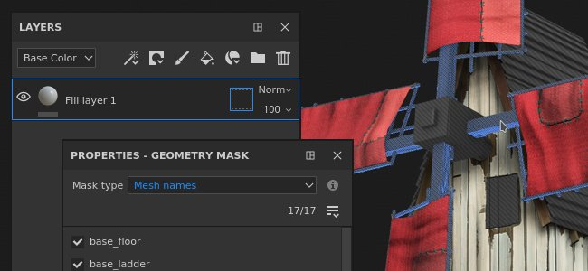
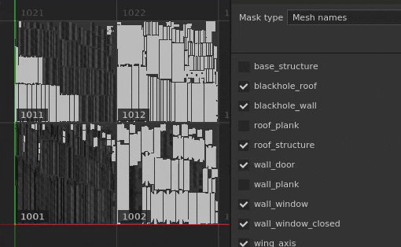
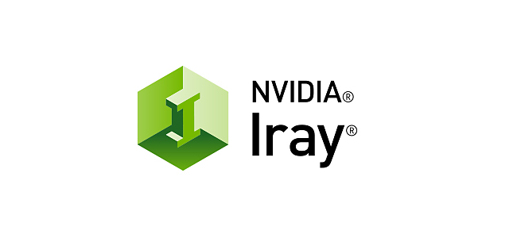

# バージョン2021.1(7.1.0)

**Substance Painter 2021.1 (7.1.0)**&#x200B;には、ジオメトリマスクやレイヤースタックでのエフェクトのコピー&amp;ペーストなど、いくつかの新機能と機能強化が導入されています。

リリースデータ： *28 January 2021*

>[!NOTE]
>
> このリリースでは、Ubuntuのサポートする最小バージョンが18.04に、MacOSが10.14に引き上げられます。 詳細については、[技術要件](../../getting-started/system-requirements.md)を参照してください。

## 主な機能

### 新規ジオメトリマスク

Geometry Maskはレイヤースタックの新しいマスクツールで、メッシュ名またはUV タイルに基づいてジオメトリを非表示にすることができます。 以前に名前を付けたUV タイルマスクを進化させ、UDIM番号に基づいてジオメトリをマスクしたものです。

この新しいツールは、複数のエンジンの最適化の利点があるため、通常のペイントよりも（または[ポリゴン塗りつぶし](../../painting/tool-list/polygon-fill.md)を使用する場合よりも）ジオメトリのマスクに適しています。 また、ジオメトリ情報（面や頂点など）を保存せず、メッシュ名やメッシュ番号だけを保存するので、UV タイルを再読み込みしてもマスクが破損することはありません。 また、ジオメトリを非表示にすると、テクスチャセット内でこれまでアクセスできなかったサーフェスでもペイントが可能になるので、オブジェクトを複数のテクスチャセットに分割する必要がなくなります。

* **レイヤー上の新しいジオメトリマスク**\
  ジオメトリマスクは、[レイヤースタック](../../interface/layer-stack/layer-stack.md)のどのレイヤーでも自動的に使用できます。 デフォルトでは効果がなく、レイヤーが完全に表示されます。\
  Geometry Maskには独自のコンテキストメニューがあり、すべての項目をすばやく選択または選択解除できるだけでなく、値を別のレイヤーにコピーすることもできます。

  

  

* **ジオメトリマスクのプロパティを編集する**&#x200B;ジオメトリマスクは、他のレイヤーのコンテキストと同じロジックに従います（マスクの編集やインスタンス化されたプロパティなど）。 ジオメトリマスク編集モードに入るには、レイヤーの右側にあるドット付きの正方形をクリックします。 ジオメトリマスクを終了するには、同じレイヤーのコンテンツまたはペイントマスクをクリックします。

  

* **メッシュ名またはUV タイルによるマスク**\
  ジオメトリマスクプロパティの上部には、マスクモードを制御するドロップダウンがあります。 マスクは、UV タイル番号またはメッシュ名で選択できます。 プロジェクトがUV タイルワークフローを使用しない場合にのみ、このドロップダウンは無効になり、「メッシュ名」に設定されます。

  

* **プロパティを使用したジオメトリのマスク**\
  ジオメトリマスクを編集すると、プロパティウィンドウに、現在のテクスチャセットに関連するジオメトリに基づいてメッシュ名（またはUVタイル）のリストが表示されます。

  * リストの上の数値は、使用可能な合計数に対して、マスクされていないメッシュ/UVタイルの数を示します。
  * 番号の横のメニューをクリックすると、すべての項目を選択するか、すべての項目を選択しないかを簡単に選択でき、現在の選択範囲を反転することもできます。
  * 下のリストは、マスクする項目とマスクしない項目を示しています。 アプリケーションの他のリストと同様に、クリック&amp;ドラッグで複数の項目を一度に有効または無効にしたり、イベントで&#x200B;**ALT+クリック**&#x200B;して項目を分離したりできます。

   

* **ビューポートを使用したジオメトリのマスク**\
  ジオメトリマスクの選択は、2Dおよび3Dビューでも変更できます。 表示/非表示にするパーツの上にマウスを移動し、パーツをクリックして状態を切り替えます。 ジオメトリマスクを編集すると、マスクされたジオメトリにグレーと対角線の効果が表示される。 複数のアイテムを一度に選択するには、クリック&amp;ドラッグで長方形の選択を行うこともできます。\
   

* **非表示または到達不可能なジオメトリをペイントしています。**\
  ジオメトリマスクでマスクするジオメトリを選択した後、ビューポートの上部にある「**除外したジオメトリを非表示/無視**」ボタンを有効にすることができます（または&#x200B;**ALT + H** ショートカットを押します）。 有効にすると、除外されたジオメトリは（他のテクスチャセットと同様に）非表示になり、現在のレイヤに含まれる/ペイント可能なジオメトリのみが表示されます。 このオプションを使用すると、以前にブロックまたは手の届かない領域をペイントできます。 このオプションは、あらゆる種類のレイヤーにも適用されます。

  >[!NOTE]
  >
  > ジオメトリをマスクしてペイントする場合は、ダイナミックなままです。ペイントをブロックするジオメトリの一部が、ブラシストロークが作成されたときに最初に非表示になっていた後、マスクを解除すると、以前に作成されたブラシストロークが再びブロックされます。

  

### レイヤースタックエフェクトの新しいコピー&amp;ペースト

通常のレイヤーと同じように、レイヤーやレイヤースタック間でエフェクトをコピーできるようになりました。

また、複数のエフェクトを一度にコピーして貼り付けることができるようになりました。

エフェクトのないレイヤー上のマスクからエフェクトをコピーまたは移動すると、自動的にエフェクトが追加されるので便利です。 これは、レイヤーの内容とマスクのエフェクトには互換性がないためです。 つまり、マスクからレイヤーのコンテンツにエフェクトをコピーすると、自動的にマスクに切り替わります（またはマスクを作成します）。

* **コンテキストメニューを使用したコピー&amp;ペースト**\
  テクスチャセットのレイヤースタックでエフェクトを右クリックし、カットまたはコピーを選択します。 次に、任意のレイヤーをもう一度右クリックして「ペースト」を選択し、目的のエフェクトを移動するかコピーを作成します。 また、コンテキストメニューを作り直し、より多くの機能にアクセスできるようにしました。

  

* **キーボードショートカットを使用したコピー&amp;ペースト**\
  他のレイヤーと同様に、キーボードショートカット&#x200B;**CTRL + C** （コピー）/**CTRL + X** （カット）および&#x200B;**CTRL + V** （ペースト）を使用して、現在の選択範囲に基づいてエフェクトをコピーできます。 レイヤーと同様に、エフェクトは現在の選択範囲の上に挿入されます。

  

* **キーボードショートカットを使用して効果をすばやく複製**\
  **CTRL + D**&#x200B;を使用して現在の選択範囲を複製するか、効果を&#x200B;**ALTキーを押しながらドラッグ**&#x200B;して、目的の場所に複製します：

  

* **レイヤー間でエフェクトを移動する**\
  コピーと複製に加えて、レイヤー間でエフェクトをドラッグ&amp;ドロップするだけで、エフェクトを移動できるようになりました。

  

### 新しい一般機能と機能強化

このリリースでは、いくつかの改善が行われました。

* **UV タイルごとに説明を追加する**\
  テクスチャセットリストを使用して、各UV タイルの説明を追加できるようになりました。 これにより、特に書き出しやベイクを行う場合に、プロジェクト内を簡単に移動できます。説明は、このようなコンテキストでも表示されます。\
  説明を追加または編集するには、 Texture Set ListウィンドウのUVタイルをクリックし、 Texture Set Settingsウィンドウに移動して編集します。

  

   

* **新しいレイヤースタックの縮小表示**\
  最適化されたレイヤースタックサムネールが改善されました。 塗りつぶしレイヤーにマテリアル球が表示され、[UV タイル](../../features/uv-tiles/uv-tiles.md)ワークフローを使用する場合でも、各レイヤーの主要なプロパティを簡単に移動して確認できるようになりました。 サムネールはレイヤー情報から生成されますが、再計算の頻度を減らすためにエフェクトは考慮されません。

  

* **レイヤースタックのジオメトリマスク終了を改善しました**\
  マスクがない場合、レイヤースタック内のUV タイルではジオメトリマスク（以前のフォルダマスク）の終了が難しいことがあります。 これは、別のレイヤーを選択する以外に、オンにするコンテキストがなかったためです。 フォルダのサムネイルをクリックして、ジオメトリマスクを終了できるようになりました。 ジオメトリマスクの編集中に、マテリアルまたはスマートマテリアルをシェルフからビューポートにドラッグ&amp;ドロップすることもできます。

  

  

* **ベイクウィンドウで新しいAltキーを押しながら選択範囲をクリック**\
  ベイクウィンドウ内のメッシュマップのリストを、手動で除外する代わりに、**Altキーを押しながらマウスでクリック**&#x200B;して、ベイクする特定のマップを分離できるようになりました。 同じショートカットを使用して、すべてのメッシュマップを再度有効にすることができます。

  

* **新しい[現在のテクスチャセットのベイク]ボタン**\
  ベイクウィンドウの下部に新しいボタンが追加され、すばやく簡単にテクスチャセットを再ベイクできるようになりました。 このボタンを使用しても、以前に定義したカスタム選択には影響せず、テクスチャセット全体（使用可能なすべてのUV タイルを含む）がベイクされます。

  

### 新しいSubstance engineの更新

Substance engineはバージョン8に更新され、最新のSubstanceファイルフォーマットとその機能をサポートしています。

新しいSubstance engine機能の詳細については、[このドキュメントページ](https://helpx.adobe.com/substance-3d/unlisted/documentation/sddoc/version-2020-2-10-2-0-200574252.html)を参照してください。

### Irayでの新しいNvidia RTX 3000サポート

[Irayレンダラー](../../features/iray-renderer/iray-renderer.md)が最新バージョンに更新され、新しいNvidia Ampere GPU （RTX 3000シリーズおよびQuadro Aシリーズ）がサポートされるようになりました。

>[!NOTE]
>
> このアップデートにより、Kepler GPU（GeForce 600および700シリーズ）はサポートされなくなりました。代わりに、CPUでIrayのレンダリングが実行されます。

### 新規コンテンツ

このリリースでは、3つの新しいステッチツールが追加され、複雑なパターンやリアルなステッチを作成するために使用できます。 見つけるには、シェルフのToolセクションで次の項目を探します。

* 複雑なステッチ
* クロスシームをステッチ
* まっすぐなステッチ

ペイントされたステッチの質を向上させるには、コンテキストツールバーで[レイジーマウス](../../painting/lazy-mouse.md)機能を有効にすることをお勧めします。

以下では、これらの新しいツールに含まれるすべてのプリセットの概要を示します。

{width="800px"}

### 新しいPython機能

Python APIはいくつかの新しい機能を受け取りました。 また、APIの理解と学習を容易にするため、ドキュメント、特にその例が見直されました。

* **リソースとシェルフの管理**\
  リソースモジュールが改善され、次のことができるようになりました。
  * シェルフを作成および管理します。
  * シェルフやプロジェクトでリソースを検索または読み込みます。
  * シェルフがクロールされているかどうかを知る（リソースが使用可能な状態になった時点を知らせる）。
  * シェルフ内のリソースにカスタムサムネールを割り当てます。

* **UV タイル情報**\
  テクスチャセットのUV タイルリストを照会できるようになりました。 これにより、例えば特定の範囲のUDIMタイルにカスタムの書き出しを作成できるようになります。

* **プロジェクトエディションの状態**\
  プロジェクトを編集できるかどうかを確認するための新しい機能とイベントが追加されました。 これは、計算が進行中であるかどうか、およびプロジェクトのプロパティを変更できないかどうかを知るのに便利です。

>[!NOTE]
>
> Python APIドキュメントには、アプリケーションのヘルプメニューからアクセスできます。

## チュートリアル

新機能を紹介するビデオチュートリアルを以下に示します。

## リリースノート

### 2021.1

*（2021年1月28日リリース）*\
概要： **メジャーリリース、ジオメトリの一部を選択してペイントできる新しいジオメトリマスク、レイヤースタックでのエフェクトのコピー&amp;ペースト、UV タイルワークフローの改善、Irayの更新、ベイカー、Substance engineおよび新しいコンテンツ**

**追加：**

* 新しいジオメトリマスクとジオメトリの選択した部分のペイント
* [ジオメトリマスク]ジオメトリの選択した部分をメッシュ名でペイントできるようにします
* [ジオメトリマスク]両方のビューポートで長方形の選択
* [ジオメトリマスク]任意のレイヤ上の除外されたジオメトリを非表示/無視できるようにします
* [ジオメトリマスク]&#x200B;[プロパティ]クリック&amp;ドラッグでチェックボックスをすばやく選択
* [Geometry Mask]&#x200B;[Properties]&#x200B;[UI]プロパティウィンドウのドロップダウンですべての要素を含める/除外する
* [ジオメトリマスク]&#x200B;[プロパティ] Alt+左クリックでリスト内の1つの項目をすばやく選択できます
* [ジオメトリマスク]&#x200B;[プロパティ]プロパティウィンドウでメッシュ名またはUVタイルをマウスでポイントすると、ビューポートにオーバーレイされる
* [ジオメトリマスク]&#x200B;[レイヤスタック]ジオメトリマスクにコピー/貼り付けオプションを追加する
* [ジオメトリマスク]除外されたジオメトリを非表示/無視ボタンの新しいアイコン
* [ジオメトリマスク]除外されたジオメトリを非表示/無視するための新しいツールチップ
* [ジオメトリマスク]キーボードショートカットALT+Hを押して、[除外されたジオメトリを無視を非表示]ボタンのオン/オフを切り替え
* [UVタイル]&#x200B;[レイヤースタック] UVタイルと単純化されたモード用の新しい塗りつぶしレイヤー球体プレビューサムネイル
* [UVタイル]&#x200B;[レイヤースタック] UVタイルマスクを簡単に終了できます。
* [UVタイル]&#x200B;[テクスチャセットリスト] UVタイルごとに説明を指定できます
* [UVタイル]&#x200B;[テクスチャセット設定]&#x200B;[UI] UVタイルの解像度を変更するためのドロップダウンメニューの2つの新しいセクションタイトル
* [UVタイル]&#x200B;[ビューポート]マテリアルをビューポートにドラッグするときにUVタイルマスクを終了
* [レイヤースタック]エフェクトのコピー/ペーストオプションを追加
* [レイヤスタック]あるテクスチャセットから別のテクスチャセットにエフェクトをコピー/ペーストできます
* [レイヤースタック]効果の複数選択を許可
* [レイヤースタック]レイヤー効果のショートカットとしてコピー/ペーストオプションを追加
* [レイヤースタック]エフェクトを別のレイヤーにドラッグすると、マスクとコンテンツが自動的に切り替わる
* [レイヤースタック]別のレイヤーからマスクをペーストするときに、自動的にマスクを作成する
* [レイヤースタック]エフェクトのコンテキストの右クリックメニュー内に移動エフェクトアクションを追加
* [レイヤースタック]レイヤー間でエフェクトをドラッグ&amp;ドロップできます
* [レイヤースタック]項目をフォルダーにドラッグすると、項目がフォルダーの一番上に配置される
* Irayをバージョン2020.1.0にアップデートします。
* [ベーカー]ベーカーをバージョン2.5.4にアップデートします。
* [ベイカー]ベイク処理の進行状況ウィンドウに個別のUVタイルを表示します
* [ベイカー]&#x200B;[UI]現在のテクスチャセットを新しいボタンですばやくベイクできます
* [ベイカー] Altキーを押しながら左クリックすると、ベイカーの1つを素早く選択できます
* Substance engineをバージョン8.0.8にアップデートする
* [Substance engine]新しい.sbsarファイルでデフォルトカラーをサポート
* [自動アンラップ]パフォーマンスの向上
* [書き出し]視覚的なフィードバックを追加して、どのUVタイルの解像度がプロジェクトのデフォルトと異なるかを示します
* [書き出し]書き出したシェーダー JSONファイルへのシーンサイズ係数の追加
* [言語]日本語の翻訳を追加
* [UI]内部依存関係のバージョン管理を含む「バージョン情報」ウィンドウの更新
* [Scripting]&#x200B;[Python] シェルフリソースを管理できます
* [Scripting]&#x200B;[Python]プロジェクトのベイクと書き出しの準備が整ったことを知ることができます
* [Scripting]&#x200B;[Python] シェルフがディスク上でリソースのクロールを完了した時点を知ることができます
* [Scripting]&#x200B;[Python] テクスチャセットごとにUVタイルのリストを照会できるようにします
* [Scripting]&#x200B;[Python] シェルフリソースにカスタムプレビューを割り当てることができます。
* [Scripting]&#x200B;[Python]カスタムシェルフを管理できます
* [Scripting]&#x200B;[Python]ドキュメントの各サブモジュールにメソッドインデックスを追加する
* [Scripting]&#x200B;[Python]ドキュメントの新しいスタイル
* [Scripting]&#x200B;[Python]リソースとシェルフドキュメントの改善
* [コンテンツ] 3つの新しいステッチツールプリセット
* [シェルフ]新しいSubstance shareプラットフォームに移行中に、「Substance shareに書き出し」を一時的に削除する

**修正済み：**

* 異なる解像度のモニターを使用するとクラッシュが発生する
* いくつかの珍しいプロジェクトとのSubstance engineのクラッシュ
* レイヤーを切り替える際に、「除外されたジオメトリを非表示/無視」でビューポートの更新が失敗する
* [2D ビュー]一部のプロジェクトで2D ビューポートが欠落している場合があります
* [ベイク] 「メッシュ名で一致」では、オブジェクトの一部が無視されます
* [レイヤースタック]レイヤーエフェクトをクリックすると、フォルダーが開きます
* [ジオメトリマスク] UV タイルのないメッシュを再読み込みしても、マスクにノイズがカウントされる
* [ジオメトリマスク] ビューポートの右クリックメニューに正しいツールが表示されない
* (エンジン)特定プロジェクトでの大幅な遅延
* [スクリプティング] WindowsでのリモートJSON POSTリクエストにより長いレイテンシーが発生する
* [Linux]特定の統合GPUでVRAMの量が正しく検出されない
* [自動ラップ解除]一部のプロジェクトでクラッシュまたは長時間ラップ解除
