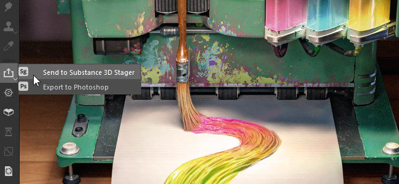
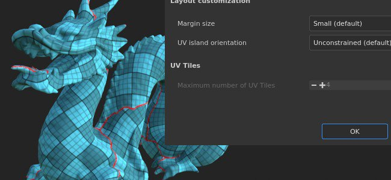
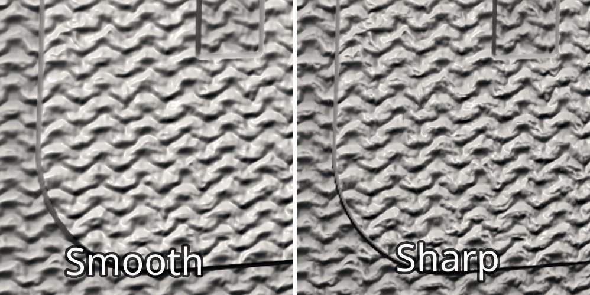

# バージョン7.2

**Substance 3D Painter 7.2**&#x200B;では、Adobe Standard Materialワークフローの新しいレンダリング機能、[Substance 3Dアプリケーション](https://www.adobe.com/jp/products/substance3d/3d-augmented-reality.html)間でのコンテンツの共有の新しい方法、および見直された「アセット」ウィンドウを利用できます。

リリース日： *23 June 2021*

## 主な機能

### 「新規アセット」ウィンドウ

古いShelfウィンドウが改良され、 Assetsウィンドウに名前が変更されました。 この再設計では、新しい専用アイコンを使用して、コンテンツにすばやくアクセスし、簡単にフィルタリングできるようにすることに重点を置いています。 また、ブレッドクラムと簡単なナビゲーションシステムが付属しています。 この再設計では、アプリケーション間でコンテンツをより簡単に管理できるように、他のSubstance 3Dソフトウェアと同じような操作性を実現することにも重点を置いています。

>[!NOTE]
>
> このリリースでは、アプリケーションの環境設定とシェルフ/アセットコンテンツの管理方法に変更が加えられました。 データの移行方法については、[専用ページ](../../pipeline-and-integration/resource-management/preferences-and-content-migration.md)をご覧ください。

* **新しいデザインとレイアウト**\
  新しいデザインでは、シンプルさに重点を置いていますが、ウィンドウの構成も簡単になっています。 スペースを無駄にすることなくウィンドウを垂直方向にドッキングできるようになりました。 新しい「リスト」表示モードでは、アセットを名前で簡単に検索できます。

  

* **新しいブレッドクラムナビゲーション**\
  小さなUIでは、ナビゲーションリソースが難しい場合があります。 ブレッドクラムでは、完全なフォルダー階層を表示することなく、フォルダー間を簡単に移動できるようになりました。

  

* **新しい使用状況フィルター**\
  「アセット」ウィンドウには多くの異なるコンテンツがあり、特定のリソースを分離してコンテンツをフィルタリングするのに便利な使用方法です。 特定の使用方法を選択するには、専用ボタンをクリックします。 複数の使用状況を追加または削除するには、[Ctrl]を押しながらボタンをクリックします。

  

* **改善されたサムネールレンダリング**\
  サムネール作成システムの画質を高めて、Substance 3Dエコシステム全体でサムネールの見た目が一貫するようにするために、時間をかけて再調整しました。 また、ディスプレイスメントのサポートも追加されました。

  {width="500px"}

* **Substanceアーカイブ(sbsar)からサムネイルを読み込んでいます**\
  Substanceファイル内に埋め込まれたカスタムサムネールが読み込まれず、アセットウィンドウに表示されません。 カスタムアイコンのリソースメタデータを含める必要がなくなったため、カスタムリソースの共有がより簡単になりました。

* **パフォーマンスの向上**&#x200B;サムネールの読み込みと生成時間はいくつかの面で改善され、はるかに高速になりました。

* **プレビューのメモリ割り当てを増やしてサムネイルを読み込む**\
  デフォルトでは、パフォーマンスを節約するために、サムネールの表示に限られた量のメモリが割り当てられます。 しかし、多くのリソースを持つライブラリを使用すると、サムネールの読み込みとアンロードが常に行われるため、リソースのナビゲーションと検索が困難になる可能性があります。 既定の予算値を上書きする新しい[環境変数](../../pipeline-and-integration/configuration/environment-variables.md)が追加されました。

### 新しいAdobe Standardマテリアルワークフロー

**Adobe Standard Material** (ASM)という名前の新しいシェーダが追加されました。このシェーダは複数の機能を同時にサポートし、単一のテクスチャセット内により複雑で正確なマテリアルを構築することができます。 この新しいシェーダを使用して、新しいチャンネルを追加し、マテリアルの作成も簡単になりました。

* **新しいAdobe Standard Materialシェーダー**\
  新しいASMシェーダは、いくつかの機能とPBRレンダリングの進化を再編成するシェーダです。 同時に次の機能をサポートします。
  * **異方性**
  * **クリアコート**
  * **光沢**
  * **Specular edge color**
  * **追加のサブサーフェススキャタリング方法**
  * もちろん、パララックスオクルージョン、ディスプレイスメントなどのその他の既存の機能。

* **新しいチャネルとユーザーチャネル**\
  新しいASMシェーダをサポートするために、新しいチャネルが追加されました。 また、ユーザチャンネルの数を2倍にして、カスタム情報とカスタムシェーダの可能性を広げました。
  * コートカラー
  * コートラフネス
  * コート法線
  * コートの不透明度
  * コートのスペキュラレベル
  * 散乱カラー
  * 光沢カラー
  * 光沢のラフネス
  * 光沢の不透明度
  * スペキュラエッジのカラー
  * 8 ～ 15のユーザーチャンネル

* **改善されたテクスチャセット設定**\
  Texture Set設定のチャンネルリストメニューで、カレントシェーダとの互換性に基づいてチャンネルがグループ化されるようになりました。 これにより、ビューポートでエフェクトを適用するチャンネルを識別しやすくなります。

  

* **可視ifおよび再コンパイルを伴う新しいシェーダー API機能**\
  ASMシェーダの開発により、APIに次の2つの重要な機能が加えられました。
  * **Visible If**:シェーダーパラメーターは、条件に基づいて表示または非表示にできるため、シェーダーUIが読みやすくなります。
  * **再コンパイル**:パラメーターを特定の方法で宣言することにより、シェーダーの一部を無効にし、パラメーターが変更されたときに再コンパイルして最適化できるようになりました。 これにより、未使用の機能を破棄できます。

### 新しいSubstance 3Dエコシステムの交換

Substance 3Dアプリケーション間でのリソースやアセットの送信が、ワンクリックで簡単にアクセスできるようになりました。 Substance 3D DesignerやSubstance 3D SamplerからSubstanceファイルを受け取ったり、プロジェクトをSubstance 3D Stagerに簡単に送ったりして、コンテンツを素早く繰り返し処理できるようになりました。

>[!WARNING]
>
> この送受信機能は、Creative Cloudデスクトップ版でのみ利用できます。 つまり、SteamまたはSubstance 3Dのスタンドアロンバージョンでは、これらの機能はサポートされていません。

* **StagerにPainter**\
  更新された書き出しプリセットを使用して、PainterからStagerに書き出すか、**Substance 3D Stagerに送信**&#x200B;アクションを使用して、現在のプロジェクトを自動的に書き出してStagerに読み込みます。 手動設定は必要ありません。

* **PainterへのStager**\
  Stagerからモデルを受け取り、Stagerから直接1回のクリック操作で同様のテクスチャを作成します。

* **DesignerまたはSamplerからPainter**\
  DesignerまたはSamplerから直接、Substanceのマテリアルやフィルターなどをワンクリックでアセットウィンドウに取り込むことができます。

* **PainterへのSubstance 3D Assets**\
  Substanceの素材などのコンテンツを、Creative CloudデスクトップからPainterの「アセット」ウィンドウに直接取り込みます。

* **Bridgeで表示**\
  Adobe Bridgeが管理するライブラリにある「アセット」ウィンドウのリソースは、特定のリソース上の右クリックメニューを使用してBridgeで直接開くことができます。

### 新規コンテンツ

このリリースで新しいコンテンツが追加されました。

* **Adobeスタンドマテリアル(ASM)用の新しいプロジェクトテンプレート**\
  新しいASMシェーダの使用を開始しやすくするために、新しいプロジェクトテンプレートが作成され、プロジェクトの作成が高速化されています。
  * ASM - PBRメタリックの粗さ
  * ASM - PBRメタリックの粗さの異方性角度
  * ASM - PBR Metallic Roughness Coated
  * ASM - PBRメタリックの粗さSSS
  * ASM - PBRメタリックの粗さ光沢

* **新しい環境マップ**\
  プロジェクトに光を当てるために、新しいAssetsサムネールのレンダリングに使用するStudio 06など、いくつかの新しい環境マップが追加されました。
  * 内部：
    * アトリエ
  * スタジオ：
    * スタジオ 06
    * スタジオ80sホラーフリックA
    * スタジオ黒ソフト
    * スタジオ白ソフト
    * スタジオ白アンブレラ

### UVの自動アンラップ機能の向上

自動UVアンラップの新しいアップデートが追加されました。これにより、UVタイルのサポートとUV生成の追加コントロールが可能になります。

* **UVタイル量**\
  UVを生成するときに、作成するUVタイルの最大数を指定できるようになりました。 これにより、UVタイルワークフローでUV生成を使用することもできます。

* **UV アイランドの向き**\
  新しいパラメータが追加され、パック時にUV アイランド方向に拘束が追加されました。 これにより、UV アイランドの位置を少し揃えて、一部のオブジェクトにテクスチャを簡単に適用できるようになります（例：木目パターンを揃えるための木目のドア）。

* **パッキングのパフォーマンスの向上**\
  新しいUVタイルのサポートにより、パッキング機能が向上し、良好なパフォーマンスを提供します。

### 全般的な改善

この新しいバージョンでは、生活の質がいくつか向上しています。

* **グラフィックタブレットのペンを使用したスライダーパフォーマンスの向上**\
  ペンを使用してスライダーをドラッグすると、反応が大幅に向上します。 スライダーの動きにくくなりました。

* **既にペイントされているレイヤーでのパフォーマンスの向上**\
  既存のブラシストロークを多く使用してレイヤーでペイントすると、処理速度が大幅に向上し、これ以上速度が低下しなくなりました。

* **プロジェクトを開いた後のペイントの高速化**\
  プロジェクトを開いた直後にレイヤースタックの先頭にあるレイヤーにペイントできるようになりました。 エンジンキャッシュの計算は後に延期され、この状況では古いプロジェクトの再編集が少し速くなりました。

* **シャープ（標準）メソッド**\
  Texture Set設定に新しいHeightから法線へのメソッドパラメータが追加され、Heightチャンネルを法線マップに変換する方法を制御できるようになりました。 この新しいパラメータは、布地のマテリアルなど、さまざまなディテールを含むサーフェスの品質を向上させるのに役立ちます。

  {width="450px"}

* **新しいインターフェイススタイル**\
  一般的なインターフェイスは、一般的なSubstance 3Dエコシステムに合うように少し調整されています。 これにより、あるアプリケーションから別のアプリケーションにジャンプしても、驚きがなく、簡単に移動できます。

* **新しい翻訳**\
  プログラムのインタフェースを翻訳するために、次の3つの新しい言語が追加されました。
  * Français
  * Deutsch
  * 簡体字中国語

## リリースノート

### 7.2.0

*（2021年6月23日リリース）*\
概要： **メジャーリリース。アセットパネルのアップデート、新しいチャンネルおよびパラメーターへのアクセスを可能にする新しいシェーダー、UIの全体的な更新、非常に要求されたパフォーマンスの向上、言語サポートの拡張などが提供されます。**

**追加：**

* [ライブラリ]シェルフを交換するための新しいアセットパネル
* [ライブラリ][UI]新しいアセットパネルのレイアウト
* [ライブラリ][UI]アセットパネルのデフォルトの向きとUIを変更する
* [ライブラリ][UI]ライブラリにリスト表示オプションを導入
* [ライブラリ][UI]アセットパネルの新しいブレッドクラムナビゲーション
* [ライブラリ][UI]保存された検索を選択するときに、「すべてのライブラリ」を選択する
* [ライブラリ][UI]すべてのフォルダーの選択が解除されている場合は、「すべてのライブラリ」を選択する
* [ライブラリ][UI]パーティクルブラシ用の新しいタグ
* [ライブラリ][UI]アプリ全体で「shelf」が「すべてのライブラリ」に置き換えられました
* [ライブラリ][UI]空のフォルダーを非表示にできます
* [ライブラリ][UI]デフォルトのユーザーライブラリは、空でも表示される必要があります
* [ライブラリ][UI]アセットタイプアイコンを使用した新しいフィルタリング方法
* [ライブラリ]複数のアセットタイプを選択するには、ショートカット「CTRL」を押します。
* [ライブラリ]アセットプレビューのメモリ予算を制御する新しい環境変数
* [ライブラリ][コンテンツ]新しい環境マップ
* [ライブラリ][コンテンツ][UI]既定のマテリアルのレンダリングディスプレイスメント
* [ライブラリ][コンテンツ]プレビュー生成用のデフォルトとしてAdobe Standard Material (ASM)シェーダを設定する
* [ライブラリ][コンテンツ][ASM]新規ASMシェーダ用の新規プロジェクトテンプレート
* [ライブラリ][サムネイル]新しいStudio 6環境マップを使用する
* [Libraries][Thumbnail]リソース内のサムネールを生成せずに読み込みます
* [Libraries][Thumbnail]サムネールの作成にディスプレイスメントを追加
* [テクスチャセット設定]
* [テクスチャセット設定][UI]新しいHeightを通常の変換方式に公開する
* [テクスチャセット設定][UI]チャネルのUI構成の修正
* [テクスチャセット設定]ユーザチャンネルの制限を16チャンネルに上げます
* [テクスチャセット設定][UI]現在選択されているシェーダと互換性のあるチャンネルを示します
* [Shader][ASM]新しいAdobe Standard Materialシェーダ
* [シェーダ][ASM] 異方性、クリアコート、サブサーフェススキャタリング、Specular edge color、光沢のサポートが追加されました
* [Shader][ASM]デフォルトチャンネルのカラー値を変更する
* [Shader][ASM][Export]書き出しテンプレートAdobe DimensionのAdobe Substance 3D Stagerへの更新
* [Shader][ASM]シェーダおよびMDLパラメータ用にラベルとツールチップを追加しました
* [Shader][ASM] SSSがサポートされていない場合でも、2Dビューで散乱カラーを表示します
* [Shader][ASM][Iray]新しいMDLでIrayのASMシェーダをサポートします
* [Shader][ASM][Iray]更新されたサブサーフェススキャッタリングは、従来のPBR spec gloss &amp; coatedで更新されました
* [Shader][ASM][Content]サンプルのデフォルトのSSSタイプを変更しました
* [Shader][ASM] ASM APIの追加ドキュメント
* [Shader][ASM]未使用のチャンネルを無視するようにシェーダを最適化する
* [シェーダ]新しいテクスチャセットチャンネルを表示する
* [シェーダ]改良されたサブサーフェススキャタリング
* [Shader]一部のシェーダ用に新しいシェーダパラメータが追加されました
* [シェーダ]シェーダパラメータの場合に表示されます
* [パフォーマンス]
* [ライブラリ]リソースプレビューの読み込み時間と計算パフォーマンスの向上
* [エンジン]ペイントパフォーマンスの向上
* [自動アンラップ] パッキングのパフォーマンスの向上
* [自動ラップ解除]
* [自動アンラップ] UVタイルワークフローと互換性のある自動アンラップ
* [自動ラップ解除]メッシュの方向に従ってUVを配置する新しいオプション
* [その他]
* [設定]デフォルトのズーム方向を変更しました
* [UI] UIの全体的な更新
* [UI]ヘルプメニューのリワーク
* [UI]反転アイコンを置換
* [UI][プラグイン]プラグインdccリンクの置換アイコン
* [UI][AMD]最低限必要なバージョンとポップアップメッセージをアップデートします
* [レイヤスタック]選択した空のフォルダ内に新しいレイヤを作成する
* Pythonドキュメントを更新する
* [ブランディング]
* [Branding][UI]アプリケーション名がAdobe Substance 3D Painterに更新されました
* [Branding][UI]スタンドアロン版を「Substance版」に更新しました
* [Branding][UI]アプリケーションの実行可能ファイル名、インストールパス、パッケージ、およびアイコンを更新しました
* [Branding][UI]デフォルトライブラリとパスの名前を変更しました
* [Branding][UI]ウィンドウの更新
* [ブランディング][UI]ようこそ画面の更新
* [Branding][UI]年ベースのバージョン番号を削除
* [ローカリゼーション]ドイツ語、フランス語、簡体字中国語の新規翻訳
* [相互運用性] SteamおよびSubstanceエディションでは使用できません
* [相互運用性] Adobeエコシステムとの相互運用性：Designer、Sampler、Stager、Bridge
* [相互運用性][UI] Designerからのアセットの受信と更新
* [相互運用性][UI] Samplerからアセットを受信
* [相互運用性][UI]アセットをStagerに送信
* [相互運用性][UI] Adobe Bridgeで表示
* [相互運用性][UI] Adobe 3Dアセットにすばやくアクセスできます
* [相互運用性] sbsarの新しい使用タグ
* [相互運用性]受信したアセットの種類を処理します
* [相互運用性] Adobe Substance 3D DesignerまたはAdobe Substance 3D Samplerから受信したアセットは、ユーザーが選択したデフォルトのライブラリに保存されます
* [相互運用性][UI]左ツールバーにStagerまたはPhotoshopに送る新しいアイコンが表示される

**修正済み：**

* [タブレット]筆圧でペイントするとパフォーマンスが低下する
* [タブレット]スライダーコントロールを持つタブレットでの問題
* [クラッシュ]テクスチャセットリストとエクスポータの名前が一致しない
* [クラッシュ][ライブラリ]サブライブラリをダブルクリック
* [ライブラリ]ライブラリディレクトリをクロールする際の問題
* [ライブラリ]強制プレビュー生成のコマンドラインが想定どおりに機能しない
* [ライブラリ][コンテンツ]ベイクライト環境フィルターはデフォルトで黒です
* [Linux][MacOS][メッシュを書き出し] Linux/MacOSで作成したglTFを読み込めない
* [Linux]アセットパネルにファイルをドラッグ&amp;ドロップすると、クラッシュする場合がある
* [自動アンラップ]メッシュが再読み込み用に選択されていない場合でも、[自動アンラップ]を使用できます
* [パーティクル]重力に伴うパーティクルの動作が正しくない
* [レイヤースタック]レベルヒストグラムでは、一部のチャンネルでのみ輝度を使用できます
* [ジオメトリマスク]ジオメトリマスクの編集時にフォルダ上で右クリックメニューが機能しない
* [プロジェクション] 球面投影法とバイリニアフィルタリングを使用したシーム
* [UVタイル]マスクをファイルに書き出しすると、タイル0、0のみが書き出される
* [メッシュをエクスポート] FBXメッシュのエクスポートが空です
* [Ray]新規プロジェクトでレンダリング時に法線マップが考慮されない
* [保存]共有ドライブの保存の問題
* [ベイク処理]メッシュを修正したパラメータで再ベイク処理すると、警告が表示される
* [ベイク処理][回帰]ハイポリゴンメッシュのグローバルバウンディングボックスにシーンの原点が含まれていないと、正しい結果が得られない
* [Python]カスタムユーザーライブラリが考慮されない

**既知の問題：**

* [ライブラリ]プロジェクトを開かないと、保存した検索が保存されない
* [NVIDIA]ドライバーが最新であっても、古いドライバーに関するメッセージが表示される
