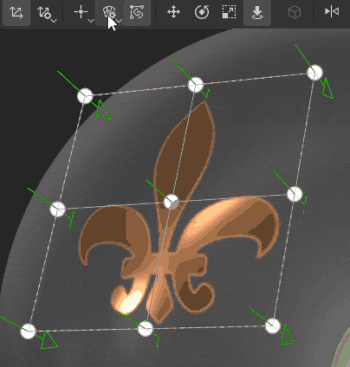

# バージョン7.3

**Substance 3D Painter 7.3**&#x200B;では、塗りつぶしレイヤーの新しいワープと円柱の投影により、メッシュに新しいテクスチャリング機能が追加されました。

リリース日： *13 October 2021*

## 主な機能

### 新しいワープ投影

このリリースでは、塗りつぶしレイヤーおよび塗りつぶしエフェクト用の新しい3Dワープ投影が導入されています。 この投影により、変形グリッドと制御可能なポイントを使用して、テクスチャやイメージを変形させることができます。

* **ドラッグアンドドロップによるクイック設定**&#x200B;アセットライブラリからマテリアル、アルファ、テクスチャ、または手続きを選択し、メッシュの目的の部分にドラッグアンドドロップします（マテリアルに必要なショートカット&#x200B;**ALT**）。 アセットがマテリアルでない場合は、割り当て先のチャネルを問い合わせるポップアップが表示されます。\
  レイヤーを作成すると、新しい&#x200B;*ワープ投影*&#x200B;が自動的に選択されます。 このレイヤーには、標準の3Dプロジェクションモードコントロールに加え、ワーププロジェクションの深度を設定できる新しいパラメーター&#x200B;*プロジェクション深度*&#x200B;があります（視覚的なキューとして緑色の矢印で表されます）。\
  この投影モードは、アセットをビューポートにドラッグ&amp;ドロップせずに、塗りつぶしレイヤーまたはエフェクトに手動で選択することもできます。

  

* **サーフェスツールを使用した自動配置**&#x200B;新しいワープレイヤーを作成すると、サーフェスツールが自動的に選択されます。 これにより、イメージを移動して、イメージが常にメッシュのサーフェス上に残るようにすることができます。 ただし、他のマニピュレータに切り替えて、その移動（ショートカット&#x200B;**W**）、回転（ショートカット&#x200B;**E**）、またはスケール（ショートカット&#x200B;**R**）をいつでも調整できます。 サーフェスツールに戻るには、ショートカット&#x200B;**SHIFT + W**&#x200B;を使用します。*頂点を編集*&#x200B;モードに切り替えると、サーフェスツールもデフォルトの選択になり、頂点の移動がメッシュのサーフェスにスナップされます。 ただし、**CTRLキーを押しながら**&#x200B;を押すと、サーフェスツールを一時的にすばやく上書きできます。これにより、選択したポイントをサーフェス上だけでなく、任意の方向に移動できます。

* **簡単に編集できるワープグリッド**&#x200B;画像のグローバルな配置が完了すると、ワープグリッド自体を編集して、より正確で柔軟な編集を行うことができます。 グリッド編集モードに切り替えるには、新しく追加されたワープメニューを使用するか、ショートカット&#x200B;**SHIFT + V**&#x200B;を使用します。これにより、グリッドの既存の頂点を編集できます。\
  グリッド全体を均等に分割することもできますが、頂点を移動した後は、元の位置にリセットされることに注意してください。 グリッドの分割は、新しいワープオプションメニューを使用して実行できます。\
  または、個別に配置された分割を追加して、必要な部分のみを詳細に表示することもできます。 分割を追加するには、ワープメニューの3つのオプション（横、横、縦）のいずれかを選択します。 いずれかを選択した状態で、ワープ投影上にカーソルを合わせて、その中の任意の場所をクリックすると、新しい分割が追加されます。 この操作では、既存のポイントの位置は変更されません。

  
* **頂点の方向の自動調整**&#x200B;既定値では、個々の頂点の接線はメッシュのサーフェスに合わせて調整されます。つまり、頂点をドラッグした場所に関係なく、常にメッシュに対して正しい方向を向きます。 この自動接線オプションは、コンテキストツールバーの新しいボタンを使用してオフにできます。この場合、方向は常に固定されたままになります。

  

ワーププロジェクションの設定とプロパティの詳細については、[専用のドキュメントページ](../../painting/fill-projections/warp-projection.md)を参照してください。

### 新しい円柱プロジェクション

このリリースでは、塗りつぶしレイヤーおよび塗りつぶしエフェクトに円柱投影法が追加されています。 新しい投影では、柱や柱などのオブジェクトの周囲にイメージやテクスチャを合わせたり、キャラクターの腕のような有機的なシェイプを作成したりできます。

* **メッシュの周りに画像を回り込ませる**\
  塗りつぶしレイヤーまたは塗りつぶしエフェクトを使用し、「投影」ドロップダウンで「*円筒投影*」を選択すると、円柱サーフェスの周囲に画像を簡単に回り込ませることができます。 投影ギズモの外側で画像を繰り返す必要がない場合は、画像が枠からはみ出さないように、*シェイプの切り抜き*&#x200B;で&#x200B;*UVラッピング*&#x200B;と&#x200B;*シェイプに切り抜き*&#x200B;に対して&#x200B;*なし*&#x200B;を選択する必要があります。 次に、マニピュレータを使用して投影を目的の位置に調整します。

* **投影角度を調整する**\
  画像を配置したら、新しい角度設定を使用できます。 この設定を使用すると、イメージを円柱シェイプの周囲に完全に投影するか、特定の角度に制限するかを調整できます。 画像を切り抜くのではなく、幅を縮小します。

  

詳細については、[専用のドキュメントページ](../../painting/fill-projections/cylindrical-projection.md)を参照してください。

### カラーピッカーの改善

このリリースでは、カラーピッカーのQOLが向上しました。

* **新しいウィンドウレイアウト**\
  Samplerの最新リリースと同様に、改善されたカラーピッカーウィンドウが修正され、垂直方向のレイアウトに対応するようになりました。 現在の選択範囲と最後の選択範囲を含むメインカラーフィールド、16進数フィールド、スポイト、色相スライダー、手動RGB/HSVスライダーセクション、スウォッチの3つのセクションに分かれています。\
  

* **新しい0 ～ 255RGB値**\
  改善されたカラーピッカーでは、従来のカラー値の入力方法に加えて、RGB値0 ～ 255を操作できます。 このオプションは、「スライダー」セクションのドロップダウンメニューで「*浮動小数点値*」がオフになっている場合に使用できます。

  
* **カラースウォッチを保存しています**\
  カラースウォッチをPainterに保存できるようになりました。 目的のカラーを選択したら、カラーピッカーの「スウォッチ」セクションにあるプラスボタンを押すと、そのカラーをセッションやプロジェクトで使用することができます。 スウォッチをクリアするには、スウォッチを右クリックします。または、このセクションのドロップダウンメニューから、すべてのスウォッチを一度に一括削除することもできます。 保存できるスウォッチの数に制限はありません。

  
* **カラーピッカーウィンドウを開いたままにする**\
  カラーピッカーウィンドウは、画面上でも任意の場所に移動および配置できるようになりました。また、コンテキストスイッチがない限り、ウィンドウは開いたままになっています。つまり、ハンドペイントのテクスチャのペイントレイヤーを切り替えているときに、カラーピッカーウィンドウを開いたままにすることで、簡単にアクセスできます。

  

* **よりアクセシブルなスポイト**\
  カラーピッカーのスポイトツールはカラーフィールドのすぐ横に表示されていますが、カラーピッカー内にも表示されています。 よりアクセシブルなスポイトは、以前のすべての機能を保持します。クリックしたままにすると、画面上の任意の場所でカラーを選択できます。 この露光量のスポイトは、レイヤーチャンネルだけでなく、Painterのすべてのカラーフィールドの横にあります。

  

詳細については、[専用のドキュメントページ](../../interface/color-picker.md)を参照してください。

### その他の機能と改善

* **アセットのドラッグ&amp;ドロップの改善**\
  ワープの導入により、ALTを維持したままアセットをライブラリからビューポートにドラッグ&amp;ドロップできるデカール機能が再加工されました。 これで、デカールをこのように作成すると、平面投影ではなくワープ投影が使用されます。 ワープ投影の自動選択により、メッシュ上のデカール調整の速度と効率が向上します。\
  さらに、マテリアルだけでなく、画像タイプのアセットをビューポートにドラッグ&amp;ドロップできるようになりました。 アルファ、テクスチャ、プロシージャを選択する場合は、[Alt]モディファイヤを使用する必要はありません。 これをメッシュにドロップすると、この画像をマスクまたはレイヤーのチャンネルの中で使用するかどうかを選択するオプションを表示するメニューが表示されます。

  

* **自動保存プラグインの向上**\
  自動保存は、メッシュの再読み込み、ベイク処理、書き出しなどの長時間または激しい操作中にトリガーされなくなりました。

* **パフォーマンスの向上**\
  スライダー操作とペイントパフォーマンスのメンテナンスと最適化を行いました。

* **Python APIの新しい関数**\
  Python APIでは、メッシュの再ロード、リソースの更新、スクリプトによるUVタイルの解像度の設定とクエリが可能になる最近の機能が追加されました。

* **Substanceエンジンの更新プログラム8.3.0**\
  このSubstanceエンジンのアップデートでは、いくつかの修正と一般的な機能強化に加え、新しいグラフの種類が考慮されるようになりました。 また、.sbsarファイルのバージョンを確認することもできます。これにより、適切なSubstance 3D Assetsバージョンの使用およびダウンロードが容易になります。

* **CCデスクトップからSubstance 3D Assetsを受信しています**\
  マテリアル、アトラス、デカールなどのSubstance 3D Assetsに、CCデスクトップアプリからアクセスできるようになりました。 また、Painterの図書館に直接送ることもできます。

## リリースノート

### 7.3.0

*（2021年8月13日リリース）*\
概要： **メジャーリリース。 これには、新しい3Dワープ投影、新しい円筒投影、カラーピッカーの改善、Python APIの新しい機能、バグ修正**&#x200B;が含まれています

**追加：**

* [プロジェクション][ワープ]新しい投影モードとして3Dワープを公開します
* [プロジェクション][ワープ]ビューポートにドラッグ&amp;ドロップすると、Alpha、テクスチャ、プロシージャのデカールモードが可能になります
* [プロジェクション][ワープ]デカールショートカットでワープ投影を使用(ALT)
* [プロジェクション][ワープ][ツールバー]ワープを全体または頂点ごとに変形
* [プロジェクション][ワープ][ツールバー]ワープを分割したグリッドポイントを、横方向、縦方向、または横方向に追加します
* [プロジェクション][ワープ][ツールバー]リセットアクション専用メニュー
* [プロジェクション][ワープ][ツールバー]ポイントの移動時に接線を自動調整するオプション
* [プロジェクション][ワープ][ツールバー]グリッド版専用メニュー（サイズ、リセット、カラー、ハンドルサイズ）
* [プロジェクション][ワープ]全頂点ワープ編集モードを切り替えるための新しいキーボードショートカット(SHIFT+V)
* [プロジェクション][ワープ] Click + Ctrlを押すと、サーフェスツールと他のツールを切り替えることができます
* [投影][円柱]円柱投影モードを表示します
* [プロジェクション][ツールバー]マニピュレータ設定をグループ化する（サイズ、グリッドステップ、角度ステップ）
* [カラーピッカー]新しいカラーピッカーUI
* [カラーピッカー]カラーピッカーウィジェットでsRGB値を使用する
* [カラーピッカー]カラースウォッチの保存と削除を許可する
* [カラーピッカー]カラースロットと標準スロットからアクセスできるスポイト
* [カラーピッカー] 0 ～ 255の値のダイナミックカラーを編集できます
* [カラーピッカー] HSV/RGBのステートをアプリ全体で共通にする
* [カラーピッカー]カラーピッカーウィンドウが半固定されます
* [カラーピッカー] Escキーを押してカラーピッカーウィンドウを閉じる
* UIの操作とペイント中のパフォーマンスが向上しました
* [Engine]新しいSubstanceエンジンバージョン(8.3.0)へのアップデート
* [スクリプティング][Python]現在のプロジェクトのメッシュを再ロードできます
* [Scripting][Python]プロジェクト内のリソースを更新できます
* [スクリプト][Python] UVタイルの解像度を設定およびクエリできます。
* [相互運用性] SteamおよびSubstanceエディションでは使用できません
* [相互運用性] Bridgeから複数のリソースを受信する

**修正済み：**

* カラーピッカーに適切なカラーが表示されない
* [ベイク]テクスチャセットリストが正しく並べられていない
* [FBXインポート] 3ds Maxグループのピボット変換は考慮されません
* [Substance engine]破損したSBSARの読み込みでクラッシュする
* [MacOS]異なる言語のプロジェクト設定オプションが存在しません
* 自動保存により、長時間プロセス中にPainterがフリーズすることがある

**既知の問題：**

* [プロジェクション][ワープ]分割が完了した後も、「分割」オプションが選択されたままになる
* [プロジェクション][ワープ]変換がワールド空間に設定されていると、フリップが機能しない
* [プロジェクション][ワープ]パッチ間のアーチファクトの線まれに生じる
* [プロジェクション][UV]投影をフリップすると、ピボットポイントがリセットされる
* [Mac M1]スマートマテリアルが正しく表示されない
* [M1][回帰]材料のレイヤーが機能しない
