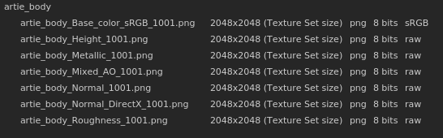
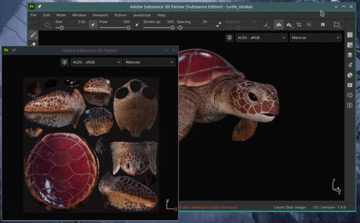

# バージョン7.4

**Substance 3D Painter 7.4**&#x200B;では、新しいカラーマネジメントワークフローにより、OpenColorIOのサポートが追加されました。

リリース日： *24 November 2021*

## 主な機能

### 新しいカラーマネジメント

このバージョンでは、[OpenColorIO](https://opencolorio.org/) （略語はOCIO）バージョン2をサポートするカラーマネジメントが導入されています。

この新しいワークフローにより、読み込みから書き出しまで、またビューポート内でも、カラーの管理と調整が可能になり、異なるアプリケーション間で任意のコンテンツをより簡単に一致させることができます。

* **プロジェクト設定**\
  新規プロジェクトの作成時に、カラーマネジメントを有効にできるようになりました。 既存のプロジェクトでは、プロジェクト設定を使用してカラーマネジメントを有効にすることもできます。\
  カラーマネジメントを有効にするには、**従来** （既定）から&#x200B;**OpenColorIO**&#x200B;に切り替え、既定の構成またはカスタムの構成のいずれかを使用します。

  {width="400px"}

* **ビューポート表示設定**\
  2Dビューと3Dビューの上部には、カラーマネジメント用の2つのコントロールがあります。\
  **色ボタン**:ビューポートの色変換を有効または無効にします。\
  **変形ドロップダウンを表示**：色の変換に使用する表示変形を選択します。

  {width="500px"}

* **カラーピッカーの設定**\
  カラーマネジメントが有効になっている場合、カラーピッカーには新しいコントロールが表示されます。 カラーは、設定で指定された作業用カラースペースで編集されます。\
  HSV/RGBスライダの下には、作業用スペースから表示カラースペースに変換された最終的なカラー値が表示されます。

  

  

* **カスタムカラースペースを使用したビットマップとSubstanceマテリアルの読み込み**\
  Substanceマテリアルの出力の解釈など、リソースの処理方法を指定するための専用の設定が利用できます。\
  ファイル名を解析することで、リソースがどのカラースペースを使用しているかを知ることもできます。

  

* **設定の書き出し**\
  テクスチャを書き出すと、カラーマネジメントされたチャンネルのファイル名に、新しいキーワード&#x200B;**$colorSpace**&#x200B;で使用したカラースペースの名前が表示されます。

  {width="250px"}

  

>[!NOTE]
>
> アプリケーション内でのカラーマネジメントの仕組みについて詳しくは、[専用ページ](../../features/color-management/color-management.md)を参照してください。

### 2Dおよび3Dビューポートのドッキング解除を新規作成

2Dおよび3Dビューをドッキング解除して、他の場所に移動できるようになりました。 例えば、3Dビューをメイン画面に表示し、2Dビューを別の画面に表示します。

ドッキングされていないビューを使用すると、アプリケーションのレイアウトを整理したり、ペイント領域を広げすぎることなくオブジェクトに注意を向けたりすることが容易になります。

* **ビューのドッキングを解除する**\
  ビューのドッキングを解除するには、ビューメニューを開き、2つのオプションのいずれかを選択します。 各オプションでは、新しいウィンドウが開き、そのビューが内側に表示されます。もう1つのビューはメインインターフェイス内にドッキングされたままになります。

  

* **ドッキングされていないビューでも入れ替える**\
  ビューのドッキングが解除されている間は、表示メニューのスワップアクションを使用して交換できます。

  {width="500px"}

* **カラーマネジメントと互換性があります**\
  ドッキングされていないビューには独自のカラーマネジメント表示変換があるため、さまざまなモニターでの管理が容易になります。

  {width="500px"}

### 3DconnectionによるSpaceMouse®の新しいサポート

**SpaceMouse®**&#x200B;は、3Dビューポートカメラをより直感的で使いやすい方法で操作できる3Dconnectionのデバイスです。 このリリースでは、Painterを使用してネイティブかつ直接プラグアンドプレイできるようになりました。

詳細については、専用の[ドキュメントページ](../../features/spacemouse-by-3dconnexion.md)を参照してください。

>[!NOTE]
>
> * バージョン7.4.2以降で利用可能です。
> * Painterの制御方式を利用するには、最新のSpaceMouse®ドライバをインストールしてください。

### 新規コンテンツ

アプリケーションで使用可能なデフォルトのコンテンツに、新しいアセットのセットが追加されました。

* 新しいデカール、ツールプリセット、フィルター（**Käy Vriend**&#x200B;による） :
  * **デカール**
    * 単純瘢痕
    * ポケットパッチレギュラー
  * **プリセット**
    * ジッパー詳細テープ
    * ジッパーの拡張停止
    * ジッパーの詳細スライダー
    * 締め付けコードレース
    * 引き締め付け用コード付きアイレット
    * グリッタースターズゴールデン
    * 派手なパーティー
    * パステル画（ドット）
  * **Generator**
    * 縮小/折り返しを膨張

* 新しい経年劣化ビットマップ（**エミールセレガー**&#x200B;による）:
  * 経年劣化プラスター塗料
  * 色あせた経年劣化プラスター
  * 剥がした経年劣化塗料
  * 経年劣化湿度
  * 経年劣化綿毛
  * 経年劣化くもの
  * 経年劣化ブッシュ
  * ソフトな経年劣化ウッド
  * 経年劣化用紙が裂けている
  * 深裂経年劣化
  * 経年劣化ブラシDust

### 自動UVアンラップの改善

自動UVアンラップが、拡張サーフェスを使用した3Dモデルのサポートを改善する新しいオプションで更新されました。

**細長いUV アイランドを避ける**&#x200B;という名前のこの新しい設定は、長すぎる可能性があるUV アイランドを分割することで、UV空間をより有効に活用します。

以下に、この新しい設定を使用せずに使用した場合と使用せずに使用した場合の例を示します。

{width="500px"}

### 改善されたPythonスクリプティング

Python APIには、Javascript APIを呼び出すことができる新しいメソッドがあります。

この新しいメソッドを使用すると、古いプラグインを新しいPython APIに簡単に移行できます。 また、Pythonでまだ公開されていない&#x200B;**ベイク**&#x200B;および&#x200B;**シェーダ**&#x200B;管理などの一部の機能もロック解除されます。

PythonからJavascriptコマンドを実行するには、新しい&#x200B;**js**&#x200B;サブモジュールから&#x200B;**evaluate()**&#x200B;関数を使用します。 詳しくは、APIドキュメントを参照してください（アプリケーションのヘルプメニューから入手可能）。

## リリースノート

### 7.4.2

*（2022年3月8日公開）*

**追加：**

* [SpaceMouse]&#x200B;[Windows]ナビゲーション用の3Dビューポートでの3Dconnection SpaceMouseのサポート
* [SpaceMouse]&#x200B;[Windows] 3DビューポートのProおよびEnterprise SpaceMouseモデルの基本的なショートカット/キー
* [SpaceMouse]&#x200B;[Windows] 3Dビューポートの専用回転中心アイコン
* [カラーマネジメント] OCIO設定の役割を使用してデフォルト設定を変更する
* [カラーマネジメント]カラーウィジェットのプロパティウィンドウのカラーマネジメント
* [カラーマネジメント]カラーマネジメントは、マテリアルプレビューのプロパティウィンドウを管理します
* [カラーマネジメント]カラーピッカーのカラーマネジメントスウォッチ
* [カラーマネジメント]標準のsRGBカラースペースを定義する設定を追加します
* [カラーマネジメント]カラーピッカーの表示セレクターリストで、OCIO設定から標準のsRGBカラースペースを追加します
* [カラーマネジメント]カラースペース上書きメニューの改善
* [カラーマネジメント]表示設定で環境マップのカラースペースを上書きできるようにします
* [カラーマネジメント]現在の表示に基づいてカラーピッカーグラデーションを描画します
* [カラーマネジメント]カラーエディターのデフォルトでHDR値を固定
* [カラーマネジメント]レガシーモードのフィルターにパススルーを使用（カラースペースなし）
* [カラーマネジメント]カラーエディターのグラデーション表示を[0 ～ 1]の範囲に一致するように制限します
* [カラーマネジメント]レガシーモードのカラーピッカーで表示セレクターを非表示にする
* [カラーマネジメント]カラーピッカーの16進フィールドを常にsRGBカラースペースで作成します
* [カラーマネジメント]データチャンネルのカラーピッカー表示ドロップダウンを無効にする
* [最適化]ワープグリッドは、カバーされたUVタイルのみを再計算します
* [書き出し] Sketchfab、USD、およびglTFのUVタイルプロジェクトの書き出しを許可
* [Scripting]&#x200B;[Python] tonemapping関数を変更できます

**修正済み：**

* [Sketchfab]既存のモデルを更新すると新しいモデルが作成される
* [Sketchfab]以前に更新されたモデルを検索するとクラッシュする
* USDに書き出すとクラッシュする
* ジオメトリマスクで新しいシェーダインスタンスを作成するとき、またはジオメトリが非表示になっているときにクラッシュする
* [アセットを読み込みウィンドウ]読み込まれたリソースの種類を変更するとクラッシュする
* 法線メッシュマップをレイヤスタックで使用すると、反転されます
* [Substance]ユーザーデータ描画モードが考慮されない
* [カラーマネジメント]ファイル名にカラースペースを含むビットマップは、UVタイルシーケンスとして読み込まれます
* [カラーマネジメント]Substanceグラフのカラーマネジメントされた出力が間違ったカラースペースにあります
* [カラーマネジメント]ポリゴン塗りつぶしツールが間違ったカラーを表示する
* [カラーマネジメント] ACESトーンマッパーがソロモードのチャンネルに適用される
* [カラーマネジメント]ツールプレビューの球体照明がカラーマネジメントされない
* [カラーマネジメント]&#x200B;[書き出し]変換されたマップが正しく変換されない
* [スクリプト]&#x200B;[Python]&#x200B;[カラーマネジメント]テンプレートおよびOCIO環境変数を使用して作成されたプロジェクトは、レガシーモードになります
* [Scripting]&#x200B;[Python]起動時にJavaScriptのevaluate関数を使用できない
* [3D Adobeプラン]デフォルトでサポートされていない言語で地域の設定を使用すると、Painterを起動できない

**既知の問題：**

* 3Dconnection SpaceMouseはMacOSではサポートされていません
* [UI]水平スクロールバーとカラーマネジメントが、新しいプロジェクトウィンドウに表示されることがある
* [ベイカー] UVタイルプロジェクトでは、「平均法線」の設定は効果がありません
* [Mac M1]スマートマテリアルが正しく表示されない
* [カラーマネジメント]投影モードで使用されているリソースがオーバーレイでカラーマネジメントされない

### 7.4.1

*（2021年12月14日公開）*

**追加：**

* [カラーマネジメント]書き出したファイル名にデータの役割を使用する
* [カラーマネジメント]新しいプロジェクトおよびプロジェクト設定ウィンドウでOCIOが選択されている場合は、デフォルトで「カラーマネジメント」セクションを展開します
* [カラーマネジメント]レガシーモードでACESトーンマッパーを追加
* [カラーマネジメント]デフォルトの構成設定の調整
* [カラーマネジメント]&#x200B;[書き出し]データチャンネルのファイル名で$colorSpaceを塗りつぶします
* [書き出し] UVタイルプロジェクトをStagerに書き出す
* [相互運用性] SteamおよびSubstanceエディションでは使用できません
* [相互運用性] UVタイルプロジェクトをStagerに送信できるようにします

**修正済み：**

* [MacOS]&#x200B;[クラッシュ] PainterがCatalinaで起動しない
* [カラーマネジメント]&#x200B;[クラッシュ]ユーザーチャンネルでデータタイプ/カラーマネジメントを操作すると、ランダムにクラッシュする
* [カラーマネジメント]マスク表示カラースペースの新規メニューでグレースケールとして使用されるリソース
* [カラーマネジメント]従来のモード+ソロ表示では、ビューポートのユーザーチャンネルが暗くなる
* [カラーマネジメント] iRayで使用する場合、環境マップは常にリニアです
* [カラーマネジメント]レガシーモードのデータチャンネルで、カラーピッカーが適切な値を選択しない
* [カラーマネジメント]レガシーモードで、カラーピッカーがSubstance内で壊れている
* [カラーマネジメント]ドロップダウンメニューを使用したときに、ビューポートでソロチャンネル表示を切り替えると、適切なカラースペースで表示される
* [カラーマネジメント]従来のモードのカラーマネジメントされたユーザーチャンネルで「書き出し」を実行すると、正しく変換されない
* 単独のビューマスクで作成したストロークが、マテリアルビューに戻ると表示されない
* [書き出し]変換されたマップが、カラーマネジメントされたチャンネルとして書き出されない
* [テクスチャセット]名前を変更したユーザチャネルで、元の名前のツールチップが表示されない
* [Steam] Steamでファイルの整合性をチェックするときに、ファイルが見つからない

**既知の問題：**

* [Mac M1]スマートマテリアルが正しく表示されない

### 7.4.0

*（2021年11月24日リリース）*

**追加：**

* [カラーマネジメント]カラーマネジメントOpenColorIOバージョン2のサポート
* [カラーマネジメント]プロジェクト設定へのカラーマネジメント設定の追加
* [カラーマネジメント]プロジェクトを開いたときにカラーマネジメント構成が変更されることに関する警告ウィンドウ
* [カラーマネジメント]無効なOCIO設定ファイルが選択された場合にエラーメッセージを表示する
* [カラーマネジメント] OCIO環境変数を使用して設定を上書きできます
* [カラーマネジメント]アプリケーションに複数のOCIO設定をデフォルトで統合
* [カラーマネジメント]読み込んだビットマップファイル名からカラースペース名を抽出します
* [カラーマネジメント]プロパティウィンドウの設定から1つのカラースペースでカラースペースを上書きできます
* [カラーマネジメント]テクスチャセット設定でカラーマネジメントオプションを追加する
* [カラーマネジメント]&#x200B;[ビューポート] 2Dビューと3Dビューを別々にカラー管理できます
* [カラーマネジメント]環境マップを作業用カラースペースに読み込んで変換します
* [カラーマネジメント]現在のカラースペースでカラーピッカーとエディターを調整
* [カラーマネジメント]新しいドロップダウンメニューを使用して、ビューポートの表示変換カラースペースを選択できます
* [カラーマネジメント] Rayレンダリング結果に表示変換を適用する
* [カラーマネジメント]異なるカラースペースを持つテクスチャの書き出し
* [カラーマネジメント]&#x200B;[Python]新しいプロジェクトに環境変数(OCIO)のカラーマネジメント設定を適用する
* [ビューポート] 2Dまたは3Dビューポートのドッキングを解除できます
* [自動ラップ解除]細長い島を避けるための新しいオプション
* [Pythonスクリプト] Python APIからJavaScript関数を呼び出す
* [新しいプロジェクトウィンドウ]読み込まれたマップのセクションを折りたたみ可能にする
* [プロジェクション]&#x200B;[ワープ]ワープ設定のオプションとして法線を非表示にできます。
* [コンテンツ] 11個の新しい経年劣化マップ
* [コンテンツ] 8つの新しいツールプリセット（ジッパー、コードの引き締め、キラキラ）
* [内容] 8つの新素材（傷跡、ポケット、...）
* [コンテンツ] 1つの新しいジェネレータ（収縮ワープを膨張）

**既知の問題：**

* [Mac M1]スマートマテリアルが正しく表示されない
* [カラーマネジメント]&#x200B;[クラッシュ]ユーザーチャンネルでデータタイプ/カラーマネジメントを操作すると、ランダムにクラッシュする
* [カラーマネジメント]レガシーモードのデータチャンネルで、カラーピッカーが適切な値を選択しない
* [カラーマネジメント]&#x200B;[IRay]ビューポートでカラーマネジメントがアクティブになっているときにレンダリングをEXRまたはTIFFで保存すると、常にリニアで保存される
* [カラーマネジメント]マスクでグレースケールとして使用されているリソースが、間違ったカラースペースメニューを表示する
* [カラーマネジメント]&#x200B;[Iray] Irayで使用する場合、環境マップは常にリニアです
* [カラーマネジメント]&#x200B;[書き出し]変換されたマップが、カラーマネジメントされたチャンネルとして書き出されない
* [カラーマネジメント]&#x200B;[書き出し]ユーザーチャンネルがカラーマネジメントされているか、レガシーモードではない場合、書き出しは無視されます
