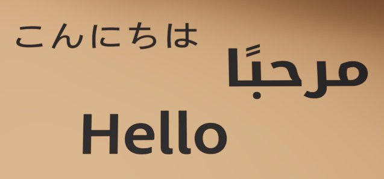
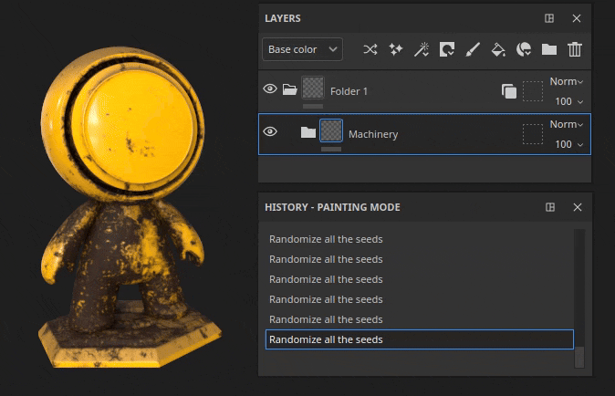
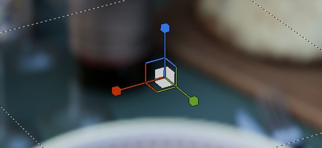
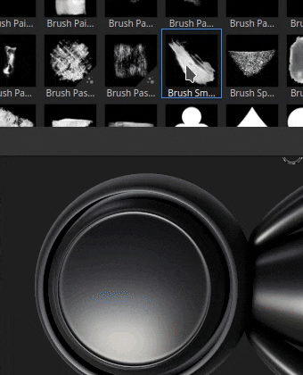

# バージョン10.0

<b>Substance 3D Painter 10.0</b>では、Illustrator(.ai)ファイルのサポート、Substance 3D Assetsの統合、テキストリソースを介したフォントの読み込み、Python APIでのレイヤースタック機能の追加が行われ、QOLが向上しました。

リリース日： *16 May 2024*

## 主な機能

### 新しいテキストリソース

この新しいバージョンでは、<b>Text resource</b>が導入されています。これは、フォントファイルを読み込んで、様々なコンテキスト（ブラシ、塗りつぶし投影法、Substance画像の入力など）でテキストを書き込むためのツールです。 テクスチャを装飾します。

* <b>アセットウィンドウでフォントを参照する</b>\
  フォントが「アセット」ウィンドウでそれぞれのフィルターの下に表示されるようになりました。 これらは、オペレーティングシステム上の異なる場所（およびライブラリからも）から収集されます。

  
* <b>他のリソースと同様にフォントをドラッグ&amp;ドロップします</b>\
  フォントは、他の種類のリソースと同様にテキストリソースとして使用できます。 ドラッグ&amp;ドロップすると、塗り潰し投影が自動的に作成されます。 また、ブラシやSubstanceフィルターへの入力としても使用できます。

  
* <b>テキストリソースパラメーター</b>\
  テキストリソースを作成するときは、いくつかのパラメーターを調整して、テキストの外観を調整できます。垂直および水平方向の整列、自動または手動サイズ、行と文字の間隔、カラーなどです。

  
* <b>幅広い文字とサポートされている機能</b>\
  テキストリソースは、右から左への書き込みと[合字](https://en.wikipedia.org/wiki/Ligature_(writing))をサポートしています。 （ラテン文字以外を書けるようにするには、互換性のあるフォントが必要です）。

  
* <b>通常のリソースなどのカスタムフォントを読み込む</b>\
  他のリソースと同様に、独自のフォントファイルをライブラリやプロジェクトに直接読み込むことができます。 一部の種類のフォントはサポートされていませんが、詳細については、この[ドキュメントページ](../technical-support/workflow-issues/shelf-issues/font-import.md)を参照してください。

>[!NOTE]
>
> <b>テキストリソース</b>の詳細については、[専用ドキュメントページ](../painting/text-resource.md)を参照してください。

### Illustratorファイル(.Ai)の新しい読み込み

<b>.svg</b>ファイルのサポートに伴い、この新しいバージョンではIllustratorファイル(<b>.ai</b>)の読み込み機能も追加されました。

* <b>Illustrator (.Ai)ファイルのサポート</b>\
  この新しいバージョンでは、Substanceiファイルを読み込んでレンダリングし、ブラシ、塗りつぶし投影法、またはSubstanceの画像入力でリソースとして使用できるようになりました。
* <b>.svgファイルと.aiファイルは共通の設定を共有</b>\
  SVGとIllustratorのドキュメントには、同様の設定が共通しています。特に、解像度、切り抜き領域、範囲選択のパラメーターが共通です。 つまり、ベクトル化リソースも同様に管理できます。

  
* <b>アートボードの選択</b>\
  Illustratorドキュメントではアートボードがサポートされています。.aiファイルを使用する場合、専用設定によって使用可能な異なるアートボードから選択することもできます。

  
* <b>スコープ選択の改善</b>\
  範囲選択ウィンドウが改善され、サムネールがサポートされるようになりました。これにより、特定の要素のみを簡単に参照して選択できます。\
  パフォーマンス上の理由から、サムネイルは既定でオフになっており、[<b>サムネイルを表示</b>]チェックボックスをオンにすると有効にできます。

  

>[!NOTE]
>
> Illustrator (<b>.ai</b>)ファイルの読み込みは現在、WindowsおよびMacOSでのみサポートされています。

### 新しいSubstance 3D Assetsの統合

Substance 3D Assets webサイトをPainter内に直接埋め込んだ新しいウィンドウが使用できるようになりました。 この統合により、独自のライブラリでリソースを簡単に直接参照およびダウンロードできます。

* <b>新しいSubstance 3D Assetsウィンドウ</b>\
  新しいドックがインターフェイスに追加され、Substance 3D Assetsを参照できるようになります。 ドックが表示されず閉じられている場合は、インターフェイスの右側にあるドッキングツールバーで再度見つけることができます。

  
* <b>マネージャーのダウンロード</b>\
  ウィンドウの左下のボタンを使用して、専用のマネージャーから現在ダウンロード中のアセットを表示できます。 ダウンロードに失敗する可能性のあるアセットは、このリストから再開できます。

  
* <b>ダウンロードしたアセットを簡単に見つける</b>\
  ウィンドウの右下にあるボタンをクリックするとメニューが開き、webサイト内の移動に役立つアクションや、アセットがダウンロードされたかどうかの表示に使用できます。

  

>[!NOTE]
>
> 初回起動時に、アセットをダウンロードするにはアカウントにログインする必要があります。 このログインは、後で使用するためにキャッシュされます。

>[!NOTE]
>
> Substance 3D AssetsドックはSteam版では使用できません。

### Python APIの新しいレイヤースタックモジュール

このリリースでは、Python APIに新しいレイヤースタックモジュールが追加されました。 このAPIを使用すると、プロジェクトのレイヤースタックを制御し、高度なレイヤースタックプラグインとカスタムツールの作成への扉を開くことができます。

* <b>新しいレイヤースタックAPI</b>\
  新しい<b>layerstack</b>モジュールを使用すると、プロジェクトのレイヤースタックを様々な方法で制御できます。 次のことが可能です。

  * 選択したレイヤーとエフェクトを照会して設定します。
  * 新しいレイヤー、フォルダー、エフェクト（フィルター、アンカーポイントなど）を作成します。
  * レイヤーをインスタンス化します。
  * レイヤーとエフェクトのパラメーターを取得および設定し、それらにリソースを読み込みます。
  * Substanceパラメーターを取得および設定します。
* <b>範囲を指定した変更とエンジンの一時停止</b>\
  レイヤースタックの操作で長時間の計算が必要になる可能性があるため、（UIと同様に）APIからエンジンの一時停止と一時停止の解除を行う可能性もあります。 また、パフォーマンス上の理由から修正をグループ化することも可能ですが、一度に複数の操作を取り消すこともできます。
* <b>基本的なカラーマネジメント</b>\
  レイヤースタックの説明により、APIにカラーマネジメントの概念を導入する必要がありました。 新しい<b>colormanagement</b>モジュールが追加され、色の作成、調整、およびビットマップのカラースペースの選択ができるようになりました。 （この部分はまだ完成しておらず、今後のバージョンで拡張される予定です）。
* <b>エクスポートプリセット情報のクエリ</b>\
  プリセットの書き出しがAPIで公開され、プリセット（定義済みとカスタムの両方）のリストを照会できるようになりました。 また、既存の書き出しテクスチャAPIと同様の形式でコンテンツを取得することもできます。
* <b>新たな可能性が待ち受けています。\
  </b> APIのこの新しい部分では、選択したレイヤーの保存や復元、プロジェクト内のすべてのリソースのランダムシードの変更など、多くの新しい操作を実行できます。

  

>[!NOTE]
>
> APIの詳細については、アプリケーションに付属のドキュメント（<b>ヘルプ/スクリプティングドキュメント/Python API</b>経由）を参照してください。このドキュメントには、簡単に開始できる多くのコードスニペットが含まれています。

>[!NOTE]
>
> レイヤースタックプラグインの例は、[オンラインドキュメント](https://adobedocs.github.io/painter-python-api/)にもあります。

### 法線マップペイントの改善

このリリースでは、通常のマップペイントのワークフローが修正されました。 ここでは、通常のブラシスタンプの重ね合わせ方法とブレンド方法を大幅に変更しました。 この変更は、ペイントフローマップに関連する問題に対処するために行われました。

* <b>累積に関する修正済みの問題</b>\
  法線チャンネル内の領域を繰り返しペイントすると、彩度が上がったり、クランプされたりせず、穴やアーティファクトが発生しなくなります。 通常のチャンネルをRGB32Fに切り替える必要もありません。

  
* <b>ペイントされたストロークの解除を修正しました</b>\
  ブラシストロークを取り消しても、既にペイントされている他のストロークが壊れなくなりました。

  
* <b>アルファをゼロにした透明度</b>\
  アルファが0のテクスチャで作成されたブラシスタンプは、透明として描画されるようになりました。 次の例では、ブラシ形状（左）と平面投影（右）を示しています。

  

>[!NOTE]
>
> フローマップのペイントの詳細については、[ドキュメントページ](../painting/advanced-channel-painting/flow-map-painting.md)を参照してください。

### 変換マニピュレータの改善

変換マニピュレータの使用を強化するために、いくつかの改良が行われました。

* <b>CTRLキーを押しながら精密モードを実行</b>\
  マニピュレータ上でドラッグ中にCtrlキーを押すと、新しい精度モードに入り、より細かい操作が可能になります。 この変更は、移動、回転、スケールマニピュレータに適用されます。\
  次に、[Ctrl]を押しながらドラッグする前と後の例を示します。

  
* <b>新しいスケールの動作</b>\
  スケール強度は、現在のスケール値自体に基づいており、シーンサイズには基づいていません。 これにより、特に小さい値では、相対的な変更が容易になります。 正確なモードと組み合わせることで、拡大・縮小が非常に快適になります。\
  また、0が負の値でなくなるまで縮小することも変更できます。 これにより、投影を縮小して誤って反転するという問題を回避できます。

  
* <b>サーフェスマニピュレータの回転を改善しました</b>\
  サーフェスデカールマニピュレータは、サーフェスの周囲をドラッグする場合により安定しています。 前後の変換のみを行う場合、回転は増加しません。\
  <b>新しい</b>動作と比較した<b>古い</b>動作は次のとおりです：

  

  
* <b>ドラッグ&amp;ドロップ時のカメラ整合プロジェクション</b>\
  リソースをビューポートにドラッグ&amp;ドロップすると、メッシュのサーフェスに直接ワープ投影を作成できます。 この投影は、以前は正しく回転されていませんでしたが、現在はカメラに位置合わせされています。

  

その他にも以下のような改良が加えられている：

* <b>更新されたTile Generator</b>\
  <b>Tile Generator</b>の描画モードパラメーターを変更できるようになりました。これにより、結果が適切に変更されます。 リソースは、<b>Substance 3D Designer</b>で利用可能な最新バージョンにも更新されました。
* <b>一部のフィルターで発生する縞模様/画質の問題を修正しました</b>\
  一部のフィルターは、16ビットではなく8ビット精度で処理されているため、使用するとバンディングやアーティファクトが発生します（ヒストグラムスキャンや方向ぼかしなど）。 この問題は修正されました。
* <b>SBSAR出力のカラースペース</b>\
  レガシーまたはOCIOカラーマネジメントワークフローが有効な場合、SBSAR書き出しは、それぞれの出力のプロジェクトで使用されているカラースペース名を参照するようになりました。
* <b>リソース検出の高速化</b>\
  <b>テキストリソース</b>の導入に伴い、新しいキャッシュが追加され、次回の起動時にディスク上のリソースのクロールが速くなりました。 これは、リソースがHDDにインストールされている場合、またはライブラリにギガバイトのリソースがある場合に非常に顕著です。 この新しいキャッシュは、コマンドラインで無効にできます。詳細については、専用の[ドキュメントページ](../pipeline-and-integration/configuration/command-lines.md)を参照してください。

Webサイト[をご利用いただきありがとうございます。アラビア語ですか？](https://isthisarabic.com/) これは、このバージョンの開発中に大いに役立った。

上記のメディアで使用されたアートワークを参照してください。

* Lucas Gouvêaによる[黒いシャツを着た男性](https://unsplash.com/photos/man-wearing-black-shirt-aoEwuEH7YAs)
* Pawel Czerwinskiによる[ピンクと緑](https://unsplash.com/photos/pink-and-green-abstract-art-ruJm3dBXCqw)
* [illustrationsの描画を解除](https://undraw.co/illustrations)
* クロードモネ

## チュートリアル

## リリースノート

### 10.0.0

リリース日： <b>2024/05/16</b>\
概要： <b>メジャーリリース、Python APIを使用したレイヤースタックのエディション、ネイティブIllustratorファイルの読み取り、3Dアセットと新しいテキストリソースの統合</b>

<b>追加済み</b>:

* [Illustrator] PainterのアートボードでIllustratorファイルを使用する
* [Illustrator]&#x200B;[SVG]スコープ選択にプレビューを追加
* [Substance 3D Assets] Painterで直接3Dアセットを参照、選択、ダウンロード
* [Substance 3D Assets]&#x200B;[UI]新規パネル
* [Substance 3D Assets]サポート環境マップとマテリアル
* [Substance 3D Assets]再読み込みおよび移動を許可し、場所フォルダーを新しいSubstance 3D Assetsパネルで開く
* [Substance 3D Assets]ダウンロードマネージャーの追加
* [テキストリソース]埋め込みフォントの使用を許可
* [テキストリソース]メッシュ上のフォント/テキストをレンダリングできます
* [テキストリソース]アセットパネルで、ユーザーのフォントおよびその他の共有パスを新しいカテゴリで表示します
* [テキストリソース]&#x200B;[プロパティ]高度なフォントプロパティのサポートを追加
* [テキストリソース]ミニシェルフ内のフォントを検索および表示できます。
* [テキストリソース]互換性のないフォントを読み込むときにエラーメッセージを追加する/ダイアログを表示する
* その他
* [塗り潰し投影]小さい値を使用する場合のスケールマニピュレータの動作を改善します
* [マニピュレータ] Ctrlショートカットを押したときに新しい正確なモードを追加する
* [マニピュレータ]移動時のサーフェスマニピュレータの安定性を改善します
* [書き出し] SBSAR出力にカラースペース名を追加
* [パフォーマンス]ディスク上のアセットのライブラリ検出時間を短縮
* [Substance] Substanceエンジンバージョン9.1.2へのアップデート
* [ドラッグアンドドロップ]ビューポートにドロップするときにデカールの回転をカメラに合わせる
* [Python]レイヤスタックのエディション
* [Python] UIでレイヤー、エフェクト、マスク、ジオマスクを選択できるようにする
* [Python]レイヤの描画モードを取得/設定できます
* [Python]塗りつぶしレイヤの投影設定を取得/設定できます
* [Python]塗り潰しレイヤからSubstanceマテリアルの色を照会できるようにします
* [Python]レイヤーとエフェクトでカラーとリソースを均一にクエリして設定できます
* [Python]レイヤスタック内のテキストリソースの作成と編集を可能にする
* [Python]レイヤとエフェクト上のアクティブなチャンネルを編集できるようにします
* [Python]バッチアクションを許可して、元に戻す/やり直しを1回実行
* [Python]ベクトルソースパラメータのロード/編集を許可
* [Python]カラーマネジメントを使用してレイヤとエフェクトのカラープロパティを編集できるようにします
* [Python]インスタンス化されたレイヤのクエリーと作成を可能にする
* [Python]カラー選択効果を追加できます
* [Python]ビットマップイメージのカラーマネジメントを制御できます
* [Python]エンジンの一時停止/一時停止を解除できます
* [Python]兄弟ノードと親ノードに移動できるようにする
* [Python]フィルタ/ジェネレータ効果を作成できるようにします
* [Python]レベル効果を追加できます
* [Python]レイヤーにスマートマスクを追加できるようにする
* [Python]アンカーポイントの作成/編集を許可する
* [Python]レイヤ上のマスクの取得/設定を許可する
* [Python]マスク比較エフェクトを作成できます
* [Python] Substanceリソースのプリセットの照会と使用を許可
* [Python]プリセットとその値を内部\_properties関数を使用して一覧表示し、Substanceリソースに使用できます
* [Python]定義済みの書き出しプリセットを一覧表示できます
* [Python]ライブラリで使用可能なエクスポートプリセットを一覧表示できます
* [Python]書き出しプリセットのコンテンツを取得できるようにします

<b>固定</b>:

* [クラッシュ] Ctrl+Zキーを押して「シェーダインスタンスを削除」を元に戻す
* [クラッシュ]最後の選択が効果であった場合、空のスタックにレイヤーを作成する
* [SVG]カスタムの切り抜き領域の値に関する問題
* [自動ラップ解除] UV方向を変更せずにパッキングのみを再計算するとクラッシュする
* [ドラッグ&amp;ドロップ]外部リソースによる遅延が複数回プリロードされる
* [UI]リソースのサムネールをドラッグ&amp;ドロップすると、レイヤースタックで警告メッセージが非表示になることがある
* [パフォーマンス]マスクされたUVタイルは計算されたままです
* [USD]スコープ選択のハイライトが正しくありません
* [リソース]通常のチャンネルでペイントしてプロジェクトを保存した後、ビットマップ画像が破損する
* [USD]左手頂点メッシュの順序をサポート
* [Substance]アングルWidgetでは、デフォルトにリセットすると常に0に戻る
* [エンジン]ステンシル内のSVGでペイントが機能しない
* [Engine]取り消し後に標準マップブラシストロークが壊れる
* [コンテンツ] 「グラフィックからマテリアル」フィルターで、アルファブレンドとカラースペースが正しく機能しない
* [コンテンツ] Tile Generatorの描画モードが機能しない
* [コンテンツ]ヒストグラムスキャンフィルターで縞模様が発生する場合がある
* [コンテンツ]ベイク処理されたライティングのスタイル設定では、ペイントされたHeightは考慮されません
* [Python]シェーダ変更後にインスタンス化されたレイヤ情報を取得すると、予期しないエラーが発生する

<b>既知の問題</b>:

* [カラーマネジメント] Linux上のACEを使用したHDRカラースペース変換では、カラーがクランプされます
* [クラッシュ]&#x200B;[Linux]&#x200B;[AMD] Wayland OSのレイヤースタックでリソースをドラッグアンドドロップする
* [Regression]&#x200B;[UI] HD画面で右クリックメニューが小さすぎる
* [クラッシュ]&#x200B;[Python] TextureStateEventによってトリガーされたUSDの書き出し
* [保存] 「別名で保存」が失敗すると、Sppプロジェクトファイルが失われる
* [MacOS Intel]一部のプリセットを読み込むとクラッシュする
* [Illustrator]サーバーがクラッシュした後、Painterを再起動しないとAiファイルをインポートできない
* [読み込み]同じ名前で別の拡張子のアセットは上書きされます
