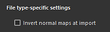

# バージョン10.1

<b>Substance 3D Painter 10.1</b>では、新しい強力なフィルター、改善されたUSD機能、更新されたVFXプラットフォームおよびLinuxサポートが追加されています。

リリース日： *17 September 2024*

>[!NOTE]
>
> このバージョンのPainterではQt version 6が使用されるようになり、PythonおよびJavaScriptプラグインのサポートに影響を与えます。 詳しくは、以下を参照してください。

## 主な機能

### 新しいデフォルトフィルター

このリリースでは、テクスチャリングプロセスを大幅に拡張するために、いくつかの新しいフィルターが追加されています。

* <b>新しい刺繍デカール素材</b>\
  アセットウィンドウのマテリアルセクションに、新しい刺繍デカールのマテリアルがあります。 メッシュ上の任意の場所にドラッグ&amp;ドロップし、任意のリソース（テクスチャやフォントなど）を接続すると、新しいファブリックのディテールを簡単に作成できます。

  
* <b>新しい塗りつぶし領域の色/マスクフィルター</b>\
  この2つの新しいフィルターを使用すると、閉じたパスやアウトラインを塗りつぶすことができます。 これは、例えば3Dパスをすばやく塗りつぶすときに便利です。 これらはフィルターなので、手動のブラシストロークやその他の状況でも使用できます。

  
* <b>新しいFXAAフィルター</b>\
  この新しいフィルターを使用すると、特にレベルの後やカラー選択エフェクトで作成されたマスクで現れるはっきりしたエッジのエイリアスをすばやく減らすことができます。

  
* <b>新しいハイパスフィルター</b>\
  この汎用フィルターを使用すると、グレースケールテクスチャを生成して、ディテールのソフト化、ブラー、シャープなどの高度な効果に使用できます。

  
* <b>新しいピクセレートフィルター</b>\
  ピクセレートフィルターは、解像度の低下をシミュレートすることができ、カラーやパターンをスタイライズするのに役立ちます。

  
* <b>新しいポスタリゼーションフィルター</b>\
  このフィルターは、画像内のカラー数を減らすことで、シェイプのコントラストを作り出し、スタイリッシュな効果を生み出すのに役立ちます。

  
* <b>新しいしきい値フィルター</b>\
  しきい値フィルターは、グレースケール入力からシャープな2進数の白黒マスクを簡単に作成する方法です。

  
* <b>新しいスムーズステップフィルター</b>\
  スムースステップフィルターは、グレースケール情報を微調整するためにレベルまたはコントラストを補正するもう1つの方法です。 このフィルターは、結果に指数曲線も適用し、線形グラデーションを滑らかな曲線に変換できるようにします。

  
* <b>改善された変形およびミラーフィルター</b>\
  変形フィルターが更新され、不均等な拡大・縮小、水平方向または垂直方向の反転がサポートされ、パラメーターの使用がより簡単になりました。 ミラーフィルターも、より簡単なパラメーターで更新されました。

  
* <b>改善されたアイコン</b>\
  標準フィルターを見つけやすくするために、アイコンが再作成されました。 黄色で着色されたアイコンは、レイヤーのコンテンツで使用することを目的としていますが、グレースケールアイコンは一般的であり、レイヤーコンテンツとマスクの両方で使用できます。

  
* <b>フィルターに関する軽微な修正</b>\
  その他にも、いくつかのフィルターが調整され、問題が解決されています。

  * Height調整フィルターがレイヤーのアルファに影響しているため、使用が難しい場合がありました。
  * 従来のカラーマネジメントモードでぼかしフィルターのカラースペースにリニアが使用されていなかったため、入力をブレンド/ミックスすると、カラーが正しく作成されませんでした。

### USDおよびVFXプラットフォームのサポートアップデート

このバージョンのPainterでは、多くのサードパーティコンポーネントが改善および更新されています。

* <b>Adobe Standard Materialのテクスチャを米ドルで書き出す\
  </b>PainterからUSDファイルにテクスチャを書き出すときに、Adobe Standard Materialのプロパティを取得できるようになりました。 これにより、これらのUSDファイルを、これらのプロパティをサポートするアプリケーションで使用できるようになります。
* <b>USDファイルからテクスチャを読み込む</b>\
  USDファイルを読み込むと、作成するプロジェクトにそのテクスチャも読み込まれるようになり、アプリケーション間の行き来が容易になりました。 USDファイルがAdobe Standard Materialを使用している場合は、シェーダ設定も設定され、ビューポート内の結果が他のソースアプリケーションと一致するようになります。
* <b>Gltfの変更\
  </b>USDの更新に伴い、パリティを確保するためにGLTF形式の動作を変更する必要がありました。 gltfファイルを読み込む際に、Painterは標準マップがOpenGLフォーマットであることを前提とします。\
  一部のgltfファイルでは、代わりにDirectXフォーマットが使用される場合があります。 そのため、新しいプロジェクトウィンドウに、それを考慮した新しい設定が追加されました（通常の形式もレイヤースタックから上書きできます）。

  
* <b>更新された依存関係</b>\
  Painterで使用されているいくつかのライブラリが更新され、特にVFXプラットフォームのリファレンスと一致するように更新されました。 Painter 10.1で使用された新しいバージョンは次のとおりです。

  * Qt 6.5.6（およびPySide6 6.5.6）
  * Substance engine 9.1.3
  * OpenEXR 3.2
  * Python 3.11
  * OCIO 2.3.2
  * OpenSubdiv 3.6.0
* <b>更新されたLinuxサポート\
  </b>この新しいバージョンのPainterでは、Red Hat Enterprise Linux (RHEL)バージョン8.6がサポートされますが、バージョン9.xとの互換性も必要です。

### パフォーマンスの向上

アプリケーションの一部の領域で、パフォーマンスが向上しました。

* <b>プロジェクトの開始時間を短縮\
  </b>多くのブラシストロークを使用したプロジェクトは、Painterでより速く開けるようになりました。 これらのプロジェクトの時間の節約も少し改善されるはずです。\
  いくつかのテストプロジェクトでは、プロジェクトを開いたときの読み込み時間が50秒からわずか6秒に短縮されました。 古いプロジェクトを開いて最新バージョンに変換するときのメモリ消費量も改善されました。
* <b>テッセレーションパフォーマンスの向上\
  </b>シェーダ設定でテッセレーションが有効になっている場合に、自動最適化を採用するようになりました。 画面上のピクセルより小さい三角形はテッセレーションされなくなるため、描画する三角形が少なくなり、レンダリング時間が短縮されます。\
  この変更は、視覚的な違いを生じることはなく、メッシュの書き出し処理にも影響しません。
* <b>簡易サムネイルが既定になりました</b>\
  バージョン6.2では、パフォーマンスを向上させるためにUVタイルプロジェクトの簡素化されたサムネールが導入されましたが、通常のプロジェクトでは古い方法でレイヤーサムネールを計算できます。 この動作は、アプリケーション設定によって制御されています。\
  この設定は、デフォルトで最適化されたサムネールに設定されるようになり、あらゆるプロジェクトでパフォーマンスを維持できます。 必要に応じて、メインの環境設定で元に戻すことができます。

  

### Painter 10.1への移行に関する注意

>[!NOTE]
>
> * Qt6のアップデート後にPythonプラグインのアップデートが必要になる場合があります。 詳細については、[このページ](https://adobedocs.github.io/painter-python-api/guides/qt6-migration/)を参照してください。
> * <b>JavaScript </b>のプラグインは、ユーザードキュメントディレクトリ内のサブフォルダーに移動されました。 既存のプラグインは、そのフォルダーに手動で移動する必要があるため、アプリケーションに表示されなくなります。
> * Steam/Ubuntuでは、Painterを正しく動作させるためにシステムライブラリが必要です。 アプリケーションを起動する前に、libxcbカーソルがインストールされていることを確認してください。

## リリースノート

### 10.1.0

リリース日： <b>2024/09/17</b>

概要： <b>メジャーリリース、新規コンテンツ：塗りつぶし領域マスク/カラーフィルター、刺繍デカールフィルター、6つの汎用Substanceフィルター、マテリアルおよびシェーダープロパティのUSDの読み込み、パフォーマンスの向上、VFX platform 2024準拠、Linux RedHatへの移行</b>

<b>追加済み</b>:

* [コンテンツ]新しい塗りつぶし領域のマスク/カラーフィルターの追加
* [コンテンツ]新しい刺繍デカールフィルターを追加
* [コンテンツ] 6つの新しい汎用Substanceフィルター（FXAA、ピクセレート、ハイパス、ポスタリゼーション、スムースステップ、しきい値）を追加します
* [USD]定義済みのASMマテリアルを含むUSDレイヤーの書き出し
* [USD]マテリアルとシェーダのプロパティとともにUSDを読み込む
* [パフォーマンス]デフォルトで最適化されたレイヤースタックサムネールを有効にする
* [パフォーマンス]プロジェクトファイルの起動時間とメモリの消費を削減（データデコード）
* VFX platform 2024準拠
* [VFX Platform 2024] Python 3.11へのアップデート
* [VFX Platform 2024] OpenEXR 3.2へのアップデート
* [VFX Platform 2024] [USD] OpenSubdiv 3.6.0を更新しました
* [VFX Platform 2024]&#x200B;[カラーマネジメント] OCIO 2.3.2に対するアップデート
* [Linux] Linux RedHatへの移行
* [Linux] Nvidiaドライバーの最小バージョンを535.171.04にアップデートします。
* [読み込み] GLTFメッシュを読み込むときに、法線マップを反転するオプションを追加します
* [UI]ドラッグイベントの検出距離にオペレーティングシステムのデフォルト値を使用する
* [Substance engine]実行可能ファイルからシンボルを削除する呼び出しストリップ関数を追加します
* [スプラッシュ画面]新しいスプラッシュ画面形式への更新
* Substance engineをバージョン9.1.3にアップデートする
* [Python]レイヤスタックドキュメントメニューにサンプルへのリンクを表示
* [JavaScript] Javascriptプラグインをjavascript/pluginsサブフォルダーに移動します

<b>固定</b>:

* [Illustrator] .aiグラフィックを含むUVタイルを書き出すと、クラッシュする場合がある
* [動的ストローク]&#x200B;[パス] 1ストロークあたりのランダム度がパス上で機能しない
* [UI]&#x200B;[プロパティ]タイルが不均等な場合、ロックが有効になる
* Painterプロジェクトをダブルクリックすると、Debug TXTファイルが作成される
* [USD]&#x200B;[書き出し]一部のテクスチャが欠落している可能性があります
* [ASM]散布カラーチャンネルがメタリックを無視する
* [コンテンツ]ぼかしフィルターが「作業中」のカラースペースで機能しない
* [コンテンツ]Height調整フィルターでもレイヤーのアルファが変更される

<b>既知の問題</b>:

* [カラーマネジメント] Linux上のACEを使用したHDRカラースペース変換では、カラーがクランプされます
* [Win]&#x200B;[クラッシュ] [ACE] sRGB ICEカラースペースを表示変換に使用しない
* [Regression]&#x200B;[UI] HD画面で右クリックメニューが小さすぎる
* [クラッシュ]&#x200B;[Python] TextureStateEventによってトリガーされたUSDの書き出し
* [MacOS Intel]一部のプリセットを読み込むとクラッシュする
* [クラッシュ]リソースの再配置とプロジェクトの保存
* [エンジン]通常チャンネルのコピーツールでペイントすると、カラーが正しくシフトされない
* [Python]スクリプトがまだ機能しているため、ゴーストウィジェットが削除されているように見える
* [RedHat]カラーピッカーの問題
