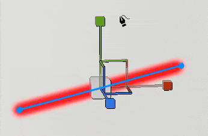
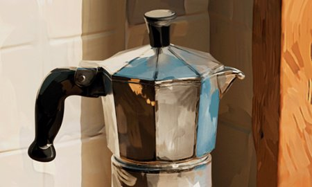
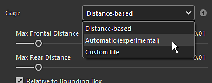

# バージョン11.0

<b>Substance 3D Painter 11.0</b>では、新しい自動リソースアップデートワークフロー、塗りつぶしパスツールに加え、パスの全般的な機能向上、ベイク処理の自動ケージ、およびスタイル化されたテクスチャを作成するためのいくつかの新しいフィルターが追加されています。

リリース日： <b>11 March 2025</b>

>[!NOTE]
>
> このバージョンのPainterでは、Mac Intelのサポート対象外の設定になっています。 詳しくは、以下を参照してください。
> 
> また、このバージョンでは、サポートされている最小バージョンのWindows 10が22H2にアップグレードされます。
> 
> 詳しくは、[必要システム構成のページ](../getting-started/system-requirements.md)をご覧ください。

## 主な機能

### リソースの新しい自動更新

新しい自動更新ワークフローでは、ライブラリやプロジェクトを最新バージョンのリソースで常に最新の状態に保つことができるようになりました。 この新しいプロセスにより、Painterはディスク上のリソースを監視して変更を検索し、自動的にリロードしてライブラリやプロジェクトに置き換えることができます。

* <b>アセットウィンドウで自動更新を有効にしています</b>\
  「アセット」ウィンドウの右下に、自動更新システムを設定するためのボタンとメニューが表示されます（小さな二重矢印アイコン）。 オプション<b>アセットパネル</b>を有効にしてライブラリを監視し、再読み込みしてください。

  
* <b>プロジェクトのリソースを更新しています</b>\
  リソースを再読み込みしても、レイヤースタック、表示設定、シェーダ設定などを介してプロジェクト内で使用されているバージョンは自動的に更新されません。これを行うには、<b>プロジェクトで使用されているリソース</b>オプションも有効にしてください。

  
* <b>更新頻度</b>\
  Painterがリソースのアップデートを検索する頻度は、専用の設定で数分で定義できます。 0分を指定すると、アプリケーションは数秒ごとに更新されます。 ただし、この値を小さくすると、パフォーマンスの問題が発生する可能性があります。 フォーカスを再取得すると、アプリケーションも自動的に更新されます。
* <b>リソースの手動更新</b>\
  自動更新メニューの下部にある専用ボタンを使用すると、更新と更新のプロセスを手動でトリガーすることもできます。 これは、自動プロセスを使用して開始するのを待つよりも便利です。

  
* <b>ログウィンドウの不一致とエラー</b>\
  リソースの更新は、特に古いバージョンと新しいバージョンの違いが重要な場合、問題の原因になることがあります。 たとえば、テクスチャリング結果は、Substanceリソース上のパラメータの欠落や変更のために大きく変化したり壊れたりすることがあります。 このため、パラメーターの不一致が既定で有効になっている場合は、<b>アセットをスキップ</b>します。 問題はログウィンドウに報告されます。\
  強制的に更新するには、この設定を無効にするだけです。

  

  
* <b>プロジェクトのメンテナンスを自動化するためのPython APIで利用可能</b>\
  自動更新ワークフローもPythonに公開されました。 古いリソースを一覧表示して置き換える新しい関数が追加されました。\
  詳しくは、アプリケーションヘルプメニューから専用のドキュメントを参照してください。

>[!NOTE]
>
> 詳細については、[専用のドキュメントページ](../features/auto-update.md)を参照してください。

### 塗りつぶしパスツールを新規作成

塗りつぶしパスツールは、3Dモデルの表面を均一なカラーで塗りつぶしてシェイプを作成できる新しいタイプのパスツールです。 これにより、複雑なパターンの作成が可能になります。

* <b>塗りつぶされた色でパスを作成するための新しいツール</b>\
  <b>塗りつぶされたパス</b>という新しいツールがパスメニューで使用できます。 このツールは、閉じたときにパスの内側の領域を塗りつぶすことができます。 テクスチャセットの各チャンネルに対して同じカラーで塗りつぶしが行われます。

  
* <b>サーフェスに自動的に適応</b>\
  塗り潰しパスツールは、あらゆる種類のサーフェスにフィットできますが、平面領域に限定されません。 隙間やオブジェクトの境界を越えることができます。

  
* <b>ミラー対称および放射対称と互換性があります</b>\
  この新しいツールは、シンメトリーのプロパティもサポートしており、これにより、複雑なシェイプを作成する可能性が開きます。

  
* <b>パスツール間の簡単な切り替え</b>\
  プロパティウィンドウに、異なる種類のパスツールを切り替える新しい方法が追加されました。 ツールを試したり、パスを複製したりすることが簡単になります。 例えば、パスのアウトラインを作成して複製し、塗りつぶされたパスに変換すると、アウトラインを持つシェイプをすばやく作成できます。

  

### スナップや直線などによるパスツールの向上

この新しいリリースでは、パスツールを使いやすくするために、動作と生活の質が大幅に改善されています。

* <b>パスのプレビュー（Shift + Pキーで切り替え）</b>\
  パスを編集する場合、新しい点線が表示され、曲線の終点に新しいポイントを追加した場合のパスの反応を示します。 これにより、変更がより予測可能になります。 このプレビューを無効にするには、専用の設定メニューを使用するか、<b>Shift + P</b>キーボードショートカットを使用します。

  
* <b>直線と角度のスナップ</b>\
  <b>Shift </b>キーボード修飾キーを使用して、ポイント間の直線を自動的に作成できるようになりました。 <b>Ctrl </b>を維持すると、角度スナップを適用して、幾何学的シェイプを作成することもできます。\
  角度スナップの設定は、コンテキストツールバーのパス設定メニューから変更できます。

  
* <b>スナップパスがメッシュポリゴンを指している</b>\
  ポイントの配置を簡単にするために、新しいスナップ（マグネットアイコン）を有効にすることができます。 このオプションを使用すると、3Dモデルの頂点にポイントを配置し、サーフェスまたはエッジに沿って移動できます。\
  スナップは、次の3つの方法で実行できます。

  * 頂点にスナップ
  * エッジにスナップ
  * エッジの中心にスナップ

  これらのモードはすべて、コンテキストツールバーのパス設定メニューから使用できます。

  

  
* <b>最後の頂点をクリックすると自動的に閉じる</b>\
  <b>塗りつぶしパスツール</b>を使いやすくするために、最後の頂点を選択している間に最初の頂点をクリックすると、パスが自動的に閉じられます。 パスを閉じる代わりにポイントを選択するには、<b>Ctrl </b>キーを使用できます。 （この動作は、以前のバージョンでは逆になっています）。

  
* <b>パスの頂点の位置をコンテンツからマスクにコピー</b>\
  マテリアルモードでパスを<b>コピー</b>してから、マスクのパスで<b>すべての頂点をペースト</b>を使用できるようになりました。 これにより、マテリアルとマスクの間で異なるパスを同期させることができます。

  
* <b>UIの表示/非表示の表示動作を改善しました</b>\
  ビューポートマニピュレータのキーボードショートカット（<b>W</b>、<b>S</b>、または<b>D</b>）を押すと、すぐに切り替わります。 コンテキストツールバーの専用ボタンから有効/無効にすることもできます。 この変更により、ビューポート内の他のビジュアル（パスカーブやポイントなど）を非表示にしなくても、これらのビジュアルをすばやく表示または非表示にすることができます。

  
* <b>回転とスケールがパスの頂点でアクセスできるようになりました</b>\
  このバージョンでは、複数の頂点を選択した場合に、<b>回転</b>および<b>スケール</b>ツールを使用できるようになりました。 これにより、頂点を調整して位置合わせすることができます。

  
* <b>[プロパティ]ウィンドウにパス情報を表示する</b>\
  パスツールを選択すると、プロパティウィンドウに新しいセクションが表示されるようになりました。 このセクションには、パスの長さ、プロジェクション深度、種類を切り替える操作など、パスに固有の情報と操作が再編成されています。

  
* <b>角度から見たときの接線編集の改善</b>\
  ビュー角度によっては、カスタム接線の編集が難しい場合があります。 接線が独自のプランにコンストレインされるように、この点が変更されました。

  
* <b>レイヤー間でパスの一覧を開いたままにする</b>\
  異なるペイントレイヤーとエフェクトを切り替える場合、ビューポートのパスパネルが閉じていると、他のレイヤーでも閉じたままになります。 パネルは開いたままになり、前と後ろに行きやすくなりました。

  
* <b>現在選択されているパス</b>にフォーカス\
  <b>F</b>キーボードショートカットを押すと、パスの編集時に3Dモデル全体ではなく、パスにフォーカスするようになりました。
* <b>バックスペース</b>のパスを削除します\
  <b>Backspace </b>のキーボードショートカットを押すと、パスをすばやく削除できます。

### 新しいSubstanceフィルターとテクスチャ生成

新しいバージョンでは、いくつかの新しいフィルターと手続き型パターンが導入されています。

<b>フィルター：</b>

* <b>スタイル化</b>\
  この新しいフィルタを使用すると、既存のテクスチャリングをよりスタイル化されたバージョンに変換できます。 3D空間でブラシストロークをシミュレートし、他のいくつかの効果を適用して、絵画のような外観を実現できます。 再生を容易にするいくつかのプリセットが含まれています。

  
* <b>クオンタイズ</b>\
  クオンタイズフィルターを使用すると、画像のカラー数を減らし、明確な制限がある平坦な領域を作成できます。 また、テクスチャのスタイル設定にも使用できます。

  
* <b>異方性桑原</b>\
  このフィルターは、ノイズの軽減やテクスチャのスタイル設定にも使用できる[桑原フィルター](https://en.wikipedia.org/wiki/Kuwahara_filter "https://en.wikipedia.org/wiki/Kuwahara_filter")を適用します。

  
* <b>方向の距離</b>\
  これは、2D空間で特定の方向にピクセルを引き伸ばす単純なフィルターです。 ブラシストロークをこする場合や、リークを発生させる場合に使用できます。

  
* <b>ベベルスムーズ</b>\
  ベベルスムーズはベベルフィルターの新しいバージョンであり、より良い結果とコントロールを提供します。 既存のフィルターに加えて使用できます。

  
* <b>グレースケール変換</b>\
  この新しいフィルターを使用すると、画像またはチャンネルをグレースケールに簡単に変換でき、必要に応じて赤、緑、青のチャンネルを制御できます。

<b>テクスチャジェネレーターとノイズ</b>:

* <b>Scratchesジェネレータ</b>\
  改良されたスクラッチ生成機能により、ランダム性を様々に制御して細いスレッドをシミュレートします。
* <b>Triangle Grid </b>\
  ランダム度とSmoothnessをコントロールする三角形の接続から作成されるノイズ。
* <b>タイルランダム</b>\
  タイルパターンを構築するためにカスタマイズされたテクスチャ生成機能。
* <b>ボロノイとボロノイフラクタルノイズ</b>\
  既に3Dノイズとして利用可能なこれらの新しい2Dバージョンは、2DまたはUV空間での作業やタイリングに使用できます。
* <b>Designer </b>の最新バージョンにノイズを更新しました\
  Painterで利用可能なノイズのほとんどは、Substance 3D Designerの最新バージョンに更新されています。 ノイズパラメーターをグループに隠して編集しやすくすることがなくなりました。

### ベーキング用の新しい自動ケージ（試験的）

ハイポリメッシュをローポリメッシュにベイクする場合、ケージモードを指定するときに新しい<b>自動</b>オプションを選択できるようになりました。 この新しい方法では、アーティファクトを回避するために、最高の高ポリゴンメッシュに適合する自動ケージメッシュを計算しようとします。

* <b>共通ベイクパラメーターの新しい設定</b>\
  一般的なベイクパラメータの内部では、ケージパラメータは3つのオプションの選択に置き換えられました。\
  <b>距離ベース</b>：既定の正面/背面距離設定です。\
  <b>自動（実験的）</b>：新しい自動ケージです。\
  <b>カスタムファイル</b>:カスタムメッシュファイルをケージとして読み込む以前の方法です。

  

>[!NOTE]
>
> この機能は実験的なものと考えられています。 今後のバージョンではアルゴリズムの改良を予定しています。 また、結果の品質や発生する可能性のあるバグに関するフィードバックも求めています。

### Mac OSでのMetalを使用したレンダリング

このリリースでは、Macプラットフォームに関連する特定の変更が行われています。

* <b>Mac </b>で、OpenGLの代わりにMetalグラフィックAPIが使用されるようになりました\
  Painterでは、このバージョンから、Mac上の<b>Metal </b>graphic APIを使用して、ビューポートのレンダリングとテクスチャの計算を行います。 このスイッチにより、アプリケーションのパフォーマンスと安定性が大幅に向上します。 また、OpenGLはMacOSで非推奨になっているため、今後は新しい機能を簡単に組み込めるようになります。
* <b>Mac OSでのIntelアーキテクチャのサポートの削除</b>\
  このバージョンでは、MacOS上のIntel CPUとの互換性は削除されています。 ARMアーキテクチャ（M1、M2など） が唯一のサポート対象になりました。

### その他

このバージョンでは、その他にもいくつかの機能が追加されています。

* <b>新しい塗りつぶしレイヤー/効果で基本カラーチャンネルのみを有効にする</b>\
  初期設定では、塗りつぶしレイヤーまたは塗りつぶし効果を新規作成すると、ベースカラーチャンネルのみが有効になります。 （この変更は、塗りつぶしレイヤー/効果を作成するリソースをドラッグ&amp;ドロップする場合には適用されません）。\
  コミュニティからのフィードバックに基づいて、この変更を行い、後で無効になるチャンネルの計算をトリガーせずに、パフォーマンスを向上させました。 これは、高解像度またはUVタイルで作業する場合の応答性に役立ちます。\
  <b>ALT </b>のキーボードショートカットを維持しながら、基本色ボタンをクリックすると、すべてのチャンネルをすばやく再び有効にできます。

  
* <b>テクスチャを書き出すためのUVタイル名の変更</b>\
  テクスチャセットリストウィンドウでは、UVタイルにカスタム名を追加することはできません。 説明とは異なり、カスタム名は専用タグ<b>$uvTileName</b>を介して書き出しプリセットで取得できます。\
  この新機能により、書き出し時にUDIM番号を特定の名前に置き換えることができます。

  
* <b>Dockツールバーに新しい[エクスポート]ボタンが追加されました</b>\
  他のアプリケーションに書き出すことができる<b>送信先</b>のアクションが専用ウィンドウに移動され、アプリケーションの右側にあるDockツールバーから利用できるようになりました。

  
* <b>コピーまたはペーストしたパスとレイヤーの名前付けを改善します</b>\
  レイヤーおよびパスを複製またはコピー&amp;ペーストするときのレイヤーの命名規則が改善され、一貫性を保ち、予測可能になりました。

  

## チュートリアル

## リリースノート

### 11.0.0

リリース日： <b>2025/03/11</b>\
概要： <b>メジャーリリース、新しい自動アップデート機能、塗りつぶしパスツールなどのパスの機能強化、および新しいフィルターとベイク処理のための実験的な自動ケージ生成</b>

<b>追加済み</b>:

* 自動更新
* [自動更新]アセットパネルで変更したアセットを自動更新します
* [自動更新]プロジェクト全体で変更されたアセットを自動更新します
* [自動更新]自動更新を既定でオフにする
* [自動更新]リソースパラメーターが一致しない場合は更新をオプションにする(.sbsar、.glsl、.ai、.svg)
* [自動更新]自動更新機能を無効にする環境変数を追加します
* [Auto-update]&#x200B;[SBSAR]リソースパラメーターが一致しない場合は更新をオプションにする
* 塗りつぶされたパス
* [パス]&#x200B;[塗りつぶし]塗りつぶされたパスを作成するための新しいツールを追加
* パスの改善
* [パス]ポリゴンにスナップするパスを作成
* [パス]パスの種類を切り替えることができます
* [パス]コンテンツとマスクの間でパスの頂点データをコピーできるようにします
* [パス]新しいポイントを作成するときに角度を制限できます
* [パス]点の作成を線分に拘束できるようにします
* [パス]ワンクリックでシェイプを閉じる
* [パス]パス情報を表示します
* [パス]パスの頂点のスケールと回転を可能にする
* [パス]&#x200B;[UX]変換ギズモを使いやすくする
* [パス]パスプレビューを追加
* [パス] Shift + Pキーを押すとパスのプレビューが無効になる
* [パス]側面図からの接線編集を改善します。
* [パス] 3Dパスにフォーカスできます
* [パス] UIのオンとオフを切り替えるときに、頂点が選択ステータスを保持する
* [パス] Backspaceを使用してパスを削除できるようにします
* [パス]ユーザーがパス一覧を展開した場合でも一覧を開いたままにする
* [Path]&#x200B;[Layer Stack]コピー/ペースト時に重複する名前を正しく変更する
* [パス] UIとツールチップの改善
* Performance
* [パフォーマンス]高いテッセレーションレベルを使用する場合のビューポートのパフォーマンスを改善します
* [パフォーマンス]新しい塗りつぶしレイヤー/エフェクトの最初のチャンネルのみを有効にする
* [パフォーマンス]ブラシストロークの並列化の計算
* ベイク処理
* [ベイク処理]ハイポリゴンメッシュでベイク処理するための新しい完全自動ケージ生成オプションを追加しました（試験的）
* コンテンツ
* [コンテンツ] 6つの新しいフィルターを追加：スタイライズ、量子化、異方性桑原、ベベルスムーズ、方向の距離、グレースケール変換
* [コンテンツ] Designerからノイズやグランジを最新版にアップデート（新しい2D Voronoiを適用）
* [コンテンツ] 3つの新しいテクスチャジェネレータ（タイルランダム、Triangle Grid、Scratchesジェネレータ）を追加
* [コンテンツ] Unreal Engineのテンプレート名を変更し、プリセットを書き出す
* Python
* [Shelf]&#x200B;[Python]スマートマテリアルまたはスマートマスクをPythonからディスクに保存
* [Python] Python APIに自動ケージのベイク処理を追加
* [Python]テクスチャセット/UVタイルの名前と説明の編集を許可
* [Python]ベクターソースとフォントソースで解像度設定を共有
* [Auto-update]&#x200B;[Python] Pythonでプロジェクトの自動更新機能を公開する
* その他
* [書き出し]新しいパネルで「送信」オプションに簡単にアクセス
* [Nvidia]最新のNvidiaドライバーに関する警告の追加(572.16)
* 角度スナップは、オブジェクト/ワールド空間の選択の影響を受ける必要があり&#x200B;す。
* [テクスチャセットリスト] UVタイルにカスタム名を追加し、書き出し時に使用できます
* Mac
* [Mac]グラフィックレンダリングにOpenGLではなくMetalを使用
* [Mac] Mac Intelサポートの終了

<b>固定</b>:

* [Nvidia]&#x200B;[Baking]環境オクルージョンのベイカー結果に斑点がある
* [クラッシュ] Altキーを押しながら無効になっているテクスチャセットの表示を切り替えるとクラッシュする
* [ベーキング]ケージは、低ポリゴンを高ポリゴンパラメータとして考慮されます
* [ベイク] IDマップのベイカーのマテリアルカラーが、USDファイル形式では機能しない
* [パフォーマンス]メッシュと多数の重なり合うオブジェクトを使用すると、ビューポートでのレンダリングに時間がかかる
* [Qt]カスタムビルドのカラーピッカーにカラーマネジメント設定がない
* [ビューポート]アンチエイリアスを有効にすると、3Dマニピュレータがちらつく
* マスクブロックのブラシ状態にある消しゴムのグレースケールスロット
* [ログ]メッシュの読み込み時に非常に長いエラーメッセージが報告されない
* [コンテンツ] Topstitchesツールプリセット内のプリセット名リストに誤りがあります
* [Python] SVG/AIファイルを別のファイルに置き換えても、プロパティが更新されない
* [Python] Pythonからクエリーを受け取ると、ベクトルリソースアートボードIDが空になる場合がある
* [Python] logに出力されたエラーで、大量の改行が行われることがある

<b>既知の問題</b>:

* [カラーマネジメント] Linux上のACEを使用したHDRカラースペース変換では、カラーがクランプされます
* [Regression]&#x200B;[UI] HD画面で右クリックメニューが小さすぎる
* [クラッシュ]&#x200B;[Python] TextureStateEventによってトリガーされたUSDの書き出し
* [エンジン]通常チャンネルのコピーツールでペイントすると、カラーが正しくシフトされない
* [Python]スクリプトがまだ機能しているため、ゴーストウィジェットが削除されているように見える
* [RedHat]カラーピッカーの問題
