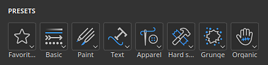
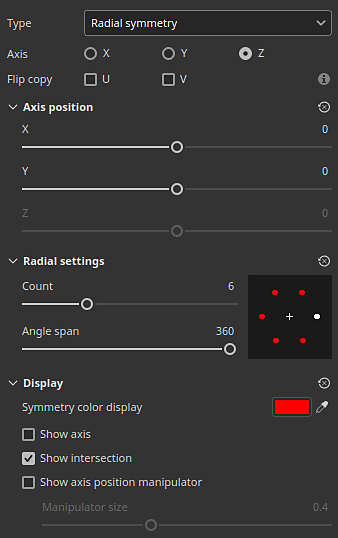

# バージョン11.1

<b>Substance 3D Painter 11.1 </b>は、専用コンテンツ、塗りつぶしレイヤーと効果に関する対称、ディスプレイスメントの物理サイズ、およびVulkan Graphics APIのサポートを備えた新しいリボンパスツールです。

リリース日： <b>2025年11月18日</b>

>[!NOTE]
>
> このバージョンのPainterでは、グラフィックAPIがOpenGLからVulkanに切り替わります。 この変更は、アプリケーションでサポートされているGPUに影響を与える可能性があります。特に、GPUベースのレイトレーシングでのベイク処理で影響が大きくなります。
> 
> 詳しくは、[必要システム構成のページ](../getting-started/system-requirements.md)をご覧ください。

## 主な機能

### 新しいリボンツール

<b>ツール</b>は、リボンパスツールファミリーの新しいツールです。 リボンは、カットなしでパスに沿ってテクスチャを変形および繰り返します。開始と終了のコントロールや、鋭角のコーナーのオプションが追加されています。

この新しいツールを使用すると、パスに沿ってテキストを配置したり、パスに沿って最適なグラデーションを配置したり、独自の高度なトリムを簡単に作成してメッシュをラップしたりするなど、新しい動作が可能になります。\
簡単に言うと、リボンはパスを使用してより正確に描画するためのクリーナーツールです。

* <b>他のパスに似たツールの横に表示される新しいリボンツール</b>\
  新しいリボンツールは、インタフェース内のツールなどの他のパスの横に表示されます。 ツールバーまたはパスの種類のショートカットから選択できます。

  

  
* <b>リボンはすべての種類のサーフェスで機能する連続パスです</b>\
  リボンは、パスに沿ってテクスチャを繰り返したり伸縮したりできるツールです。 この機能は、メッシュパーツが接続されていない場合でも、あらゆる種類のサーフェスおよびジオメトリで機能します。

  
* <b>繰り返しのパターンとグラデーションを作成しています</b>\
  この新しいツールは、シームやカットを使用せずに、様々な方法で画像を繰り返すことができます。これは、グラデーションやクリーンなパターンに適しています。

  
* <b>カスタムの開始と終了で画像を引き伸ばす</b>\
  <b>オフセット間で伸縮</b>設定を使用すると、画像の一部を分離してパス上の開始部分と終了部分として使用し、中間部分をパスの残りの部分に沿って伸縮することができます。 これは、単純なビットマップをすばやく使用して、矢印などのゆがみのないパスに沿って配置するのに便利です。

  
* <b>利用可能な各種コーナーの種類</b>\
  正接を分割してコーナーを作成する場合、クラシックな分割からスムーズな回転まで、ニーズに応じて複数のシェイプを使用できます。

  
* <b>伸縮とタイリングの制御</b>\
  画像は、自動または手動のどちらでも、リボンパスに沿って簡単に繰り返したり伸縮したりできます。

  
* <b>パスに沿ったテキスト</b>\
  フォントリソースは、リボンパス上で直接使用できます。 テキストはパスに合わせて自動的に調整され、その曲線に沿って変形します。 アラインメント設定を使用すると、状況に応じて適切にテキストを適応させることができます。

  
* <b>縦横比と非正方形リソース</b>\
  非正方形リソースは、リボンパスの長さに合わせて自動的に調整されるため、繰り返しの装飾やトリムなどの細長いパターンに最適です。

  
* <b>動的ストロークと互換性のあるワークフロー</b>\
  また、リボンパスはSubstanceベースの動的ストロークシステムと互換性があるため、複雑な結果を生み出すことができます。 特筆すべき例は、カスタムの開始/終了と左/右コーナーを設定できることです。\
  この機能に簡単にアクセスできるようにするために、<b>カスタムリボンツールプリセット</b>と<b>カスタムリボンマテリアル</b>という名前の2つの新しいグレースケールも提供されています。

  
* <b>対称と互換性があります</b>\
  他の種類のツールと同様に、このリボンパスも対称機能と互換性があります。

  
* <b>セルフオーバーラップ時の描画モード</b>\
  リボンパスが交差すると、予期しない結果が生じる可能性があります。 Alpha、通常、Heightチャンネルの専用の描画モードを使用すると、より良い結果を得ることができます。

  

すべてのパスツールに対して追加の機能強化が行われました。

* <b>パス上の頂点ごとにサイズと不透明度を分ける</b>\
  パス上の頂点のサイズと不透明度を調整できるようになり、圧力パラメーターとの連動が解除されました。 これら2つのプロパティは、インターフェイスの専用スライダーで個別に処理されるようになりました。

  
* <b>プロパティウィンドウのパラメータグループ化</b>\
  Painterのほとんどのツールに、パラメーターの折りたたみ可能なグループが追加されました。 この変更により、作業中にパラメータを非表示にしてウィンドウの長さを短くすることが容易になります。

  

>[!NOTE]
>
> <b>リボンツール</b>の詳細については、[専用ドキュメントページ](../painting/tool-list/ribbon-tool.md)を参照してください。
> 
> <b>動的ストローク</b>について詳しくは、[専用のドキュメントページ](../painting/dynamic-strokes/dynamic-strokes.md)を参照してください。

### リボンツールの新しいコンテンツとカテゴリ

このリリースには、Ribbonの新機能を利用する75の新しいツールプリセットが含まれています。 プリセットを見つけやすくするために、新しいプリセットカテゴリが<b>プロパティ</b>ウィンドウに追加されました。

* <b>プロパティウィンドウの新しいプリセットカテゴリのショートカット</b>\
  パスツールを使用している場合に、一連の新しいボタンが<b>プロパティ</b>ウィンドウの上部に表示されるようになりました。 各ボタンから、カテゴリごとに並べ替えられたツールプリセットにアクセスできます。 お気に入りカテゴリに、選択したプリセットが再グループ化されます。

  

  いずれかのボタンをクリックすると、事前に選択されたプリセットにすばやくアクセスできます。 「<b>Show more in Assets</b>」をクリックすると、<b>Assets</b>ウィンドウに表示されるツールプリセットが増えます。

  
* <b>プリセット間のクイック切り替え</b>\
  プリセット間の切り替えを簡単にするため、プリセットをクリックしても現在編集しているパスの選択が解除されなくなりました。

  
* <b>新しいコンテンツ</b>\
  このバージョンでは、デフォルトのコンテンツの一部として、リボンツール専用の75の新しいツールプリセットが追加されています。 これらのプリセットは、<b>アセット</b>ウィンドウ内のブラシセクションから直接使用するか、<b>プロパティ</b>ウィンドウの新しいカテゴリのショートカットから使用できます。\
  これらのプリセットには以下が含まれます。

  * <b>アパレル</b> : シームのパッキングとトップステッチのプリセット、ジッパーと生地の裂け目が改善されました。
  * <b>基本</b>：線やダッシュなどの単純な線ですが、グラデーションや<b>動的な線</b>システムに基づく<b>カスタムリボン</b>プリセットもあります。
  * <b>経年劣化</b>：様々な種類のサーフェスのダメージをシミュレートする3種類の亀裂です。
  * <b>硬い表面</b>:グリップパターン、パネル、およびシャットダウンの詳細、テープ、および溶接を使用するか、機械オブジェクトを使用します。
  * <b>オーガニック</b> ：包帯は、清潔で汚れていて、肌やその他の表面に巻きついています。
  * <b>ペイント</b> :ブラシベースのグラデーションとガウチプリセット。
  * <b>テキスト</b>:リボンのパスに沿ってテキストを設定するためのクイックプリセットです。さまざまなアラインメントモードや伸縮を使用できます。
* <b>アセットウィンドウで検索する新しいツールキーワード</b>\
  <b>デザイン素材</b>のウィンドウで「リボン」、「ペイント」、「パス」、または「指先」と入力できるようになりました。この機能は、対応するツールに合ったプリセットを見つけるのに役立ちます。

  

### 塗りつぶしレイヤーとエフェクトの新しい対称

塗りつぶしレイヤーと効果が、3D 投影モードとの対称をサポートするようになりました。 コンテキストツールバーの対称メニュー、または<b>プロパティ</b>ウィンドウに新しく追加された対称セクションから有効にすることができます。

* <b>塗りつぶしレイヤーの対称</b>\
  塗りつぶし効果やレイヤーで3Dベースの投影モードを使用する場合、対称を有効にできるようになりました。 ミラーモードとラジアル対称の両方を使用できます。

  
* <b>コンテキストツールバーまたは[プロパティ]ウィンドウで対称を有効にする</b>\
  対称は、ペイントツールと同様に<b>コンテキストツールバー</b>メニューを使用するか、新しい専用セクションが表示された<b>プロパティ</b>ウィンドウを使用してアクティブにできます。

  

  
* <b>テキストとロゴの入力リソースを反転する</b>\
  塗りつぶしレイヤーと効果の対称には、入力画像やX/Y軸を反転できる新しいオプションも利用できます。 これにより、例えばテキストを鏡像化しても、左右両側で読み取ることができます。

  
* <b>改善された対称設定インターフェイス</b>\
  対称設定のインターフェイスが修正され、読みやすくなり、使いやすくなりました。 例えば、軸スライダーにはそれぞれ固有の線があり、より正確に描画できます。 ラジアルディスプレイもサイズを縮小して、省スペース化しました。

  

<b>対称</b>の詳細については、[専用ドキュメントページ](../painting/symmetry/symmetry.md)を参照してください。

### ディスプレイスメントの物理サイズ

ディスプレイスメントを特定の単位で定義できるようになりました。 この変更により、他のアプリケーション間で変位したジオメトリを簡単に位置合わせして一致させることができます。

* <b>ディスプレイスメント設定の新しいスケール単位オプション</b>\
  <b>シェーダー設定</b>ウィンドウで、ディスプレイスメントの強さを調整する際に、新しいスケール単位の設定を使用できます。 この設定には、次のオプションがあります。

  * <b>正規化</b>:デフォルトでは、Painterの以前の動作と一致します。 このサイズは、現在のプロジェクト内のメッシュ境界ボックスに基づきます。
  * <b>シーン</b>: メッシュファイル内に格納されているユニットを参照ポイントとして使用します。
  * <b>物理サイズ (cm)</b>: <b>プロジェクト構成</b>ウィンドウで定義されたプロジェクトのユニットを使用します。

  

### WindowsおよびLinux用の新しいVulkanグラフィックスバックエンド

Mac OSでOpenGLからMetalに切り替えた以前のバージョンに続き、この新しいバージョンではWindowsおよびLinuxプラットフォームで<b>Vulkan</b>を使用しています。

* <b>WindowsおよびLinuxで、OpenGLの代わりにVulkan Graphics APIが使用されるようになりました</b>\
  Painterは、ビューポートおよびコンピューティングテクスチャでのレンダリングにVulkanグラフィックAPIを使用するようになりました。 このスイッチにより、アプリケーションの全般的なパフォーマンスが向上します。 また、将来的には新しい機能の統合も容易になります。
* <b>Vulkan経由でベイクするためのGPU レイトレーシング</b>\
  レイトレーシング(DRX)とOptixは、当社ベイカーのVulkan Graphics APIを介したレイトレーシングに置き換えられました。 この変更により、GPUベースのレイトレーシングが、AMD GPUおよびLinuxオペレーティングシステムで利用できるようになりました。\
  Vulkanに切り替えると、特に高解像度でのベイク処理レンダリング時間も短縮されます。

### その他

このバージョンでは、追加機能と機能強化が追加されています。

* <b>Substance解決の上書き</b>\
  ツールおよび塗りつぶしレイヤー/効果でSubstanceリソースを使用する場合は、新しい<b>Resolution</b>パラメーターグループを使用できます。 これらの設定を使用して、アプリケーションが選択したデフォルトの解像度を変更できます。\
  これは、画質やパフォーマンス上の理由から、Substanceが生成される解像度を高くしたり低くしたりするのに便利です。

  使用可能な設定は次のとおりです。

  * <b>解像度</b>：解像度の計算に使用するモードとコンテキストを定義します。 既定値は自動ですが、<b>テクスチャセット</b>または<b>カスタム</b>に設定できます。
  * <b>係数</b>：解像度を追加で制御し、相対的な差異を作成します。 例えば、指定されたコンテキストの解像度の半分を使用します。
  * <b>出力サイズ</b>：前回の設定に基づいて計算された最終的な解像度です。

  
* <b>単一の大きな三角形に対するパフォーマンスの向上</b>\
  今まで、Painterは非常に低いポリゴンのメッシュまたは非常に大きなメッシュや長い三角形で苦労していました。 今ではそうではない。 例えば、テクスチャを作成するために1つのクアッドメッシュを使用することは、もはや問題ではありません。
* <b>改善されたデフォルトのブラシシェイプ</b>\
  デフォルトのブラシシェイプが新しい設定で更新され、硬さのビヘイビアーを考慮しながら、サイズと丸みを制御できるようになりました。

  

## チュートリアル

新機能を取り上げる最新のチュートリアルは次のとおりです。

## リリースノート

### 11.1.0

リリース日： <b>2025/11/18</b>\
概要： <b>このアップデートにはメジャーリリースで、専用の新しいコンテンツを備えた新しいリボンツール、塗りつぶしレイヤーの対称サポート、ディスプレイスメントのための物理サイズパラメーター、更新されたベイカーによるパフォーマンスの向上、WindowsおよびLinuxのVulkanの完全サポート、その他の機能強化が含まれています。</b>

<b>追加済み</b>:

* 新しいリボンツール
* [ツール]新しいリボンツールを追加して、シームレスなパスを作成する
* [リボン] [プロパティ]ウィンドウでリボンプリセットショートカットを追加する
* [Ribbon]パス上の頂点ごとにリボンの不透明度を変更できます
* [Ribbon]パス上の頂点ごとにリボンのサイズを変更できます
* [リボン]パスを閉じたときに、Substanceに定義されている始点/終点を除去する
* [リボン]パス/マテリアル/指先ツールのプロパティウィンドウでペイント/消しゴムプレビューを削除
* [リボン]セルフオーバーラップ時にアルファと一部のチャンネルに描画モードを追加
* 塗りつぶし対称
* [Fill] 塗りつぶしレイヤーと効果に関する対称のサポートを追加
* [Fill]&#x200B;[UI]プロパティウィンドウで塗りつぶしレイヤーとエフェクトの対称を表示
* [塗りつぶし] ビューポートメニューとプロパティウィンドウの両方で対称設定UIを再調整
* [塗りつぶし]ワープモードで投影したときに、通常テクスチャの向きが正しく変更される
* ディスプレイスメント
* [ディスプレイスメント] 物理サイズをディスプレイスメントユニットとして使用
* パフォーマンスの向上
* [パフォーマンス]大きな三角形に対する小さなブラシストロークのレンダリングを改善します
* [パフォーマンス]シェーダのコンパイル時間を改善する
* [パフォーマンス] WindowsおよびLinux向けのVulkanの完全サポート
* [パフォーマンス]より高速なGPUレンダリングとAMDレイトレーシングのサポートを備えた更新されたベイカー
* [UI]ツールプロパティをグループに再編成し、デフォルトでいくつかのプロパティを折りたたむ
* [エンジン] Substance engineをバージョン9.2.5にアップデートする
* [Substance]ツールと塗りつぶしのSubstanceリソースの解像度の上書きを表示する
* [書き出し] [メッシュマップを更新]グレースケールテクスチャを書き出すためのプリセットを書き出す
* Python
* [ベイク処理]&#x200B;[Python]ベイカーの更新後に変更ログでブレークの変更を示す
* [Python] Pythonで塗り潰しの対称設定を公開する
* コンテンツと新規コンテンツ
* [コンテンツ]リボンツール用に75個の新しいツールプリセットを追加
* [コンテンツ]グラデーションビルダーリソースを更新してリボンと互換性を持たせる

<b>固定</b>:

* [クラッシュ]パススナップが有効になっているときに別のプロジェクトを読み込むと、クラッシュする場合がある
* [クラッシュ]パスパネルで右クリックしたときに、クリップボードの別のセッションの情報がクラッシュすることがある
* [UI]パスの作成時にインターフェイスがツールプロパティでスクロールされる
* [UI]パスビューポートのビジュアライゼーションを非表示にすると、マウスカーソルが消える
* [パス]パスパネルで異なるツールプロパティをコピー&amp;ペーストすると、プロパティが不安定になる
* [ツール]消しゴムツールや指先ツールのプリセットで、チャンネル選択が更新されない場合がある
* [ツール]色付きのツールプリセットをマスクに読み込むと、ペイントされた値がグレーで表示され、UIが白で表示される
* [ツール]マスクから作成したプリセットで、別のプリセットから読み込まれたチャンネル値が保持される
* [Substance]グラフで定義された標準カラースペースのオーバーライドが考慮されない
* [コンテンツ]デフォルトのブラシシェイプリソースで古いSubstanceが使用されている

<b>既知の問題</b>:

* シェーダーインスタンスの履歴が正しく追跡されません
* [リボン] UVタイルに関するパフォーマンスの問題
* [リボン]コーナーの後でパスが予期せず重なることがある
* [リボン]ポイントをパスの端に近づけると、接線が不要なループを作成する
* [クラッシュ]&#x200B;[リボン]リボンで非常に長いテキストを作成すると、クラッシュすることがある
* [ツール]投影がマスクで使用されていると、マテリアルプレビューが機能しない
* [ベイク]複数のテクスチャセットでAO設定の「セルフオクルージョン」が無視され、「名前で一致」が有効になる
* [ベイク処理]パディングがないため、法線を含むAOのエッジにアーティファクトが生じる
* [カラーマネジメント] Linux上のACEを使用したHDRカラースペース変換では、カラーがクランプされます
* [Regression]&#x200B;[UI] HD画面で右クリックメニューが小さすぎる
* [クラッシュ]&#x200B;[Python] TextureStateEventによってトリガーされたUSDの書き出し
* [エンジン]通常チャンネルのコピーツールでペイントすると、カラーが正しくシフトされない
* [Python]スクリプトがまだ機能しているため、ゴーストウィジェットが削除されているように見える
