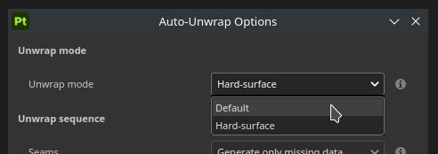
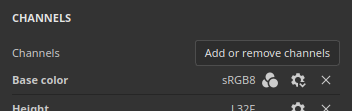
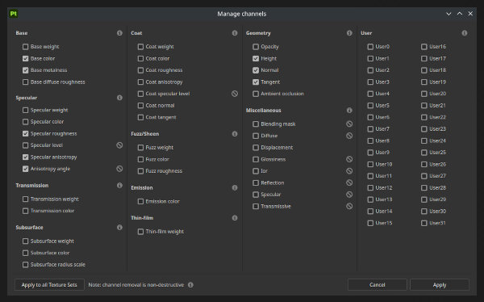

# バージョン 12.1

<b>Substance 3D Painter 12.1</b>では、自動リベイクおよびスキュー補正ペインティング、OpenPBRマテリアル定義のサポート、および自動UVアンラップ用の新しいハードサーフェスモードによるベイク処理ワークフローが向上しました。

リリース日： <b>2026年6月22日</b>

>[!NOTE]
>
> サポートされるmacOSの最小バージョンが13.0(Ventura)に更新されます。 詳しくは、[必要システム構成のページ](../getting-started/system-requirements.md)をご覧ください。

## 主な機能

### スキュー描画でのベイク処理ワークフローの改善

ベイク処理ワークフローが修正され、連続したリベイク処理、メッシュ上のスキュー補正ペイント、エッジ保護、再設計されたメッシュマップリストがサポートされるようになりました。

* <b>自動リベイク処理</b>

  メッシュマップは、ベイク処理パラメータを調整するときに連続的に再ベイク処理できるため、変更のたびに手動でベイク処理を開始する必要がなくなります。 自動リベイク処理はマップごとに切り替えられ、一度に1つのマップに適用されます。 これは、スキューのペイントワークフローで特に便利ですが、一般的なベイク処理の設定を調整する場合にも便利です。

  

* <b>ゆがみ補正のペイント</b>

  ケージを<b>距離ベース</b>モードに設定すると、低ポリメッシュに直接スキュー補正をペイントして、ベイク処理時に使用される投影方向を制御できます。 ブラシ、消しゴム、および多角形の塗りつぶしツールが使用可能です。コンパクトなグレースケール値ピッカー、シンメトリー、および通常のブラシコントロールが用意されています（<b>Ctrl +右クリック</b>でブラシのサイズを変更、<b>X</b>でペイントされた値を反転）。 ゆがみペイント操作は取り消すことができます。

  

* <b>エッジ保護</b>

  スキュー補正をペイントする場合、新しいエッジ保護オプションを使用すると、ハードエッジに投影された高ポリゴンの柔らかさが保持されます。 その結果は、<b>エッジ距離</b>および<b>エッジコントラスト</b>パラメーターによって制御されます。

  

* <b>再設計されたメッシュマップリスト</b>

  メッシュマップリストでは、マップをビューポートとして切り替える<b>プレビュー</b>、<b>クイックベイク</b>単一マップとして切り替える、<b>自動リベイク</b>および<b>同期</b>の設定をテクスチャセット間で切り替える（プロジェクトに複数のテクスチャセットがある場合に利用可能）マップ単位のコントロールが提供されます。 各コントロールには、カーソルを合わせたときにツールチップが表示されます。

  

* <b>簡略化されたベイクボタン</b>

  ビューポートベイクボタンは、ベイク処理するマップの数を表示する単一の<b>ベイク</b>ボタンに置き換えられました（テクスチャセットx UVタイルx選択されたメッシュマップ）。

  

>[!NOTE]
>
> ベイク処理の詳細については、[専用ドキュメントページ](../baking/baking.md)を参照してください。

### OpenPBR のサポート

シェーディングモデルがPainterでサポートされるようになり、デフォルトワークフローとして使用されるようになりました。これにより、アプリケーション間で伝送できる標準化されたマテリアル定義が提供されます。

* <b>新しいOpenPBRシェーダーと既定のワークフロー</b>

  OpenPBR 1.1仕様を実装するシェーダがデフォルトで使用できます。 テンプレートを使用せずに作成された新しいプロジェクトではOpenPBRシェーダが使用され、新しいプロジェクトウィンドウの最初のエントリには、<b>ASM</b>ではなく<b>OpenPBR</b>というラベルが付けられます。 OpenPBR用の新しいプロジェクトテンプレートが含まれ、サンプルプロジェクトが更新されて使用されます。

  

* <b>読み込み時にプロジェクトテンプレートからシェーダが選択されました</b>

  USDまたはGLTFファイルを読み込むときに、ファイルの内容から推測するのではなく、プロジェクトテンプレートからシェーダを設定できるようになりました。 マテリアルとテンプレートで不一致のワークフローが使用されている場合は、ログにメッセージが記録されます。

  

* <b>エクスポートに関するOpenPBR名前付け規則</b>

  <b>テクスチャの書き出し</b>ウィンドウに、命名規則を選択するための新しいドロップダウンが追加されました。 プロジェクト内の少なくとも1つのシェーダがOpenPBRを使用し、選択したスキームが各テクスチャセットのマップのリストに反映される場合は、デフォルトでデータが使用されます。

  

* <b>USDとMDLのサポート</b>

  OpenPBR資料はUSDフォーマットでサポートされています。 新しいMDLが追加され、IrayでOpenPBRマテリアルをレンダリングできるようになり、より正確なマテリアル表現が提供されます。

>[!NOTE]
>
> カスタムシェーダを更新する必要がある場合があります。 シェーダー APIがサポートOpenPBRに変更されました。詳細については、アプリケーションのヘルプメニューにあるchangelogを参照してください。

### 新しいハードサーフェスの自動アンラップ

ハードサーフェスアセットに合わせてカスタマイズされた、新しい自動アンラップモードが追加されました。

* <b>ハードサーフェスのラップ解除モード</b>

  <b>ハードサーフェス</b>オプションは、自動アンラップ設定で使用できます。 これによりUVのゆがみが最小限に抑えられ、UVレイアウトが直交投影で整列されます。このため、メカニカルメッシュやハードサーフェスメッシュに適しています。

  

>[!NOTE]
>
> 自動アンラップの詳細については、[専用ドキュメントページ](../features/automatic-uv-unwrapping.md)を参照してください。

### その他

このバージョンでは、追加機能と機能強化が追加されています。

* <b>複数のチャンネルを一度に追加または削除</b>

  OpenPBRの取り込み後、<b>テクスチャセット設定</b>からアクセスできる新しいウィンドウでは、複数のチャンネルを一度に選択できます。これは、OpenPBRワークフローで使用する大きなチャンネルリストを設定する場合に便利です。

  * 新しいウィンドウは、<b>チャンネルの追加または削除</b>ボタンを使用して、テクスチャセット設定でアクセスできます。

    

  * ウィンドウには、Painterで使用できるすべてのチャンネルの概要が表示されます。

    

  * <b>すべてのテクスチャセットに適用</b>ボタンを使用すると、すべてのテクスチャセットのチャンネル構成を一度に編集できます。

    

* <b>テクスチャセット間ですべてのインスタンスを統合します</b>

  新しい<b>すべてのインスタンスを統合</b>オプションは、インスタンス化されたレイヤーおよびグループで使用できます。 インスタンスが表示されるすべてのテクスチャセットに対して、インスタンスのツリー全体を下に向かってフラット化された結果が生成され、単一の取り消し手順として記録されます。

  

* <b>元に戻す操作の統合履歴</b>

  ベイク処理モードとペイントモードで同じ取り消し履歴が共有されるようになりました。 ベイクモードとペイントモードの切り替えは取り消し可能な手順として記録されるため、アクションは発生したモードでのみ取り消すことができます。

## チュートリアル

Youtubeの最新チュートリアルをご覧ください。

## リリースノート

### 12.1.2

リリース日： **2026/08/03**

概要： **マイナーリリース**

**修正済み：**

* \[クラッシュ\]一部のSubstanceは、レンダリング時にクラッシュする可能性があります
* \[クラッシュ\]ベーキングモードでメッシュを再読み込み
* \[クラッシュ\]グラフィック表示の初期化に失敗すると、クラッシュする場合があります
* \[クラッシュ\]テクスチャの書き出しは、ログの更新中にクラッシュすることがあります
* \[クラッシュ\]環境マップの読み込み/更新時に、ベイクモードでクラッシュすることがある
* \[Baking\]高ポリファイルを修正した後にベイク処理を再起動すると、フリーズする場合がある
* \[Photoshopに送信\]レイヤーのマスクを書き出せない
* \[Engine\]アンカーポイントの結果が、マスクとカラーチャンネル間でレンダリングされない

### 12.1.1

リリース日： <b>2026/07/09</b>

概要：マイナーリリース

追加：

* [スキューのベイク処理]スキューの基準法線モードを表示：メッシュまたは三角形ごと
* [プロパティ]均一な色を常にチャンネルの既定値にリセットする
* [OpenPBR] 出力テンプレートを作成するために、テクスチャの書き出しウィンドウでカテゴリ別にチャンネルを再編成します
* Substanceエンジンをバージョン9.4.5にアップデートする

修正：

* [プロジェクト]一部のプロジェクトを開いたり保存したりするのに、通常より時間がかかる場合があります
* [クラッシュ]複数のメッシュを再読み込みすると、クラッシュする場合があります
* [クラッシュ]マスクビューモードでチャンネルを削除すると、クラッシュします
* [クラッシュ]一部のSubstanceは、レンダリング時にクラッシュする可能性があります
* ペイントモードに切り替えた後も、[スキューのペイント]で選択したツールが選択されたままになる
* [共通の設定のベイク処理]ケージの距離の設定で、ケージのワイヤーフレームとシェーダのビジュアライゼーションが更新されない
* [エンジン] UVパディングの「3Dスペース近隣」モードが細い三角形で適切に機能しません
* [エンジン]のアンカーポイントの結果が、マスクとカラーチャンネルの間でレンダリングされません

### 12.1.0

リリース日： <b>2026/06/23</b>

概要： <b>このアップデートはメジャーリリースであり、新しいベイク処理のデフォルトUIステート、スキューのマップのペイント、自動リベイク処理、ハードサーフェスメッシュおよびOpenPBRの自動UVアンラップの新しいオプションを備えたベイカー機能が強化されています。 詳細については、完全なリリースノートを参照してください。</b>

<b>追加済み</b>:

* [ゆがみベイク]スキュー描画ツール
* [スキューのベイク処理]スキューのマップをペイントするときに、スキューのプレビューシェーダとスキュー方向ベクタービジュアルを追加する
* [ゆがみベイク]エッジ保護オプションを追加
* [スキュー焼き付け]オートリベイク
* [スキューのベイク処理]メッシュマップリストのリワークUI
* [スキューのベイク処理]メッシュマップの分割/共通ベイク処理設定+メッシュマップリストから共通設定を移動ベースカラーまたはマスクのみ
* [スキューベイク]ビューポートのツールバーボタンを変更する
* [ゆがみベイク]上部ツールバーの[ブラシのシンメトリを表示]切り替え
* [スキューのベイク]メッシュマップリストの同期メニューの名前変更オプション
* [スキューのベイク処理]同期ダイアログとチェック済み状態ダイアログを更新
* [ゆがみベイク]グレースケールカラーピッカーのバリエーションを作成
* [ゆがみベイク処理]ベイクモードアイコンを更新
* [自動アンラップ] [ハードサーフェスを統合]オプション
* [OpenPBR] OpenPBR 1.1のサポートを追加する
* [OpenPBR] OpenPBRをデフォルトのワークフローおよびシェーダにする
* [OpenPBR] USDでOpenPBRマテリアルとテクスチャを読み込む
* [OpenPBR] USDでOpenPBRマテリアルとテクスチャを書き出す
* [OpenPBR] [テクスチャを書き出し]ウィンドウを更新して、OpenPBRの命名規則を表示します
* [OpenPBR]サポートOpenPBRの変更点に関するドキュメントを追加する
* [OpenPBR]&#x200B;[Iray] IrayでOpenPBR 1.1をサポートする新しいMDLを追加
* USDの書き出しに関するいくつかのマイナーな改善
* [UI]別のテクスチャセットにペイントしようとすると、ビューポートに警告が表示される
* [フラット化]テクスチャセット全体でインスタンス化されたすべてのレイヤをフラット化できるようにします
* [テクスチャセット設定]新しいウィンドウで複数のチャンネルを一度に選択できます
* [履歴] 「値」を更新するエントリの文言を元に戻してパラメーター名を反映させる
* [レイヤースタック]マスクの塗りつぶし効果のデフォルトを白(1.0)にする
* [Substance]新しい「mesh_hard_edges_triangle」エンジンマップ入力を追加します
* [Substance]新しい「mesh_hard_edges」エンジンマップ入力を追加します
* [シェーダ]シェーダインスタンスが同じ名前を共有できないようにする
* [シェーダ] USDまたはGLTFファイルを読み込むときに、プロジェクトテンプレートのシェーダを使用します
* Adobe Color Engineをバージョン7.0にアップデートする
* MacOS Xの最小バージョンを13.0にアップグレード(Ventura)
* [コンテンツ] OpenPBRの新しいプロジェクトテンプレート
* [コンテンツ]新しいOpenPBRシェーダを使用するためにサンプルプロジェクトを更新する
* [Python]ジオメトリマスクAPIを拡張して、UIのような包含モードと除外モードを許可する

<b>固定</b>:

* [クラッシュ]&#x200B;[メッシュマップ設定]他のテクスチャセットに設定を適用する
* [クラッシュ]ワールド空間法線を使用せずにマップから曲率をベイク処理すると、
* [クラッシュ]&#x200B;[ベーキング]カスタムケージを有効にしたが、ファイルが選択されていない場合のベイク処理がクラッシュする
* [クラッシュ] AOベイク処理をキャンセルする
* [自動ケージ]高ポリゴンファイルパスが無効な場合の無限荷重
* [Linux]&#x200B;[Windows]カラーピッカーが完全に黒くなったり、表示されないことがある
* [ポリゴン塗り潰しツール]ツールがPBR以外では機能しない
* &lbrack;[Paint]ベースカラーチャンネルを削除しても、以前にペイントしたカラーは削除されません
* [USD]シェーダーインスタンスがすべて正しく検出されない
* [Substance]入力/出力ノードの最初の使用のみが考慮されます
* [シェーダ]異なるミキシング方式を使用したテクスチャセットでアンビエントオクルージョンが2回適用される
* [エンジン]青チャンネル（黒）が空の通常のテクスチャでは、正しいブレンド結果が得られない場合がある
* [GLTF読み込み]すべてのテクスチャセットでAlpha描画が有効になる
* [GLTF書き出し]書き出し時にAlphaの描画が常に有効になる
* [書き出し] GLTFファイルを読み込むときに、両面ジオメトリが常に無効になる
* [Javascript]シェーダ設定の変更が取り消し履歴に影響しない
* [サンプル] [マテリアルを合わせる]の[表示設定]で、サブサーフェススキャタリングが有効になっていません
