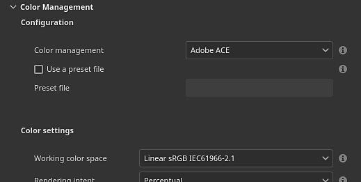
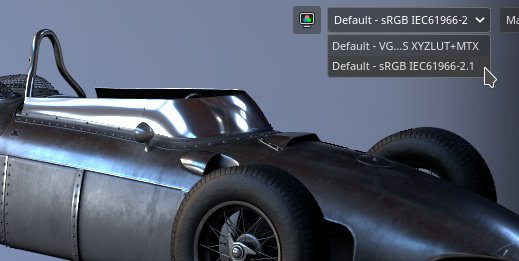
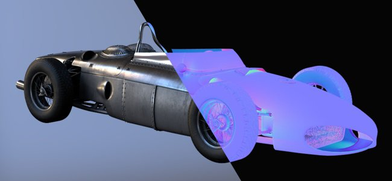
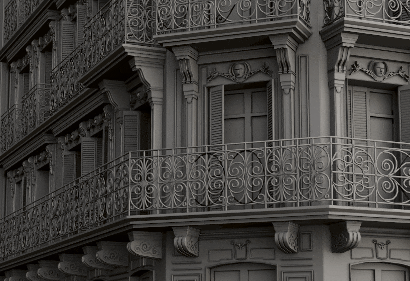
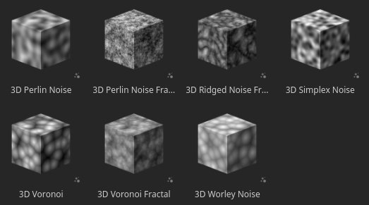

# バージョン8.1

**Substance 3D Painter 8.1**&#x200B;は、ICCプロファイル、新しいベイカー、新しい3D ノイズ、20個の経年劣化マップ、改良されたスポイトをサポートするAdobe Color Engine (ACE)を統合しています。

リリース日： *2022年6月7日*

## 主な機能

### Adobe Color Engineを使用した新しいカラーマネジメント（ICCサポート）

今回のバージョンでは、カラーマネジメントシステムが拡張され、Adobe Color Engine(ACE)がサポートされるようになりました。これにより、ICCプロファイルの使用がロック解除されます。 この新しいシステムでは、Photoshopを含む幅広いアプリケーションでカラーを一致させることができます。

* **新しいプロジェクト設定**\
  新規プロジェクトの作成時に、新しく追加された&#x200B;**Adobe Color Engine** (ACE)を使用してカラーマネジメントエンジンを指定できるようになりました。

  {width="400px"}

  ACEには、次の作業用カラースペースが付属しています。

  * **リニアsRGB**
  * **ACEScg**
  * **リニアAdobe RGB**
* **ICCプロファイルサポートの監視**\
  ICCプロファイルを使用してビューポートの外観を調整し、カラーをモニターに一致させることができます。

  {width="400px"}

* **ICCプロファイルが埋め込まれた画像の読み込みと書き出し**\
  ビットマップを読み込むときに、ICCプロファイルを自動的に抽出できます。 レイヤープロパティでそのプロファイルを上書きすることもできます。\
  書き出すときには、テクスチャファイルに埋め込む目的のICCプロファイルを指定することができます。

  {width="400px"}

* **新しいJSONテンプレート設定**&#x200B;プロジェクト間で設定を共有および再利用するために、プリセットファイルを指定できます。 プリセットの仕様の詳細については、[専用ドキュメント](../features/color-management/color-management-with-adobe-ace-icc.md)を参照してください。

>[!NOTE]
>
> 詳細については、[カラーマネジメント](../features/color-management/color-management.md)のドキュメントを参照してください。

### マテリアルの新しい物理サイズサポート

マテリアル内のサイズを使用して、塗りつぶしレイヤー投影内のスケールとタイリングを制御できるようになりました。 これは、サーフェス上のマテリアルを実際のサイズに合わせて推測する必要なしに適切に一致させる場合に便利なツールです。

* **新しい塗りつぶしレイヤーパラメーター**\
  塗りつぶしレイヤー（または効果）には、物理サイズが定義されている場合に、マテリアルのタイリング/繰り返しを制御するための新しいパラメーターがあります。 これらの新しいパラメーターは、3D 投影でのみ使用できます。

  {width="400px"}

* **新しいグリッド**\
  物理サイズをわかりやすく、見やすくするために、[ディスプレイ設定](../interface/display-settings/display-settings.md)ウィンドウで3D ビューポートのグリッドをアクティブ化できるようになりました。\
  有効にすると、ズームのレベルに基づいてグリッドが自動的に再分割されます。 グリッドユニットは、ビューポートの左下に表示されます。

  {width="400px"}

  {width="400px"}

>[!NOTE]
>
> 詳細については、[専用ドキュメント](../features/physical-size.md)を参照してください。

### 新しいベイカー

この3つの新しい機能により、DesignerとPainterの間のギャップが埋まり、テクスチャリングとレンダリングの可能性が広がります。

これらはベイカーリストに追加されましたが、デフォルトでは無効になっています。

新しいベイカーは次のとおりです。

* **ベイカー** Bent normalsベイカーを使用すると、オクルージョンの方向を（法線マップと同様のベクターとして）ベイクできます。 このテクスチャは、[シェーダー設定](../interface/shader-settings/shader-settings.md)ウィンドウの&#x200B;**曲げ法線**&#x200B;設定を有効にすることで、ビューポートのシェーディングを向上させるために使用できます。 Bent normalsを使用すると、リアルタイムのビューポートシェーディングの精度が大幅に向上します。\
  **拡散シェーディング**&#x200B;の場合、より正確なオクルージョンが得られ、ほぼ全体のイルミネーションのように見えることがあります（下の最初の例）。\
  **Specular反射**&#x200B;の場合、セルフシャドウイングをシミュレートし、漏れる光の量を減らすことができるため、特にメタリック面でオブジェクトが大きく接地しているように感じられます（下の2番目の例）。

  {width="350px"}

  {width="400px"}

* **ベイカー**\
  ベイカーを使用すると、モザイク分割されたメッシュにディスプレイスメントを生成するために使用できるグレースケールテクスチャとして、低ポリゴンメッシュと高ポリゴン粒子の差をベイクできます。 たとえば、平面に対してスキャン情報をベイクする場合などです。

  {width="400px"}

* **不透明度のベイカー**\
  不透明度ベイカーを使用すると、高ポリゴンのメッシュから穴を示す白黒のマップが作成されます。 例えば、布の表面の内側にフェンスや穴をベイクするために使用できます。

### 新規コンテンツ

このリリースでは、次のような様々な新しいコンテンツが追加されています。

* **100を超えるプリセットを備えた、新しく改良された3D ノイズ**\
  既存の3D ノイズが修正され、3つの新しい要素が追加されました。 それぞれに定義済みの設定が含まれるようになり、7つのノイズに合計105のプリセットが提供されます。 これらのプリセットを出発点として使用し、パラメーターを調整して、特定の外観を得ることができます。 3D ノイズの場合も通常ですが、シームレスで、目立つパターンもなく非常に簡単に繰り返すことができます。

  3D ノイズを見つけるには、アセットパネルの「手続き」セクションに移動します。

  {width="400px"}

  ノイズは、非常に幅広い可能性を提供します。例えば、**3D Voronoi Fractal**&#x200B;で使用できるプリセットを次に示します。

  {width="300px"}

* **20個の新しい経年劣化ビットマップと2つの布パターン**\
  既存のパターンの範囲を拡張するために、デフォルトの内容で新しいグランジのセットが追加されました。 これらは、**プロシージャ/グランジビットマップ**&#x200B;にあります。\
  **プロシージャ>ファブリック**&#x200B;では、2つの布地パターンも使用できます。

  {width="400px"}

>[!NOTE]
>
> 一部の3D ノイズは、最初の使用時に計算に数秒かかる場合があります。

### スポイトとマテリアルピッカーの改善

カラーの抽出と管理を容易にするため、スポイト機能がいくつか改善されました。

* **新しいピッキングモード**\
  カラーを選択する場合、マウスの移動中にマウスのクリックを押し続ける必要はありません。 スポイトをシングルクリックし、マウスを目的の場所に移動してから、もう一度クリックすると、カラーをキャプチャできます。

* **新しいスポイトボタン**\
  カラーボタンの横に新しいスポイトアイコンがあります。このアイコンを使用すると、最初にカラーピッカーを開かなくてもカラーをキャプチャできます。

  {width="400px"}

* **新しいスポイトツールのキーボードショートカット**\
  カラーピッカーウィンドウが開いているときに、**I**&#x200B;を押して専用のアイコンをクリックしなくてもスポイトモードに切り替えることができます。これにより、選択とペイントをすばやく繰り返し実行できます。

* **スポイト中の新しいプレビュー**\
  スポイトツールを使用してカラーを選択する場合、マウスの横に新しいプレビューが表示されません。 このプレビューもカラーマネジメントされます。

  

* **チャネルに直接追加する新しい選択**\
  新しいスポイト機能を使用すると、メッシュ上のチャンネルを直接選択できます。 Shiftキーを押しながらドラッグするだけで、チャンネルから直接カラーを選択できます。 チャンネルは、スポイトを開始した場所から決定されます。 この方法では、正確なカラーを取得するためにカラーマネジメントで重要なカラー変換をバイパスします。 カラーのキャプチャ元のチャンネルを示すツールヒントが表示されます。

  

* **カラーをキャプチャするときの新しいカラースペース設定**\
  カラーマネジメントが有効になっている場合、カラーピッカーで新しい設定を使用して、カラーをキャプチャするときに使用するカラースペースを指定できます。 この設定はPainterのセッションに対してグローバルであり、プロパティウィンドウのカラーボタンの横にあるスポイトボタンにも適用されます。

  

* **マテリアル選択の動作を改善しました**\
  ツールツールバー（キーボードショートカット P）のマテリアルピッカーが、プロパティウィンドウ内のチャンネル選択を反映するようになりました。 チャンネル自体では有効になりません。

  {width="400px"}

### 自動ラップ解除機能の向上

自動ラップ解除プロセスにより、より自然なセグメント化が可能になります。

現在では、メッシュは個別のUV アイランドに切り分けられ、手作業、特に有機メッシュで行うことができるものに近づいています。

## リリースノート

### 8.1.0

*（2022年6月7日リリース）*

**追加：**

* [カラーマネジメント] Adobe Color Engine付きICCプロファイルのサポートを追加(ACE)
* [カラーマネジメント] ICCの作業用カラースペースとして「Adobe 98 RGB」のサポートを追加
* [カラーマネジメント]設定ファイルを使用してACE/ICC設定を許可する
* [カラーマネジメント]レガシーモードでカラーピッカーにリニアカラー値を入力できます
* [カラーマネジメント] UI外でカラーを選択するために使用するカラープロファイルを指定できます
* [カラーマネジメント] ビューポートで最後に選択した表示値を記憶
* [カラーマネジメント]&#x200B;[Substance]カラーマネジメントでジェネレーター/フィルターが正しく動作するようにする
* [カラーマネジメント]&#x200B;[Substance]新しいカラースペースオーバーライドキーワード$workingと$standardsrgbを追加
* [物理サイズ]&#x200B;[エンジン] メッシュから物理サイズ情報を抽出します
* [物理サイズ]&#x200B;[エンジン] 物理サイズ計算
* [物理サイズ] UIで物理サイズを使用するオプションを表示する
* [物理サイズ] ビューポートにビジュアルヘルパーを追加する
* [ベイク] Heightベイカーを追加
* [ベイク] Bent normalsを追加ベイカー
* [ベイク]不透明度ベイカーを追加
* [スポイト]新規カラーピッカーのプレビュー
* [スポイト]カラーピッカーパネルを再度開くと、パネルが最後の位置に表示される
* [スポイト] マテリアルピッカーの新しいアイコン
* [スポイト]カラーピッカーのチャンネルプレビューのカラー管理
* [スポイト]クリックして選択する機能をスポイトに追加します
* [スポイト] マテリアルピッカーが非アクティブチャンネルをアクティブにしません
* [スポイト] ショートカットでスポイトを使用できるようにする
* [スポイト]スポイトが関連するチャンネルをピックアップします（該当する場合）
* [スポイト]カラーピッカーモードに入ると、すべてのショートカットが無効になる
* [スポイト] 16進フィールドの自動選択を解除
* [スポイト] マテリアルピッカーの使用中にパネルを閉じない
* [スポイト]チャンネルを選択できないときに新たに無効になった状態
* [書き出し] glTF書き出しに正接属性を追加
* Substance engineをv8.4にアップデートする
* 自動ラップ解除を0.9.0に更新する
* Qt 5.15.8にアップデートします。
* Python 3.9にアップデートする
* [シェーダ] [法線を曲げる]シェーディングのサポートを追加
* [MacOS] 3DConnection SpaceMouseのサポート
* [Python] APIで使用されているPythonバージョンをドキュメント化する
* [コンテンツ] 105のプリセットで6つの新しい3Dノイズを追加
* [コンテンツ] 20個の新しい経年劣化マップと2つの布地折り目パターン
* [コンテンツ] 「メッシュマップ」書き出しプリセットを更新して、新しいベイカーを使用する
* [コンテンツ]テクスチャセットの解像度に依存してぼかし勾配とワープフィルター
* [コンテンツ] 3つの新しいパン屋を使用するために、サンプルプロジェクトを更新する

**修正済み：**

* [glTF]特殊文字を含むglTFを開くことができません
* [Engine] 異方性とSVTが無効な場合のアーティファクト
* [MacOS]&#x200B;[M1]スマートマテリアルが正しく表示されない
* [メッシュ処理] Modelerからメッシュをインポートできません
* [UI]カラーマネジメントが有効になっている新規プロジェクトウィンドウの水平スクロールバー
* [カラーマネジメント]一部のOCIO設定で、カラーピッカーに作業用スペースの値が表示されない
* [カラーマネジメント]ビューポートのブラシプレビューがカラーマネジメントされない
* [SpaceMouse]フォーカスを変更してもピボットがすぐに更新されず、場合によってはモデルから外れる
* [書き出し]&#x200B;[USD]書き出したUSDファイルの構造が間違っています
* [USD]書き出し時の周囲オクルージョンの問題
* [コンテンツ]サムネールのメッシュを更新してプレビュー球のサンプルプロジェクトと一致させる

**既知の問題：**

* 拡散パディングを使用してテクスチャを書き出すと、黒いマップがレンダリングされる
* 通常/周囲オクルージョンのミキシングが壊れている
* [MacOS] Irayを起動するとクラッシュすることがある
* [プレビューサムネール]アンカーを使用しても、簡略化されたサムネールが更新されない
* [カラーマネジメント] Linux上のACEを使用したHDRカラースペース変換では、カラーがクランプされます
