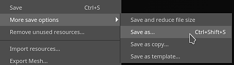

# バージョン8.2

**Substance 3D Painter 8.2**&#x200B;は、アプリケーションの複数の領域における専用機能により、多くの品質の向上に重点を置いています。

リリース日： *6 October 2022*

## 主な機能

### 描画モードと不透明度を適用する新しいオプション

レイヤースタックの複数のチャンネルに描画モードと不透明度をすばやく簡単にコピーして適用できるように、いくつかのショートカットとアクションが追加されました。

* **描画モードまたは不透明度コントロールを右クリック**\
  描画モードまたは不透明度を右クリックしてアクション&#x200B;**「すべてのチャンネルに適用」**&#x200B;を選択すると、レイヤーの他のすべてのチャンネルでこの描画モードが使用されます。 このアクションは、描画モードと不透明度を制御するエフェクトでも使用できます。

  

* **レイヤーを右クリックし、描画オプションを選択します**\
  レイヤー（またはエフェクト）を右クリックして、次のいずれかのアクションを選択することもできます。

  * **すべてのチャンネルにブレンドを適用** ：現在のレイヤー/エフェクトの他のすべてのチャンネルに、現在のチャンネルのブレンドモードを適用します。
  * **すべてのチャンネルに不透明度を適用** ：現在のチャンネルの不透明度を、現在のレイヤー/エフェクトの他のすべてのチャンネルに適用します。
  * **両方のチャンネルに適用**：現在のレイヤー/エフェクトの他のすべてのチャンネルに、現在のチャンネルの描画モードと不透明度を適用します。
  * **チャンネルのブレンド設定をコピー** ：現在のレイヤー/エフェクトのすべてのブレンドモードと不透明度の値をクリップボードにコピーします。
  * **チャンネルのブレンド設定をペースト** ：現在クリップボードにある描画モードと不透明度の値を、ターゲットのレイヤー/エフェクトに適用します。

  

### フィルターおよびカラー選択効果の新しい描画モードと不透明度

フィルターおよびカラー選択エフェクトで、描画モードと不透明度のコントロールを使用できるようになりました。

* **フィルターの描画モードと不透明度**\
  フィルターでは、描画モードと不透明度の値を使用できるようになりました。 以前と同じ動作を維持し、アルファコンポーネント情報を2倍にすることを避けるために、既定では&#x200B;**Replace**&#x200B;に設定されています。 フィルターの描画モードを使用すると、エフェクトを計算し、その結果をレイヤー上で直接組み合わせることができます。これにより、同じ結果を得るためにアンカーポイントと塗りつぶしエフェクトを使用する必要がなくなります。 これにより、フィルター自体の内部に描画モードを手動で実装する必要がなくなります。

  

* **カラー選択の描画モードと不透明度**\
  カラー選択エフェクトが変更され、描画モードと不透明度のコントロールがサポートされるようになりました。 以前はこのエフェクトでアルファ結果を出力していましたが、描画モードを想定どおりに動作させるために、出力する背景色を指定する新しい設定が追加されました。 この値は、透明（従来の動作）ではなく黒に設定されます。

  

  

* **簡略化された効果のスタック**\
  以前は、特定の方法でエフェクトを組み合わせる必要がある場合（描画モードを使用する場合など）、アンカーポイントと塗りつぶしエフェクトの使用が必要でした。 フィルターに描画モードを直接適用できるようになりました。これにより、エフェクトのスタックの複雑さを大幅に軽減できる必要はなくなりました。

  {width="400px"}

### フォルダーへの新しいエフェクト

フォルダーコンテンツ（レイヤーのカラー部分）で、あらゆる種類のエフェクトを適用できるようになりました。 以前は、同じ結果を得るために、複雑なレイヤー設定（パススルーレイヤーやアンカーポイントなど）を作成する必要がありました。

### 新しいSubstanceアーカイブ(SBSAR)書き出し

Substanceアーカイブ(SBSAR)ファイル形式が、テクスチャの書き出し時に使用できるようになりました。 SBSARは、Substanceを統合した多くのアプリケーションで開くことができるコンテナです。このコンテナを使用すると、「プラグアンドプレイ」のカスタムテクスチャをより迅速かつ簡単に作成できます。

* **Substanceアーカイブ(SBSAR)をエクスポートしています**\
  **テクスチャの書き出し**&#x200B;ウィンドウのファイル形式の一覧からSBSARファイル形式を指定できるようになりました。 これにより、指定されたすべてのテクスチャを含む単一のSBSARファイルが書き出されます。 出力ノードの名前とその使用方法は、選択した書き出しプリセットとそのチャンネルタイプから定義されます。

  

* **PSDおよびSBSARファイル形式のハイブリッド書き出しプリセット**\
  書き出しプリセットで、他のすべての画像形式に加えて、PSDまたはSBSARとして出力マップを指定できるようになりました。 PSDおよびSBSARフォーマットは「コンテナ」と見なされます。つまり、複数のテクスチャを内部に格納できます。 エクスポートプリセットでコンテナフォーマットとスタンドアロンイメージフォーマットの両方が指定されている場合、SBSARファイルをターゲットとするテンプレート内の出力はすべてグループ化され、他の出力は個別のファイルとしてエクスポートされます。

  

### 3Dモデルの下に光を当てる新しい環境オプション

[ディスプレイ設定](../interface/display-settings/environment-settings.md)内の新しい設定により、環境マップをカメラに合わせることができるため、3Dモデルの下の照明の角度を調整したり、パーツを明るくしたりできます。

この新しい設定を使用するには、[表示設定](../interface/display-settings/environment-settings.md)に移動し、**環境の配置**&#x200B;の設定を変更します：

* **ワールド**：環境マップがシーンに合わせられています。
* **ローカル**：環境マップはカメラに合わせられています。

シャドウは、この設定の構成に基づいて自動的に調整されます。

### 新しいお気に入りと「アセット」ウィンドウでの削除/再読み込み

リソースの管理をより便利にするために、新しいアクションが[アセット](../interface/assets/assets.md)ウィンドウに追加されました。

* **お気に入りのリソースを使ってすばやく検索する**\
  「アセット」ウィンドウで任意のリソースを右クリックして、お気に入り（またはお気に入りを解除）します。 検索クエリでは、常にお気に入りのリソースが最初に並び、その隅に星タグが表示されます。これにより、お気に入りのリソースが目立つようになり、アクセスしやすくなります。 専用の検索クエリも追加され、お気に入りのすべてのリソースを簡単に表示できるようになりました。

  {width="350px"}

* **ディスク上のリソースの削除と再読み込み**\
  ユーザーライブラリにあるリソースを削除、再ロード、名前変更できるようになりました（SubstanceグラフやABRブラシなどの、パッケージの一部であるリソースを除く）。

### その他の機能と改善点

この新しいバージョンには、以下のような小さな改良や機能が数多く追加されています。

* **新しいようこそ、および新機能ウィンドウ**\
  アプリケーションに追加された新機能に関する情報を常に受け取れるように、アプリケーションの起動時に新しい「ようこそ」ウィンドウと「新機能」ウィンドウを導入しました。 これらのウィンドウは簡単に閉じることができ、次回の起動時に再表示されることはありません。 **ヘルプ**&#x200B;メニューを使用して、いつでも再び開くことができます。

  {width="400px"}

  {width="400px"}

* **3Dモデルをすばやく再読み込みするための新しいアクション**\
  新しいキーボードショートカット（デフォルトでは&#x200B;**CTRL + SHIFT + R**）が追加されました。これにより、現在のプロジェクトの3Dモデルをすばやく再読み込みできます。 これにより、アセットの繰り返しが簡単かつ迅速になります。 ソースファイルが見つからない場合、ログにエラーメッセージが表示されます。 **編集**&#x200B;メニューにもアクションが追加されました。

  

* **HDPIサポートの向上**\
  HDPI画面およびシステムのスケーリングに関していくつかの修正が行われています。 中間のスケーリング値(例： 125%)は、特定の画面でインターフェイスが大きすぎたり小さすぎたりするのを避ける必要があります。 スケーリング値が異なるHDPI画面間でのウィンドウの移動も正しく動作するはずです。

* **Substanceグラフパラメーターを既定にリセットする**\
  Substanceグラフが使用されるすべての場所（アルファ、マテリアル、フィルタなど） パラメーターをデフォルトにリセットできるようになりました。

  * **すべてのパラメーターをリセットする**:パラメーターの一覧の下にある[既定値に戻す]ボタンを使用して、Substanceリソース全体をリセットします。
  * **右クリック**：特定のパラメーターを右クリックすると、このパラメーターに固有のリセットアクションを含むメニューが開きます。

   

* **ビューポートで個々のRGBAコンポーネントを表示する**\
  ビューポートでチャンネルを見ると、**表示設定/チャンネル表示**&#x200B;に&#x200B;**カラーチャンネル**&#x200B;という新しい設定があり、これを使用してRGBAコンポーネントを個別に見ることができます。 これは、テクスチャを分析したり、ユーザチャンネル内の特定のコンポーネントを分離したりするのに便利です。

  

  {width="450px"}

* **128を超える塗りつぶしレイヤーと効果をタイリング**\
  塗りつぶしレイヤーとエフェクトのタイリングパラメーターがソフト範囲に変更されました。 これにより、任意のタイリング値を入力できるようになります。 スライダーのデフォルトの範囲も、ドラッグしやすくするために[-128,128]から[-32,32]に縮小されました。

  

* **新しい16fおよび32f EXRテクスチャ書き出し設定**\
  以前は、EXRテクスチャの書き出しはインターフェイスで32fビットに強制されていましたが、実際のファイル内では16fビットデータ（半浮動小数点）が生成されていました。 現在は修正されており、16fから32fのビットを選択する可能性があります。 古いプロジェクトおよびEXRをファイル形式として使用した書き出しプリセットでは、古い動作を考慮してデフォルトで16fビットに設定されます（主に以前よりもファイルサイズの大きいファイルが作成されないためです）。

  

* **UIレイアウトの書き出しと再読み込み**\
  UIレイアウトを保存して再読み込みするための新しいアクションは、**Windows**&#x200B;メニュー内にあります。 これにより、レイアウトを切り替えたり、UIを保存してコンピューター間で再利用したりするときの利便性が向上します。 現在の2つのPainterモード（レンダリングとペイント）には独自のレイアウトがあります。 Pythonでは、UIレイアウトの保存と再読み込みを行うための関数も用意されています（下記参照）。

  

* **ファイルメニューの再編成**\
  高度な保存機能をいくつかグループ化して、ファイルメニューを整理しました。 これらのアクションの一部は、動作を明確にするために名前が変更されています。

  

* **プロジェクトを開く際のエラーメッセージが改善されました。**\
  アプリケーションの新しいバージョンで作成されたプロジェクトを開くときに、より役立つメッセージが表示されるようになりました。 メッセージにプロジェクトとアプリケーションの両方のバージョンが含まれるようになり、必要なバージョンに関する情報の収集が容易になりました。

  {width="400px"}

### 改善されたPythonスクリプティング

Python APIにいくつかの新機能が追加されました。 詳細については、アプリケーションのヘルプメニューに表示されるドキュメントを参照してください。

* **substance\_painter.resource**\
  **substance\_painter.resource.Type**&#x200B;では、より多くの種類のリソース、特にSubstanceとPhotoshopのブラシパッケージを特定できるようになりました。\
  リソースオブジェクトの親と子を一覧表示して、SubstanceパッケージやSubstanceグラフなどを切り替えることができるようになりました。

* **substance\_painter.textureset**\
  テクスチャセット設定でメッシュマップを取得および設定するための2つの新しい関数（および列挙）が追加されました： **get\_mesh\_map\_resource()**&#x200B;および&#x200B;**set\_mesh\_map\_resource()**。

* **substance\_painter.ui**\
  UIレイアウトを保存して再ロードするためのいくつかの機能が追加されました。 レイアウトは、現在のアプリケーションモード（ペイントまたはレンダリング）にも依存することに注意してください。

* **substance\_painter.event**\
  新しい&#x200B;**TextureStateEvent**&#x200B;が追加され、テクスチャセットのレイヤースタックの変更やその他のパラメーターの変更を追跡できるようになりました。 このイベントは、ペイントストロークまたはチャンネルの追加/削除によってトリガーされます。

## リリースノート

### 8.2.0

*（リリース：2022年10月6日）*\
概要： **新しいオンボーディングパネル（新しいウェルカムパネルと新機能パネル）、SBSARへの書き出し、フォルダーの効果、生活の質を高めるいくつかの改善、バグの修正を含むメジャーリリース。**

**追加：**

* [オンボーディング]新しいユーザーを歓迎するオンボーディングパネル

  新しいCCユーザーがPainterを初めて開いたときの新しいようこそ画面が追加されました。
* [オンボーディング]新機能を見つけやすくする新機能パネル

  主な新機能が表示される新しい「新機能」画面を追加しました。 メジャーアップデート後にPainterを初めて開くと、このアイコンは自動的に表示されます。このアイコンにアクセスするには、ヘルプ/新機能を選択します。
* [オンボーディング] 「古いようこそ」の名前を「ホーム画面」に変更する

  新しいようこそ画面と混同されないように、古いようこそ画面の名前をホーム画面に変更しました。
* [UI]高DPI画面のスケーリングの問題を解決する

  カスタム表示スケーリングを使用した高解像度画面でのPainter UI適用を改善しました。
* [UI] UIの永続的なエラーメッセージを回避する

  以前のプロジェクトのエラーメッセージが、下部のステータスバーから削除されるようになりました。
* [UI]保存メニューの再処理

  追加の保存オプションがサブメニューでグループ化され、一部のオプションの名前が変更されて一貫性が保たれます。
* [UI] UIレイアウトの保存と書き出し/共有

  ウィンドウメニュー内には、UIレイアウトをファイルに保存し、再ロードするための新しいアクションが追加されています。 ペイントレイアウトとレンダリングレイアウトは別々に保存されます。\
  UIレイアウトを保存、リセット、読み込みするための様々な機能が「substance\_painter.ui」に追加されました。
* レイヤーの描画モード/不透明度にコピー/ペーストアクションを追加

  レイヤーの右クリックメニューに「描画オプション」という新しいエントリを追加しました。 これにより、レイヤー間ですべてのチャンネルの描画モードと不透明度をコピーしてペーストできます。
* レイヤーのすべてのチャンネルに描画モード/不透明度を適用する

  レイヤーの描画モードと不透明度に右クリック機能が追加されました。これにより、現在クリックしている設定をすべてのチャンネルに適用できます。
* キーボードショートカットを使用してメッシュを再読み込み(Ctrl+Shift+R)

  編集可能なショートカットが追加され、使用可能な最後の設定でメッシュファイルが再ロードされました。 編集/メッシュを再読み込みからアクセスすることもできます。
* Substanceパラメーターをデフォルトにリセット

  .sbsarリソースの下部のプロパティに、リソースをデフォルトにリセットできる新しいボタンが追加されました。
* ペイントブラシをデフォルトにリセット

  「プロパティ」の「ブラシ」セクションに新しいメニューが追加され、デフォルトの基本ブラシにリセットできるようになりました。
* 右クリックして個々のSubstanceパラメーターをデフォルトにリセット

  右クリックで.sbsarリソース内の個々のパラメーターをリセットできる機能が追加されました。
* [アセットパネル] 「ピン留め」のお気に入りアセットがアセットパネルの上に表示される

  ライブラリアセットに新しい右クリックオプションが追加されました。これを使用すると、アセットをお気に入りとしてパネルの上部に固定できます。 保存済みの検索を使用して、お気に入りのすべてのアセットを表示することもできます。
* [アセットパネル]アセットの削除、再読み込み、名前の変更

  ユーザーライブラリのアセットを削除、再ロード、名前を変更するための右クリックメニューオプションが追加されました。 ディスク上のライブラリの場所から直接削除され、元の場所から再ロードされます。 .abrや.sbsarなどのパッケージに含まれるアセットは、個別に編集できません。
* [カラー選択]カラー選択効果に描画モードを追加
* [レイヤースタック]フィルターに描画モードと不透明度を追加
* [レイヤースタック]塗りつぶしレイヤー/効果に、128より大きいタイリング値を許可
* [レイヤスタック]塗り潰しレイヤ/効果の円柱投影のシリンダキャップ

  塗りつぶしレイヤープロパティの円筒形投影に、円柱キャップを削除するオプションが追加されました。
* [ログ] UVタイルプロジェクトを作成するときにメッシュパーツが負のスペースにある場合にエラーメッセージを表示する

  UVパーツがネガティブスペースに見つかるため、UVタイルプロジェクトの作成に失敗した場合の、より明確なエラーメッセージが追加されました。
* [プロジェクト]プロジェクトを開くときに、エラーメッセージ「データが新しすぎます」にバージョンを表示する

  アプリケーションにとって新しすぎるプロジェクトを開くと、エラーメッセージにプロジェクトのバージョンが表示されるようになり、適切なアプリケーションバージョンを簡単に特定できるようになりました。
* [ビューポート]下からメッシュに光を当てることができます

  Display Settings > Camera > Environment settingsに新しいEnvironment Alignmentパラメータが追加され、「Local」に設定されている場合に環境マップの照明がカメラに合わせられるようになりました。
* [ビューポート]ビューポート内のビューR、G、B、Alpha（単独表示モード）

  Display Settings > Viewport Settings > Channel displayには、チャンネルのR、G、B、またはAlphaコンポーネントをシングルディスプレイモードでのみ表示できる新しいカラーチャンネル設定があります。
* [シェーダ]ユーザチャンネルをマテリアルレイヤシェーダのRGBAとして設定できます

  マテリアルレイヤ用のシェーダ内でテクスチャセットチャンネル設定を設定する場合に、既定値から外れるチャンネルの形式を指定できるようになりました。 これにより、特にグレースケールのみではなくカラーユーザチャンネルを要求できます。
* [エクスポート]テクスチャをSBSARとしてエクスポートできます

  File > Export Texturesウィンドウを使用してテクスチャを書き出すときに、SBSAR（Substanceアーカイブ）ファイルフォーマットを選択して一緒に再グループ化できます。 SBSARのコンテンツは、使用される出力テンプレートによって駆動されます。\
  SBSARファイル形式は、書き出しプリセットで設定することもできます。 ハイブリッド構成（SBSAR +その他の形式）を使用する場合、SBSARをターゲットとするテクスチャはグループ化され、残りは一緒に書き出されます。
* [書き出し] EXRファイル形式の16ビットオプションを表示する

  EXRテクスチャファイルを書き出すときに、テクスチャの書き出しウィンドウ（書き出し設定と書き出しプリセットの両方）で16fビット(Half-Float)または32fビット(Float)を選択できるようになりました。 古いプロジェクトと古い書き出しプリセットは、古い動作を反映するためにデフォルトで16fビットに設定されます。
* [Python]テクスチャセットが変更された時点を知らせるイベントを追加する

  新しい「substance\_painter.event.TextureStateEvent」により、ペイントストローク、新しいチャンネルの追加、チャンネルの削除などによってテクスチャセットが変更された日時を知ることができます。
* [Python]テクスチャセット設定でメッシュマップリソースの取得と設定を可能にする

  メッシュマップのリソースを取得および設定するための新しい関数が「substance\_painter.project」モジュールに追加されました。 これらの関数を使用すると、テクスチャセット設定によって参照されるメッシュマップを更新できます。
* [プラグイン]他のJSプラグインを取得するオプションを削除します

  Javascriptプラグインが非推奨の共有webサイトでホストされたため、プラグインを取得するオプションが削除されました。
* [コンテンツ]新しいRobloxテンプレートを追加し、プリセットを書き出す

  新しいRobloxの「マテリアルバリアント」および「サーフェス外観」プロジェクトテンプレートと書き出しプリセットが追加され、PBRテクスチャをRobloxに簡単に書き出せるようになりました。 テンプレートには、ファイル/新規プロジェクトウィンドウからアクセスできます。
* Substance engineを最新バージョンにアップデート(8.6.3)
* [Steam] Apple Siliconチップセット向けに最適化されたビルド(Apple M1 / M2)

**修正済み：**

* 16k exrを使用するとクラッシュする
* [クラッシュ]シェーダインスタンスを削除した後にCtrl Zを押す
* [Iray]一部のシェーダでIoRが1にブロックされる
* [Win]&#x200B;[ベーキング]一部の高いポリが読み込まれない
* [カラーマネジメント]フィルター付きUIのカラースペース名が正しくない
* [Python] import関数から返されたリソースオブジェクトに型がありません

  PythonでSubstanceパッケージをインポートする際、関数はグラフではなくパッケージを返していました。 リソースモジュールは、Substanceパッケージのグラフを取得するための関数とパラメーターを提供するようになりました。

**既知の問題：**

* [カラーマネジメント] Linux上のACEを使用したHDRカラースペース変換では、カラーがクランプされます
* [レイヤスタック]レイヤごとに入力ソースが保存されない
* [ペイント]一時的なアンチエイリアスにより、ペイント時に斑点が生じることがある
* [書き出し] 2DViewはランダムに均一なマップを書き出します
