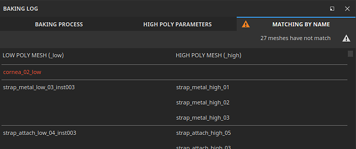
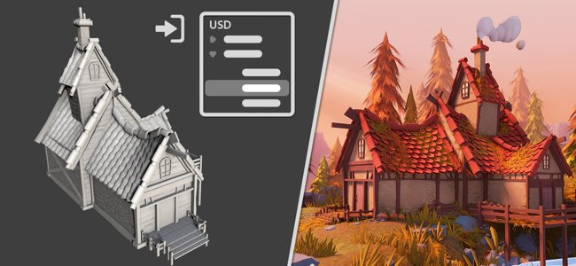
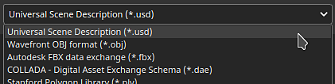

# バージョン8.3

**Substance 3D Painter 8.3**&#x200B;は、まったく新しいベーキングモード、USDファイルの読み込み、UV 投影モードでの物理サイズのサポートを導入しています。

リリース日： *10 January 2023*

## 主な特徴

### 新しいベイクモード

古いベーキングウィンドウは、ケージの表示やマッチングエラーなどのビューポートの視覚化など、いくつかの新機能を備えた専用モードに置き換えられました。

* **モードへのアクセスと切り替え**\
  ベイク処理は、アプリケーションの既存のペイントモードとレンダリングモードに加えて、新しい個別のモードになりました。 ベーキングモードにするには、コンテキストツールバーの小さなクロワッサンアイコンを使用します。 モードの切り替えは、それ以外の場合にも実行できます。モードメニューまたはキーボードショートカットを使用します。 別のモードに戻るには、モードの専用アイコンを使用します（さらに、[テクスチャセット設定](../interface/texture-set/texture-set-settings.md)内の&#x200B;**メッシュマップのベイク**&#x200B;ボタンを使用すると、引き続き新しいモードに戻ることができます）。

  

  

* **新しいモードインターフェイス**\
  従来のベーキングウィンドウは、専用のドックを備えたモードに変わりました。特に次のようになります。

  * **テクスチャセットリスト**&#x200B;を使用して、プロジェクトのどの部分をベイクするかを定義できます。
  * **メッシュマップベイカー**&#x200B;では、一般的なベイク処理の設定とベイカー処理の設定を選択できます。 また、どのベイカープロセスを開始するかを指定することもできます。
  * **メッシュマップの設定**&#x200B;は、すべてのパン屋さんおよび共通の設定が配置される場所で、前の2つのウィンドウからの選択に応じて変更できます。
  * **ベイクログ**&#x200B;は、ベイク処理に関するさまざまな情報（特にエラーメッセージ）を再編成します。
  * **ビジュアライゼーションのベイク処理**：このパネルはビューポートにあり、ローポリメッシュとハイポリメッシュの表示に関連するいくつかのオプションを制御します。

  {width="500px"}

* **ビューポートから直接ベイク処理を開始およびキャンセル**\
  ベイク処理を開始またはキャンセルするボタンが、ビューポートの下部に表示されるようになりました。 小さな矢印を使用してベイクモードを指定することもできます。ベイクモードは、テクスチャセットリストの選択に基づいて、または現在アクティブなテクスチャセットを使用して指定します。

  

  

* **ビューポートにハイポリゴンメッシュを表示**\
  ベイク設定で高ポリゴンメッシュを指定すると、ビューポートにもロードされます（専用のビジュアライゼーション設定が無効になっている場合を除く）。 これにより、低ポリゴンメッシュジオメトリと高ポリゴンメッシュジオメトリが適切に一致しているかどうかをチェックできます。

  {width="400px"}

* **見つからない領域をエラーとしてビューポートにケージメッシュを表示**\
  ケージメッシュは、ビューポートに表示することもできます。 専用のメッシュファイルを使用しない場合、代わりに暗黙のケージが表示され、[最大前面距離]パラメータに反応します。 ケージのサイズを調整する場合、高ポリゴンメッシュのケージの外側にある部分は、デフォルトで赤で表示されるため、ベイク処理によって見落とされるメッシュの部分を簡単に見つけることができます。

  

* **読み込みとベイク処理の際にメッシュを見回す**\
  メッシュをロードしてベイク処理を行うと、アプリケーションがフリーズしなくなりました。つまり、これらの操作中にビューポートを操作することができます。 これは、処理中のベイク処理を調査し、問題を早期に特定してベイク処理をキャンセルするのに便利で、最終的には時間を節約できます。 同様に、ビューポートで最も可視のテクスチャセットが最初にベイク処理され、特定の領域の結果を事前に確認するのに役立ちます。

  

* **ニュートラルマテリアルとビューポートの設定**\
  ベイク処理の結果に注目して問題が発生した場合に対処できるように、ベイク処理モードではペイントされたテクスチャは表示されず、代わりにニュートラルマテリアルを使用します。 このニュートラルマテリアルの設定は、ビューポート内のベイク処理ビジュアライゼーションパネルで調整できます。

  

* **UVシームがないハードエッジを表示する**\
  ベイク処理でアーチファクトが発生する原因の1つは、UVシームのないハードなエッジが存在することです。 これにより、線が表示され、シェーディングのSmoothnessが損なわれる可能性があります。 この目的のために、ビジュアライゼーション設定が追加され、3Dビューと2Dビューの両方でハイライト表示されるようになりました。この設定がない場合は非常に簡単に見落とすことができます。

  {width="450px"}

  {width="300px"}

* **パラメーターの同期と同期の解除**\
  新しい同期アクションを使用すると、ベイク設定のどの部分をテクスチャセット間で同期するかを指定できます。 そうでないと、同じ方法で設定を複数回設定するのは面倒です。 場合によっては、専用の設定を持つテクスチャセットを使用すると便利です。この場合は、これらの設定を同期させないことが推奨されます。 例えば、Common設定を分割したままにすると、Max Fronar Distance、Resolution、および/またはTexture Setごとに異なるハイポリメッシュのリストを使用できるようになりました。

  {width="400px"}

  {width="400px"}

* **名前チェッカーによる一致**\
  **ベイクログ**&#x200B;の&#x200B;**名前による一致**&#x200B;タブは、ベイク処理の前に一致プロセスのエラーを見つけるのに役立ち、一致しないメッシュを見つけやすくします。 一致するメッシュはグループ化され、その他のメッシュは赤で表示されます。

  {width="450px"}

>[!NOTE]
>
> この新しいモードには、さらに多くの新しい設定があります。 詳しくは、[専用のドキュメントページ](../baking/baking.md)を参照してください。

### USDファイルの新しい読み込みと書き出し

この新しいバージョンでは、[Universal Scene Description(USD)](https://graphics.pixar.com/usd/release/intro.html)ファイル形式のサポートが追加されています。 Painterプロジェクトを開始し、USDフォーマットを使用してメッシュとテクスチャを書き出せるようになりました。これにより、アプリケーション間でより一貫したワークフローが実現します。

* **バリアント型、スキン、および特定のフレームでのUSDファイルのインポート**\
  USDファイル形式は、プロジェクトを作成するときや、プロジェクト内でメッシュを再読み込みするときに使用できます。 USDファイルは複雑なシーンである場合が多いので、スコープとバリアントセレクターを使用して、ファイルのサブセットのみを読み込むこともできます。

  {width="400px"}

  {width="400px"}

* **USDを新しいファイルとして書き出すか、プロジェクトで使用されている元のUSDにリンクしてください**\
  テクスチャリングの準備ができたら、**ファイル/テクスチャを書き出し**&#x200B;ウィンドウを使用して、USDファイルをテクスチャファイルと一緒に書き出すことができます。 設定&#x200B;**USDアセットの書き出し**&#x200B;を有効にするだけです。 これにより、いくつかのUSDファイルが生成され、後でパイプラインに簡単に統合できます。 USD以外のファイルまたはUVのないUSDファイルを使用した場合、テクスチャマップとUSDマテリアルファイルに加えて、新しいUSDジオメトリファイルが書き出されます。\
  さらに、**ファイル/メッシュを書き出し**&#x200B;を使用して、プロジェクトのジオメトリをUSDファイルとして書き出すこともできます。

  

  {width="400px"}

### UVモードでの物理サイズのサポートの改善

物理サイズを埋め込んだSubstance材のサポートがUVベースの投影に拡張されました。

* **UVモードの物理サイズ**\
  UV 投影モードを使用して、塗りつぶしレイヤーおよび塗りつぶし効果でタイリングの代わりに、スケールモードを物理サイズに設定できるようになりました。 UVのサイズは、UVアンラップでの三角形の平均サイズに基づいて自動的に計算されます。

  {width="400px"}

* **物理サイズに自動的に切り替える**&#x200B;新しいプロジェクト設定が追加され、マテリアルを作成するとき（たとえば、資産ウィンドウのリソースをドラッグアンドドロップするとき）に、スケール設定が自動的に物理サイズに設定されます。 これにより、新しい塗りつぶしレイヤーを作成するたびに手動で設定を切り替えることなく、プロジェクト全体で一貫したサイズ設定を使用できます。 既存のプロジェクトで有効にするには、**編集/プロジェクト構成**&#x200B;に移動し、**マテリアルを割り当てるときに塗りつぶしレイヤーの拡大・縮小を物理サイズに切り替え**&#x200B;を有効にします。 この設定は、新規プロジェクトの作成時にも有効にすることができます。

  

## プラットフォームサポート情報

このリリースでは、Steamでサポートされている最小バージョンのPainterをUbuntu 20.04に引き上げました。

## チュートリアル

新しいベイクモードについて確認して学ぶには、最新のチュートリアルを参照してください。

## リリースノート

*（リリース：2023年1月10日）*\
概要： **新しいベイクモード、USDファイルの新しい読み込みと書き出し、UV 投影の物理サイズサポートを備えたメジャーリリース**

**追加：**

* [ベーキングモード]ベーキングプロセス専用の新しいベーキングモード
* [ベイクモード]ショートカットを設定してベイクモードをF8モードに切り替え
* [ベイクモード]ビューポートの[開始を追加]および[ベイクをキャンセル]ボタン
* [ベイクモード]テクスチャセットリストにベイク選択を追加する
* [ベイクモード]新しい[メッシュマップベイカー]ウィンドウを追加してベイカーを選択
* [ベイクモード]新しいメッシュマップ設定ウィンドウを追加してベイク処理の設定を編集する
* [ベイクモード]ベイク処理に従って新しいベイクログウィンドウを追加
* [ベイクモード]ベイクパラメータを追加し、ヒストリーウィンドウにアクションを取り消す
* [ベイクモード]メッシュマップ設定でブレッドクラムを追加する
* [ベイクモード] [メッシュマップベイカー]ウィンドウでメッシュマップサムネイルを追加する
* [ベイクモード] 3Dビューポートで折りたたみ可能な表示設定を追加
* [ベイクモード]ハイポリゴンメッシュの表示/非表示を切り替えるビジュアライゼーション設定を追加
* [ベイクモード]ケージメッシュとワイヤーフレームの表示/非表示を切り替えるビジュアライゼーション設定を追加
* [ベイクモード]ローポリゴンメッシュの表示/非表示を切り替えるビジュアライゼーション設定を追加
* [ベイクモード] UVシームのないハードエッジをエラーとして表示するビジュアライゼーション設定を追加
* [ベイクモード]ベイクログが表示されない場合に、ビューポートでメッシュとベイクエラーを通知します
* [ベイクモード]すべてのテクスチャセットでベイカー設定を同期するアクションを追加

  Mesh Map Bakersウィンドウで、名前の横にあるリンクアイコンをクリックすると、各ベイカー（および共通の設定）をテクスチャセット間で同期できます。 この操作を実行するとウィンドウが開き、同じパラメータを共有するテクスチャセットを選択できます。
* [ベイクモード]ベイカー設定のコピー&amp;ペーストにアクションを追加

  Mesh Map Bakersウィンドウでは、ウィンドウの上部にある専用メニューまたは右クリックコンテキストメニューを使用して、テクスチャセット間で各ベイカー設定をコピーおよび越えるアクションを使用できます。
* [ベイクモード]ベイクログにボタンを追加して、エラーから適切な設定にジャンプします

  ベイカーが失敗した場合やメッシュが正しくロードされなかった場合は、ベイクログにエラーメッセージが表示されます。 メッセージの横のボタンをクリックすると、メッシュマップベイカーとメッシュマップ設定ウィンドウを変更して、関連する設定を表示できます。 これにより、問題の原因を簡単に特定して、解決できます。
* [ベイクモード]メニューを追加してテクスチャセットとベイカーの選択を管理する

  「テクスチャセットリスト」と「メッシュマップベイカー」ウィンドウの両方に、選択範囲のコピーと反転に役立つ小さなアクションメニューが追加されました。
* [ベイクモード]テクスチャセットごとにベイカー選択リストを分割
* [ベイクモード]テクスチャセットごとに共通設定を分割
* [ベイクモード]インターフェイスをフリーズせずにハイポリゴンメッシュとケージメッシュをロードする
* [ベイクモード]ビューポート進行状況バーを使用してメッシュのロードを表示します
* [ベイクモード]ベイクログにメッシュのロード状態を追加
* [ベイクモード]ベイク処理中にビューポートでメッシュの回転を許可する
* [ベイクモード]現在のメッシュビューポートの可視性に基づいてベイク順序を設定
* [ベイクモード]ビューポートに暗黙のベイクケージを表示

  カスタムケージメッシュファイルを使用していない場合、自動ケージメッシュが生成され、ビューポートに表示されます。 このサイズは、ベーキングの共通設定の[最前頭間距離]パラメータに基づきます。 ケージメッシュは、ローとハイのポリゴン間のマッチングがどの程度行われるかを示すために使用されます。
* [ベイクモード]ベイクログで名前で一致させるメッシュ名の一致リストを表示する
* [ベイクモード]ニュートラルマテリアルを使用してビューポートに3Dモデルを表示
* [ベイクモード]ベイクモード時にエンジン計算を無効にする
* [ベイクモード]ベイク処理の進行中にアプリを終了すると警告が表示される
* [ベイカー]アンチエイリアス設定ラベルを更新する

  アンチエイリアス設定値は「スーパーサンプリング」に名前が変更され、明示的な乗数を使用して動作を明確にしています。
* [ベーカー]ベーカーをバージョン2.5.7にアップデートします。
* [USD] Universal Scene Description(USD)ファイルの読み込みと書き出し
* [USD] USDファイルを選択するときに、USDオプションを「新規プロジェクト」ウィンドウに追加
* [USD]新しいスコープとバリアントの選択ウィンドウを追加

  USDファイルを読み込む際に、「新規プロジェクト」または「プロジェクト構成」ウィンドウで「変更」ボタンをクリックすると、USDファイルのどの部分とバリアントを読み込むかを選択できます。
* [USD] 再分割レベルを追加オプション

  サブディビジョンを含むUSDメッシュファイルを使用して新しいプロジェクトを作成する場合、スライダを使用してサブディビジョンのレベルを選択できます。 プロジェクトは、分割されたメッシュで作成されます。 このレベルは、プロジェクト構成を介して変更できます。
* [USD]特定のフレームでUSDのスキンメッシュを読み込む

  アニメーションを含むUSDメッシュファイルを使用して新しいプロジェクトを作成する場合、埋め込まれたタイムラインシーケンスを反映するスライダーを使用してフレームを選択できます。 このフレームは、プロジェクト設定を使用して変更できます。
* [USD]&#x200B;[書き出し] USDファイルを書き出すオプションを追加

  テクスチャを書き出しウィンドウに新しい「USDを書き出し」チェックボックスが追加されました。 オンにすると、任意のテンプレートを使用して、USDファイルとテクスチャマップを書き出すことができます。
* [USD]&#x200B;[書き出し]メッシュ書き出しにUSDファイル形式を追加
* [USD]既存の「USD PBRメタルの粗さ」書き出しプリセットの名前をより明確に変更します

  これまで「USD PBRメタルの粗さ」として知られていたUSDの書き出しテンプレートには、引き続きテクスチャの書き出し/出力テンプレート/USDz(Apple AR)からアクセスできます。
* [自動ラップ解除] パッキングのロック方向を追加

  パッキング機能の使用時に既存のUV アイランドの向きを保持できる、自動アンラップ設定の新しいオプション。 これは、新規プロジェクト/自動ラップ解除オプション/UV アイランドの向きを使用してアクセスできます。
* [物理サイズ]塗りつぶし効果/レイヤーで物理サイズを自動的に使用する設定を追加

  物理サイズが埋め込まれたマテリアルを使用する場合に、自動的に物理サイズスケールに切り替える新しいオプションが追加されました。 この機能は、新規プロジェクトを使用するか、またはマテリアルを割り当てるときに編集/プロジェクト設定/物理サイズ/塗りつぶしレイヤーの拡大・縮小を物理サイズに切り替えを使用して、プロジェクトごとに有効にできます。
* [物理サイズ] UV 投影の物理サイズを表示する

  物理サイズスケーリングがUV 投影で使用できるようになりました。これにより、メッシュの物理サイズに基づいてマテリアルの自動サイズ変更が可能になります。 これは、塗りつぶしレイヤーまたはエフェクトプロパティウィンドウの拡大・縮小/物理サイズを使用して選択できます。
* [Scripting]&#x200B;[Python]アプリケーションのバージョンを照会できます
* [スクリプティング]&#x200B;[JavaScript]新しいベイクパラメーターに合わせてAPIを更新
* [スクリプト]&#x200B;[Python]ベイクモジュール：ベイクパラメータを編集
* [スクリプティング]&#x200B;[Python]ベイクモジュール：ベイク処理の起動/キャンセル
* [スクリプティング]&#x200B;[Python] Bakingモジュール：曲率メソッドを選択
* [スクリプティング]&#x200B;[Python]ベイクモジュール：ベイカー/uvタイルの選択
* [スクリプト]&#x200B;[Python]ベイクモジュール：すべてのテクスチャセットでベイカー設定を同期
* [SVT] AMD GPUで疎ハードウェアサポートを有効にする

  スパース仮想テクスチャシステムのハードウェアアクセラレーションをAMD GPUで有効にできるようになりました。 この設定は、一般環境設定で自動的に有効になります。
* [投影]円柱投影パラメータの名前を変更

  パラメータ「Cylinder Cap Culling」の名前が「Backface Culling」に変更され、アクションがより適切に表現されるようになりました。 関連付けられたツールチップは、それに応じて調整されます。
* [プロジェクト]プロジェクトにアプリケーションバージョンを保存し、スクリプトを使用して取得する

  バージョン8.2以降では、アプリケーションのバージョンは保存時にsppファイル内に保存されるようになりました。\
  このバージョン番号は、Python APIのプロジェクトモジュール内の関数last\_saved\_substance\_painter\_version()で取得できます。\
  8.2より前に作成されたプロジェクトの場合、戻り値はnullになります。
* [読み込み] 3Dモデルの一般的な読み込み時間を短縮

  メッシュの一般的な読み込み時間を改善しました。 たとえば、ベイク処理のために高ポリゴンメッシュをロードする際の待ち時間を短縮できます。 この最適化は、特にOBJファイルのロードに適用されます。

**修正済み：**

* [クラッシュ]特定のスタックを含むフィルターのチャンネルを変更する
* [Mac]&#x200B;[M1]塗りつぶしレイヤーを作成して、レイヤースタックを離れるとクラッシュする

  この問題は、Mac OS 13(Ventura)にアップデートすることで修正できます。
* [スクリプト]&#x200B;[Python] ui.add\_dock\_widget()を間違ったタイプで使用するとクラッシュする
* [ベイク]ベイク処理が失敗したときのログのエラーメッセージが不完全である
* [ベイク]ベイク処理の終了時にメモリが解放されない
* [エンジン]エフェクトの表示/非表示を変更しても、テクスチャキャッシュが更新されない
* [書き出し] 2DViewはランダムに均一なマップを書き出します
* [プロジェクト]大きなメッシュでプロジェクトを保存すると、メモリ割り当てエラーが発生する
* [ビューポート] TAAでペイントするとアーチファクトが発生することがある

**既知の問題：**

* [カラーマネジメント] Linux上のACEを使用したHDRカラースペース変換では、カラーがクランプされます
* [レイヤスタック]レイヤごとに入力ソースが保存されない
* [書き出し] 2Dビューがランダムに均一なマップを書き出す
