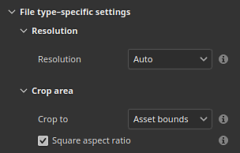

# バージョン9.1

<b>Substance 3D Painter 9.1</b>には、パスツールの接線コントロール、SVGファイルフォーマットのサポート、ドラッグアンドドロップによるリソースのインポートと適用の機能、ビューポートでの半透明度のサポートが追加されています。

リリース日： *2023年11月7日*

## 主な機能

### 新しい接線コントロールとパスツールの改善

この新しいバージョンでは、コミュニティから要求された欠落ビットや機能を追加するためのPathツール（バージョン9.0で導入）の開発を継続しています。

* <b>パスポイントの接線を手動で制御する</b>

  パス上の特定のポイントの接線を手動で設定できるようになりました。 これにより、自動動作を無効にして新しいシェイプを作成できます。

  
* <b>マニピュレータを使用したパスポイントの編集</b>

  オブジェクトの表面のスライディングポイントだけでは不十分な場合があります。 マニピュレータを使用すると、サーフェスを超えてポイントを移動できます。 これは、メッシュの再読み込み後にサーフェスから離れすぎた場合などに、一度に複数のポイントを移動するのに非常に役立ちます。

  
* <b>パスの表示を個別に切り替える</b>

  専用のビューポートパネルで、パスごとにパスの表示/非表示を変更できるようになりました。 パスを無効にすると、最終的なテクスチャからの影響が、削除する必要なしに取り除かれます。

  
* <b>パスの位置とプロパティをコピーして貼り付ける</b>

  パスのコピー&amp;ペーストが拡張され、パスポイントの位置またはそのプロパティのみをコピーできるようになりました。 様々な方法でパスを同期できるようになり、（位置を介して）複雑なエフェクトを作成したり、（プロパティを介して）様々な場所で特定の外観を共有したりすることが容易になりました。

  

  

>[!NOTE]
>
> パスツールの詳細については、[専用のドキュメント](../painting/tool-list/path.md)を参照してください。

### ビューポートでの透明度、透明度、吸収の新しいサポート

新しいプロジェクトを作成するときに既定で使用される<b>Adobe Standard Material</b> (ASM)シェーダーが更新され、<b>半透明度</b>、<b>透明度</b>および<b>吸収</b>のプロパティがサポートされました。 つまり、リアルタイムビューポートで、これらのレンダリング動作の結果を表示できるようになりました（Rayレンダラー内でも表示できます）。

そのため、薄い光吸収を使用した<b>ガラス</b>、<b>葉</b>、<b>プラスチック</b>などの素材のオーサリングが可能になり、ビューポートで直接表示できるようになりました。 他のSubstance 3Dアプリケーションに書き出した場合も、ASMの定義により外観が一致します。

* <b>新しいASMシェーダー設定</b>

  ASMシェーダが更新され、新しい機能がサポートされるようになりました。この機能は[シェーダ設定](../interface/shader-settings/shader-settings.md)ウィンドウで変更できます。

  * <b>透明度</b> （不透明度）：葉などの透明なサーフェスを取得するために、別のシェーダに切り替える必要がなくなりました。 代わりに、<b>ジオメトリ/不透明度</b>グループで、<b>アルファテスト</b>または<b>アルファブレンド</b>のいずれかのパラメーターを有効にします。 ディザリングなどの通常の設定も使用できます。
  * <b>透光性</b> ：この新しいプロパティを使用すると、ガラスのようなサーフェスを作成して、Specularの反射を維持しながらシェイプを透明にすることができます。 これを使用するには、プロジェクトに半透明度チャネルを追加し、<b>Interior</b>グループの<b>半透明度</b>パラメーターを有効にします。
  * <b>吸収</b> ：この新しいプロパティを使用すると、オブジェクトを通過して吸収される光をシミュレートできるため、サブサーフェス散乱を使用するよりも効果的にプラスチックや液体をシミュレートするのに役立ちます。 これを使用するには、<b>Interior</b>グループの<b>吸収</b>設定を有効にします。
* <b>シェーダー設定のUIとツールヒントの改善</b>

  シェーダの再処理により、パラメータのUIを改善する機会が得られました。また、パラメータをアクティブにする方法を簡単に理解できるように、多数の新しいツールチップを追加しました。

  パラメーターの順序も、他のSubstance 3Dソフトウェアと一致している必要があり、設定を試すときに前後に行うのがより簡単になります。

  
* <b>Adobe Standardマテリアルのデモを行う新しいサンプルプロジェクト</b>

  新しいASMプロパティの操作は、最初は困難な場合があります。そのため、シェーダのいくつかの機能を示す新しいサンプルプロジェクトが追加され、簡単に学習できるようになりました。

  このプロジェクトは<b>フランス料理のレストランテーブル</b>と呼ばれ、<b>ファイル/サンプルを開く</b>メニューから確認できます。 また、多くの小さなトリックを使用しているため、テクスチャリングの新しい方法を発見するための優れた学習リソースになります。

  
* <b>半透明チャンネルの既定値が黒に設定されました</b>

  新しいシェーダプロパティを使いやすくし、ビューポートでの予期しない結果を避けるために、チャンネルのトランスルーセントの既定値のカラーが（白ではなく）黒に変更されました。

  このチャンネルがプロジェクトで既に使用されている場合は、レイヤースタックの下部に塗りつぶしレイヤーを追加し、チャンネルの値を白に設定するだけで、以前の動作を取得できます。 シェーダパラメータで設定<b>Use translucency as scattering mask</b>を有効にして、チャンネルの作用をサブサーフェススキャタリング結果に再び適用することもできます。

### ベクターグラフィックファイルの新しいサポート(SVG)

このリリースでは、レイヤーやペイントツールなどで使用できるリソースとして、SVGファイルのサポートが追加されています。

SVGファイルは、非常に軽量でありながら、ロゴやシェイプを正確に表現するのにとても便利です。 Painterでは、任意の解像度でレンダリングして簡単に更新できるため、非破壊的なワークフローに最適です。

* <b>SVGファイルのインポート</b>\
  SVGファイルは、他のリソースと同様に、プロジェクト、ライブラリなどに読み込むことができます。SVG <b>からバージョン1.1</b>までインポートできます。新しいバージョンの機能はサポートされていません。

  このバージョンでも読み込みが簡単になったため（以下を参照）、SVGファイルの使用は、Painterの外部からメッシュまたはレイヤースタックにリソースを直接ドラッグ&amp;ドロップするだけで実行できます。
* <b>専用SVGの設定</b>\
  SVGリソースを使用する場合は、いくつかの設定を使用してリソースの外観を制御できます。

  * <b>解像度</b>：自動の解像度を使用する場合、ファイル内で定義された解像度を使用する場合、またはカスタムの値を使用する場合です。
  * <b>切り抜き領域</b>：使用するSVGカンバスの範囲を指定します。
  * <b>範囲</b>:エレメントのコンテンツ全体を選択するか、一部のSVGのみを選択します。

  
* <b>新しいSVGのカスタマイズされた資料</b>

  テクスチャリング時のSVGファイルの使用に役立つ3つの新しいリソースが追加されました。

  * <b>カスタムスプレーペイント</b>：単一の入力画像から壁に塗られたデカールをシミュレートします。
  * <b>カスタムステッカー</b>：表面にプラスチックのステッカーを作成します。 いくつかの設定を使用して、ダメージや折り畳みをシミュレートします。
  * <b>グラフィックからマテリアルへ</b>：単一の画像入力から複数のマテリアルプロパティを作成できます。 このリソースは、SVGファイルをビューポートにドラッグアンドドロップすると自動的に挿入されます。 このリソースを使用すると、複数のチャンネルで入力の透明度を簡単に共有できるため、シンプルなデカールに最適です。

  

  

>[!NOTE]
>
> SVGの形式と設定の詳細については、[専用のドキュメントを参照してください](../painting/vector-graphic-svg.md)。

### ドラッグ&amp;ドロップによるリソースの新しい読み込み

このリリースでは、外部ファイルをアプリケーションの別のコンテキストにドラッグ&amp;ドロップして、リソースを自動的に読み込んで使用することができます。 この新しいプロセスにより、ファイルの読み込みに関する面倒な手順をスキップできます。

* <b>ドラッグアンドドロップでビューポートに読み込む</b>

  外部ファイルをビューポートにドラッグして、メッシュに直接配置できるようにします。 この操作により、新しいレイヤーが自動的に作成されます。 リソースの性質（イメージ、Substance素材、Substanceフィルターなど）によって異なります。 結果はそれに応じて適応します。
* <b>ドラッグ&amp;ドロップでレイヤースタックに読み込む</b>\
  外部リソースファイルをビューポートにドロップするのと同じように、ファイルをレイヤースタックにドロップすると、リソースを含むレイヤーやエフェクトを直接作成できます。
* <b>ドラッグアンドドロップでリソーススロットにインポートする</b>

  レイヤーまたはツールにリソースを直接読み込むこともできます。 適切に設定された塗りつぶしレイヤーまたはエフェクトがすでに存在する場合は、外部ファイルをプロパティウィンドウのいずれかのチャンネルスロットにドロップするだけで、読み込んで適用できます。

>[!NOTE]
>
> リソースのインポートの詳細については、[専用のドキュメント](../content/importing-assets/import-drag-and-drop.md)を参照してください。

### 新しいリソースのドラッグ&amp;ドロップビヘイビアー

ドラッグ&amp;ドロップの改善は、リソースの読み込みに限定されません。 アセットウィンドウからリソースをドラッグ&amp;ドロップして、新しいレイヤー、エフェクト、マスクをその場で作成できるようになりました。

* <b>多くの種類のリソースをドラッグアンドドロップします</b>

  リソースのタイプをビューポートまたはレイヤスタックに直接ドラッグアンドドロップできるようになりました。 次のタイプのリソースは、どこにでも（ほぼ）ドラッグ&amp;ドロップできます。

  * アルファ
  * テクスチャ
  * プロシージャル
  * マテリアル
  * スマートマテリアル
  * スマートマスク
  * ジェネレーター
  * フィルター
  * 環境マップ
* <b>新しいレイヤーまたは効果としてリソースをドロップ</b>

  リソースをドロップする場所を選択すると、Painterによって新しいレイヤーまたはエフェクトが自動的に作成されます。

  
* <b>ドラッグ中にコンテンツまたはマスク効果スタックを選択\
  </b>

  リソースをサムネールの上にドラッグすると、Painterは関連するエフェクトスタックに自動的に切り替わります。 その後、スタック内の正確な場所にリソースをドロップすることは非常に簡単になります。 これにより、事前に適切なスタックに切り替える必要がなくなります。

  
* <b>その場で新しい黒いマスクを作成する</b>

  リソースをドラッグすると、マスクのないレイヤーに新しいアイコンが表示されます。 このゴーストマスクにリソースをドロップすると、新しいマスクが自動的に作成され、新しいリソースが追加されます。 これは、新しいマスクを簡単に設定し、ドラッグ&amp;ドロップをキャンセルして手動で追加しないようにする方法です。

  
* <b>ビューポートにドロップして新しいレイヤーを作成</b>

  リソースのドラッグ&amp;ドロップは、ビューポートで実行して新しいレイヤを作成することもできます。 リソースの種類に応じて、結果が変わる場合があります。 フィルターはパススルーモードでペイントレイヤーを作成し、スマートマスクは新しいマスクで塗りつぶしレイヤーを作成します。

  

  
* <b>高度なビヘイビアーにキーボード修飾キーを使用する</b>

  リソースを削除するときに、キーボード修飾キーCTRLまたはALTを維持すると、追加のビヘイビアーが有効になります。

  * <b>レイヤースタック</b>へのドロップ中にCTRL</b>:リソースを黒いマスクに配置した新しいレイヤーを作成します。 <b>たとえば、マテリアルを強制的にマスクに配置する場合に便利です。 または、アルファ付きのドロップダウンメニューをスキップします。
  * <b>ALT</b>を<b>レイヤースタック</b>にドロップ中：レイヤーサムネール上にドロップする場合にのみ適用されます。 ALTキーを押すと、以前のすべての効果が削除されます。 これは、最初に手動で削除することなく、様々なリソース、特にスマートマスクを試す簡単な方法として使用できます。
  * <b>ビューポート</b>にドロップ中にCTRL</b>:リソースを黒いマスクに配置して新しいレイヤーを作成します。 <b>リソースは、ビューポートで行った選択に基づいて設定される<b>カラーID選択</b>効果の下に置かれます。
  * <b>ビューポート</b>にドロップ中に<b>ALT</b>：以前と同じように、リソースをデカールプロジェクションモードにします。

### その他の改善

このリリースでは、いくつかのマイナー機能および機能強化も追加されています。

* <b>16ビット画像の可逆圧縮</b>

  今後、ビット深度が16のプロジェクトに含まれる画像は、可逆圧縮アルゴリズムで圧縮されるため、画質を損なうことなくサイズを縮小できます。 これは、既に独自のデータを圧縮しているプロジェクトファイルに追加されます。

  この変更は主に<b>テクスチャのベイク</b>を対象にしています。通常、この目的は、プロジェクトファイルがディスク上で非常に重くなる場合があります。 平均すると、ディスク上のプロジェクトのサイズは<b>30%減から50%減</b>しました。

  この圧縮は、まだ圧縮されていないリソースにプロジェクト（新旧）を保存するときに自動的に適用されます。 古いプロジェクトでは、この新しいバージョンで初めて保存する場合、通常より少し時間がかかる可能性があります。 これが完了すると、時間の節約は通常に戻ります。
* <b>UVセットをUVにセットする新しいUVは投影モードを埋める</b>

  塗りつぶしレイヤー/エフェクトの新しい投影モードが<b>UVセットからUVセットへの投影</b>という名前で追加されました。 これを使用して、プロジェクト内のメッシュで使用可能な異なるUVに基づいてテクスチャを投影することができます。 外部ツールに依存することなく、より高度なテクスチャ転送を実行できます。

  <b>UVセット0</b>は、Painterがペイントに使用するデフォルトのUVです。 追加のUVセットが使用できる場合は、設定<b>ソース</b>のドロップダウン内で使用できます。

  
* <b>新しいプロジェクトでは、テンポラルアンチエイリアシングは既定で有効になっています</b>

  新しいプロジェクトを作成する際、ビューポートのレンダリングの質を高めるために、表示設定ウィンドウで使用可能な<b>テンポラルアンチエイリアシング</b>設定がデフォルトで有効になりました。
* <b>新しいPython APIの機能向上</b>

  Python APIは、このリリースでいくつかの追加を受け取りました。

  * 新しい<b>substance\_painter.application.close() </b>関数を使用すると、PainterをPythonで閉じたり閉じたりすることができます。
  * APIを使用して、メインビューポートカメラを変更できるようになりました。 これには、位置や回転だけでなく、視野、絞りなどのその他のプロパティも含まれます。メッシュに関してカメラを配置しやすくするために、APIはシーンのバウンディングボックスも公開するようになりました。
  * 書き出しモジュールを使用して、三角形分割の有無とディスプレイスメントの有無を指定してプロジェクトメッシュを書き出すことができるようになりました。
  * プロジェクトの書き出しテクスチャパスをAPIからも取得できるようになりました。
* <b>After Effects （ベータ版）に新しく送信</b>

  新しいSEND TO ACTIONを使用して、メッシュとそのテクスチャをAfter Effectsに書き出すことができるようになりました。これにより、視覚効果を繰り返し実行するのに便利です。 この機能を使用するには、After Effectsバージョン24.1ベータ版へのアクセスが必要です。

## チュートリアル

## リリースノート

### 9.1.0

（リリース：2023年11月7日）\
概要： <b>SVGと透明度のサポートに加え、ドラッグ&amp;ドロップとパスツールの改善を導入したメジャーリリース</b>

<b>追加：</b>

* [SVG]ベクトルファイルを読み込めるようにする(SVG)
* [SVG][UI] SVG固有のプロパティのサポートを追加
* [SVG]オプションを追加して元の画像の縦横比を簡単に維持
* [SVG]透明度のあるSVGのアルファを自動使用できるようにします
* [Interop]テクスチャ加工されたメッシュをAfter Effectsに送ることができます(Ae 24.1 beta)
* [Interop] After Effectsに送信するための設定を追加する
* [QoL][アセット][UI] UIスロットにドラッグ&amp;ドロップすると、アセットが自動読み込みされる
* [QoL]外部アセットをレイヤースタックにドラッグ&amp;ドロップできます
* [QoL][レイヤースタック]アセットパネルからレイヤースタックにテクスチャをドラッグ&amp;ドロップ
* [QoL][ビューポート]メッシュ上のフィルタジェネレータをドラッグアンドドロップできます
* [QoL][ビューポート]外部アセットをメッシュにドロップできます
* [QoL][プロジェクション]新しいUVセットをUVセットプロジェクションモードに追加
* [QoL]ビューポートとレイヤースタックに新しいレイヤーとしてスマートマスクをドラッグ&amp;ドロップ
* [QoL]マスクで使用した場合、複数の出力を持つジェネレータのセレクターを追加する
* [QoL]塗りつぶしエフェクトの上に単一チャンネルの画像をドラッグ&amp;ドロップできるようにする
* [QoL][レイヤースタック] CTRL/ALT修飾キーをドラッグ&amp;ドロップで使用して、エフェクト/レイヤーを作成する場所/方法を指定します
* [パス]パスパネルでパスの表示を個別に切り替え
* [パス]パスポイントに変換マニピュレータを使用できるようにします
* [パス]頂点ごとの接線を手動でコントロールできるようにします
* [パス]パスプロパティをコピー/貼り付け
* [パス] [接線をブレーク]ボタンに空のショートカットを導入します
* [シェーダ] ASMシェーダで不透明度と半透明度のサポートを追加
* [シェーダ] ASMシェーダを使用した吸収カラーチャンネルのサポートを追加する
* [シェーダ] ASMシェーダパラメータのツールチップを改善する
* [シェーダ]半透明度チャンネルのデフォルトカラーを黒に変更する
* [表示設定] テンポラルアンチエイリアシングを既定で有効にする
* [表示設定]既定値でサブサーフェススキャタリング設定を有効にします
* [Substance]グラフの入出力からカラースペースプロパティのサポートを追加
* [Substance] Substanceエンジンをバージョン9.0.3にアップデートする
* [UI]アプリウィンドウが小さい場合でもコンテキストツールバーボタンにアクセスできるようにする
* [自動アンラップ] [テクスチャ密度]でUVタイル数を制御する
* [ベイク] AMD GPUのGPU レイトレーシングをデフォルトでディアクティベート
* [パフォーマンス] 16ビット画像に可逆圧縮を適用してプロジェクトのフットプリントを削減
* [Python] 3Dビューで既定のカメラを操作できるようにします
* [Python]スクリプティングでメッシュを書き出す機能を公開する
* [コンテンツ][サンプル]新しいサンプルプロジェクト「French Restaurant Table」を追加
* [コンテンツ] Substanceロゴのアルファを新しいバージョンに更新する
* [コンテンツ] 3つのSVGに焦点を当てたマテリアルフィルター（カスタムステッカー、カスタムスプレー、グラフィックをマテリアルに追加）を追加する

<b>修正済み：</b>

* [クラッシュ]シンメトリツールを使用していないときのマニピュレータのサイズ変更
* [クラッシュ] [レイヤースタック]何も選択されていないときにレイヤーを作成する
* [プロジェクト]未使用のリソースを削除すると、メッシュマップが破損する可能性がある
* [プロジェクト]イメージの再読み込みまたは再ベイク処理後にリソースが破損する
* [アセット]アセットを再読み込みすると、お気に入りから削除される
* [読み込み]アセットパネルに「結果が見つかりません」と表示されている場合、リソースを読み込むことができない
* [UI]コンテキストツールバーの矢印が表示されない場合がある
* [Substance]ブール値の[並べて表示]ボタンはサポートされていません
* [Level]マスクで使用するとチャンネルラベルが正しくない
* [エクスポート][glTF] PainterからエクスポートされたglTF/GLBファイルには物理サイズユニットがありません
* [コンテンツ]ぼかしフィルターの強度を16に固定
* [コンテンツ]カラーマッチフィルターの「ターゲットカラー」画像入力が表示されない

<b>既知の問題：</b>

* [カラーマネジメント] Linux上のACEを使用したHDRカラースペース変換では、カラーがクランプされます
* [クラッシュ][Linux]レイヤースタックにリソースをドラッグ&amp;ドロップすると、AMD上のLinux Waylandでクラッシュする
* [クラッシュ][Mac] Monterey OSで異方性フィルタリングの値を変更する
* [クラッシュ]画像入力として使用されるExr
* [クラッシュ] 16K環境マップの使用
* [自動アンラップ]テキストの密度コントロールのUIの問題
* [Regression][UI] HD画面で右クリックメニューが小さすぎる
* [Python] TextureStateEventによってトリガーされたUSDの書き出しのクラッシュ
* [QoL]デカールモードでAlphaリソースをドラッグ&amp;ドロップすると、マスクにUV 投影が発生する
