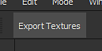

# Javascriptプラグインの作成

このステップバイステップガイドでは、プロジェクトで現在選択されているレイヤーのマスクを書き出すことができる簡単なプラグインを作成する方法について説明します。

このガイドのプラグインの目的は、プロジェクト内の現在のテクスチャセットのすべてのチャンネルを個別のテクスチャとして書き出すことです。

## 1 – プラグインフォルダーに移動します

新しいJavascriptプラグインを追加するには、Substance 3D Painterのプラグインフォルダーにフォルダーを作成する必要があります。

**プラグイン**&#x200B;フォルダーにアクセスするには、次の場所に移動します。

<table data-preserve-html="true" style="width: 100.0%;"> <colgroup> <col style="width: 15.0%;"/> <col style="width: 15.0%;"/> <col style="width: 70.0%;"/> </colgroup> <tbody> <tr> <th>Platform</th> <th>バージョン</th> <th>パス</th> </tr> <tr> <td rowspan="2"><strong>Windows</strong></td> <td><strong>7.2</strong>以降</td> <td colspan="1">C:\Users\username\Documents\Adobe\Adobe Substance 3D Painter</td> </tr> <tr> <td colspan="1">レガシー</td> <td colspan="1">C:\Users\username\Documents\Allegorithmic\Substance Painter</td> </tr> <tr> <td rowspan="2"><strong>Mac</strong></td> <td colspan="1"><strong>7.2</strong>以降</td> <td colspan="1">/Users/username/Documents/Adobe/Adobe Substance 3D Painter</td> </tr> <tr> <td colspan="1">レガシー</td> <td colspan="1">/Users/username/Documents/Allegorithmic/Substance Painter</td> </tr> <tr> <td rowspan="2"><strong>Linux</strong></td> <td colspan="1"><strong>7.2</strong>以降</td> <td colspan="1">/home/username/Documents/Adobe/Adobe Substance 3D Painter</td> </tr> <tr> <td>レガシー</td> <td colspan="1">/home/username/Documents/Allegorithmic/Substance Painter</td> </tr> </tbody> </table>

### 2 – プラグインフォルダーの作成

プラグイン名は、親フォルダーの名前に基づきます。

この例では、プラグインフォルダー内に&#x200B;**export-textures**&#x200B;という名前の新しいフォルダーを作成するだけです。

### 3 – プラグインファイルの作成

新しく作成したフォルダーを開き、2つの空のテキストファイル（メモ帳）を作成します。

* **main.qml**
* **toolbar.qml**

qmlファイル拡張子は、Qt QML言語用に作成されたスクリプト用のJavascript拡張子です。 Javascriptコードを実行できるだけでなく、カスタムUIを作成することもできます。

**main.qml**&#x200B;ファイルは必須です。プラグインを読み込むためにアプリケーションが最初に探すファイルです。 ただし、任意の名前で追加ファイルを作成できるので、スクリプトをパーツに分割して管理しやすくすることができます。 この場合、**toolbar.qml**&#x200B;は、プラグインによってインターフェイスに追加されるボタンの外観を記述するために使用されます。

### 4 – スクリプトコンテンツ

スクリプトファイルをメモ帳などのテキストエディターで開き++次のコードスニペットを貼り付けます。 詳しくは、コードコメントを参照してください。

**toolbar.qml**

```
import QtQuick 2.7 

import AlgWidgets 2.0 

import AlgWidgets.Style 2.0 

 

AlgButton 

{ 

 tooltip: "" 

 iconName: "" 

 text: "Export Textures" 

}
```


**main.qml**

```
// Default includes, to acces Qt/QML 

// and Substance 3D Painter APIs 

import QtQuick 2.7 

import Painter 1.0 

 

// Root object for the plugin 

PainterPlugin 

{ 

 // Disable update and server settings 

 // since we don't need them 

 tickIntervalMS: -1 // Disabled Tick 

 jsonServerPort: -1 // Disabled JSON server 

 

 // Implement the OnCompleted function 

 // This event is used to build the UI 

 // once the plugin as been loaded by Substance 3D Painter 

 Component.onCompleted: 

 { 

  // Create a toolbar button 

  var InterfaceButton = alg.ui.addToolBarWidget("toolbar.qml"); 

 

  // Connect the function to the button 

  if( InterfaceButton ) 

  { 

   InterfaceButton.clicked.connect( exportTextures ); 

  } 

 } 

 

 // Custom function called by the Button, 

 // this is the core of the plugin 

 function exportTextures() 

 { 

  // Catch errors in the script during execution 

  try 

  { 

   // Verify if a project is open before  

   // trying to export something 

   if( !alg.project.isOpen() ) 

   { 

    return; 

   } 

 

   // Retrieve the currently selected Texture Set (and sub-stack if any) 

   var MaterialPath = alg.texturesets.getActiveTextureSet() 

   var UseMaterialLayering = MaterialPath.length > 1 

   var TextureSetName = MaterialPath[0] 

   var StackName = "" 

 

   if( UseMaterialLayering ) 

   { 

    StackName = MaterialPath[1] 

   } 

 

   // Retrieve the Texture Set information 

   var Documents = alg.mapexport.documentStructure() 

   var Resolution = alg.mapexport.textureSetResolution( TextureSetName ) 

   var Channels = null 

 

   for( var Index in Documents.materials ) 

   { 

    var Material = Documents.materials[Index] 

 

    if( TextureSetName == Material.name ) 

    { 

     for( var SubIndex in Material.stacks ) 

     { 

      if( StackName == Material.stacks[SubIndex].name ) 

      { 

       Channels = Material.stacks[SubIndex].channels 

       break 

      } 

     } 

    } 

   } 

 

   // Create the export settings 

   var Settings = { 

    "padding":"Infinite", 

    "dithering":"disbaled", // Hem, yes... 

    "resolution": Resolution, 

    "bitDepth": 16, 

    "keepAlpha": false 

   } 

 

   // Build the base of the export path 

   // Files will be located next to the project 

   var BasePath = alg.fileIO.urlToLocalFile( alg.project.url() ) 

   BasePath = BasePath.substring( 0, BasePath.lastIndexOf("/") ); 

 

   // Export the each channel 

   for( var Index in Channels ) 

   { 

    // Create the stack path, which defines the channel to export 

    var Path = Array.from( MaterialPath ) 

    Path.push( Channels[Index] ) 

 

    // Build the filename for the texture to export 

    var Filename = BasePath + "/" + TextureSetName 

 

    if( UseMaterialLayering ) 

    { 

     Filename += "_" + StackName 

    } 

 

    Filename += "_" + Channels[Index] + ".png" 

 

    // Perform the export 

    alg.mapexport.save( Path, Filename, Settings ) 

    alg.log.info( "Exported: " + Filename ) 

   } 

  } 

  catch( error ) 

  { 

   // Print errors in the log window 

   alg.log.exception( error ) 

  } 

 } 

} 
```


完了したら、ファイルを保存して閉じます。

### 5 – プラグインの読み込みと有効化

Substance 3D Painterを起動すると、デフォルトで新しいプラグインが自動的に読み込まれ、有効になります。

プロジェクトを開き、プラグインで作成されたUIボタンをクリックして、現在選択されているテクスチャセットのチャンネルを書き出します。



プラグインを有効または無効にするには、インターフェイスの上部にあるJavascriptメニューを使用します。


