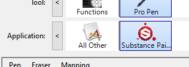

# ペンとタブレットの設定

このページには、アプリケーションとの互換性を向上させるために、Windowsでグラフィックタブレットペンを設定するためのいくつかの推奨事項が記載されています。

## Windows Inkとは

Windows Inkは、グラフィックタブレットからスタイラスやペンなどのペンを処理するソフトウェア/サービスです。 ノート注釈やSketchpadなど、コンピューター上のペンを操作するための様々なアプリケーションが用意されています。

バージョン2019.3以降、アプリケーションはグラフィックタブレットの処理に依存します。 このバージョンが使用される前は、代わりにWintabが使用されていました（すべてのグラフィックタブレットのモデルでサポートされていない古いサービス）。

## タブレットドライバー設定でWindowsインクを有効にする

筆圧が正しく認識されるようにするには、グラフィックタブレットのドライバー設定でWindows Inkを有効にする必要があります。

>[!NOTE]
>
> Windows Inkは仮想マシンでサポートされていないため、グラフィックタブレットイベントはアプリケーションに転送されません。 そのため、この設定では筆圧はサポートされていません。

### Wacomタブレット向けWindows Inkを有効にする

1. **スタート**&#x200B;メニューを開きます。
1. **Wacomタブレットのプロパティ**&#x200B;を入力し、最初の検索結果をクリックします。
1. **Wacomタブレットのプロパティ**&#x200B;ウィンドウで、ツールリストの&#x200B;**ペン**&#x200B;をクリックします。\
   
1. プラス&#x200B;**「+」**&#x200B;ボタンをクリックして、アプリケーションプロファイルを追加します。\
   
1. 新しいウィンドウの「**参照**」ボタンをクリックして、Substance 3D Painterの実行可能ファイルを見つけます。\
   
1. [**OK**]をクリックして、プロファイルを検証および作成します。\
   
1. 「**マッピング**」タブをクリックします。\
   
1. ウィンドウの左下で、[**Windowsインクを使用**]が有効になっていることを確認します。\
   

>[!NOTE]
>
> Windows Inkを有効にした後、アプリケーションを再起動して、変更が正しく考慮されていることを確認します。

### Windows Ink for Huionタブレットを有効にする

1. **スタート**&#x200B;メニューを開きます。
1. **Huionタブレット**&#x200B;と入力し、最初の検索結果をクリックします
1. **Huionタブレット**&#x200B;ウィンドウで、**デジタルペン**&#x200B;をクリックします。\
   
1. ウィンドウの左下で、[**Windowsインクを有効にする**]が有効になっていることを確認します。\
   

## Windowsインク設定にアクセスする方法

Windowsインキ設定は、一般的なWindows設定でアクセスできます。

1. **スタート**&#x200B;メニューを開きます。
1. **設定**&#x200B;アイコンをクリックします。\
   
1. 設定ウィンドウで、「**デバイス**」をクリックします。\
   
1. **デバイス**&#x200B;のウィンドウで、**ペンとウィンドウインク**&#x200B;をクリックします（グラフィックタブレットが接続されている場合のみ使用可能）。\
   

## 推奨されるWindowsインク設定

以下に、Windowsのインク設定と、それぞれの推奨構成を示します。

>[!NOTE]
>
> このガイドに従った後でも、Windows Inkに関連するいくつかのビジュアルは引き続き表示されます。 残念ながら、Microsoftには、無効にする設定のWindows版はありません。
> 
> 残りのビジュアルは：
> 
> * 右クリックすると&#x200B;**円**&#x200B;になります。
> * キー修飾キー（Ctrl、Alt、またはShift）を押すとマウスの下に&#x200B;**ツールヒント**&#x200B;が表示されます。

### ペン設定

| ***設定*** | ***説明*** |
| --- | --- |
| **書き手を選択** | 推奨： **右手**&#x200B;この設定は、ペンの向きを認識する方法を制御します。 この設定を左手に設定すると、パラメーターを微調整するときにUIがフリーズする場合があります。 |
| **視覚効果の表示** | 推奨： **無効**&#x200B;この設定は、ペンの操作中に表示される視覚効果を制御します。 これを無効にすると、クリック時にリップル円エフェクトが非表示になります。 

 |
| **カーソルの表示** | 推奨： **無効** |
| **一部のデスクトップアプリでペンをマウスとして使用する** | 推奨： **有効**&#x200B;この設定を使用すると、グラフィックタブレットペンから通常のマウス入力を送信できます。 無効にすると、UIパラメーターの操作に問題が発生する可能性があります。 |

### 手書きの設定

| ***設定*** | ***説明*** |
| --- | --- |
| **テキストフィールドに直接書き込むときのフォントサイズ** | 推奨： **中（既定）** |
| **手書き入力時のフォント** | 推奨： **Segoe UI （既定）** |
| **ペンでテキストフィールドをタップすると、手書きでテキストを入力できます** | 推奨： **タブレットモードのみ**&#x200B;この設定は、手書きテキスト入力ウィンドウが表示される方法とタイミングを制御します。 「タブレットモードのみ」に設定しない場合、UIでテキストフィールドを選択するたびにウィンドウが表示されます。 例えば、スライダーに特定の値を入力する場合などです。 |
| **一部のデスクトップアプリでペンをマウスとして使用する** | 推奨： **有効**&#x200B;この設定を使用すると、グラフィックタブレットペンから通常のマウス入力を送信できます。 無効にすると、UIパラメーターの操作に問題が発生する可能性があります。 |
| **指先で手書きパネルに書き込む** | 推奨： **無効** |

### ペンショートカットの設定

| ***設定*** | ***説明*** |
| --- | --- |
| **1回クリック** | 推奨： **なし** |
| **ダブルクリック** | 推奨： **なし** |
| **長押し（一部のペンでのみサポート）** | 推奨： **なし** |
| **ショートカットボタンの動作をアプリで上書きすることを許可する** | 推奨： **有効** |
| **ペンをストレージから取り外した後に、利用可能になったらインクワークスペースを表示します** | 推奨： **無効** |

## ペンとタッチの設定にアクセスする方法

コントロールパネルでペンとタッチの設定にアクセスできます。

1. **スタート**&#x200B;メニューを開きます。
1. **コントロールパネル**&#x200B;と入力し、最初の検索結果をクリックします。
1. コントロールパネル&#x200B;**表示モード**&#x200B;を&#x200B;**小さいアイコン**&#x200B;に切り替えます。\
   
1. **ペンとタッチ**&#x200B;の設定をクリックします。\
   

## 推奨されるペンとタッチの設定

ペイント動作とカメラ操作を改善するには、次の設定を使用することをお勧めします。

設定にアクセスするには、ウィンドウの&#x200B;**ペンアクション**&#x200B;のいずれかをクリックし、**設定**&#x200B;ボタンをクリックします。

| ***設定*** | ***説明*** |
| --- | --- |
| **シングルタップ** | パラメーターがありません。 |
| **ダブルタップ** | 推奨： **既定値** |
| **長押し** | 推奨： **設定を無効にする[右クリックのプレスアンドホールドを有効にする]**&#x200B;この設定を無効にすると、Windowsのドラッグ円をアクティブにしなくても通常どおり要素をドラッグできます： 

 |
| **右クリックに相当する操作としてペンボタンを使用する** | 推奨： **有効** |
| **ペンの上部を使ってインクを消去します（使用可能な場合）** | 推奨： **有効** |
