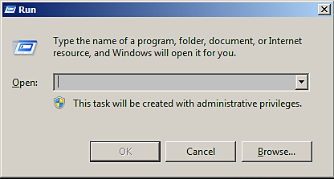

# 長い計算でGPUドライバーがクラッシュする（TDRクラッシュ）

{zoomable="yes"}

Windowsでは、現在のTDR値が一定の制限（10秒）を下回っていることがSubstance 3D Painterによって検出された場合に、このウィンドウが表示されます。

<table>
<tr style="border: 0;">
<td style="border: 0;" valign="top">

## GPUドライバーがクラッシュする原因

</td>
<td style="border: 0;" valign="top">

### TDR値の編集方法

</td>
<td style="border: 0;" valign="top">

### TDR値をデフォルトに戻す

</td>
</tr>
</table>

## GPUドライバーがクラッシュする原因

レンダリングやGPUの計算が&#x200B;**システムのロック**&#x200B;になるのを防ぐために、Windowsオペレーティングシステム&#x200B;**は、レンダリングに数秒かかるたびにGPUドライバーを終了**&#x200B;します。 ドライバが強制終了されると、ドライバを使用しているアプリケーションが自動的にクラッシュします。 レンダリングタスクや計算に必要な時間を把握できないため（GPU、ドライバー、OS、メッシュサイズ、テクスチャサイズなどに依存します）、コンピューターの処理能力を制限して、アプリケーションレベルからのクラッシュを回避することはできません。

Windowsには、**レジストリ** **キー**&#x200B;があり、OSがGPUドライバーを強制終了するまでの待機時間を指定します。 アプリケーションはこの設定を直接変更する権限がありません。この手順は手動で実行する必要があります（下記参照）。

詳細については、公式ドキュメントを参照してください： <https://docs.microsoft.com/en-us/windows-hardware/drivers/display/tdr-registry-keys>。

### 変更が必要なキーのリスト

TDRを調整するには、TDR遅延を増やします。**TdrDelay**&#x200B;と&#x200B;**TdrDdiDelay**&#x200B;の両方をより高い値（60秒など）に変更します。

{zoomable="yes"}

>[!NOTE]
>
> これらのキーは、Windowsの更新プログラムまたはGPUドライバーの更新プログラムによってデフォルト値にリセットできます。

## TDR値の編集方法

TDR値を変更するには、次の手順に従います。

***2つの異なるキーを作成または編集する必要があることに注意してください。***

>[!WARNING]
>
> レジストリを編集すると、予期しない重大な問題が発生する可能性があり、システムが起動しなくなる可能性があります。また、修正方法がわからない場合は、オペレーティングシステム全体を再インストールする必要が生じる可能性があります。 ただし、このページで説明されているレジストリキーによってこのような問題が発生することはありません。
> 
> Adobeは、システムレジストリを修正することによってシステムに損害が生じた場合でも、一切責任を負いません。

### 1 - [ファイル名を指定して実行]ウィンドウを開く

**[開始]**、**[実行]**&#x200B;の順にクリックします（または&#x200B;**Windows**&#x200B;と&#x200B;**R**&#x200B;キーを押します）。 **ファイル名を指定して実行**&#x200B;ウィンドウが開きます。

{zoomable="yes"}

### 2 – レジストリエディターを起動する

テキストフィールドに「**regedit**」と入力し、「**OK**」を押します。

{zoomable="yes"}

### 3 - GraphicsDriversレジストリキーに移動します

レジストリウィンドウが開きます。\
左側のウィンドウで、次の項目に移動して、ツリー内の&#x200B;**GraphicsDrivers**&#x200B;キーに移動します。

```
Computer\HKEY_LOCAL_MACHINE\SYSTEM\CurrentControlSet\Control\GraphicsDrivers
```


次の手順に進む前に、**GraphicsDriversを**&#x200B;に引き続き使用し、**レジストリ**&#x200B;以下のキー&#x200B;**で**&#x200B;をクリックしないように設定してください。

+++Windowsレジストリツリーの「GraphicsDrivers」
{zoomable="yes"}


+++

### 4 - TdrDelay値を追加または編集する

>[!NOTE]
>
> <b>TdrDelay</b>の値<b>がまだ存在しない</b>場合は、右側のウィンドウで右クリックして、<b>新規/ DWORD （32ビット）値</b>を選択します。 「<b>TdrDelay</b>」という名前を付けます。 大文字と小文字の使い分けは重要ですが、必ず後に付けてください（また、末尾にスペースなどの文字がないことを確認してください）。
> 
> 

**右側のウィンドウ**&#x200B;で、値&#x200B;**TdrDelay**&#x200B;をダブルクリックします。 **基準**&#x200B;の設定を&#x200B;**小数**&#x200B;に変更します。 値を既定の&#x200B;**2**&#x200B;以外に設定してください（**60**&#x200B;をお勧めします）。

この値は、計算中にGPUが応答していないと判断するまでにオペレーティングシステムが待機する時間を秒単位で示します。

{zoomable="yes"}

### 5 - TdrDdiDelay値を追加または編集する

>[!NOTE]
>
> <b>TdrDdiDelay</b>の値<b>が存在しない</b>場合、右側のウィンドウで右クリックし、<b>新規/DWORD （32ビット）値</b>を選択します。 「<b>TdrDdiDelay</b>」という名前を付けます。 ケースが重要な場合は、必ずそれに従ってください（そして、スペースなどの他の文字がないことを確認してください）。
> 
> 

**右側のウィンドウ**&#x200B;で、値&#x200B;**TdrDdiDelay**&#x200B;をダブルクリックします。 **基準**&#x200B;の設定を&#x200B;**小数**&#x200B;に変更します。 値を既定の&#x200B;**5**&#x200B;以外に設定してください（**60**&#x200B;をお勧めします）。

この値は、ソフトウェアがGPUドライバーを離れるのに時間がかかりすぎたと判断するまでに、オペレーティングシステムが待機する時間を秒単位で示します。

**16進数**&#x200B;がデフォルト値です。**10進数**&#x200B;に切り替えるだけで正しい値が表示されます。 **3C** （16進数）は&#x200B;**60** （10進数）に等しいことに注意してください。

### 6 – 完了して再起動

右側のペインは次のようになります。

{zoomable="yes"}

レジストリエディターを&#x200B;**閉じる**。 **開始**、次に&#x200B;**再起動**&#x200B;を使用して、コンピューターを&#x200B;**再起動**&#x200B;します。

TdrValueはコンピューターの起動時にのみ表示されるので、強制的に更新するには再起動が必要です。

長時間の計算を行ってもアプリケーションがクラッシュする場合は、ディレイ（秒単位）を60から120に増やしてみてください。

## TDR値をデフォルトに戻す

TDRをデフォルト値に戻すには、次の2つの方法があります。

* 上記の手順に従って、**TdrDelay**&#x200B;を&#x200B;**2s**&#x200B;に、**TdrDdiDelay**&#x200B;を&#x200B;**5s**&#x200B;に設定します。
* または、**TdrDelay**&#x200B;および&#x200B;**TdrDdiDelay**&#x200B;キーをレジストリエントリから&#x200B;**削除**&#x200B;します。
