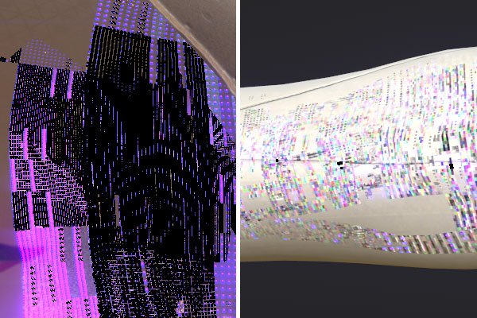

# ビューポートのテクスチャに濃淡のむらが出る

バージョン2018.3.0以降では、ビューポートに次のようなアーティファクトが表示される場合があります。

{width="400px"}

これらのアーティファクトは、Nvidia GPUドライバーの問題に関連しています。\
アーティファクトを回避するには、Sparse Virtual Texturesハードウェアサポートを非アクティブにする必要があります。

GeForce **ドライバー440.97**&#x200B;は現在、**この問題を修正**&#x200B;しました。 アドビでは、これらのドライバーを更新し、良好なパフォーマンスを得るためにSVTを有効にしておくことをお勧めします。

新しいドライバーはNVIDIA Webサイトで入手できます： <https://www.nvidia.com/Download/index.aspx>

## スパース仮想テクスチャハードウェアアクセラレーションを無効にする

### 1 - Substance 3D Painterを起動し、設定を開きます。

編集/設定を選択して、メインの「設定」を開きます。

### 2 - 「スパース仮想テクスチャ」という名前のセクションを見つけます。

「一般」セクション内を下にスクロールして、「スパース仮想テクスチャ」という名前のサブセクションを見つけます

### 3 – 設定をオフにする

チェックを外して、「ハードウェアサポートアクセラレーション」設定を無効にします。

### 4 - Substance 3D Painterを検証して再起動します

「OK」ボタンをクリックして、変更を検証します。

「はい」をクリックしてSubstance 3D Painterを再起動し、変更内容を適用します。
