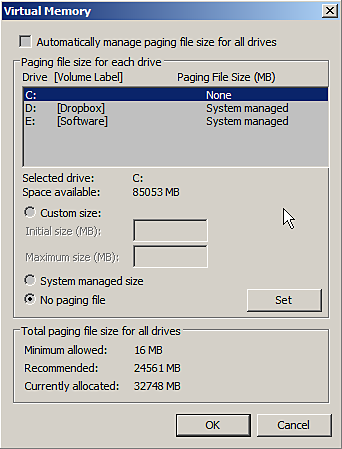

# 仮想メモリ不足によるクラッシュ

**ページング**&#x200B;ファイル（**スワップ**&#x200B;メモリ/ **仮想**&#x200B;メモリ）の値が&#x200B;**低すぎる**&#x200B;に設定されている場合、Substance 3D Painterが不安定になることがあります。\
これらの設定は、オペレーティングシステムに処理させることをお勧めします（通常はデフォルトで処理されます）。 Substance 3D Painterが正しく動作するには、**最小**&#x200B;の&#x200B;**16 GB**&#x200B;の仮想メモリが必要です。

## Windowsで仮想メモリサイズを変更する方法

>[!NOTE]
>
> Windowsで仮想メモリのサイズを変更すると、コンピューターの再起動が必要になります。

次の手順で仮想メモリ設定にアクセスします

1. **コンピューター/このPC**&#x200B;のアイコンを右クリックし、**プロパティ**&#x200B;を選択します
1. 「**システムの詳細設定**」を選択します
1. **パフォーマンス**&#x200B;セクションの&#x200B;**設定**&#x200B;ボタンをクリックします
1. [**詳細設定**]タブをクリックします
1. **仮想メモリ**&#x200B;セクションの&#x200B;**変更**&#x200B;をクリックします

次のいずれかの操作が可能になります。

* チェックボックスを有効にする&#x200B;**すべてのドライブのページングファイルのサイズを自動的に管理する**

**または**

* 仮想メモリサイズを変更するハードドライブを選択し、**システム管理サイズ**&#x200B;を選択して、**設定**&#x200B;ボタンをクリックします。

**自動：**

**手動：**

