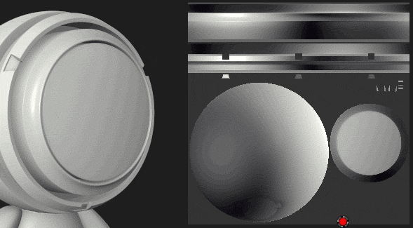

# ペイントツールが他のUV アイランドでブリードする

[ペイントツール](../../../features/effects/paint.md)の既定の動作の中には、特定の状況で直感的に感じられないものがあります。 Substance 3D Painterは主に3D空間で動作するアプリケーションです。これはペイントにも適用されます。 ペイントブラシのデフォルト設定は、ペイント時にUVをまたいでシームレスになるようにすることです。 そのため、2D ビューを操作すると、予期しない結果が生じることがあります。

2D ビューをペイントするときに他のUV アイランドににじみが発生しないようにするには、ツールパラメーターの&#x200B;**アラインメント**&#x200B;の設定を変更します。

| *アラインメントモード* | *プレビュー* |
| --- | --- |
| **正接ラップ** | 

 |
| **UV** | 

 |
